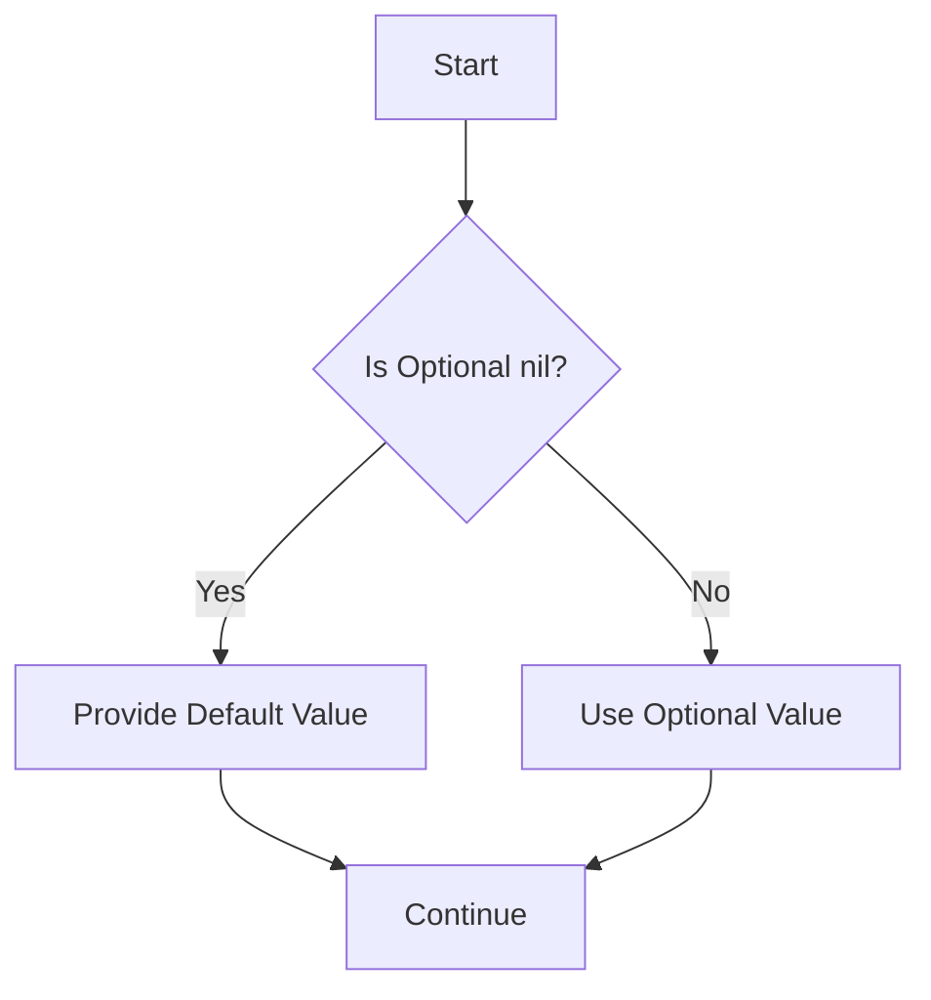

## 18.2.3 Force Unwrapping Optionals

In Swift, optionals are a powerful feature that allows developers to handle the absence of a value. However, with great power comes great responsibility. One of the most common anti-patterns in Swift is the misuse of the force unwrap operator (`!`). This section will delve into the dangers of force unwrapping optionals, the risks associated with it, and safer alternative practices to adopt.

### Understanding Optionals in Swift

Before we dive into force unwrapping, let's review what optionals are. In Swift, an optional is a type that can hold either a value or `nil` to indicate the absence of a value. This is particularly useful in scenarios where a variable might not have a value at some point in its lifecycle.

```swift
var name: String? = "Alice"
name = nil // The optional can now hold a nil value
```

### The Force Unwrap Operator (`!`)

The force unwrap operator (`!`) is used to access the value of an optional directly. When you force unwrap an optional, you are asserting that it contains a value, and you are willing to take the risk of a runtime crash if it does not.

```swift
let name: String? = "Alice"
print(name!) // Force unwrapping the optional
```

### The Risks of Force Unwrapping

While force unwrapping might seem convenient, it introduces significant risks:

1. **Runtime Crashes**: If an optional is `nil` and you force unwrap it, your program will crash. This can lead to a poor user experience and is often a source of bugs.

2. **Unpredictable Behavior**: Force unwrapping makes code less predictable and harder to maintain. It can be challenging to track down the source of a crash if force unwrapping is used liberally throughout the codebase.

3. **Code Smell**: Frequent use of force unwrapping is often considered a code smell, indicating that the code might not be handling optional values safely or correctly.

### Safer Alternatives to Force Unwrapping

To avoid the pitfalls of force unwrapping, consider these safer alternatives:

#### 1. Optional Binding

Optional binding is a safe way to unwrap an optional. It involves using `if let` or `guard let` to check if the optional contains a value before using it.

```swift
if let name = name {
    print(name) // Safe unwrapping
} else {
    print("Name is nil")
}
```

`guard let` is particularly useful for early exits in functions:

```swift
func greet(_ name: String?) {
    guard let name = name else {
        print("Name is nil")
        return
    }
    print("Hello, \\(name)!")
}
```

#### 2. Nil Coalescing Operator (`??`)

The nil coalescing operator provides a default value if the optional is `nil`.

```swift
let name: String? = nil
let displayName = name ?? "Guest"
print(displayName) // Output: Guest
```

#### 3. Optional Chaining

Optional chaining allows you to call properties, methods, and subscripts on an optional that might currently be `nil`.

```swift
let length = name?.count
print(length ?? 0) // Output: 0 if name is nil
```

### When to Use Force Unwrapping

While force unwrapping is generally discouraged, there are scenarios where it might be appropriate:

- **Testing**: In test cases, where you are certain that an optional will contain a value, force unwrapping can be used to simplify assertions.

- **Implicitly Unwrapped Optionals**: These are optionals that are automatically unwrapped when accessed. They are declared with `!` instead of `?`, but should be used sparingly and only when you are certain the value will not be `nil`.

```swift
var name: String! = "Alice"
print(name) // Automatically unwrapped
```

### Visualizing Optional Handling

To better understand the flow of handling optionals, let's visualize the process using a flowchart.



This flowchart illustrates the decision-making process when handling optionals, emphasizing the importance of checking for `nil` values before proceeding.

### Common Pitfalls and How to Avoid Them

1. **Overusing Force Unwrapping**: Relying on force unwrapping can lead to a fragile codebase. Always consider safer alternatives first.

2. **Ignoring Optional Types**: Treating optionals as regular types without proper handling can introduce subtle bugs. Always be mindful of optional types in your code.

3. **Misusing Implicitly Unwrapped Optionals**: These can lead to the same issues as force unwrapping if not used carefully. Reserve them for cases where a value is guaranteed to be present after initialization.

### Best Practices for Handling Optionals

- **Adopt Optional Binding**: Use `if let` and `guard let` to safely unwrap optionals.
- **Leverage Nil Coalescing**: Provide default values with `??` to avoid `nil` pitfalls.
- **Utilize Optional Chaining**: Safely access properties and methods on optionals.
- **Minimize Force Unwrapping**: Reserve it for scenarios where you are certain of the presence of a value.

### Try It Yourself

Let's experiment with some code examples to reinforce these concepts. Modify the following code snippets to practice safe optional handling:

```swift
// Example 1: Convert force unwrapping to optional binding
let age: Int? = 25
print(age!)

// Example 2: Use nil coalescing to provide a default value
let username: String? = nil
let displayUsername = username!
```

### Knowledge Check

To ensure you've grasped the concepts, consider these questions:

- What are the risks of using force unwrapping?
- How can optional binding improve code safety?
- When might it be appropriate to use force unwrapping?

### Embrace the Journey

Remember, mastering optionals is a journey. As you continue to refine your Swift skills, you'll find that handling optionals safely becomes second nature. Keep experimenting, stay curious, and enjoy the process of becoming a more robust Swift developer!

## Quiz Time!



### What is the primary risk of using force unwrapping in Swift?

- [x] Runtime crashes due to nil values
- [ ] Increased code readability
- [ ] Improved performance
- [ ] Better memory management

> **Explanation:** Force unwrapping can lead to runtime crashes if the optional is nil.

### Which of the following is a safer alternative to force unwrapping?

- [x] Optional binding
- [ ] Using more force unwrapping
- [ ] Ignoring nil values
- [ ] Implicitly unwrapped optionals

> **Explanation:** Optional binding safely unwraps optionals without risking crashes.

### What operator can provide a default value if an optional is nil?

- [x] Nil coalescing operator (`??`)
- [ ] Force unwrap operator (`!`)
- [ ] Optional chaining operator (`?.`)
- [ ] Assignment operator (`=`)

> **Explanation:** The nil coalescing operator (`??`) provides a default value if the optional is nil.

### What does optional chaining allow you to do?

- [x] Safely access properties and methods on an optional
- [ ] Force unwrap multiple optionals at once
- [ ] Ignore nil values
- [ ] Automatically convert optionals to non-optionals

> **Explanation:** Optional chaining allows safe access to properties and methods on an optional.

### When might it be appropriate to use force unwrapping?

- [x] In test cases where the value is guaranteed to be present
- [ ] In production code without checks
- [ ] Whenever an optional is used
- [ ] To improve code readability

> **Explanation:** In test cases, force unwrapping can be used when the value is guaranteed to be present.

### What is a common code smell associated with frequent force unwrapping?

- [x] Fragile codebase
- [ ] Improved performance
- [ ] Better memory management
- [ ] Increased readability

> **Explanation:** Frequent force unwrapping is a code smell indicating a fragile codebase.

### How can you handle an optional that might be nil without crashing?

- [x] Use optional binding or nil coalescing
- [ ] Force unwrap it
- [ ] Ignore it
- [ ] Convert it to a non-optional

> **Explanation:** Optional binding and nil coalescing safely handle optionals without crashing.

### What is the purpose of implicitly unwrapped optionals?

- [x] To automatically unwrap optionals when accessed
- [ ] To force unwrap optionals
- [ ] To ignore nil values
- [ ] To convert optionals to non-optionals

> **Explanation:** Implicitly unwrapped optionals automatically unwrap when accessed.

### What does the nil coalescing operator (`??`) do?

- [x] Provides a default value if the optional is nil
- [ ] Forces an optional to unwrap
- [ ] Chains multiple optionals
- [ ] Converts an optional to a non-optional

> **Explanation:** The nil coalescing operator provides a default value if the optional is nil.

### True or False: Force unwrapping is always safe to use in Swift.

- [ ] True
- [x] False

> **Explanation:** Force unwrapping is not always safe and can lead to runtime crashes if the optional is nil.




