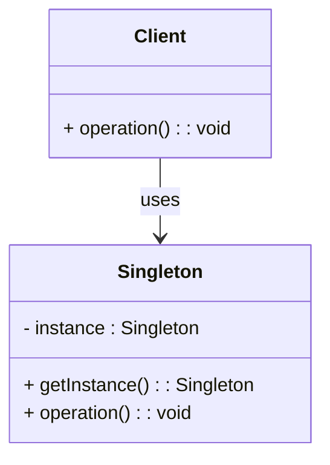

## 18.2.4 Singleton Overuse and Abuse

The Singleton pattern is one of the most well-known design patterns in software development. It ensures that a class has only one instance and provides a global point of access to that instance. While this pattern can be useful in certain scenarios, its overuse and misuse can lead to several issues, particularly in Swift development. In this section, we will explore the pitfalls of over-relying on the Singleton pattern, discuss the problems it introduces, and consider alternative design patterns that promote better software architecture.

### Understanding the Singleton Pattern

The Singleton pattern is a creational design pattern that restricts the instantiation of a class to a single object. This is useful when exactly one object is needed to coordinate actions across the system. The Singleton pattern is characterized by the following:

- **Single Instance:** Ensures that only one instance of the class exists.
- **Global Access:** Provides a global point of access to the instance.

#### Implementing Singleton in Swift

Let's start by looking at a basic implementation of the Singleton pattern in Swift:

```swift
class Logger {
    static let shared = Logger()
    
    private init() {
        // Private initialization to ensure just one instance is created.
    }
    
    func log(message: String) {
        print("Log: \\(message)")
    }
}

// Usage
Logger.shared.log(message: "Singleton pattern in action!")
```

In this example, the `Logger` class is a Singleton. The `shared` static property ensures that there is only one instance of `Logger`. The initializer is private to prevent the creation of additional instances.

### The Pitfalls of Singleton Overuse

While the Singleton pattern can be convenient, overusing it can lead to several issues:

1. **Global State Management:**
   - Singletons introduce global state into your application. This can make it difficult to understand and predict the state of the application at any given time, leading to bugs that are hard to track down.

2. **Testability Concerns:**
   - Singletons make unit testing challenging. Since they provide a global point of access, it becomes difficult to isolate tests. This can lead to tests that are dependent on the state of the Singleton, making them unreliable.

3. **Hidden Dependencies:**
   - Singletons can hide dependencies within your code. This can lead to tight coupling between components, making the codebase harder to maintain and refactor.

4. **Concurrency Issues:**
   - If not implemented carefully, Singletons can lead to concurrency issues, especially in a multi-threaded environment. This can result in race conditions and data corruption.

5. **Difficulty in Refactoring:**
   - Over-reliance on Singletons can make refactoring difficult. As your application grows, the Singleton can become a bottleneck, and changing its implementation can have widespread effects.

### Alternatives to Singleton Pattern

To avoid the pitfalls associated with Singleton overuse, consider the following alternative design patterns:

#### 1. Dependency Injection

Dependency Injection (DI) is a design pattern that allows you to inject dependencies into a class rather than having the class create them itself. This promotes loose coupling and enhances testability.

**Constructor Injection Example:**

```swift
class Logger {
    func log(message: String) {
        print("Log: \\(message)")
    }
}

class UserManager {
    private let logger: Logger
    
    init(logger: Logger) {
        self.logger = logger
    }
    
    func createUser(name: String) {
        logger.log(message: "User \\(name) created.")
    }
}

// Usage
let logger = Logger()
let userManager = UserManager(logger: logger)
userManager.createUser(name: "Alice")
```

In this example, `UserManager` receives a `Logger` instance through its initializer, promoting loose coupling.

#### 2. Factory Method

The Factory Method pattern provides an interface for creating objects in a superclass but allows subclasses to alter the type of objects that will be created.

**Factory Method Example:**

```swift
protocol Logger {
    func log(message: String)
}

class ConsoleLogger: Logger {
    func log(message: String) {
        print("Console Log: \\(message)")
    }
}

class LoggerFactory {
    static func createLogger() -> Logger {
        return ConsoleLogger()
    }
}

// Usage
let logger = LoggerFactory.createLogger()
logger.log(message: "Factory Method pattern in action!")
```

The Factory Method pattern allows for more flexible and scalable code by decoupling the creation of objects from their usage.

#### 3. Service Locator

The Service Locator pattern provides a central registry for services, allowing clients to request services without knowing their concrete implementations.

**Service Locator Example:**

```swift
protocol Logger {
    func log(message: String)
}

class ConsoleLogger: Logger {
    func log(message: String) {
        print("Console Log: \\(message)")
    }
}

class ServiceLocator {
    private var services: [String: Any] = [:]
    
    func addService<T>(service: T, for type: T.Type) {
        let key = String(describing: type)
        services[key] = service
    }
    
    func getService<T>(for type: T.Type) -> T? {
        let key = String(describing: type)
        return services[key] as? T
    }
}

// Usage
let serviceLocator = ServiceLocator()
serviceLocator.addService(service: ConsoleLogger(), for: Logger.self)

if let logger = serviceLocator.getService(for: Logger.self) {
    logger.log(message: "Service Locator pattern in action!")
}
```

The Service Locator pattern allows for decoupling of service creation and usage, but it should be used with caution as it can introduce hidden dependencies.

### Visualizing Singleton Overuse

To better understand the issues associated with Singleton overuse, let's visualize the concept using a class diagram:



In this diagram, the `Client` class depends on the `Singleton` class, which can lead to tight coupling and hidden dependencies.

### Design Considerations

When considering the use of the Singleton pattern, keep the following in mind:

- **Use Sparingly:** Only use the Singleton pattern when truly necessary. Consider whether the benefits outweigh the potential drawbacks.
- **Thread Safety:** Ensure that your Singleton implementation is thread-safe to avoid concurrency issues.
- **Testability:** Be mindful of how the Singleton pattern affects the testability of your code. Consider using dependency injection to improve testability.

### Swift Unique Features

Swift provides several unique features that can help mitigate the issues associated with Singleton overuse:

- **Value Types:** Swift's emphasis on value types (structs and enums) can help reduce reliance on global state.
- **Protocol-Oriented Programming:** Swift's protocol-oriented programming paradigm promotes the use of protocols to define interfaces, reducing tight coupling.
- **Generics:** Swift's support for generics allows for more flexible and reusable code, reducing the need for Singletons.

### Differences and Similarities

The Singleton pattern is often confused with other patterns such as the Factory Method and Service Locator. It's important to understand the differences:

- **Singleton vs. Factory Method:** The Factory Method pattern focuses on object creation, while the Singleton pattern focuses on ensuring a single instance.
- **Singleton vs. Service Locator:** The Service Locator pattern provides a registry for services, while the Singleton pattern provides a single instance.

### Try It Yourself

To gain a deeper understanding of the Singleton pattern and its alternatives, try modifying the code examples provided. Experiment with implementing a Singleton pattern and then refactor it using dependency injection or the Factory Method pattern. Observe how these changes affect the testability and flexibility of your code.

### Conclusion

The Singleton pattern can be a powerful tool when used appropriately, but its overuse and misuse can lead to significant issues in your codebase. By understanding the pitfalls of Singleton overuse and considering alternative design patterns, you can create more robust and maintainable Swift applications.

Remember, this is just the beginning. As you progress in your Swift development journey, continue to explore and experiment with different design patterns to find the best solutions for your specific needs. Keep learning, stay curious, and enjoy the process of mastering Swift design patterns!

## Quiz Time!



### What is a primary characteristic of the Singleton pattern?

- [x] It ensures a class has only one instance.
- [ ] It allows multiple instances of a class.
- [ ] It provides multiple points of access to the instance.
- [ ] It is used to create multiple objects of different classes.

> **Explanation:** The Singleton pattern ensures that a class has only one instance and provides a global point of access to it.

### What is a common issue associated with Singleton overuse?

- [x] Global state management
- [ ] Improved testability
- [ ] Increased modularity
- [ ] Simplified codebase

> **Explanation:** Singleton overuse can lead to issues with global state management, making the codebase harder to understand and maintain.

### Which design pattern is an alternative to Singleton that promotes loose coupling?

- [x] Dependency Injection
- [ ] Composite Pattern
- [ ] Singleton Pattern
- [ ] Observer Pattern

> **Explanation:** Dependency Injection promotes loose coupling by injecting dependencies into a class rather than having the class create them itself.

### What is a benefit of using Dependency Injection over Singleton?

- [x] Enhanced testability
- [ ] Increased global state
- [ ] Reduced modularity
- [ ] Simplified codebase

> **Explanation:** Dependency Injection enhances testability by allowing dependencies to be easily mocked or replaced in tests.

### Which pattern provides a central registry for services?

- [x] Service Locator
- [ ] Singleton
- [ ] Factory Method
- [ ] Observer

> **Explanation:** The Service Locator pattern provides a central registry for services, allowing clients to request services without knowing their concrete implementations.

### What is a potential issue with using the Service Locator pattern?

- [x] Hidden dependencies
- [ ] Improved modularity
- [ ] Enhanced testability
- [ ] Simplified codebase

> **Explanation:** The Service Locator pattern can introduce hidden dependencies, making the codebase harder to maintain and understand.

### Which Swift feature can help reduce reliance on global state?

- [x] Value Types
- [ ] Reference Types
- [ ] Singleton Pattern
- [ ] Global Variables

> **Explanation:** Swift's emphasis on value types (structs and enums) can help reduce reliance on global state.

### What is a key difference between the Singleton and Factory Method patterns?

- [x] Singleton ensures a single instance, while Factory Method focuses on object creation.
- [ ] Singleton focuses on object creation, while Factory Method ensures a single instance.
- [ ] Both patterns ensure a single instance.
- [ ] Both patterns focus on object creation.

> **Explanation:** The Singleton pattern ensures a single instance, while the Factory Method pattern focuses on object creation.

### True or False: The Singleton pattern is always the best choice for managing global state.

- [ ] True
- [x] False

> **Explanation:** False. The Singleton pattern is not always the best choice for managing global state due to its potential drawbacks, such as issues with testability and hidden dependencies.

### What is the primary purpose of the Singleton pattern?

- [x] To ensure a class has only one instance and provide a global point of access to it.
- [ ] To create multiple instances of a class.
- [ ] To provide multiple points of access to a class instance.
- [ ] To enhance testability and modularity.

> **Explanation:** The primary purpose of the Singleton pattern is to ensure a class has only one instance and provide a global point of access to it.




