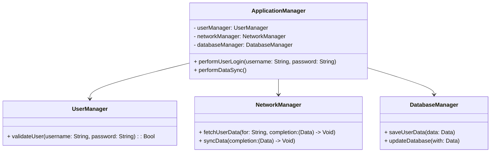

## 18.2.5 God Object and Spaghetti Code

In the realm of software development, maintaining clean, efficient, and scalable code is paramount. However, developers often encounter anti-patterns that can lead to code that is difficult to maintain and extend. Two of the most notorious anti-patterns are the God Object and Spaghetti Code. In this section, we will explore these anti-patterns in detail, understand their implications in Swift development, and learn strategies to refactor and avoid them.

### Understanding the God Object Anti-Pattern

#### Definition

The God Object anti-pattern occurs when a single class or object takes on too many responsibilities, effectively becoming an all-knowing, all-doing entity within a codebase. This object often has extensive knowledge about the application and performs a multitude of tasks that should ideally be distributed across multiple, more focused classes.

#### Characteristics of a God Object

- **High Coupling**: The God Object is tightly coupled with many other parts of the system, making changes risky and prone to errors.
- **Low Cohesion**: It performs a wide variety of unrelated tasks, leading to low cohesion within the class.
- **Difficult to Test**: Due to its extensive responsibilities, testing the God Object becomes complex and cumbersome.
- **Poor Scalability**: As the application grows, the God Object becomes a bottleneck, hindering scalability.

#### Example of a God Object in Swift

Let's consider a simple example of a God Object in a Swift application:

```swift
class ApplicationManager {
    var userManager: UserManager
    var networkManager: NetworkManager
    var databaseManager: DatabaseManager

    init() {
        self.userManager = UserManager()
        self.networkManager = NetworkManager()
        self.databaseManager = DatabaseManager()
    }

    func performUserLogin(username: String, password: String) {
        // Validate user credentials
        if userManager.validateUser(username: username, password: password) {
            // Fetch user data from the server
            networkManager.fetchUserData(for: username) { data in
                // Save user data to the database
                databaseManager.saveUserData(data)
            }
        }
    }

    func performDataSync() {
        // Synchronize data with the server
        networkManager.syncData { data in
            // Update local database with new data
            databaseManager.updateDatabase(with: data)
        }
    }

    // Other unrelated methods...
}
```

In this example, the `ApplicationManager` class is responsible for user management, network operations, and database interactions, making it a classic God Object.

### Breaking Down the God Object

To refactor a God Object, we need to break it down into smaller, more focused components. This involves identifying distinct responsibilities and delegating them to specialized classes.

#### Refactoring the God Object

1. **Identify Responsibilities**: List all the responsibilities of the God Object and group related tasks.
2. **Create Specialized Classes**: For each group of related tasks, create a new class that focuses solely on those responsibilities.
3. **Delegate Tasks**: Modify the God Object to delegate tasks to these new classes, reducing its responsibilities.

#### Refactored Example

```swift
class UserAuthenticationManager {
    func validateUser(username: String, password: String) -> Bool {
        // Validate user credentials
        return true
    }
}

class NetworkService {
    func fetchUserData(for username: String, completion: (Data) -> Void) {
        // Fetch user data from the server
    }

    func syncData(completion: (Data) -> Void) {
        // Synchronize data with the server
    }
}

class DatabaseService {
    func saveUserData(_ data: Data) {
        // Save user data to the database
    }

    func updateDatabase(with data: Data) {
        // Update local database with new data
    }
}

class ApplicationManager {
    private let userAuthenticationManager = UserAuthenticationManager()
    private let networkService = NetworkService()
    private let databaseService = DatabaseService()

    func performUserLogin(username: String, password: String) {
        if userAuthenticationManager.validateUser(username: username, password: password) {
            networkService.fetchUserData(for: username) { data in
                databaseService.saveUserData(data)
            }
        }
    }

    func performDataSync() {
        networkService.syncData { data in
            databaseService.updateDatabase(with: data)
        }
    }
}
```

By creating `UserAuthenticationManager`, `NetworkService`, and `DatabaseService`, we have distributed responsibilities, resulting in a more maintainable and scalable codebase.

### Visualizing the God Object Refactoring Process

To better understand the refactoring process, let's visualize the transition from a God Object to a more modular architecture.



This diagram illustrates how responsibilities are distributed among specialized classes, reducing the complexity of the `ApplicationManager`.

### Understanding Spaghetti Code

#### Definition

Spaghetti Code refers to a codebase with a complex and tangled control structure, often resulting from unstructured and ad-hoc programming. This type of code is difficult to follow, understand, and maintain.

#### Characteristics of Spaghetti Code

- **Lack of Structure**: The code lacks a clear structure, making it difficult to navigate.
- **Poor Readability**: The tangled logic makes understanding the code challenging.
- **Difficult to Debug**: Identifying and fixing bugs in Spaghetti Code is time-consuming and error-prone.
- **Fragile**: Changes in one part of the code can have unintended consequences elsewhere.

#### Example of Spaghetti Code in Swift

Consider the following example, which demonstrates Spaghetti Code:

```swift
func processUserInput(input: String) {
    if input.isEmpty {
        print("Input is empty")
    } else {
        if input == "exit" {
            print("Exiting...")
            return
        } else {
            if input.count > 10 {
                print("Input is too long")
            } else {
                print("Processing input: \\(input)")
                // Additional processing logic...
            }
        }
    }
}
```

The nested `if` statements and lack of clear structure make this code difficult to follow and maintain.

### Refactoring Spaghetti Code

To refactor Spaghetti Code, we need to introduce structure and clarity to the codebase.

#### Steps to Refactor

1. **Flatten Control Structures**: Reduce nesting by using guard statements or early returns.
2. **Extract Methods**: Break down complex logic into smaller, more focused methods.
3. **Use Descriptive Naming**: Use clear and descriptive names for variables and methods to improve readability.

#### Refactored Example

```swift
func processUserInput(input: String) {
    guard !input.isEmpty else {
        print("Input is empty")
        return
    }

    if input == "exit" {
        handleExit()
        return
    }

    if input.count > 10 {
        handleLongInput()
    } else {
        processValidInput(input)
    }
}

func handleExit() {
    print("Exiting...")
}

func handleLongInput() {
    print("Input is too long")
}

func processValidInput(_ input: String) {
    print("Processing input: \\(input)")
    // Additional processing logic...
}
```

By using guard statements and extracting methods, we have improved the readability and maintainability of the code.

### Visualizing Spaghetti Code Refactoring

Let's visualize the process of refactoring Spaghetti Code into a more structured form.

```mermaid
flowchart TD
    A[Start] --> B{Is input empty?}
    B -->|Yes| C[Print "Input is empty"]
    B -->|No| D{Is input "exit"?}
    D -->|Yes| E[Handle Exit]
    D -->|No| F{Is input too long?}
    F -->|Yes| G[Handle Long Input]
    F -->|No| H[Process Valid Input]
```

This flowchart illustrates the logical flow of the refactored code, highlighting the improved structure and clarity.

### Preventing God Object and Spaghetti Code

#### Best Practices

- **Adopt SOLID Principles**: Follow the SOLID principles to ensure your code is well-structured and maintainable.
- **Use Design Patterns**: Leverage design patterns to solve common problems and improve code organization.
- **Regular Code Reviews**: Conduct regular code reviews to identify and address potential anti-patterns early.
- **Continuous Refactoring**: Regularly refactor your code to improve its structure and readability.

#### Swift-Specific Techniques

- **Protocol-Oriented Programming**: Use Swift's protocol-oriented programming paradigm to define clear interfaces and separate concerns.
- **Value Types**: Utilize value types (structs and enums) to encapsulate data and behavior, reducing the risk of God Objects.
- **Extensions**: Leverage extensions to add functionality to existing types without modifying their original implementation.

### Try It Yourself

Experiment with refactoring a God Object or Spaghetti Code in your own projects. Start by identifying a class or function that seems overly complex or difficult to maintain. Break it down into smaller components or methods, and observe how it improves the code's readability and maintainability.

### Knowledge Check

- **What is a God Object, and why is it considered an anti-pattern?**
- **How can you identify Spaghetti Code in a Swift codebase?**
- **What strategies can you use to refactor a God Object?**
- **Why is it important to prevent these anti-patterns in your code?**

### Conclusion

Understanding and avoiding anti-patterns like the God Object and Spaghetti Code is crucial for maintaining a clean and efficient codebase. By applying the strategies and best practices discussed in this section, you can improve the maintainability and scalability of your Swift applications. Remember, the journey to mastering Swift development is ongoing. Keep experimenting, stay curious, and enjoy the process of learning and improving your craft.

## Quiz Time!



### What is a God Object?

- [x] An object that takes on too many responsibilities
- [ ] An object that is well-structured and maintainable
- [ ] An object that follows the SOLID principles
- [ ] An object that is easy to test

> **Explanation:** A God Object is an anti-pattern where a single object takes on too many responsibilities, making it difficult to maintain and extend.

### Which of the following is a characteristic of Spaghetti Code?

- [x] Lack of structure
- [ ] High cohesion
- [ ] Easy to debug
- [ ] Follows design patterns

> **Explanation:** Spaghetti Code is characterized by a lack of structure, making it difficult to follow and maintain.

### How can you refactor a God Object?

- [x] Break it down into smaller, focused components
- [ ] Add more responsibilities to it
- [ ] Increase its coupling with other classes
- [ ] Use more nested if statements

> **Explanation:** Refactoring a God Object involves breaking it down into smaller, focused components to improve maintainability.

### What is the first step in refactoring Spaghetti Code?

- [x] Flatten control structures
- [ ] Add more nested loops
- [ ] Increase the number of global variables
- [ ] Use more complex algorithms

> **Explanation:** The first step in refactoring Spaghetti Code is to flatten control structures, reducing nesting and improving readability.

### Which Swift feature can help prevent God Objects?

- [x] Protocol-Oriented Programming
- [ ] Singleton pattern
- [ ] Global variables
- [ ] Nested classes

> **Explanation:** Protocol-Oriented Programming in Swift helps define clear interfaces and separate concerns, reducing the risk of God Objects.

### What is a common consequence of Spaghetti Code?

- [x] Difficult to debug
- [ ] Easy to read
- [ ] High performance
- [ ] Follows best practices

> **Explanation:** Spaghetti Code is difficult to debug due to its tangled and unstructured nature.

### What is the benefit of using extensions in Swift?

- [x] Add functionality without modifying original implementation
- [ ] Increase the complexity of code
- [ ] Create more God Objects
- [ ] Make code less readable

> **Explanation:** Extensions in Swift allow you to add functionality to existing types without modifying their original implementation, promoting cleaner code.

### Why is it important to prevent God Objects and Spaghetti Code?

- [x] To maintain a clean and efficient codebase
- [ ] To increase the number of bugs
- [ ] To make the code more complex
- [ ] To reduce code readability

> **Explanation:** Preventing God Objects and Spaghetti Code is important to maintain a clean and efficient codebase, making it easier to maintain and extend.

### Which principle helps in avoiding God Objects?

- [x] Single Responsibility Principle
- [ ] Open/Closed Principle
- [ ] Liskov Substitution Principle
- [ ] Interface Segregation Principle

> **Explanation:** The Single Responsibility Principle helps avoid God Objects by ensuring that a class or object has only one responsibility.

### True or False: Spaghetti Code is easy to maintain.

- [ ] True
- [x] False

> **Explanation:** Spaghetti Code is difficult to maintain due to its tangled and unstructured nature.




