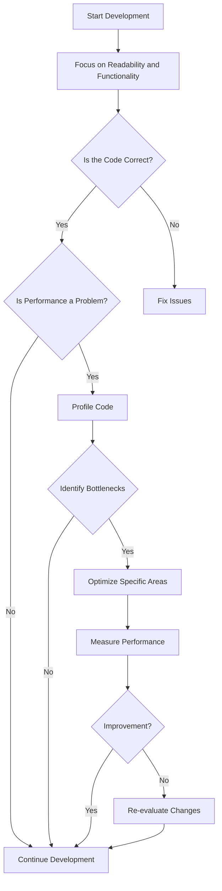

## 18.2.6 Premature Optimization

Premature optimization is a common anti-pattern in software development, including Swift programming. It refers to the practice of focusing on performance improvements too early in the development process, often at the expense of code readability, maintainability, and correctness. As Donald Knuth famously stated, "Premature optimization is the root of all evil." In this section, we will explore how premature optimization can lead to unnecessary complexity, the importance of emphasizing readability and correct functionality first, and best practices to optimize only when necessary.

### Understanding Premature Optimization

Premature optimization occurs when developers prioritize performance enhancements before the code's structure and functionality are fully understood or finalized. This can lead to several issues:

- **Complex Code:** Early optimization efforts often result in complex code that is difficult to read, understand, and maintain. This complexity can obscure the original intent of the code and make future modifications challenging.

- **Increased Development Time:** Time spent on optimizing code prematurely could be better used for developing features, fixing bugs, or improving code quality.

- **Neglected Functionality:** Focusing too much on optimization can lead to neglecting the primary goal of the software: to function correctly and meet user requirements.

- **Misplaced Priorities:** Developers may optimize parts of the code that are not critical to performance, ignoring areas that genuinely need improvement.

### The Importance of Readability and Correct Functionality

Before diving into optimization, it is crucial to ensure that the code is:

1. **Readable:** Code should be clear and easy to understand. This involves using meaningful variable names, consistent formatting, and comprehensive comments where necessary. Readable code facilitates collaboration and makes it easier for others (or even yourself) to understand and modify the code in the future.

2. **Correct:** The primary focus should be on ensuring that the software functions correctly and meets its intended purpose. This involves thorough testing and validation of the code.

3. **Maintainable:** Code should be structured in a way that allows for easy updates and modifications. This includes using design patterns and best practices that promote modularity and reusability.

### Code Example: Premature Optimization Pitfall

Let's consider an example of premature optimization in Swift. Suppose we have a function that calculates the sum of an array of integers:

```swift
func sumOfArray(_ numbers: [Int]) -> Int {
    var sum = 0
    for number in numbers {
        sum += number
    }
    return sum
}
```

This function is simple, readable, and correct. However, a developer might be tempted to optimize it prematurely by using a more complex approach, such as parallel processing:

```swift
func optimizedSumOfArray(_ numbers: [Int]) -> Int {
    let chunkSize = numbers.count / 4
    let queue = DispatchQueue.global(qos: .userInitiated)
    let group = DispatchGroup()
    
    var results = [Int](repeating: 0, count: 4)
    
    for i in 0..<4 {
        group.enter()
        queue.async {
            let start = i * chunkSize
            let end = (i == 3) ? numbers.count : start + chunkSize
            results[i] = numbers[start..<end].reduce(0, +)
            group.leave()
        }
    }
    
    group.wait()
    return results.reduce(0, +)
}
```

While the optimized function may seem more efficient, it introduces complexity without a clear understanding of whether the performance gain is necessary or significant. It also makes the code harder to read and maintain.

### When to Optimize

Optimization should be considered only after the code is correct, readable, and maintainable. Here are some guidelines on when to optimize:

1. **Identify Bottlenecks:** Use profiling tools to identify parts of the code that are actual performance bottlenecks. This ensures that optimization efforts are focused on areas that will have the most significant impact.

2. **Measure Performance:** Before and after optimization, measure the performance to ensure that the changes have the desired effect. This helps avoid unnecessary changes that do not improve performance.

3. **Consider the Trade-offs:** Optimization often involves trade-offs between performance and other factors, such as readability and maintainability. Consider these trade-offs carefully before making changes.

4. **Iterate Gradually:** Optimize in small, incremental steps. This allows you to test and validate each change and ensures that you do not introduce new issues.

### Best Practices for Avoiding Premature Optimization

To avoid premature optimization, consider the following best practices:

- **Emphasize Simplicity:** Write simple, clear, and correct code first. Focus on solving the problem at hand rather than optimizing prematurely.

- **Use Profiling Tools:** Use tools like Instruments in Xcode to profile your application and identify real performance bottlenecks.

- **Follow Design Patterns:** Use established design patterns that promote modularity and reusability. This makes it easier to optimize specific parts of the code without affecting the entire system.

- **Prioritize Maintainability:** Write code that is easy to understand and modify. This will make it easier to optimize when necessary.

- **Educate Your Team:** Ensure that your team understands the pitfalls of premature optimization and the importance of focusing on readability and correctness first.

### Swift-Specific Considerations

Swift provides several features that can help avoid premature optimization:

- **Value Types:** Swift's preference for value types (such as structs and enums) can lead to more predictable performance, reducing the need for premature optimization.

- **Automatic Reference Counting (ARC):** Swift's memory management system helps manage memory efficiently without manual intervention, reducing the need for early optimization.

- **Generics:** Swift's generics enable you to write flexible and reusable code, which can be optimized later if necessary.

- **Concurrency:** Swift's concurrency model, including async/await and actors, provides tools for efficient parallel processing when needed, allowing you to focus on correctness first.

### Visualizing the Impact of Premature Optimization

To better understand the impact of premature optimization, consider the following flowchart illustrating the decision-making process:



### Try It Yourself

To better understand the concept of premature optimization, try modifying the code examples provided. Experiment with different optimization techniques and measure their impact on performance. Use profiling tools to identify bottlenecks and focus on optimizing those areas.

### Knowledge Check

- **Why is premature optimization considered an anti-pattern?**
- **What are the potential pitfalls of premature optimization?**
- **How can profiling tools help avoid premature optimization?**
- **What are some best practices for writing maintainable code?**
- **How does Swift's concurrency model help avoid premature optimization?**

### Conclusion

Premature optimization is a common trap that can lead to complex, unreadable, and unmaintainable code. By focusing on readability, correctness, and maintainability first, and using profiling tools to identify real performance bottlenecks, you can ensure that your optimization efforts are effective and necessary. Remember, the goal is to write code that is both efficient and easy to understand.

## Quiz Time!



### Why is premature optimization considered an anti-pattern?

- [x] It leads to complex and unreadable code.
- [ ] It always improves performance.
- [ ] It is necessary for all applications.
- [ ] It simplifies code maintenance.

> **Explanation:** Premature optimization often results in complex and unreadable code, making maintenance difficult.

### What should be prioritized before optimizing code?

- [x] Readability and correct functionality.
- [ ] Performance enhancements.
- [ ] Adding more features.
- [ ] Reducing code size.

> **Explanation:** Ensuring code readability and correct functionality should be prioritized before any optimization efforts.

### How can profiling tools help in the optimization process?

- [x] By identifying actual performance bottlenecks.
- [ ] By automatically optimizing code.
- [ ] By removing unnecessary code.
- [ ] By simplifying code structure.

> **Explanation:** Profiling tools help identify real performance bottlenecks, allowing developers to focus optimization efforts where they are needed most.

### Which of the following is a Swift-specific feature that aids in avoiding premature optimization?

- [x] Automatic Reference Counting (ARC).
- [ ] Manual memory management.
- [ ] Global variables.
- [ ] Hard-coded values.

> **Explanation:** Swift's ARC helps manage memory efficiently, reducing the need for early optimization.

### What is the main goal of premature optimization?

- [ ] To improve code readability.
- [ ] To reduce code complexity.
- [x] To enhance performance too early.
- [ ] To simplify the development process.

> **Explanation:** Premature optimization focuses on enhancing performance too early in the development process, often at the expense of readability and maintainability.

### What is a potential consequence of premature optimization?

- [x] Increased development time.
- [ ] Decreased code complexity.
- [ ] Improved code readability.
- [ ] Enhanced user experience.

> **Explanation:** Premature optimization can increase development time by focusing on unnecessary performance enhancements.

### What is a key consideration when deciding to optimize code?

- [x] The trade-offs between performance and maintainability.
- [ ] The number of lines of code.
- [ ] The use of global variables.
- [ ] The color scheme of the IDE.

> **Explanation:** Optimization often involves trade-offs between performance and maintainability, which should be carefully considered.

### How can Swift's concurrency model help avoid premature optimization?

- [x] By providing tools for efficient parallel processing when needed.
- [ ] By requiring manual memory management.
- [ ] By simplifying all code structures.
- [ ] By eliminating the need for testing.

> **Explanation:** Swift's concurrency model, including async/await and actors, provides tools for efficient parallel processing when necessary, allowing developers to focus on correctness first.

### What is the first step in the decision-making process for optimization?

- [x] Ensuring the code is correct and functional.
- [ ] Identifying performance bottlenecks.
- [ ] Measuring performance.
- [ ] Implementing optimization techniques.

> **Explanation:** The first step is to ensure that the code is correct and functional before considering optimization.

### True or False: Premature optimization should be a primary focus during initial development.

- [ ] True
- [x] False

> **Explanation:** Premature optimization should not be a primary focus during initial development. The focus should be on readability and correct functionality.




