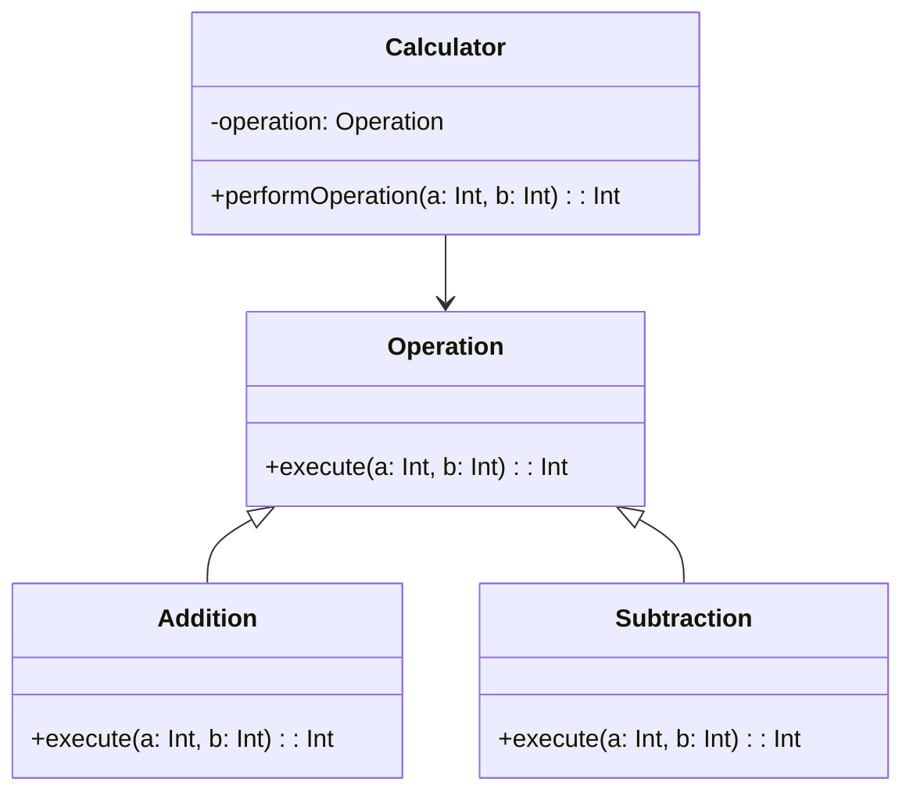
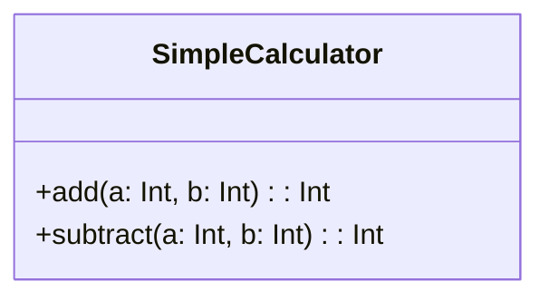

## 18.2.7 Over-Engineering

Over-engineering is a common anti-pattern in software development where solutions are designed to be more complex than necessary. This often results in increased development time, higher maintenance costs, and reduced code readability. In this section, we will explore how over-engineering manifests in Swift development, how to recognize it, and strategies to avoid it. 

### Understanding Over-Engineering

Over-engineering occurs when developers, often with the best intentions, create systems that are more elaborate than the problem requires. This can happen due to several reasons, such as anticipating future requirements that may never materialize, misunderstanding the problem domain, or simply a desire to use the latest technologies and patterns without considering their necessity.

#### Key Characteristics of Over-Engineering

- **Unnecessary Abstractions**: Introducing layers of abstraction that do not provide clear benefits can complicate the codebase.
- **Premature Optimization**: Optimizing parts of the code that are not performance bottlenecks can lead to complexity without real gains.
- **Feature Creep**: Adding features that are not part of the original requirements or that do not add significant value.
- **Overuse of Design Patterns**: Applying design patterns inappropriately or excessively can lead to convoluted code.

### Balancing Architecture with Practical Requirements

Striking the right balance between a robust architecture and practical requirements is essential to avoid over-engineering. Here are some strategies to help achieve this balance:

#### 1. **Understand the Requirements Thoroughly**

Before diving into the implementation, ensure that you have a clear understanding of the project requirements. Engage with stakeholders to clarify any ambiguities and prioritize features based on their importance and impact.

#### 2. **Embrace Simplicity**

Adopt the principle of simplicity in your design and code. Simple solutions are often more effective and easier to maintain. Ask yourself if a simpler approach could achieve the same result without unnecessary complexity.

#### 3. **Iterative Development**

Use an iterative development process to build and refine your application. This allows you to adapt to changes in requirements and avoid building features that may not be needed.

#### 4. **Avoid Premature Optimization**

Focus on writing clear and maintainable code first. Optimize only when necessary, and after identifying actual performance bottlenecks through profiling.

#### 5. **Appropriate Use of Design Patterns**

Design patterns are powerful tools but should be used judiciously. Ensure that the pattern fits the problem at hand and adds value to the solution.

### Avoiding Unnecessary Abstractions

Abstractions are essential in software development, but unnecessary abstractions can lead to over-engineering. Here are some guidelines to avoid this pitfall:

#### 1. **Keep Abstractions Minimal**

Use abstractions to simplify complex logic, but keep them minimal. Avoid creating abstractions for the sake of abstraction.

#### 2. **Evaluate the Need for Abstractions**

Before introducing an abstraction, evaluate its necessity. Consider whether it simplifies the code, improves maintainability, or enhances flexibility.

#### 3. **Refactor When Necessary**

Regularly refactor your code to remove redundant abstractions. This helps maintain a clean and efficient codebase.

### Code Example: Avoiding Over-Engineering in Swift

Let's consider a simple example to illustrate how over-engineering can be avoided in Swift. Suppose we need to create a class to handle basic arithmetic operations. An over-engineered solution might involve creating multiple layers of abstraction and unnecessary complexity:

```swift
// Over-engineered solution with unnecessary abstractions

protocol Operation {
    func execute(a: Int, b: Int) -> Int
}

class Addition: Operation {
    func execute(a: Int, b: Int) -> Int {
        return a + b
    }
}

class Subtraction: Operation {
    func execute(a: Int, b: Int) -> Int {
        return a - b
    }
}

class Calculator {
    private var operation: Operation
    
    init(operation: Operation) {
        self.operation = operation
    }
    
    func performOperation(a: Int, b: Int) -> Int {
        return operation.execute(a: b)
    }
}

let addition = Addition()
let calculator = Calculator(operation: addition)
print(calculator.performOperation(a: 5, b: 3)) // Output: 8
```

In this example, the use of protocols and separate classes for each operation is unnecessary for such a simple problem. A simpler solution would be more appropriate:

```swift
// Simplified solution without unnecessary abstractions

class SimpleCalculator {
    func add(a: Int, b: Int) -> Int {
        return a + b
    }
    
    func subtract(a: Int, b: Int) -> Int {
        return a - b
    }
}

let simpleCalculator = SimpleCalculator()
print(simpleCalculator.add(a: 5, b: 3)) // Output: 8
```

### Try It Yourself

Experiment with the code examples above. Try adding more operations to the `SimpleCalculator` class and see how it impacts the complexity. Consider when it might be appropriate to introduce abstractions and when it is better to keep the code simple.

### Visualizing Over-Engineering

To better understand how over-engineering can complicate a system, let's visualize the difference between an over-engineered solution and a simple solution using a class diagram.



The diagram above represents the over-engineered solution. Notice the unnecessary complexity introduced by the `Operation` protocol and the `Calculator` class.



This diagram represents the simplified solution, which is easier to understand and maintain.

### Recognizing Over-Engineering in Your Code

Recognizing over-engineering in your code is the first step to addressing it. Here are some signs to look out for:

- **Complex Code for Simple Problems**: If the code seems overly complex for the problem it solves, it might be over-engineered.
- **Difficulty in Understanding**: If team members struggle to understand the code, it might be due to unnecessary complexity.
- **High Maintenance Costs**: Over-engineered code often requires more time and effort to maintain and extend.

### Strategies to Avoid Over-Engineering

Here are some practical strategies to help you avoid over-engineering in your Swift projects:

#### 1. **Adopt a Minimalist Mindset**

Focus on solving the problem at hand with the simplest solution possible. Avoid adding features or complexity unless they are truly necessary.

#### 2. **Seek Feedback**

Regularly seek feedback from peers and stakeholders to ensure that your solution aligns with the project goals and requirements.

#### 3. **Prioritize Readability**

Write code that is easy to read and understand. This not only helps avoid over-engineering but also improves collaboration and maintainability.

#### 4. **Use Design Patterns Wisely**

While design patterns are useful, they should be applied judiciously. Ensure that the pattern fits the problem and adds value to the solution.

#### 5. **Refactor Regularly**

Regular refactoring helps keep the codebase clean and efficient. Remove unnecessary abstractions and complexity as you identify them.

### Knowledge Check

Here are some questions to help reinforce the concepts covered in this section:

1. What are some common characteristics of over-engineering?
2. How can you balance architecture with practical requirements?
3. Why is it important to avoid unnecessary abstractions?
4. What are some strategies to recognize over-engineering in your code?
5. How can iterative development help avoid over-engineering?

### Summary

Over-engineering is a common pitfall in software development that can lead to increased complexity, higher maintenance costs, and reduced code readability. By understanding the characteristics of over-engineering and adopting strategies to avoid it, you can create more efficient and maintainable Swift applications. Remember, simplicity is often the key to effective software design.

## Quiz Time!



### What is over-engineering in software development?

- [x] Designing solutions that are more complex than necessary
- [ ] Failing to meet project deadlines
- [ ] Writing code without comments
- [ ] Using outdated technologies

> **Explanation:** Over-engineering involves creating overly complex solutions that exceed the requirements of the problem.

### Which of the following is a sign of over-engineering?

- [x] Unnecessary abstractions
- [ ] Clear and concise code
- [ ] Efficient performance
- [ ] Simple architecture

> **Explanation:** Unnecessary abstractions are a common characteristic of over-engineering, adding complexity without clear benefits.

### How can iterative development help avoid over-engineering?

- [x] By allowing adaptation to changing requirements
- [ ] By enforcing strict deadlines
- [ ] By requiring more documentation
- [ ] By using more design patterns

> **Explanation:** Iterative development helps adapt to changes and avoid building unnecessary features, reducing the risk of over-engineering.

### What is a minimalist mindset in software development?

- [x] Focusing on solving problems with the simplest solution possible
- [ ] Adding as many features as possible
- [ ] Using the latest technologies regardless of necessity
- [ ] Writing code without testing

> **Explanation:** A minimalist mindset prioritizes simplicity and avoids adding unnecessary complexity to the solution.

### Why is it important to avoid premature optimization?

- [x] It can lead to unnecessary complexity without real performance gains
- [ ] It improves code readability
- [ ] It ensures all code is optimized
- [ ] It reduces development time

> **Explanation:** Premature optimization often results in complex code without addressing actual performance bottlenecks.

### What is the role of refactoring in avoiding over-engineering?

- [x] To remove redundant abstractions and maintain a clean codebase
- [ ] To add more features
- [ ] To increase code complexity
- [ ] To introduce more design patterns

> **Explanation:** Refactoring helps eliminate unnecessary complexity and keeps the codebase efficient and maintainable.

### How can seeking feedback help avoid over-engineering?

- [x] By ensuring the solution aligns with project goals and requirements
- [ ] By increasing development time
- [ ] By adding more features
- [ ] By using more technologies

> **Explanation:** Feedback helps ensure that the solution is appropriate and not overly complex for the project's needs.

### Which of the following is a strategy to avoid over-engineering?

- [x] Prioritize readability
- [ ] Use as many design patterns as possible
- [ ] Focus solely on performance
- [ ] Ignore stakeholder feedback

> **Explanation:** Prioritizing readability helps maintain simplicity and avoid unnecessary complexity in the code.

### What is feature creep?

- [x] Adding features that are not part of the original requirements
- [ ] Removing essential features
- [ ] Optimizing existing features
- [ ] Documenting all features

> **Explanation:** Feature creep involves adding features beyond the initial requirements, often leading to over-engineering.

### True or False: Over-engineering always results in better software.

- [ ] True
- [x] False

> **Explanation:** Over-engineering often leads to unnecessary complexity, increased maintenance costs, and reduced code readability, which do not necessarily result in better software.



Remember, avoiding over-engineering is an ongoing process. Keep refining your approach, seek feedback, and prioritize simplicity to create efficient and maintainable Swift applications.
