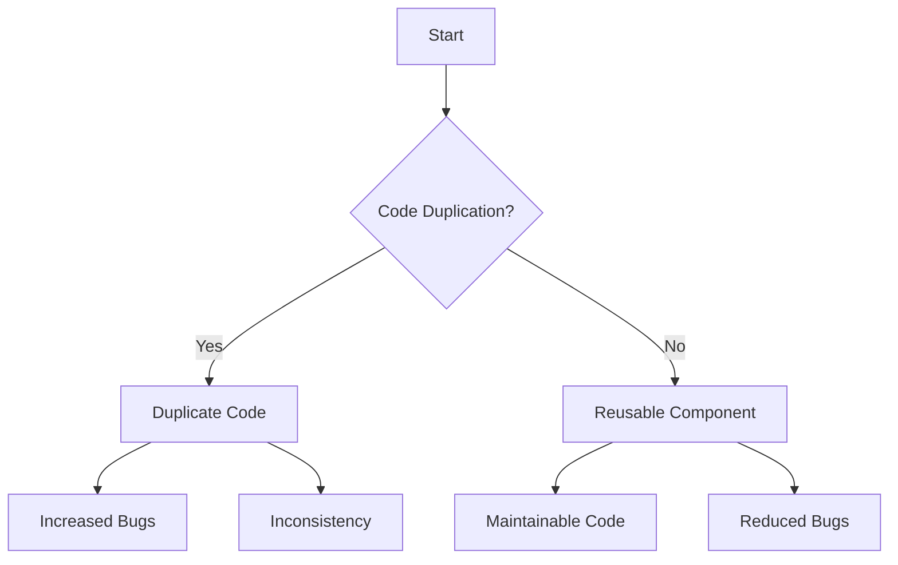

## 18.2.8 Copy-Paste Programming

Copy-paste programming is a common anti-pattern that emerges when developers duplicate code across different parts of an application instead of creating reusable components. This practice can lead to a host of issues, including increased risk of bugs, inconsistency, and difficulties in maintenance. In this section, we will explore the pitfalls of copy-paste programming, the importance of the DRY (Don't Repeat Yourself) principle, and strategies to foster reusable components in Swift development.

### Understanding Copy-Paste Programming

Copy-paste programming involves duplicating code snippets across various locations in a codebase. This often occurs when developers seek quick solutions to problems by reusing existing code without refactoring it into a more generalized and reusable form. While it may seem like a time-saving approach initially, it introduces several long-term challenges.

#### The Risks of Code Duplication

1. **Increased Risk of Bugs**: Duplicated code means that any bugs present in the original snippet are replicated across multiple locations. Fixing a bug in one place does not automatically resolve it elsewhere, leading to inconsistent behavior.

2. **Inconsistency**: As the application evolves, duplicated code may be modified in one place but not in others, resulting in inconsistent functionality. This can confuse developers and users alike.

3. **Maintenance Challenges**: Maintaining a codebase with significant duplication is cumbersome. Any change or improvement must be applied to all instances of the duplicated code, increasing the effort required for updates and bug fixes.

4. **Code Bloat**: Copy-paste programming leads to larger codebases with redundant code, making it harder to navigate and understand the overall structure.

5. **Technical Debt**: Over time, the accumulation of duplicated code adds to the technical debt of a project, making future development slower and more error-prone.

### The DRY Principle

The DRY (Don't Repeat Yourself) principle is a cornerstone of software development best practices. It advocates for reducing repetition of software patterns by abstracting common functionality into reusable components. Adhering to the DRY principle can significantly mitigate the issues associated with copy-paste programming.

#### Implementing DRY in Swift

Swift offers several powerful features that facilitate the implementation of DRY principles. Let's explore some of these features and how they can be leveraged to create reusable components.

1. **Functions and Methods**: Encapsulate repeated logic within functions or methods. This not only reduces duplication but also improves code readability and testability.

   ```swift
   // Example of encapsulating repeated logic in a function
   func calculateDiscountedPrice(for price: Double, discount: Double) -> Double {
       return price - (price * discount)
   }
   
   let item1Price = calculateDiscountedPrice(for: 100.0, discount: 0.1)
   let item2Price = calculateDiscountedPrice(for: 200.0, discount: 0.15)
   ```

2. **Protocols and Protocol Extensions**: Use protocols to define common behavior and protocol extensions to provide default implementations. This promotes code reuse and polymorphism.

   ```swift
   protocol Discountable {
       func applyDiscount(_ discount: Double) -> Double
   }
   
   extension Discountable {
       func applyDiscount(_ discount: Double) -> Double {
           return self.price - (self.price * discount)
       }
   }
   
   struct Product: Discountable {
       var price: Double
   }
   
   let product = Product(price: 150.0)
   let discountedPrice = product.applyDiscount(0.2)
   ```

3. **Generics**: Use generics to write flexible and reusable code that can work with any data type.

   ```swift
   // Generic function to find the maximum element in an array
   func findMaximum<T: Comparable>(in array: [T]) -> T? {
       return array.max()
   }
   
   let numbers = [1, 2, 3, 4, 5]
   if let maxNumber = findMaximum(in: numbers) {
       print("Maximum number is \\(maxNumber)")
   }
   ```

4. **Extensions**: Extend existing types with new functionality without modifying their original implementation. This is particularly useful for adding utility methods.

   ```swift
   extension String {
       func reversedString() -> String {
           return String(self.reversed())
       }
   }
   
   let original = "Swift"
   let reversed = original.reversedString()
   ```

5. **Structs and Classes**: Use structs and classes to encapsulate related data and behavior, promoting modular and reusable code.

   ```swift
   struct Rectangle {
       var width: Double
       var height: Double
       
       func area() -> Double {
           return width * height
       }
   }
   
   let rectangle = Rectangle(width: 10.0, height: 5.0)
   print("Area of rectangle: \\(rectangle.area())")
   ```

### Visualizing Code Duplication and DRY Implementation

Let's visualize the impact of code duplication and how DRY principles can be applied to refactor the code. Consider a scenario where you have multiple functions performing similar operations on different data types.



**Diagram Description**: This flowchart illustrates the decision-making process when encountering code duplication. If duplication is present, it leads to increased bugs and inconsistency. If a reusable component is created, it results in maintainable code and reduced bugs.

### Strategies to Avoid Copy-Paste Programming

1. **Code Reviews**: Conduct regular code reviews to identify and address instances of code duplication. Encourage team members to refactor duplicated code into reusable components.

2. **Refactoring**: Regularly refactor the codebase to extract common functionality into functions, methods, or classes. This not only reduces duplication but also improves code quality.

3. **Use of Libraries and Frameworks**: Leverage existing libraries and frameworks that provide reusable components and utilities. This can significantly reduce the need for custom implementations.

4. **Documentation and Guidelines**: Establish coding guidelines that emphasize the importance of DRY principles and provide examples of how to implement reusable components.

5. **Automated Tools**: Utilize tools that can automatically detect code duplication and suggest refactoring opportunities. These tools can be integrated into the development workflow to maintain code quality.

### Try It Yourself

Encourage experimentation by modifying the provided code examples. Try creating a new protocol with a default implementation, or refactor a piece of duplicated code in your own project into a reusable function or class. Observe how these changes impact the maintainability and readability of your code.

### Knowledge Check

Before moving on, let's test your understanding of copy-paste programming and DRY principles with a few questions:

1. What are the primary risks associated with copy-paste programming?
2. How can the DRY principle help mitigate the issues caused by code duplication?
3. Provide an example of how you can use Swift protocols to promote code reuse.
4. What role do code reviews play in preventing copy-paste programming?
5. How can generics be used to create reusable components in Swift?

### Embrace the Journey

Remember, avoiding copy-paste programming is just the beginning of writing clean and maintainable code. As you progress in your Swift development journey, continue to explore new ways to abstract and reuse code. Stay curious, keep experimenting, and enjoy the process of refining your skills.

## Quiz Time!



### What is a primary risk of copy-paste programming?

- [x] Increased risk of bugs
- [ ] Improved code readability
- [ ] Faster development speed
- [ ] Enhanced code security

> **Explanation:** Copy-paste programming increases the risk of bugs because duplicated code may contain errors that are replicated across multiple locations.

### How does the DRY principle help in software development?

- [x] By reducing code duplication
- [ ] By increasing code duplication
- [ ] By making code harder to read
- [ ] By slowing down development

> **Explanation:** The DRY principle helps by reducing code duplication, which leads to more maintainable and consistent code.

### Which Swift feature can be used to encapsulate repeated logic?

- [x] Functions and Methods
- [ ] Variables
- [ ] Constants
- [ ] Loops

> **Explanation:** Functions and methods are used to encapsulate repeated logic, promoting code reuse and reducing duplication.

### What is the role of code reviews in preventing copy-paste programming?

- [x] Identifying and addressing code duplication
- [ ] Encouraging more code duplication
- [ ] Slowing down the development process
- [ ] Making code harder to understand

> **Explanation:** Code reviews help identify and address code duplication, encouraging the creation of reusable components.

### How can generics in Swift promote code reuse?

- [x] By allowing functions to work with any data type
- [ ] By restricting functions to specific data types
- [ ] By increasing code duplication
- [ ] By making code harder to understand

> **Explanation:** Generics allow functions to work with any data type, promoting code reuse and flexibility.

### What is a common consequence of code duplication?

- [x] Inconsistency in functionality
- [ ] Consistency in functionality
- [ ] Improved code readability
- [ ] Faster development

> **Explanation:** Code duplication can lead to inconsistency in functionality, as changes in one place may not be reflected in others.

### How can protocols and protocol extensions help in Swift?

- [x] By defining common behavior and providing default implementations
- [ ] By increasing code duplication
- [ ] By making code harder to read
- [ ] By slowing down development

> **Explanation:** Protocols and protocol extensions define common behavior and provide default implementations, promoting code reuse.

### What is a benefit of using extensions in Swift?

- [x] Adding functionality to existing types
- [ ] Increasing code duplication
- [ ] Making code harder to read
- [ ] Slowing down development

> **Explanation:** Extensions allow adding functionality to existing types without modifying their original implementation, promoting code reuse.

### Which strategy can help avoid copy-paste programming?

- [x] Regular refactoring
- [ ] Avoiding code reviews
- [ ] Increasing code duplication
- [ ] Ignoring coding guidelines

> **Explanation:** Regular refactoring helps extract common functionality into reusable components, reducing code duplication.

### True or False: Copy-paste programming leads to technical debt.

- [x] True
- [ ] False

> **Explanation:** True. Copy-paste programming contributes to technical debt by creating a codebase that is harder to maintain and evolve.




