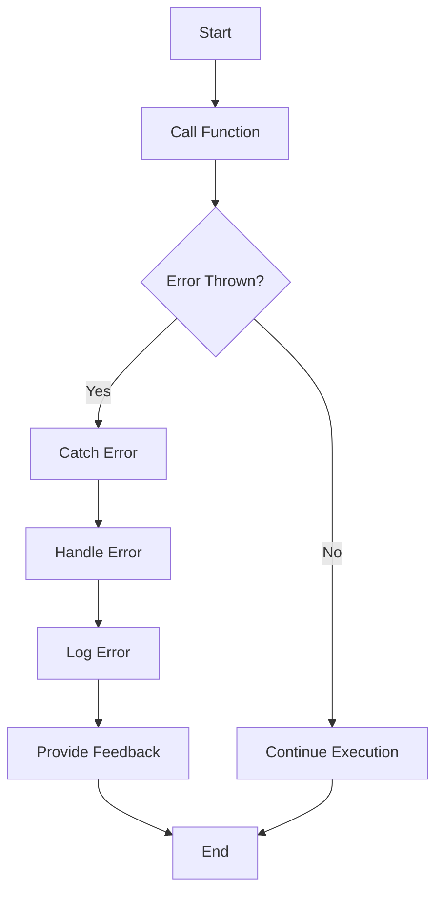

## 18.2.9 Ignoring Error Handling

In the realm of software development, particularly in Swift, ignoring error handling is a common anti-pattern that can lead to significant issues in application stability and user experience. This section delves into the consequences of neglecting error handling, explores effective strategies for managing errors, and provides practical examples to help you master error handling in Swift.

### Understanding the Consequences of Ignoring Error Handling

Ignoring error handling in Swift can have various detrimental effects on your application:

- **Potential for Crashes**: Unhandled errors can cause your application to crash, leading to a poor user experience and potentially losing user data.
- **Poor User Experience**: Users expect applications to handle errors gracefully. Ignoring errors can result in confusing behavior, leaving users frustrated and dissatisfied.
- **Security Vulnerabilities**: Unchecked errors can expose your application to security risks, as attackers might exploit these vulnerabilities.
- **Technical Debt**: Ignoring errors can lead to increased technical debt, making your codebase harder to maintain and extend.

### The Importance of Comprehensive Error Handling

Implementing comprehensive error handling strategies is crucial for building robust and reliable applications. Effective error handling involves anticipating potential issues, providing meaningful feedback to users, and ensuring the application remains stable under unexpected conditions.

### Swift's Error Handling Model

Swift provides a powerful and flexible error handling model that allows developers to manage errors effectively. Understanding Swift's error handling mechanisms is essential for avoiding the ignoring error handling anti-pattern.

#### Error Protocol

In Swift, errors are represented by types that conform to the `Error` protocol. This protocol is an empty protocol, serving as a marker to indicate that a type can be used for error handling.

```swift
enum NetworkError: Error {
    case invalidURL
    case requestFailed
    case unknown
}
```

#### Throwing Functions

Swift functions can throw errors, allowing you to indicate that a function might fail under certain conditions. To declare a throwing function, use the `throws` keyword.

```swift
func fetchData(from url: String) throws -> Data {
    guard let url = URL(string: url) else {
        throw NetworkError.invalidURL
    }
    // Logic to fetch data
    return Data()
}
```

#### Do-Try-Catch

Swift uses a `do-try-catch` block to handle errors. This block allows you to attempt an operation that might throw an error and handle any errors that occur.

```swift
do {
    let data = try fetchData(from: "https://example.com")
    // Process data
} catch NetworkError.invalidURL {
    print("Invalid URL provided.")
} catch NetworkError.requestFailed {
    print("Network request failed.")
} catch {
    print("An unknown error occurred: \\(error).")
}
```

#### Propagating Errors

Instead of handling an error immediately, you can propagate it to the calling function. This is useful when the current function cannot handle the error appropriately.

```swift
func performNetworkRequest() throws {
    try fetchData(from: "https://example.com")
}
```

### Best Practices for Error Handling in Swift

To avoid the ignoring error handling anti-pattern, consider the following best practices:

#### 1. Anticipate and Plan for Errors

- **Identify Potential Failure Points**: Analyze your code to identify where errors might occur and plan accordingly.
- **Use Defensive Programming**: Implement checks and validations to prevent errors from occurring.

#### 2. Provide Meaningful Error Messages

- **User-Friendly Messages**: Ensure error messages are clear and helpful, guiding users on how to resolve the issue.
- **Detailed Logs for Developers**: Log detailed error information to assist in debugging and troubleshooting.

#### 3. Use Swift's Error Handling Features

- **Leverage the `do-try-catch` Block**: Use Swift's built-in error handling features to manage errors effectively.
- **Propagate Errors When Necessary**: Allow errors to be handled at a higher level when appropriate.

#### 4. Avoid Silent Failures

- **Handle All Errors**: Ensure that all potential errors are handled explicitly, avoiding silent failures that can lead to unexpected behavior.
- **Use Assertions for Critical Errors**: Use assertions to catch critical errors during development.

#### 5. Test Error Handling Code

- **Unit Tests for Error Scenarios**: Write unit tests to verify that your error handling code behaves as expected.
- **Simulate Error Conditions**: Test your application under various error conditions to ensure robustness.

### Code Example: Comprehensive Error Handling

Let's explore a comprehensive example of error handling in Swift, demonstrating best practices and effective strategies.

```swift
import Foundation

enum FileError: Error {
    case fileNotFound
    case unreadable
    case encodingFailed
}

func readFile(at path: String) throws -> String {
    guard let fileURL = URL(string: path) else {
        throw FileError.fileNotFound
    }
    
    do {
        let data = try Data(contentsOf: fileURL)
        guard let content = String(data: data, encoding: .utf8) else {
            throw FileError.encodingFailed
        }
        return content
    } catch {
        throw FileError.unreadable
    }
}

func processFileContent() {
    let filePath = "file:///example.txt"
    
    do {
        let content = try readFile(at: filePath)
        print("File content: \\(content)")
    } catch FileError.fileNotFound {
        print("Error: The file was not found.")
    } catch FileError.unreadable {
        print("Error: The file could not be read.")
    } catch FileError.encodingFailed {
        print("Error: Failed to decode the file content.")
    } catch {
        print("An unexpected error occurred: \\(error).")
    }
}

processFileContent()
```

### Visualizing Error Handling in Swift

Let's visualize the process of error handling in Swift using a flowchart.



**Figure 1: Visualizing Error Handling in Swift**

### Try It Yourself

Experiment with the provided code example by modifying the error types and handling different error scenarios. Consider adding new error cases and handling them appropriately to strengthen your understanding of Swift's error handling model.

### References and Links

- [Swift Error Handling Documentation](https://developer.apple.com/documentation/swift/error)
- [Swift Programming Language Guide](https://docs.swift.org/swift-book/LanguageGuide/ErrorHandling.html)

### Knowledge Check

- What are the potential consequences of ignoring error handling in Swift?
- How does Swift's `Error` protocol help in error handling?
- What is the purpose of the `do-try-catch` block in Swift?
- Why is it important to provide meaningful error messages to users?

### Embrace the Journey

Remember, mastering error handling in Swift is a journey. As you continue to develop your skills, you'll build more resilient and reliable applications. Keep experimenting, stay curious, and enjoy the process of learning and growing as a Swift developer!

## Quiz Time!



### What is a potential consequence of ignoring error handling in Swift?

- [x] Application crashes
- [ ] Improved performance
- [ ] Enhanced security
- [ ] Increased user engagement

> **Explanation:** Ignoring error handling can lead to application crashes, resulting in a poor user experience.

### Which Swift feature is used to declare a function that can throw errors?

- [ ] `catch`
- [x] `throws`
- [ ] `try`
- [ ] `do`

> **Explanation:** The `throws` keyword is used to declare a function that can throw errors.

### What is the purpose of the `do-try-catch` block in Swift?

- [ ] To improve code readability
- [x] To handle errors that might be thrown
- [ ] To optimize performance
- [ ] To enhance security

> **Explanation:** The `do-try-catch` block is used to handle errors that might be thrown during execution.

### How can errors be propagated in Swift?

- [x] By using the `throws` keyword in function signatures
- [ ] By using the `catch` keyword
- [ ] By using the `do` keyword
- [ ] By using the `try` keyword

> **Explanation:** Errors can be propagated in Swift by using the `throws` keyword in function signatures.

### Which practice helps avoid silent failures in Swift?

- [ ] Ignoring errors
- [ ] Using assertions
- [x] Handling all errors explicitly
- [ ] Avoiding error propagation

> **Explanation:** Handling all errors explicitly helps avoid silent failures in Swift.

### Why is it important to test error handling code?

- [x] To ensure it behaves as expected under error conditions
- [ ] To improve code readability
- [ ] To enhance performance
- [ ] To reduce code complexity

> **Explanation:** Testing error handling code ensures it behaves as expected under error conditions.

### What is a benefit of providing meaningful error messages?

- [x] Improved user experience
- [ ] Reduced application size
- [ ] Increased code complexity
- [ ] Enhanced performance

> **Explanation:** Providing meaningful error messages improves user experience by guiding users on how to resolve issues.

### How can developers simulate error conditions for testing?

- [x] By writing unit tests for error scenarios
- [ ] By ignoring errors
- [ ] By optimizing code
- [ ] By avoiding error handling

> **Explanation:** Developers can simulate error conditions by writing unit tests for error scenarios.

### True or False: Ignoring error handling can lead to security vulnerabilities.

- [x] True
- [ ] False

> **Explanation:** Ignoring error handling can expose applications to security vulnerabilities.

### What is one way to handle critical errors during development?

- [x] Use assertions
- [ ] Ignore them
- [ ] Optimize code
- [ ] Avoid error handling

> **Explanation:** Using assertions helps catch critical errors during development.






