## 18.2 Common Anti-Patterns in Swift

In the world of software development, anti-patterns are common solutions to recurring problems that are ineffective and counterproductive. In Swift development, these anti-patterns can lead to code that is difficult to read, maintain, and extend. Recognizing and avoiding these pitfalls is crucial for creating robust and maintainable Swift applications. In this section, we will explore some of the most prevalent anti-patterns encountered in Swift projects, their impact, and strategies to avoid them.

### 18.2.1 Massive View Controller

#### Definition
The Massive View Controller anti-pattern occurs when a view controller is overloaded with responsibilities, handling everything from UI logic to business logic and data management. This results in a monolithic class that is difficult to test and maintain.

#### Impact
- **Reduced Readability:** The view controller becomes cluttered with code, making it hard to navigate and understand.
- **Poor Testability:** Testing becomes challenging as the view controller handles multiple responsibilities.
- **Difficult Maintenance:** Changes in one part of the view controller can have unintended effects on other parts.

#### How to Avoid
- **Adopt MVC Properly:** Ensure that the Model-View-Controller pattern is correctly implemented by separating concerns.
- **Use MVVM or VIPER:** Consider using architectural patterns like MVVM (Model-View-ViewModel) or VIPER to better separate concerns.
- **Delegate and Data Source:** Offload some responsibilities to delegate and data source objects.

#### Code Example

```swift
// Massive View Controller Example
class MassiveViewController: UIViewController {
    var data: [String] = []
    
    override func viewDidLoad() {
        super.viewDidLoad()
        fetchData()
        setupUI()
    }
    
    func fetchData() {
        // Fetch data from network
    }
    
    func setupUI() {
        // Setup UI elements
    }
    
    func handleUserInteraction() {
        // Handle user interaction
    }
}
```

#### Refactored Example

```swift
// Refactored with MVVM
class ViewController: UIViewController {
    var viewModel: ViewModel!
    
    override func viewDidLoad() {
        super.viewDidLoad()
        viewModel.fetchData()
        setupUI()
    }
    
    func setupUI() {
        // Setup UI elements
    }
}

// ViewModel
class ViewModel {
    var data: [String] = []
    
    func fetchData() {
        // Fetch data from network
    }
}
```

### 18.2.2 Retain Cycles and Memory Leaks

#### Definition
Retain cycles occur when two or more objects hold strong references to each other, preventing them from being deallocated and causing memory leaks.

#### Impact
- **Memory Leaks:** Unused objects remain in memory, leading to increased memory usage and potential app crashes.
- **Performance Degradation:** The app may slow down due to excessive memory consumption.

#### How to Avoid
- **Use Weak References:** Use `weak` or `unowned` references to break retain cycles.
- **ARC Awareness:** Be mindful of Automatic Reference Counting (ARC) and how it manages memory.

#### Code Example

```swift
// Retain Cycle Example
class Parent {
    var child: Child?
}

class Child {
    var parent: Parent?
}

let parent = Parent()
let child = Child()
parent.child = child
child.parent = parent
```

#### Refactored Example

```swift
// Breaking Retain Cycle
class Parent {
    var child: Child?
}

class Child {
    weak var parent: Parent?
}

let parent = Parent()
let child = Child()
parent.child = child
child.parent = parent
```

### 18.2.3 Force Unwrapping Optionals

#### Definition
Force unwrapping occurs when an optional is accessed using the `!` operator without ensuring it contains a value, leading to runtime crashes if the optional is `nil`.

#### Impact
- **Runtime Crashes:** The app crashes if a `nil` value is force unwrapped.
- **Unreliable Code:** Code becomes less reliable and harder to debug.

#### How to Avoid
- **Optional Binding:** Use `if let` or `guard let` to safely unwrap optionals.
- **Nil-Coalescing Operator:** Use the `??` operator to provide a default value.

#### Code Example

```swift
// Force Unwrapping Example
let number: Int? = nil
let unwrappedNumber = number! // Runtime crash if number is nil
```

#### Refactored Example

```swift
// Safe Unwrapping
let number: Int? = nil

if let unwrappedNumber = number {
    print("Number is \\(unwrappedNumber)")
} else {
    print("Number is nil")
}

// Using Nil-Coalescing Operator
let safeNumber = number ?? 0
print("Safe number is \\(safeNumber)")
```

### 18.2.4 Singleton Overuse and Abuse

#### Definition
The Singleton pattern restricts a class to a single instance. Overuse occurs when singletons are used excessively, leading to tightly coupled code and global state management issues.

#### Impact
- **Global State Issues:** Singletons introduce global state, making it difficult to manage and test.
- **Tight Coupling:** Code becomes tightly coupled to the singleton, reducing flexibility.

#### How to Avoid
- **Limit Singleton Use:** Use singletons sparingly and only when truly necessary.
- **Dependency Injection:** Use dependency injection to manage dependencies instead of singletons.

#### Code Example

```swift
// Singleton Overuse Example
class Logger {
    static let shared = Logger()
    
    private init() {}
    
    func log(message: String) {
        print(message)
    }
}
```

#### Refactored Example

```swift
// Using Dependency Injection
class Logger {
    func log(message: String) {
        print(message)
    }
}

class SomeClass {
    let logger: Logger
    
    init(logger: Logger) {
        self.logger = logger
    }
    
    func doSomething() {
        logger.log(message: "Doing something")
    }
}
```

### 18.2.5 God Object and Spaghetti Code

#### Definition
A God Object is an object that knows too much or does too much. Spaghetti code refers to code with a complex and tangled control structure.

#### Impact
- **Poor Maintainability:** Code is difficult to understand and modify.
- **High Complexity:** The system becomes overly complex and error-prone.

#### How to Avoid
- **Single Responsibility Principle:** Ensure each class or function has a single responsibility.
- **Refactoring:** Regularly refactor code to improve structure and readability.

#### Code Example

```swift
// God Object Example
class GodObject {
    var data: [String] = []
    
    func fetchData() {
        // Fetch data
    }
    
    func processData() {
        // Process data
    }
    
    func displayData() {
        // Display data
    }
}
```

#### Refactored Example

```swift
// Refactored with Separation of Concerns
class DataFetcher {
    func fetchData() -> [String] {
        // Fetch data
        return []
    }
}

class DataProcessor {
    func processData(data: [String]) {
        // Process data
    }
}

class DataDisplayer {
    func displayData(data: [String]) {
        // Display data
    }
}
```

### 18.2.6 Premature Optimization

#### Definition
Premature optimization refers to making performance improvements before they are necessary, often at the expense of code clarity and maintainability.

#### Impact
- **Reduced Readability:** Code becomes complex and difficult to understand.
- **Wasted Effort:** Time and effort are spent on optimizing parts of the code that may not need it.

#### How to Avoid
- **Profile First:** Use profiling tools to identify performance bottlenecks before optimizing.
- **Focus on Readability:** Prioritize code readability and maintainability over premature optimization.

#### Code Example

```swift
// Premature Optimization Example
func calculateSum(_ numbers: [Int]) -> Int {
    var sum = 0
    for number in numbers {
        sum += number
    }
    return sum
}
```

#### Refactored Example

```swift
// Optimized After Profiling
func calculateSum(_ numbers: [Int]) -> Int {
    return numbers.reduce(0, +)
}
```

### 18.2.7 Over-Engineering

#### Definition
Over-engineering occurs when a solution is more complex than necessary, often involving unnecessary abstractions and features.

#### Impact
- **Increased Complexity:** The codebase becomes unnecessarily complex and difficult to maintain.
- **Wasted Resources:** Time and resources are wasted on developing features that may not be needed.

#### How to Avoid
- **YAGNI Principle:** Follow the "You Aren't Gonna Need It" principle to avoid adding unnecessary features.
- **Simplify Solutions:** Focus on simplicity and only add complexity when absolutely necessary.

#### Code Example

```swift
// Over-Engineered Example
protocol Operation {
    func execute()
}

class AdditionOperation: Operation {
    func execute() {
        // Perform addition
    }
}

class SubtractionOperation: Operation {
    func execute() {
        // Perform subtraction
    }
}
```

#### Refactored Example

```swift
// Simplified Solution
func performOperation(_ operation: (Int, Int) -> Int, a: Int, b: Int) -> Int {
    return operation(a, b)
}

let sum = performOperation(+, a: 5, b: 3)
let difference = performOperation(-, a: 5, b: 3)
```

### 18.2.8 Copy-Paste Programming

#### Definition
Copy-paste programming involves duplicating code across different parts of a codebase, leading to redundancy and inconsistency.

#### Impact
- **Code Duplication:** Increases the risk of bugs and inconsistencies.
- **Difficult Maintenance:** Changes need to be made in multiple places, increasing maintenance effort.

#### How to Avoid
- **DRY Principle:** Follow the "Don't Repeat Yourself" principle to eliminate code duplication.
- **Refactor Common Logic:** Extract common logic into reusable functions or classes.

#### Code Example

```swift
// Copy-Paste Example
func calculateAreaOfRectangle(width: Double, height: Double) -> Double {
    return width * height
}

func calculateAreaOfSquare(side: Double) -> Double {
    return side * side
}
```

#### Refactored Example

```swift
// Refactored with DRY Principle
func calculateArea(of shape: Shape) -> Double {
    switch shape {
    case .rectangle(let width, let height):
        return width * height
    case .square(let side):
        return side * side
    }
}

enum Shape {
    case rectangle(width: Double, height: Double)
    case square(side: Double)
}
```

### 18.2.9 Ignoring Error Handling

#### Definition
Ignoring error handling involves neglecting to handle potential errors, leading to unhandled exceptions and crashes.

#### Impact
- **Unreliable Code:** Code becomes unreliable and prone to crashes.
- **Poor User Experience:** Users may encounter unexpected errors and crashes.

#### How to Avoid
- **Use Do-Try-Catch:** Implement error handling using Swift's `do-try-catch` mechanism.
- **Handle All Cases:** Ensure all potential error cases are handled appropriately.

#### Code Example

```swift
// Ignoring Error Handling Example
func readFile(at path: String) -> String {
    let content = try! String(contentsOfFile: path)
    return content
}
```

#### Refactored Example

```swift
// Proper Error Handling
func readFile(at path: String) -> String? {
    do {
        let content = try String(contentsOfFile: path)
        return content
    } catch {
        print("Failed to read file: \\(error)")
        return nil
    }
}
```

### 18.2.10 Poor Naming Conventions

#### Definition
Poor naming conventions involve using unclear or inconsistent names for variables, functions, and classes, leading to confusion and misunderstandings.

#### Impact
- **Reduced Readability:** Code becomes difficult to read and understand.
- **Increased Errors:** Misunderstandings can lead to errors and bugs.

#### How to Avoid
- **Follow Naming Conventions:** Use descriptive and consistent naming conventions.
- **Use Swift Guidelines:** Follow Swift's naming guidelines for clarity and consistency.

#### Code Example

```swift
// Poor Naming Example
func c(x: Int, y: Int) -> Int {
    return x + y
}
```

#### Refactored Example

```swift
// Improved Naming
func calculateSum(of firstNumber: Int, and secondNumber: Int) -> Int {
    return firstNumber + secondNumber
}
```

### Visualizing Anti-Patterns

To better understand the relationships and impact of anti-patterns, let's visualize the concept using a Mermaid.js diagram.

```mermaid
graph TD;
    A[Massive View Controller] --> B[Reduced Readability];
    A --> C[Poor Testability];
    A --> D[Difficult Maintenance];
    E[Retain Cycles] --> F[Memory Leaks];
    E --> G[Performance Degradation];
    H[Force Unwrapping] --> I[Runtime Crashes];
    H --> J[Unreliable Code];
    K[Singleton Overuse] --> L[Global State Issues];
    K --> M[Tight Coupling];
    N[God Object] --> O[Poor Maintainability];
    N --> P[High Complexity];
    Q[Premature Optimization] --> R[Reduced Readability];
    Q --> S[Wasted Effort];
    T[Over-Engineering] --> U[Increased Complexity];
    T --> V[Wasted Resources];
    W[Copy-Paste Programming] --> X[Code Duplication];
    W --> Y[Difficult Maintenance];
    Z[Ignoring Error Handling] --> AA[Unreliable Code];
    Z --> AB[Poor User Experience];
    AC[Poor Naming Conventions] --> AD[Reduced Readability];
    AC --> AE[Increased Errors];
```



### Conclusion

Understanding and avoiding common anti-patterns in Swift development is crucial for creating robust, maintainable, and efficient applications. By recognizing these pitfalls and implementing best practices, you can ensure that your code remains clean, scalable, and easy to understand.

Remember, this is just the beginning. As you progress in your Swift development journey, continue to refine your skills and stay curious. Keep experimenting, learn from your mistakes, and enjoy the journey of mastering Swift design patterns.

## Quiz Time!



### What is the main issue with the Massive View Controller anti-pattern?

- [x] It leads to reduced readability and poor testability.
- [ ] It causes memory leaks and performance degradation.
- [ ] It results in runtime crashes due to force unwrapping.
- [ ] It introduces global state issues.

> **Explanation:** The Massive View Controller anti-pattern results in reduced readability and poor testability due to overloading the view controller with multiple responsibilities.

### How can retain cycles be prevented in Swift?

- [x] By using weak or unowned references.
- [ ] By using strong references.
- [ ] By avoiding optionals.
- [ ] By using force unwrapping.

> **Explanation:** Retain cycles can be prevented by using weak or unowned references to break the strong reference cycle between objects.

### What is a common consequence of force unwrapping optionals?

- [x] Runtime crashes if the optional is nil.
- [ ] Memory leaks due to retain cycles.
- [ ] Increased complexity and over-engineering.
- [ ] Poor naming conventions.

> **Explanation:** Force unwrapping an optional that is nil will result in a runtime crash, making the code unreliable.

### What is the main problem with Singleton Overuse?

- [x] It introduces global state issues and tight coupling.
- [ ] It causes runtime crashes due to force unwrapping.
- [ ] It results in code duplication and difficult maintenance.
- [ ] It leads to poor naming conventions.

> **Explanation:** Singleton overuse introduces global state issues and tight coupling, making the code difficult to manage and test.

### Which principle helps avoid the God Object anti-pattern?

- [x] Single Responsibility Principle.
- [ ] YAGNI Principle.
- [ ] DRY Principle.
- [ ] SOLID Principle.

> **Explanation:** The Single Responsibility Principle helps ensure that each class or function has a single responsibility, avoiding the God Object anti-pattern.

### What should be prioritized over premature optimization?

- [x] Code readability and maintainability.
- [ ] Adding more features.
- [ ] Using more design patterns.
- [ ] Increasing code complexity.

> **Explanation:** Code readability and maintainability should be prioritized over premature optimization to ensure the code is clear and easy to understand.

### What is the impact of copy-paste programming?

- [x] Code duplication and difficult maintenance.
- [ ] Increased complexity and over-engineering.
- [ ] Poor testability and reduced readability.
- [ ] Global state issues and tight coupling.

> **Explanation:** Copy-paste programming leads to code duplication and difficult maintenance, as changes need to be made in multiple places.

### How can ignoring error handling affect an application?

- [x] It makes the code unreliable and prone to crashes.
- [ ] It leads to increased complexity and over-engineering.
- [ ] It causes memory leaks and performance degradation.
- [ ] It results in poor naming conventions.

> **Explanation:** Ignoring error handling makes the code unreliable and prone to crashes, negatively impacting the user experience.

### What is a benefit of following good naming conventions?

- [x] Improved readability and reduced errors.
- [ ] Increased code complexity.
- [ ] More global state issues.
- [ ] More runtime crashes.

> **Explanation:** Good naming conventions improve code readability and reduce errors by making the code easier to understand and follow.

### True or False: Over-engineering is beneficial for future-proofing an application.

- [ ] True
- [x] False

> **Explanation:** Over-engineering is not beneficial as it increases complexity unnecessarily and wastes resources on features that may not be needed.




