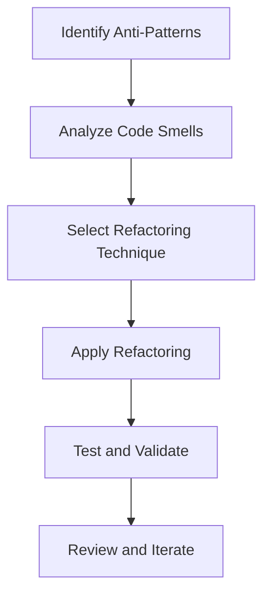

## 18.3 Refactoring Anti-Patterns

In software development, anti-patterns are common solutions to recurring problems that are ineffective and counterproductive. Refactoring anti-patterns involves identifying these problematic patterns and applying strategies to eliminate them, thereby improving code quality and maintainability. In this section, we will delve into strategies for identifying and eliminating anti-patterns, explore refactoring techniques to enhance code quality, and introduce tools that assist in the refactoring process.

### Understanding Anti-Patterns

Before we dive into refactoring techniques, it's essential to understand what anti-patterns are. Anti-patterns are poor solutions to design problems that can hinder software development by introducing complexity, reducing code readability, and making maintenance difficult. Common examples include:

- **Massive View Controller**: Overloaded view controllers with too many responsibilities.
- **Spaghetti Code**: Code with a complex and tangled control structure.
- **God Object**: An object that knows too much or does too much.
- **Singleton Overuse**: Excessive use of the Singleton pattern, leading to tightly coupled code.

### Identifying Anti-Patterns

Identifying anti-patterns is the first step in the refactoring process. Here are some strategies to help you recognize them:

1. **Code Smells**: Look for code smells, which are symptoms of deeper problems. Examples include long methods, large classes, duplicate code, and inconsistent naming conventions.

2. **Code Reviews**: Conduct regular code reviews to spot anti-patterns. Peer reviews can provide fresh perspectives and identify issues that the original developer might overlook.

3. **Static Code Analysis**: Use static analysis tools to detect potential anti-patterns. These tools can automatically identify code smells and suggest improvements.

4. **Performance Issues**: Monitor performance metrics. Anti-patterns often lead to inefficient code that can degrade application performance.

5. **Complexity Metrics**: Measure code complexity using tools that provide metrics like cyclomatic complexity. High complexity often indicates the presence of anti-patterns.

### Refactoring Techniques

Once anti-patterns are identified, the next step is to refactor the code to eliminate them. Here are some effective refactoring techniques:

#### 1. Extract Method

**Intent**: Simplify complex methods by breaking them into smaller, more manageable pieces.

**Example**:

```swift
// Before refactoring
func processOrder(order: Order) {
    // Validate order
    if order.items.isEmpty {
        print("Order has no items.")
        return
    }
    // Calculate total
    var total = 0.0
    for item in order.items {
        total += item.price * Double(item.quantity)
    }
    // Print receipt
    print("Order total: \\(total)")
}

// After refactoring
func processOrder(order: Order) {
    guard validateOrder(order) else { return }
    let total = calculateTotal(order)
    printReceipt(total)
}

func validateOrder(_ order: Order) -> Bool {
    if order.items.isEmpty {
        print("Order has no items.")
        return false
    }
    return true
}

func calculateTotal(_ order: Order) -> Double {
    return order.items.reduce(0) { $0 + $1.price * Double($1.quantity) }
}

func printReceipt(_ total: Double) {
    print("Order total: \\(total)")
}
```

#### 2. Move Method/Field

**Intent**: Improve class cohesion by moving methods or fields to more appropriate classes.

**Example**:

```swift
// Before refactoring
class Order {
    var items: [Item] = []
    var customerEmail: String = ""
    
    func sendConfirmationEmail() {
        print("Sending email to \\(customerEmail)")
    }
}

// After refactoring
class Order {
    var items: [Item] = []
    var customer: Customer
}

class Customer {
    var email: String = ""
    
    func sendConfirmationEmail() {
        print("Sending email to \\(email)")
    }
}
```

#### 3. Replace Conditional with Polymorphism

**Intent**: Replace complex conditional logic with polymorphic behavior.

**Example**:

```swift
// Before refactoring
func calculateShippingCost(order: Order) -> Double {
    switch order.shippingMethod {
    case .standard:
        return 5.0
    case .express:
        return 10.0
    case .overnight:
        return 20.0
    }
}

// After refactoring
protocol ShippingStrategy {
    func calculateCost() -> Double
}

class StandardShipping: ShippingStrategy {
    func calculateCost() -> Double { return 5.0 }
}

class ExpressShipping: ShippingStrategy {
    func calculateCost() -> Double { return 10.0 }
}

class OvernightShipping: ShippingStrategy {
    func calculateCost() -> Double { return 20.0 }
}

func calculateShippingCost(strategy: ShippingStrategy) -> Double {
    return strategy.calculateCost()
}
```

### Tools for Refactoring

Several tools can assist in the refactoring process, making it more efficient and reliable:

1. **Xcode Refactoring Tools**: Xcode provides built-in refactoring tools that support common refactoring operations like renaming, extracting methods, and moving files.

2. **SwiftLint**: A tool to enforce Swift style and conventions. It can help identify code smells and suggest improvements.

3. **SonarQube**: A static analysis tool that can detect code smells, bugs, and security vulnerabilities.

4. **AppCode**: A JetBrains IDE for Swift that offers advanced refactoring capabilities.

5. **SwiftFormat**: A tool for formatting Swift code according to style guidelines, which can also help identify and fix code smells.

### Visualizing Refactoring Process

To better understand the refactoring process, let's visualize the steps involved using a flowchart:



**Description**: This flowchart outlines the refactoring process, starting from identifying anti-patterns, analyzing code smells, selecting appropriate refactoring techniques, applying refactoring, testing and validating changes, and finally reviewing and iterating to ensure code quality.

### Knowledge Check

Let's reinforce our understanding with a few questions:

- What are some common anti-patterns in Swift development?
- How can code reviews help in identifying anti-patterns?
- What is the purpose of the "Extract Method" refactoring technique?
- How does replacing conditionals with polymorphism improve code quality?
- What tools can assist in the refactoring process for Swift?

### Try It Yourself

Experiment with the refactoring techniques discussed:

- Take a piece of complex Swift code and apply the "Extract Method" technique.
- Identify a class with low cohesion and use the "Move Method/Field" technique.
- Find a section of code with complex conditionals and refactor it using polymorphism.

### Embrace the Journey

Remember, refactoring is an ongoing process. As you continue developing in Swift, keep an eye out for anti-patterns and apply refactoring techniques to maintain high code quality. Stay curious, experiment with different approaches, and enjoy the journey of mastering Swift development!

## Quiz Time!



### What is an anti-pattern?

- [x] A common solution to a recurring problem that is ineffective and counterproductive.
- [ ] A design pattern that solves a common problem effectively.
- [ ] A pattern used to create new objects in Swift.
- [ ] A pattern that enhances code readability.

> **Explanation:** An anti-pattern is a common solution to a recurring problem that is ineffective and counterproductive, often leading to poor code quality.

### Which refactoring technique simplifies complex methods?

- [x] Extract Method
- [ ] Move Method/Field
- [ ] Replace Conditional with Polymorphism
- [ ] Singleton Pattern

> **Explanation:** The "Extract Method" technique simplifies complex methods by breaking them into smaller, more manageable pieces.

### What tool can be used for static code analysis in Swift?

- [x] SonarQube
- [ ] SwiftLint
- [ ] Xcode
- [ ] AppCode

> **Explanation:** SonarQube is a static analysis tool that can detect code smells, bugs, and security vulnerabilities in Swift code.

### How does replacing conditionals with polymorphism improve code?

- [x] By reducing complex conditional logic and enhancing code readability.
- [ ] By increasing the number of classes in the codebase.
- [ ] By making the code more difficult to understand.
- [ ] By introducing more dependencies.

> **Explanation:** Replacing conditionals with polymorphism reduces complex conditional logic and enhances code readability by leveraging polymorphic behavior.

### Which tool is specifically designed to enforce Swift style and conventions?

- [x] SwiftLint
- [ ] SonarQube
- [ ] Xcode
- [ ] AppCode

> **Explanation:** SwiftLint is a tool specifically designed to enforce Swift style and conventions, helping to identify code smells and suggest improvements.

### What is the first step in the refactoring process?

- [x] Identifying anti-patterns
- [ ] Applying refactoring techniques
- [ ] Testing and validating changes
- [ ] Reviewing and iterating

> **Explanation:** The first step in the refactoring process is identifying anti-patterns, which involves recognizing problematic patterns in the code.

### What is the purpose of the "Move Method/Field" technique?

- [x] To improve class cohesion by moving methods or fields to more appropriate classes.
- [ ] To simplify complex methods by breaking them into smaller pieces.
- [ ] To replace complex conditional logic with polymorphic behavior.
- [ ] To enforce Swift style and conventions.

> **Explanation:** The "Move Method/Field" technique improves class cohesion by moving methods or fields to more appropriate classes.

### How can code reviews help in identifying anti-patterns?

- [x] By providing fresh perspectives and identifying issues that the original developer might overlook.
- [ ] By automatically detecting code smells.
- [ ] By increasing the number of classes in the codebase.
- [ ] By introducing more dependencies.

> **Explanation:** Code reviews help in identifying anti-patterns by providing fresh perspectives and identifying issues that the original developer might overlook.

### What is the benefit of using Xcode's refactoring tools?

- [x] They support common refactoring operations like renaming, extracting methods, and moving files.
- [ ] They automatically detect code smells and suggest improvements.
- [ ] They enforce Swift style and conventions.
- [ ] They provide advanced refactoring capabilities.

> **Explanation:** Xcode's refactoring tools support common refactoring operations like renaming, extracting methods, and moving files, making the refactoring process more efficient.

### True or False: Refactoring is a one-time process.

- [ ] True
- [x] False

> **Explanation:** Refactoring is not a one-time process; it is an ongoing process that involves continuously improving code quality and maintaining high standards.




