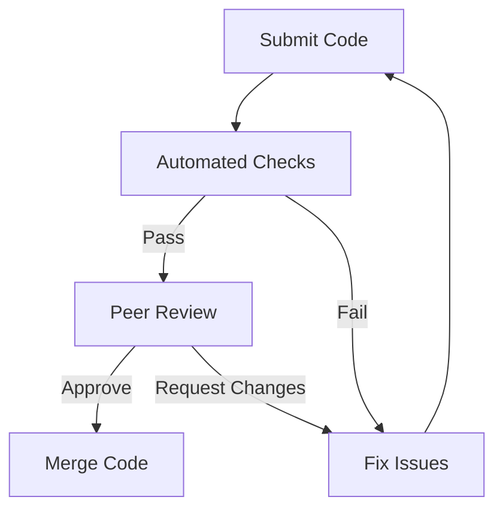

## 18.4 Techniques to Avoid Anti-Patterns

In the world of software development, anti-patterns are common pitfalls that can lead to inefficient, unmaintainable, and error-prone code. As Swift developers, our goal is to build robust, scalable, and maintainable applications. In this section, we will explore effective techniques to avoid anti-patterns in Swift development. We will emphasize simplicity, clarity, and adherence to design patterns, along with regular code reviews and team education.

### Understanding Anti-Patterns

Before we delve into the techniques to avoid anti-patterns, it's important to understand what anti-patterns are. An anti-pattern is a common response to a recurring problem that is usually ineffective and risks being counterproductive. Unlike design patterns, which are proven solutions to common problems, anti-patterns are the opposite—they are solutions that may seem beneficial at first but ultimately lead to negative consequences.

### The Importance of Avoiding Anti-Patterns

Avoiding anti-patterns is crucial for several reasons:

1. **Maintainability**: Anti-patterns often result in code that is difficult to understand and modify, leading to increased maintenance costs.
2. **Scalability**: Poor design choices can hinder the scalability of the application, making it difficult to adapt to changing requirements.
3. **Performance**: Inefficient code patterns can lead to performance bottlenecks, affecting the overall user experience.
4. **Team Collaboration**: Anti-patterns can create confusion and inconsistency within a development team, leading to decreased productivity.

### Techniques to Avoid Anti-Patterns

Let's explore a variety of techniques that can help us avoid anti-patterns in Swift development.

#### 1. Emphasize Simplicity and Clarity

One of the most effective ways to avoid anti-patterns is to prioritize simplicity and clarity in your code. Here are some strategies to achieve this:

- **Write Clear and Concise Code**: Avoid complex and convoluted logic. Strive for code that is easy to read and understand.
- **Use Descriptive Naming**: Choose meaningful names for variables, functions, and classes. This makes the code self-explanatory and reduces the need for excessive comments.
- **Break Down Complex Functions**: If a function is becoming too long or complex, break it down into smaller, more manageable functions.

#### 2. Adhere to Established Design Patterns

Design patterns provide proven solutions to common problems and can help prevent anti-patterns. Here are some ways to effectively use design patterns:

- **Understand the Purpose of Each Pattern**: Familiarize yourself with the intent and applicability of various design patterns. This will help you choose the right pattern for the problem at hand.
- **Avoid Overusing Patterns**: While design patterns are useful, overusing them can lead to unnecessary complexity. Use patterns judiciously and only when they provide a clear benefit.
- **Stay Updated with Modern Patterns**: The field of software design is constantly evolving. Stay informed about new patterns and best practices.

#### 3. Conduct Regular Code Reviews

Code reviews are an essential part of the development process and can help identify and prevent anti-patterns. Here are some tips for effective code reviews:

- **Establish a Code Review Process**: Define a clear process for code reviews, including guidelines and criteria for evaluating code quality.
- **Encourage Constructive Feedback**: Foster a culture of constructive feedback where team members can learn from each other and improve their coding skills.
- **Use Automated Tools**: Leverage automated tools to identify common coding issues and enforce coding standards.

#### 4. Invest in Team Education

Continuous learning and education are key to preventing anti-patterns. Here are some ways to promote team education:

- **Provide Training and Workshops**: Offer training sessions and workshops on design patterns, best practices, and new technologies.
- **Encourage Knowledge Sharing**: Create opportunities for team members to share their knowledge and experiences, such as regular tech talks or brown bag sessions.
- **Stay Informed About Industry Trends**: Encourage team members to stay updated with the latest industry trends and advancements.

#### 5. Implement Effective Error Handling

Proper error handling is crucial to avoid anti-patterns related to error management. Here are some strategies for effective error handling:

- **Use Swift's Error Handling Mechanisms**: Leverage Swift's built-in error handling features, such as `do-catch` blocks and `Result` types, to manage errors gracefully.
- **Avoid Force Unwrapping**: Force unwrapping optionals can lead to runtime crashes. Use optional binding or the `guard` statement to safely handle optionals.
- **Provide Meaningful Error Messages**: When handling errors, provide clear and informative error messages that help users understand what went wrong.

#### 6. Prioritize Testability and Testing

Testing is a critical aspect of software development that can help prevent anti-patterns. Here are some testing best practices:

- **Write Unit Tests**: Develop unit tests to verify the functionality of individual components. This helps catch issues early in the development process.
- **Use Test-Driven Development (TDD)**: Adopt TDD practices to ensure that your code is thoroughly tested and meets the desired requirements.
- **Automate Testing**: Automate your testing process to ensure consistent and reliable test execution.

#### 7. Foster a Culture of Continuous Improvement

Continuous improvement is essential for avoiding anti-patterns and enhancing code quality. Here are some ways to promote continuous improvement:

- **Conduct Retrospectives**: Regularly conduct retrospectives to reflect on past projects and identify areas for improvement.
- **Set Improvement Goals**: Establish clear goals for improving code quality and reducing technical debt.
- **Celebrate Successes**: Recognize and celebrate achievements in improving code quality and preventing anti-patterns.

### Code Examples and Visualizations

To illustrate these techniques, let's explore some code examples and visualizations.

#### Example 1: Avoiding the Massive View Controller Anti-Pattern

The Massive View Controller anti-pattern occurs when a view controller becomes overly complex and handles too many responsibilities. Here's how we can avoid this anti-pattern using the Model-View-ViewModel (MVVM) pattern:

```swift
// Model
struct User {
    let name: String
    let age: Int
}

// ViewModel
class UserViewModel {
    private let user: User
    
    init(user: User) {
        self.user = user
    }
    
    var displayName: String {
        return "Name: \\(user.name)"
    }
    
    var displayAge: String {
        return "Age: \\(user.age)"
    }
}

// ViewController
class UserViewController: UIViewController {
    private var viewModel: UserViewModel!
    
    override func viewDidLoad() {
        super.viewDidLoad()
        
        // Initialize ViewModel
        let user = User(name: "Alice", age: 30)
        viewModel = UserViewModel(user: user)
        
        // Update UI
        updateUI()
    }
    
    private func updateUI() {
        // Use ViewModel to update UI
        print(viewModel.displayName)
        print(viewModel.displayAge)
    }
}
```

In this example, the `UserViewController` delegates data formatting to the `UserViewModel`, reducing complexity and adhering to the Single Responsibility Principle.

#### Example 2: Safe Optional Handling

Force unwrapping optionals can lead to runtime crashes. Here's how we can safely handle optionals using optional binding:

```swift
func printUserName(user: User?) {
    // Use optional binding to safely unwrap the optional
    if let userName = user?.name {
        print("User name is \\(userName)")
    } else {
        print("User name is not available")
    }
}
```

By using optional binding, we ensure that the code only executes if the optional has a value, preventing potential crashes.

#### Visualization: Code Review Process

Let's visualize the code review process using a flowchart:



This flowchart illustrates the steps involved in a typical code review process, including automated checks, peer review, and merging code.

### Knowledge Check

To reinforce your understanding, consider the following questions:

1. What are anti-patterns and why are they important to avoid?
2. How can simplicity and clarity in code help prevent anti-patterns?
3. Why is it important to adhere to established design patterns?
4. How can regular code reviews help prevent anti-patterns?
5. What role does team education play in avoiding anti-patterns?

### Embrace the Journey

Remember, avoiding anti-patterns is an ongoing journey. As you continue to develop your Swift programming skills, keep experimenting, stay curious, and embrace the process of continuous improvement. By applying the techniques discussed in this section, you'll be well-equipped to build robust, scalable, and maintainable applications.

## Quiz Time!



### What is an anti-pattern?

- [x] A common solution to a recurring problem that is usually ineffective
- [ ] A proven solution to a common problem
- [ ] A new design pattern
- [ ] A type of algorithm

> **Explanation:** An anti-pattern is a common response to a recurring problem that is usually ineffective and risks being counterproductive.

### Which technique emphasizes simplicity and clarity in code?

- [x] Writing clear and concise code
- [ ] Using complex algorithms
- [ ] Overusing design patterns
- [ ] Ignoring code reviews

> **Explanation:** Writing clear and concise code helps prevent anti-patterns by making the code easy to read and understand.

### Why is it important to adhere to established design patterns?

- [x] They provide proven solutions to common problems
- [ ] They make the code more complex
- [ ] They are always the best solution
- [ ] They replace the need for code reviews

> **Explanation:** Established design patterns provide proven solutions to common problems, helping to prevent anti-patterns.

### What is the purpose of regular code reviews?

- [x] To identify and prevent anti-patterns
- [ ] To make the code more complex
- [ ] To replace unit testing
- [ ] To automate the development process

> **Explanation:** Regular code reviews help identify and prevent anti-patterns by evaluating code quality and providing constructive feedback.

### How can team education help avoid anti-patterns?

- [x] By promoting continuous learning and improvement
- [ ] By replacing the need for code reviews
- [ ] By ignoring design patterns
- [ ] By focusing solely on new technologies

> **Explanation:** Team education promotes continuous learning and improvement, helping to avoid anti-patterns and improve code quality.

### What is a benefit of using Swift's error handling mechanisms?

- [x] They help manage errors gracefully
- [ ] They make the code more complex
- [ ] They eliminate the need for testing
- [ ] They replace the need for design patterns

> **Explanation:** Swift's error handling mechanisms, such as `do-catch` blocks, help manage errors gracefully and prevent anti-patterns related to error management.

### Why should force unwrapping be avoided?

- [x] It can lead to runtime crashes
- [ ] It simplifies error handling
- [ ] It is a recommended practice
- [ ] It improves performance

> **Explanation:** Force unwrapping optionals can lead to runtime crashes if the optional is `nil`, so it should be avoided.

### What is the role of test-driven development (TDD)?

- [x] To ensure that code is thoroughly tested
- [ ] To replace code reviews
- [ ] To make the code more complex
- [ ] To eliminate the need for design patterns

> **Explanation:** Test-driven development (TDD) ensures that code is thoroughly tested and meets the desired requirements, helping to prevent anti-patterns.

### What is the purpose of conducting retrospectives?

- [x] To reflect on past projects and identify areas for improvement
- [ ] To replace unit testing
- [ ] To automate the development process
- [ ] To ignore design patterns

> **Explanation:** Retrospectives help teams reflect on past projects and identify areas for improvement, promoting continuous improvement and preventing anti-patterns.

### True or False: Overusing design patterns can lead to unnecessary complexity.

- [x] True
- [ ] False

> **Explanation:** While design patterns are useful, overusing them can lead to unnecessary complexity, so they should be used judiciously.



By applying these techniques and continuously refining your approach, you'll be able to avoid anti-patterns and build high-quality Swift applications. Keep learning, stay curious, and enjoy the journey of software development!


