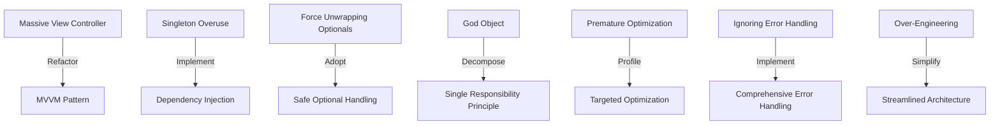

## 18.5 Case Studies of Anti-Patterns

In software development, anti-patterns can be as instructive as design patterns. They are common responses to recurring problems that are ineffective and counterproductive. Understanding anti-patterns is crucial for developers aiming to write clean, efficient, and maintainable code. In this section, we will delve into real-world case studies where anti-patterns in Swift development led to significant issues, analyze the problems faced, and explore the solutions implemented. We'll also discuss the lessons learned from correcting these anti-patterns.

### Case Study 1: The Massive View Controller

#### Problem Overview

In iOS development, the Model-View-Controller (MVC) pattern is a common architectural pattern. However, a frequent anti-pattern that emerges is the "Massive View Controller." This occurs when a view controller becomes bloated with responsibilities, handling not only UI logic but also business logic, network calls, and data management.

#### Analysis of the Problem

A real-world example involved an iOS app where a single view controller was responsible for managing user input, fetching data from a server, and updating the UI. This led to:

- **Poor Maintainability:** The view controller had over 2000 lines of code, making it difficult to navigate and modify.
- **High Coupling:** Changes in one part of the view controller often required changes in other parts, increasing the risk of introducing bugs.
- **Testing Challenges:** Unit testing was nearly impossible due to the intertwined logic.

#### Solution Implemented

To address these issues, the development team refactored the codebase using the Model-View-ViewModel (MVVM) pattern. They:

- **Separated Concerns:** Moved data fetching and business logic into separate ViewModel classes.
- **Improved Testability:** With logic decoupled from the UI, unit tests could be written for the ViewModel independently.
- **Enhanced Maintainability:** The view controller's responsibilities were reduced, making it easier to manage and update.

```swift
// Example of a ViewModel in MVVM
class UserViewModel {
    private var userService: UserService

    init(userService: UserService) {
        self.userService = userService
    }

    func fetchUserData(completion: @escaping (User?) -> Void) {
        userService.getUser { user in
            completion(user)
        }
    }
}
```

#### Lessons Learned

- **Adopt MVVM:** The MVVM pattern helps separate concerns and reduces the complexity of view controllers.
- **Prioritize Testability:** Decoupling logic from UI elements makes testing more straightforward and reliable.
- **Regular Refactoring:** Regularly review and refactor code to prevent the accumulation of technical debt.

### Case Study 2: Singleton Overuse

#### Problem Overview

Singletons are a common design pattern used to ensure a class has only one instance. However, overusing singletons can lead to anti-patterns, such as global state and hidden dependencies.

#### Analysis of the Problem

In a server-side Swift application, singletons were used extensively to manage shared resources. This led to:

- **Global State:** The application had multiple singletons managing state, making it difficult to track changes and debug issues.
- **Hidden Dependencies:** Many classes relied on singletons, creating implicit dependencies that were not immediately apparent.
- **Concurrency Issues:** Singletons were not thread-safe, leading to race conditions and data corruption.

#### Solution Implemented

The development team implemented dependency injection to reduce reliance on singletons. They:

- **Introduced Dependency Injection:** Used constructor injection to pass dependencies explicitly, making them more visible and manageable.
- **Ensured Thread Safety:** Implemented locks and queues to manage concurrent access to shared resources.
- **Reduced Global State:** Minimized the use of singletons by creating scoped instances where possible.

```swift
// Example of Dependency Injection
class UserManager {
    private let userService: UserService

    init(userService: UserService) {
        self.userService = userService
    }

    func performUserAction() {
        // Use userService to perform actions
    }
}
```

#### Lessons Learned

- **Use Dependency Injection:** This pattern promotes loose coupling and makes dependencies explicit.
- **Limit Singleton Use:** Reserve singletons for truly global resources that require a single instance.
- **Ensure Thread Safety:** When using shared resources, implement appropriate synchronization mechanisms.

### Case Study 3: Force Unwrapping Optionals

#### Problem Overview

Swift's optionals are a powerful feature for handling the absence of a value. However, force unwrapping optionals without proper checks is an anti-pattern that can lead to runtime crashes.

#### Analysis of the Problem

In a Swift-based iOS app, force unwrapping was used extensively to access optional values. This led to:

- **Runtime Crashes:** The app frequently crashed when nil values were force unwrapped.
- **Poor Error Handling:** Force unwrapping bypassed error handling, making it difficult to recover gracefully from unexpected nil values.
- **Code Smell:** The prevalence of force unwrapping indicated a lack of proper optional handling strategies.

#### Solution Implemented

The team adopted safer optional handling techniques, including:

- **Optional Binding:** Used `if let` and `guard let` to safely unwrap optionals.
- **Nil-Coalescing Operator:** Provided default values for optionals using `??`.
- **Error Handling:** Implemented proper error handling to manage unexpected nil values.

```swift
// Example of Safe Optional Handling
func fetchData() {
    guard let url = URL(string: "https://example.com") else {
        print("Invalid URL")
        return
    }

    // Proceed with URL
}
```

#### Lessons Learned

- **Avoid Force Unwrapping:** Use safe unwrapping techniques to prevent runtime crashes.
- **Implement Error Handling:** Ensure that your code can gracefully handle unexpected nil values.
- **Adopt Swift Best Practices:** Leverage Swift's language features to write safer, more robust code.

### Case Study 4: God Object

#### Problem Overview

The God Object anti-pattern occurs when a single class takes on too many responsibilities, becoming a "do-it-all" object. This leads to high coupling and low cohesion, making the code difficult to maintain and extend.

#### Analysis of the Problem

In a Swift project, a single class was responsible for managing user data, performing network requests, and handling UI updates. This resulted in:

- **High Complexity:** The class had over 3000 lines of code, making it hard to understand and modify.
- **Low Reusability:** The tightly coupled code was not reusable in other parts of the application.
- **Difficult Testing:** The class was nearly impossible to test due to its size and complexity.

#### Solution Implemented

The development team refactored the codebase to adhere to the Single Responsibility Principle (SRP). They:

- **Decomposed the God Object:** Broke down the class into smaller, more focused classes, each with a single responsibility.
- **Increased Modularity:** Created reusable components that could be easily tested and maintained.
- **Enhanced Readability:** Simplified the codebase, making it easier for developers to understand and work with.

```swift
// Example of Decomposing a God Object
class UserDataManager {
    func saveUserData() {
        // Save user data logic
    }
}

class NetworkManager {
    func performRequest() {
        // Network request logic
    }
}

class UIManager {
    func updateUI() {
        // UI update logic
    }
}
```

#### Lessons Learned

- **Adhere to SRP:** Ensure each class has a single responsibility to improve maintainability and testability.
- **Promote Modularity:** Break down complex classes into smaller, reusable components.
- **Enhance Code Readability:** Simplify code to make it more accessible to developers.

### Case Study 5: Premature Optimization

#### Problem Overview

Premature optimization is an anti-pattern where developers focus on optimizing code before understanding the problem fully. This often leads to complex, hard-to-maintain code without significant performance gains.

#### Analysis of the Problem

In a Swift application, developers optimized a data processing algorithm before identifying the actual performance bottlenecks. This resulted in:

- **Increased Complexity:** The optimized code was difficult to understand and maintain.
- **Minimal Performance Gains:** The optimization had little impact on overall performance.
- **Wasted Resources:** Time and effort were spent optimizing the wrong part of the application.

#### Solution Implemented

The team adopted a more measured approach to optimization:

- **Profile First:** Used profiling tools to identify actual performance bottlenecks.
- **Optimize Where Necessary:** Focused optimization efforts on the areas that provided the most significant performance improvements.
- **Maintain Simplicity:** Kept the code as simple as possible while achieving the desired performance.

```swift
// Example of Profiling and Optimization
func processData() {
    // Use profiling tools to identify bottlenecks
    // Optimize only the necessary parts
}
```

#### Lessons Learned

- **Profile Before Optimizing:** Use profiling tools to identify actual performance issues before optimizing.
- **Focus on Impactful Changes:** Optimize only the parts of the code that will have a significant impact on performance.
- **Maintain Code Simplicity:** Avoid unnecessary complexity in pursuit of optimization.

### Case Study 6: Ignoring Error Handling

#### Problem Overview

Ignoring error handling is a common anti-pattern that can lead to unpredictable application behavior and poor user experience. Proper error handling is essential for building robust applications.

#### Analysis of the Problem

In a Swift-based application, error handling was often overlooked, leading to:

- **Unpredictable Behavior:** The application frequently crashed or behaved unexpectedly when errors occurred.
- **Poor User Experience:** Users were often left without feedback when errors happened, leading to frustration.
- **Difficult Debugging:** Without proper error handling, identifying and fixing issues was challenging.

#### Solution Implemented

The development team implemented comprehensive error handling strategies:

- **Use Do-Try-Catch:** Employed Swift's error handling model to catch and manage errors effectively.
- **Provide User Feedback:** Implemented user-friendly error messages to improve the user experience.
- **Log Errors:** Used logging to capture and analyze errors, aiding in debugging and future prevention.

```swift
// Example of Error Handling with Do-Try-Catch
func performOperation() {
    do {
        try someRiskyOperation()
    } catch {
        print("Operation failed with error: \\(error)")
    }
}
```

#### Lessons Learned

- **Prioritize Error Handling:** Implement comprehensive error handling to improve application robustness.
- **Improve User Experience:** Provide clear feedback to users when errors occur.
- **Facilitate Debugging:** Use logging to capture and analyze errors for easier debugging.

### Case Study 7: Over-Engineering

#### Problem Overview

Over-engineering occurs when developers create overly complex solutions for simple problems. This anti-pattern leads to increased development time, maintenance challenges, and reduced code readability.

#### Analysis of the Problem

In a Swift project, developers implemented a complex architecture for a simple feature, resulting in:

- **Increased Development Time:** The complexity of the solution led to longer development cycles.
- **Maintenance Challenges:** The intricate architecture was difficult to understand and modify.
- **Reduced Code Readability:** The complexity made the codebase hard to navigate and work with.

#### Solution Implemented

The team simplified the architecture by:

- **Evaluating Requirements:** Reassessed the feature's requirements to determine the simplest solution.
- **Reducing Complexity:** Removed unnecessary layers and components to streamline the architecture.
- **Improving Readability:** Focused on writing clear, concise code that was easy to understand and maintain.

```swift
// Example of Simplifying Architecture
class SimpleFeatureManager {
    func executeFeature() {
        // Simplified logic for feature execution
    }
}
```

#### Lessons Learned

- **Avoid Over-Engineering:** Focus on simple, effective solutions that meet the requirements.
- **Streamline Architecture:** Remove unnecessary complexity to improve maintainability and readability.
- **Evaluate Requirements:** Regularly reassess requirements to ensure the solution aligns with the problem.

## Visualizing Anti-Patterns

To better understand the impact of anti-patterns and the solutions implemented, let's visualize the transition from anti-patterns to effective design patterns using Mermaid.js diagrams.



### Conclusion

Understanding and addressing anti-patterns is an essential part of becoming a proficient Swift developer. By learning from these case studies, we can avoid common pitfalls and write cleaner, more efficient code. Remember, the journey to mastering Swift is ongoing. Keep experimenting, stay curious, and embrace the lessons learned from both successes and failures.

## Quiz Time!



### What is the "Massive View Controller" anti-pattern?

- [x] A view controller that handles too many responsibilities, leading to bloated code.
- [ ] A view controller with minimal responsibilities.
- [ ] A view controller that only manages UI updates.
- [ ] A view controller that is used in multiple applications.

> **Explanation:** The "Massive View Controller" anti-pattern occurs when a view controller takes on too many responsibilities, making the code bloated and hard to maintain.

### How can the Singleton Overuse anti-pattern be mitigated?

- [x] By using dependency injection to manage dependencies explicitly.
- [ ] By creating more singletons to manage state.
- [ ] By ignoring thread safety concerns.
- [ ] By using global variables instead of singletons.

> **Explanation:** Dependency injection helps manage dependencies explicitly, reducing reliance on singletons and improving code maintainability.

### What is a common consequence of force unwrapping optionals?

- [x] Runtime crashes when nil values are encountered.
- [ ] Improved code readability.
- [ ] Enhanced performance.
- [ ] Increased code security.

> **Explanation:** Force unwrapping optionals without proper checks can lead to runtime crashes if nil values are encountered.

### Which principle helps address the God Object anti-pattern?

- [x] Single Responsibility Principle (SRP)
- [ ] Open/Closed Principle
- [ ] Liskov Substitution Principle
- [ ] Interface Segregation Principle

> **Explanation:** The Single Responsibility Principle (SRP) helps ensure that each class has a single responsibility, addressing the God Object anti-pattern.

### What is a key step before optimizing code to avoid premature optimization?

- [x] Profiling the code to identify actual performance bottlenecks.
- [ ] Adding more features to the code.
- [ ] Writing more complex algorithms.
- [ ] Removing all comments from the code.

> **Explanation:** Profiling the code helps identify actual performance bottlenecks, ensuring that optimization efforts are focused on impactful areas.

### How can ignoring error handling impact an application?

- [x] It can lead to unpredictable behavior and poor user experience.
- [ ] It can improve application performance.
- [ ] It can enhance code readability.
- [ ] It can reduce development time.

> **Explanation:** Ignoring error handling can lead to unpredictable application behavior and a poor user experience, as errors are not managed effectively.

### What is a common result of over-engineering a solution?

- [x] Increased development time and maintenance challenges.
- [ ] Simplified codebase.
- [ ] Reduced complexity.
- [ ] Faster application performance.

> **Explanation:** Over-engineering leads to increased development time and maintenance challenges due to unnecessary complexity.

### What technique can help prevent the Massive View Controller anti-pattern?

- [x] Using the Model-View-ViewModel (MVVM) pattern.
- [ ] Increasing the responsibilities of the view controller.
- [ ] Using more singletons.
- [ ] Ignoring testability concerns.

> **Explanation:** The MVVM pattern helps separate concerns, reducing the responsibilities of the view controller and preventing the Massive View Controller anti-pattern.

### Which of the following is NOT a benefit of using dependency injection?

- [ ] Improved testability.
- [x] Increased reliance on global state.
- [ ] Reduced coupling between components.
- [ ] Enhanced code maintainability.

> **Explanation:** Dependency injection reduces reliance on global state, improving testability and maintainability by making dependencies explicit.

### True or False: Anti-patterns are ineffective solutions to recurring problems.

- [x] True
- [ ] False

> **Explanation:** Anti-patterns are indeed ineffective solutions to recurring problems, often leading to more issues than they solve.




