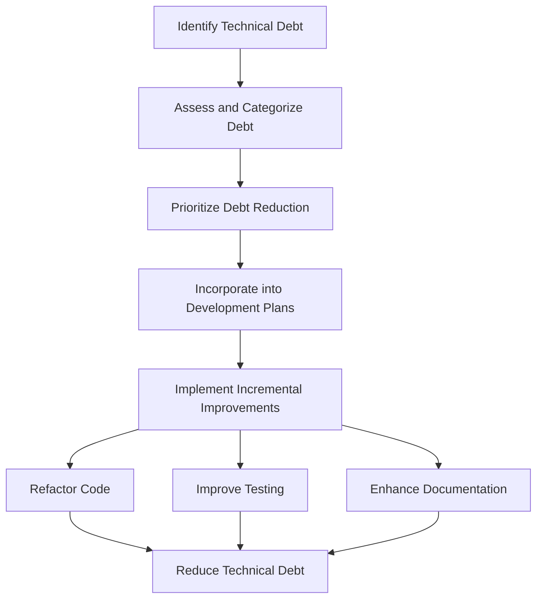

## 18.6 Recognizing and Addressing Technical Debt in Swift Development

In the fast-paced world of software development, technical debt is an inevitable reality that developers must manage effectively. Understanding and addressing technical debt is crucial for maintaining a robust and scalable codebase, especially in Swift development for iOS and macOS applications. In this section, we will explore what technical debt is, how to recognize it, and strategies for managing and reducing it over time.

### Understanding Technical Debt

**Technical debt** is a metaphor that describes the long-term costs of choosing an easy or quick solution in software development, rather than a more comprehensive and time-consuming approach. Just like financial debt, technical debt incurs interest over time, which can manifest as increased maintenance costs, reduced agility, and a higher likelihood of bugs.

#### Key Characteristics of Technical Debt

1. **Short-Term Gains vs. Long-Term Costs**: Quick fixes might solve immediate problems but often lead to more significant issues down the line.
2. **Accumulation Over Time**: Technical debt tends to accumulate as projects grow, making it harder to manage if not addressed early.
3. **Impact on Code Quality**: High levels of technical debt can degrade code quality, making it difficult to implement new features or fix bugs.
4. **Increased Complexity**: As technical debt grows, the complexity of the codebase increases, leading to longer development cycles.

### Recognizing Technical Debt

Recognizing technical debt is the first step toward managing it effectively. Here are some signs that your Swift codebase might be suffering from technical debt:

1. **Frequent Bugs and Issues**: A high number of bugs and issues can indicate underlying problems in the codebase.
2. **Slow Development Velocity**: If new features take longer to implement, it might be due to the complexity introduced by technical debt.
3. **Code Smells**: Code smells, such as duplicated code, large classes, and long methods, are often indicators of technical debt.
4. **Poor Documentation**: Lack of documentation can lead to misunderstandings and errors, contributing to technical debt.
5. **High Coupling and Low Cohesion**: Modules that are tightly coupled and lack cohesion are harder to maintain and extend.

### Strategies for Addressing Technical Debt

Addressing technical debt requires a strategic approach that balances immediate needs with long-term goals. Here are some strategies to consider:

#### 1. Prioritize Debt Reduction

- **Assess and Categorize Debt**: Begin by assessing the existing technical debt and categorizing it based on its impact and urgency.
- **Set Clear Goals**: Define clear goals for debt reduction, such as reducing bug counts or improving code modularity.
- **Incorporate Debt Reduction into Development Plans**: Make technical debt reduction a part of your regular development cycle, allocating time and resources to address it.

#### 2. Incremental Improvement

- **Refactor Code**: Regularly refactor code to improve its structure and readability. Focus on small, incremental changes that can be integrated into the development process.
- **Improve Testing**: Enhance your testing strategy to catch issues early. Automated tests can help ensure that refactoring does not introduce new bugs.
- **Enhance Documentation**: Improve documentation to provide clear guidance on code usage and maintenance.

#### 3. Leverage Swift Features

Swift offers several features that can help manage technical debt:

- **Protocol-Oriented Programming (POP)**: Use protocols to define clear interfaces and reduce coupling between components.
- **Value Types**: Favor value types (structs and enums) over reference types (classes) to reduce complexity and improve performance.
- **Optionals**: Use optionals to handle nil values safely, reducing the likelihood of runtime errors.

#### 4. Implement Best Practices

- **Follow SOLID Principles**: Adhere to SOLID principles to create a more maintainable and scalable codebase.
- **Embrace Code Reviews**: Conduct regular code reviews to identify and address potential issues before they become technical debt.
- **Adopt Continuous Integration**: Use continuous integration tools to automate testing and deployment, ensuring that changes are integrated smoothly.

### Code Example: Refactoring for Improved Modularity

Let's consider a simple example of refactoring a Swift class to improve modularity and reduce technical debt.

```swift
// Original Code: A tightly coupled class with multiple responsibilities
class UserManager {
    var users: [String] = []
    
    func addUser(_ user: String) {
        users.append(user)
        saveToDatabase(user)
    }
    
    func saveToDatabase(_ user: String) {
        // Code to save user to the database
    }
    
    func sendWelcomeEmail(_ user: String) {
        // Code to send a welcome email
    }
}

// Refactored Code: Improved modularity by separating responsibilities
protocol UserRepository {
    func saveUser(_ user: String)
}

class DatabaseUserRepository: UserRepository {
    func saveUser(_ user: String) {
        // Code to save user to the database
    }
}

protocol EmailService {
    func sendEmail(to user: String)
}

class WelcomeEmailService: EmailService {
    func sendEmail(to user: String) {
        // Code to send a welcome email
    }
}

class UserManager {
    var users: [String] = []
    private let userRepository: UserRepository
    private let emailService: EmailService
    
    init(userRepository: UserRepository, emailService: EmailService) {
        self.userRepository = userRepository
        self.emailService = emailService
    }
    
    func addUser(_ user: String) {
        users.append(user)
        userRepository.saveUser(user)
        emailService.sendEmail(to: user)
    }
}
```

In this example, we have refactored the `UserManager` class to separate the responsibilities of saving users to a database and sending emails. This improves modularity and makes the code easier to maintain and extend.

### Visualizing Technical Debt Management

Here is a visual representation of how technical debt can be managed over time using incremental improvements and strategic planning.



### Knowledge Check

To reinforce your understanding of technical debt and its management, consider these questions:

- What are the signs of technical debt in a codebase?
- How can refactoring help reduce technical debt?
- What role do Swift features play in managing technical debt?

### Try It Yourself

Experiment with the refactoring example provided above. Try introducing a new feature or modifying an existing one. Observe how the refactored code's modularity makes these tasks easier compared to the original version.

### Conclusion

Recognizing and addressing technical debt is an essential aspect of maintaining a robust and scalable Swift codebase. By prioritizing debt reduction, implementing incremental improvements, and leveraging Swift's unique features, developers can manage technical debt effectively and ensure long-term success in their projects. Remember, this is just the beginning. As you progress, continue to refine your approach to technical debt management, stay curious, and enjoy the journey!

## Quiz Time!



### What is technical debt?

- [x] The long-term costs of choosing a quick solution over a comprehensive one
- [ ] The amount of money spent on software tools
- [ ] The number of bugs in a codebase
- [ ] The time taken to develop a feature

> **Explanation:** Technical debt refers to the long-term costs incurred by choosing quick solutions instead of comprehensive ones.

### Which of the following is a sign of technical debt?

- [x] Frequent bugs and issues
- [ ] High code coverage
- [ ] Fast development velocity
- [ ] Comprehensive documentation

> **Explanation:** Frequent bugs and issues can indicate underlying technical debt in the codebase.

### How can refactoring help with technical debt?

- [x] By improving code structure and readability
- [ ] By increasing the number of features
- [ ] By reducing the number of developers needed
- [ ] By eliminating all bugs

> **Explanation:** Refactoring improves code structure and readability, which helps reduce technical debt.

### What is a benefit of using Protocol-Oriented Programming (POP) in Swift?

- [x] Reducing coupling between components
- [ ] Increasing the number of classes
- [ ] Decreasing code readability
- [ ] Making code less modular

> **Explanation:** Protocol-Oriented Programming helps reduce coupling between components, aiding in managing technical debt.

### Which Swift feature helps handle nil values safely?

- [x] Optionals
- [ ] Classes
- [ ] Enums
- [ ] Extensions

> **Explanation:** Optionals in Swift are used to handle nil values safely, reducing runtime errors.

### What is the purpose of code reviews?

- [x] To identify and address potential issues before they become technical debt
- [ ] To increase the number of developers on a project
- [ ] To reduce the number of features
- [ ] To eliminate the need for testing

> **Explanation:** Code reviews help identify and address potential issues, preventing technical debt accumulation.

### Which principle is part of the SOLID principles?

- [x] Single Responsibility Principle
- [ ] Double Responsibility Principle
- [ ] Triple Responsibility Principle
- [ ] Quadruple Responsibility Principle

> **Explanation:** The Single Responsibility Principle is one of the SOLID principles, promoting maintainable code.

### What is a common consequence of high technical debt?

- [x] Increased maintenance costs
- [ ] Decreased code complexity
- [ ] Faster feature development
- [ ] Improved code quality

> **Explanation:** High technical debt often leads to increased maintenance costs and reduced agility.

### Which strategy involves making small, incremental changes to improve code?

- [x] Incremental Improvement
- [ ] Massive Refactoring
- [ ] Complete Rewriting
- [ ] Feature Expansion

> **Explanation:** Incremental Improvement involves making small changes to gradually improve code quality.

### True or False: Technical debt only affects new projects.

- [ ] True
- [x] False

> **Explanation:** Technical debt can affect both new and existing projects, accumulating over time if not addressed.


