## 18.7 Best Practices to Prevent Anti-Patterns

In the world of software development, anti-patterns can be likened to the pitfalls that lead to inefficient, unmaintainable, and error-prone code. As expert Swift developers, it's crucial to recognize and prevent these anti-patterns to ensure the robustness and scalability of our applications. This section will explore best practices to avoid common anti-patterns in Swift development, fostering a culture of continuous improvement and collaboration.

### Understanding Anti-Patterns

Before diving into prevention strategies, let's briefly define what anti-patterns are. Anti-patterns are recurring solutions to common problems that, despite being widely used, often lead to negative consequences. They are the opposite of design patterns, which provide proven and effective solutions. Recognizing anti-patterns is the first step toward avoiding them.

### Cultivating a Coding Culture That Avoids Anti-Patterns

The foundation of preventing anti-patterns lies in cultivating a coding culture that prioritizes quality, collaboration, and continuous learning. Here are some key strategies:

#### 1. Continuous Learning and Staying Updated

**Stay Informed:** The Swift programming language is constantly evolving, with new features and best practices emerging regularly. It's essential to stay informed about the latest developments by following official Swift documentation, attending conferences, and participating in Swift communities.

**Embrace New Tools and Techniques:** As Swift evolves, so do the tools and techniques available to developers. Embrace new tools that can help identify and prevent anti-patterns, such as static code analyzers and linters.

**Learn from the Community:** Engage with the Swift community through forums, blogs, and social media. Sharing experiences and learning from others can provide valuable insights into avoiding anti-patterns.

#### 2. Encouraging Collaboration and Knowledge Sharing

**Code Reviews:** Implement regular code reviews to ensure code quality and identify potential anti-patterns early. Encourage constructive feedback and open discussions during reviews.

**Pair Programming:** Pair programming is an effective way to share knowledge and catch anti-patterns in real-time. It fosters collaboration and helps team members learn from each other.

**Documentation and Knowledge Sharing:** Maintain comprehensive documentation of coding standards, best practices, and lessons learned. Encourage team members to share their knowledge through presentations, workshops, and internal wikis.

### Best Practices to Prevent Specific Anti-Patterns

Now, let's delve into specific best practices to prevent common anti-patterns in Swift development.

#### 3. Avoiding the Massive View Controller

The Massive View Controller (MVC) anti-pattern occurs when view controllers become overloaded with responsibilities, making them difficult to maintain and test.

**Best Practices:**

- **Adopt MVVM or VIPER:** Consider using architectural patterns like MVVM (Model-View-ViewModel) or VIPER (View-Interactor-Presenter-Entity-Router) to separate concerns and reduce the burden on view controllers.
- **Use Delegation and Data Sources:** Offload responsibilities to delegate and data source objects. This keeps view controllers focused on their primary role of managing views.
- **Leverage SwiftUI:** SwiftUI promotes a declarative approach to UI development, naturally encouraging separation of concerns.

#### 4. Preventing Retain Cycles and Memory Leaks

Retain cycles occur when two or more objects hold strong references to each other, preventing their deallocation and leading to memory leaks.

**Best Practices:**

- **Use Weak References:** Use `weak` or `unowned` references in closures and delegate patterns to break retain cycles.
- **Utilize ARC Tools:** Take advantage of Swift's Automatic Reference Counting (ARC) to manage memory efficiently. Use tools like Xcode's memory graph debugger to identify and resolve retain cycles.
- **Implement Deinitializers:** Implement `deinit` methods to release resources and ensure proper cleanup.

#### 5. Avoiding Force Unwrapping Optionals

Force unwrapping optionals can lead to runtime crashes if the optional is `nil`.

**Best Practices:**

- **Use Optional Binding:** Use `if let` or `guard let` to safely unwrap optionals.
- **Employ Nil-Coalescing Operator:** Use the `??` operator to provide default values when unwrapping optionals.
- **Leverage Optional Chaining:** Use optional chaining to safely access properties and methods on optionals.

#### 6. Singleton Overuse and Abuse

While singletons can be useful, overusing them can lead to tightly coupled code and difficulties in testing.

**Best Practices:**

- **Limit Singleton Usage:** Restrict the use of singletons to cases where they are truly necessary, such as shared resources or services.
- **Consider Dependency Injection:** Use dependency injection to manage dependencies and improve testability.
- **Encapsulate Singleton Logic:** Encapsulate singleton logic within dedicated classes or structs to minimize coupling.

#### 7. Avoiding the God Object and Spaghetti Code

God objects are classes that know too much or do too much, leading to complex and unmanageable code.

**Best Practices:**

- **Promote Single Responsibility Principle (SRP):** Ensure each class or struct has a single responsibility and adheres to SRP.
- **Refactor Large Classes:** Break down large classes into smaller, more focused components.
- **Use Protocols and Extensions:** Leverage Swift's protocol-oriented programming to define clear interfaces and separate concerns.

#### 8. Preventing Premature Optimization

Premature optimization involves optimizing code before it's necessary, often leading to complexity and maintenance challenges.

**Best Practices:**

- **Focus on Readability and Maintainability:** Prioritize code readability and maintainability over premature optimization.
- **Optimize When Necessary:** Use profiling tools to identify performance bottlenecks and optimize only when necessary.
- **Write Clean and Simple Code:** Clean and simple code is often more performant and easier to optimize when needed.

#### 9. Avoiding Over-Engineering

Over-engineering occurs when developers create overly complex solutions for simple problems.

**Best Practices:**

- **Keep It Simple:** Apply the KISS (Keep It Simple, Stupid) principle to avoid unnecessary complexity.
- **Use YAGNI (You Aren't Gonna Need It):** Avoid adding features or abstractions until they are truly needed.
- **Focus on Requirements:** Stay focused on the project's requirements and avoid adding unnecessary features.

#### 10. Preventing Copy-Paste Programming

Copy-paste programming leads to code duplication and inconsistencies.

**Best Practices:**

- **Encourage Code Reuse:** Identify common patterns and extract them into reusable components or functions.
- **Implement DRY (Don't Repeat Yourself):** Strive to eliminate code duplication by reusing existing code.
- **Use Templates and Snippets:** Create templates and code snippets for repetitive tasks to ensure consistency.

#### 11. Handling Error Ignorance

Ignoring errors can lead to unexpected behavior and crashes.

**Best Practices:**

- **Implement Comprehensive Error Handling:** Use Swift's `do-try-catch` to handle errors gracefully.
- **Provide Meaningful Error Messages:** Ensure error messages are informative and help diagnose issues.
- **Log Errors for Debugging:** Use logging frameworks to capture and analyze errors during development and production.

#### 12. Avoiding Poor Naming Conventions

Poor naming conventions can lead to confusion and misunderstandings.

**Best Practices:**

- **Adopt Consistent Naming Conventions:** Follow Swift's naming conventions for variables, functions, and types.
- **Use Descriptive Names:** Choose descriptive names that convey the purpose and intent of the code.
- **Review and Refactor Names:** Regularly review and refactor names to improve clarity and readability.

### Visualizing Anti-Pattern Prevention

To better understand how these best practices interconnect, let's visualize the prevention strategies using a flowchart.

```mermaid
graph TD;
    A[Continuous Learning] --> B[Stay Informed];
    A --> C[Embrace New Tools];
    A --> D[Learn from Community];
    E[Collaboration] --> F[Code Reviews];
    E --> G[Pair Programming];
    E --> H[Knowledge Sharing];
    I[Specific Anti-Pattern Prevention] --> J[Massive View Controller];
    I --> K[Retain Cycles];
    I --> L[Force Unwrapping];
    I --> M[Singleton Overuse];
    I --> N[God Object];
    I --> O[Premature Optimization];
    I --> P[Over-Engineering];
    I --> Q[Copy-Paste Programming];
    I --> R[Error Ignorance];
    I --> S[Poor Naming Conventions];
```

### Conclusion

Preventing anti-patterns in Swift development requires a proactive approach, continuous learning, and a collaborative culture. By implementing these best practices, we can create robust, maintainable, and scalable Swift applications. Remember, the journey to mastering Swift is ongoing, and embracing these practices will help you become a more effective and efficient developer.

### Try It Yourself

To reinforce your understanding, try modifying the code examples provided in this section. Experiment with different approaches to see how they affect code quality and maintainability. Remember, practice makes perfect!

## Quiz Time!



### What is an anti-pattern?

- [x] A common but ineffective solution to a problem
- [ ] A proven and effective solution to a problem
- [ ] A design pattern used in Swift
- [ ] A type of software bug

> **Explanation:** An anti-pattern is a common but ineffective solution to a problem, often leading to negative consequences.

### Which practice helps prevent the Massive View Controller anti-pattern?

- [x] Using MVVM or VIPER architecture
- [ ] Using force unwrapping
- [ ] Ignoring error handling
- [ ] Overusing singletons

> **Explanation:** Using MVVM or VIPER architecture helps separate concerns and reduce the burden on view controllers.

### What is a retain cycle?

- [x] A situation where two or more objects hold strong references to each other
- [ ] A type of error handling in Swift
- [ ] A method for optimizing code performance
- [ ] A design pattern in Swift

> **Explanation:** A retain cycle occurs when two or more objects hold strong references to each other, preventing deallocation.

### How can you safely unwrap optionals in Swift?

- [x] Using `if let` or `guard let`
- [ ] Using force unwrapping
- [ ] Ignoring the optional
- [ ] Using singletons

> **Explanation:** Using `if let` or `guard let` allows safe unwrapping of optionals in Swift.

### What is the primary goal of avoiding over-engineering?

- [x] Keeping solutions simple and focused on requirements
- [ ] Adding as many features as possible
- [ ] Optimizing code before it's necessary
- [ ] Using complex design patterns

> **Explanation:** The primary goal of avoiding over-engineering is to keep solutions simple and focused on the project's requirements.

### What does DRY stand for?

- [x] Don't Repeat Yourself
- [ ] Do Repeat Yourself
- [ ] Don't Run Yards
- [ ] Do Run Yards

> **Explanation:** DRY stands for "Don't Repeat Yourself," emphasizing code reuse and eliminating duplication.

### Which practice helps prevent copy-paste programming?

- [x] Encouraging code reuse
- [ ] Using force unwrapping
- [ ] Ignoring error handling
- [ ] Overusing singletons

> **Explanation:** Encouraging code reuse helps prevent copy-paste programming by reusing existing code.

### What is the purpose of using `deinit` in Swift?

- [x] To release resources and ensure proper cleanup
- [ ] To force unwrap optionals
- [ ] To create singletons
- [ ] To ignore errors

> **Explanation:** The `deinit` method is used to release resources and ensure proper cleanup when an object is deallocated.

### What is the benefit of using optional chaining?

- [x] It allows safe access to properties and methods on optionals
- [ ] It forces unwrapping of optionals
- [ ] It creates retain cycles
- [ ] It optimizes code performance

> **Explanation:** Optional chaining allows safe access to properties and methods on optionals, preventing crashes.

### True or False: Overusing singletons can lead to tightly coupled code.

- [x] True
- [ ] False

> **Explanation:** Overusing singletons can lead to tightly coupled code, making it difficult to test and maintain.



Remember, preventing anti-patterns is an ongoing journey. Stay curious, keep learning, and embrace collaboration to become a master of Swift development!
