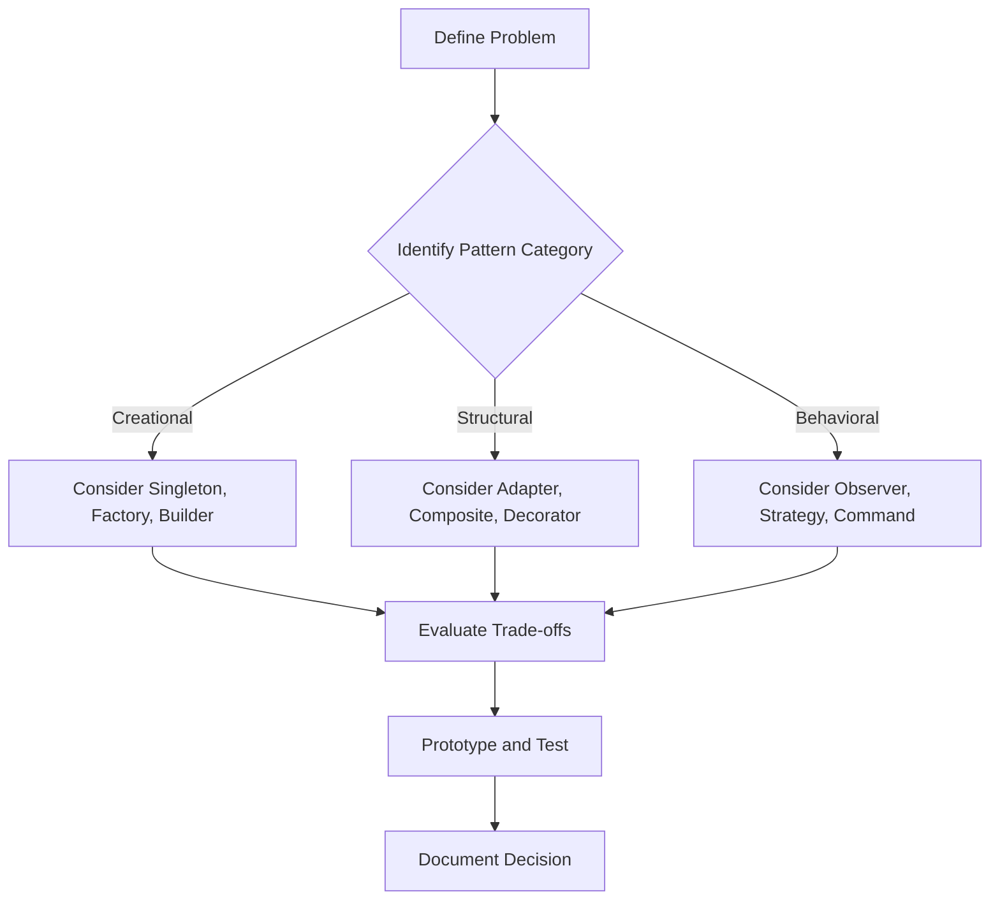

## 19.1 Selecting the Right Pattern for the Problem

In software development, one of the most critical skills is the ability to select the right design pattern for a given problem. This decision can significantly impact the maintainability, scalability, and performance of your application. In this section, we will explore how to understand problem domains, evaluate trade-offs, and avoid the misuse of patterns in Swift development.

### Understanding Problem Domains

Before diving into design patterns, it's essential to have a deep understanding of the problem you're trying to solve. This involves:

1. **Identifying Requirements:** Clearly define what the software needs to accomplish. Gather requirements from stakeholders and ensure they are well-documented.

2. **Analyzing Constraints:** Consider any constraints such as performance, memory usage, or platform limitations that may affect your design decisions.

3. **Understanding Context:** Recognize the environment in which the software will operate. This includes the hardware, operating system, and any external systems it will interact with.

4. **Defining Goals:** Establish clear goals for the software's architecture, such as flexibility, reusability, or simplicity.

### Evaluating Trade-offs and Pattern Applicability

Once you understand the problem domain, the next step is to evaluate the trade-offs of different design patterns. Each pattern has its strengths and weaknesses, and the key is to find the one that best fits your needs.

#### Key Considerations

- **Complexity vs. Simplicity:** Some patterns introduce complexity that may not be necessary for simpler problems. Always aim for the simplest solution that meets the requirements.

- **Performance:** Consider how each pattern affects performance. Some patterns may introduce overhead that could impact the application's responsiveness or resource usage.

- **Scalability:** If the application needs to scale, choose patterns that support growth without requiring significant refactoring.

- **Maintainability:** Patterns that improve code readability and organization can make maintenance easier, especially in large codebases.

- **Reusability:** Patterns that promote code reuse can reduce duplication and improve consistency across the application.

### Avoiding the Misuse of Patterns

Misusing design patterns can lead to over-engineering, reduced performance, and increased complexity. Here are some common pitfalls to avoid:

- **Pattern Overuse:** Not every problem requires a design pattern. Use patterns judiciously and only when they provide a clear benefit.

- **Forcing Patterns:** Avoid trying to fit a problem into a pattern that doesn't naturally apply. This can lead to convoluted and difficult-to-maintain code.

- **Ignoring Simplicity:** Sometimes, a straightforward solution is better than a complex pattern. Don't add unnecessary complexity to your code.

- **Lack of Understanding:** Ensure you fully understand a pattern before implementing it. Misunderstanding a pattern's intent can lead to incorrect usage.

### Practical Steps for Selecting the Right Pattern

#### Step 1: Define the Problem Clearly

Before selecting a pattern, ensure you have a clear and concise problem definition. This will help you determine whether a pattern is necessary and which one might be appropriate.

#### Step 2: Identify Pattern Categories

Design patterns are typically categorized into three types: creational, structural, and behavioral.

- **Creational Patterns:** Focus on object creation mechanisms, such as Singleton, Factory, and Builder.

- **Structural Patterns:** Deal with object composition, such as Adapter, Composite, and Decorator.

- **Behavioral Patterns:** Concerned with object interaction and responsibility, such as Observer, Strategy, and Command.

#### Step 3: Match Patterns to Problem Characteristics

Once you understand the problem and pattern categories, match the characteristics of your problem to the patterns that address similar issues. Consider the following:

- **Singleton:** Use when you need to ensure a class has only one instance and provide a global point of access.

- **Factory Method:** Use when creating objects without specifying the exact class to create.

- **Adapter:** Use when you need to convert the interface of a class into another interface clients expect.

- **Observer:** Use when an object needs to notify other objects about changes in its state.

#### Step 4: Evaluate Trade-offs

For each potential pattern, evaluate the trade-offs in terms of complexity, performance, scalability, maintainability, and reusability. Consider how each pattern aligns with your goals and constraints.

#### Step 5: Prototype and Test

Before fully committing to a pattern, create a prototype to test how well it works in your specific context. This can help identify potential issues early and refine your approach.

#### Step 6: Document Your Decision

Once you've selected a pattern, document your decision and the rationale behind it. This will help future developers understand the reasoning and make informed decisions when modifying the code.

### Code Examples

Let's explore some code examples to illustrate how to select the right pattern for a problem.

#### Singleton Pattern Example

The Singleton pattern ensures a class has only one instance and provides a global point of access. This pattern is useful for managing shared resources, such as a database connection or a configuration manager.

```swift
class ConfigurationManager {
    static let shared = ConfigurationManager()
    
    private init() {
        // Private initialization to ensure just one instance is created.
    }
    
    func getConfigurationValue(forKey key: String) -> String? {
        // Retrieve configuration value
        return "ExampleValue"
    }
}

// Usage
let configValue = ConfigurationManager.shared.getConfigurationValue(forKey: "AppTheme")
```

#### Factory Method Pattern Example

The Factory Method pattern provides an interface for creating objects in a superclass but allows subclasses to alter the type of objects that will be created.

```swift
protocol Product {
    func use()
}

class ConcreteProductA: Product {
    func use() {
        print("Using Product A")
    }
}

class ConcreteProductB: Product {
    func use() {
        print("Using Product B")
    }
}

class Creator {
    func factoryMethod() -> Product {
        return ConcreteProductA()
    }
}

// Usage
let creator = Creator()
let product = creator.factoryMethod()
product.use()
```

#### Adapter Pattern Example

The Adapter pattern allows incompatible interfaces to work together. This is useful when integrating with third-party libraries or legacy code.

```swift
protocol Target {
    func request()
}

class Adaptee {
    func specificRequest() {
        print("Specific request")
    }
}

class Adapter: Target {
    private var adaptee: Adaptee
    
    init(adaptee: Adaptee) {
        self.adaptee = adaptee
    }
    
    func request() {
        adaptee.specificRequest()
    }
}

// Usage
let adaptee = Adaptee()
let adapter = Adapter(adaptee: adaptee)
adapter.request()
```

### Visualizing Design Pattern Selection

To help visualize the process of selecting the right pattern, let's use a flowchart to illustrate the decision-making process.



### Try It Yourself

Experiment with the code examples provided. Try modifying the Singleton pattern to include additional functionality, or create a new product type in the Factory Method example. This hands-on practice will deepen your understanding of how to apply these patterns effectively.

### Knowledge Check

- What are the three main categories of design patterns?
- How does the Singleton pattern ensure only one instance of a class is created?
- When would you use the Adapter pattern?
- What are some trade-offs to consider when selecting a design pattern?
- Why is it important to document your design pattern decisions?

### Embrace the Journey

Remember, selecting the right pattern is an art as much as it is a science. As you gain experience, you'll develop an intuition for which patterns to use in different situations. Keep experimenting, stay curious, and enjoy the journey of mastering design patterns in Swift.

## Quiz Time!



### What is the first step in selecting the right design pattern?

- [x] Define the problem clearly
- [ ] Identify pattern categories
- [ ] Evaluate trade-offs
- [ ] Prototype and test

> **Explanation:** Defining the problem clearly is the first step to ensure you understand what needs to be solved before selecting a design pattern.

### Which pattern is used to ensure a class has only one instance?

- [x] Singleton
- [ ] Factory Method
- [ ] Adapter
- [ ] Observer

> **Explanation:** The Singleton pattern is specifically designed to ensure a class has only one instance and provides a global point of access to it.

### What is a key consideration when evaluating trade-offs for design patterns?

- [ ] Only consider performance
- [x] Consider complexity, performance, scalability, maintainability, and reusability
- [ ] Focus solely on maintainability
- [ ] Ignore scalability

> **Explanation:** Evaluating trade-offs involves considering multiple factors, including complexity, performance, scalability, maintainability, and reusability, to find the best fit for the problem.

### How does the Adapter pattern help in software design?

- [x] It allows incompatible interfaces to work together
- [ ] It ensures only one instance of a class is created
- [ ] It provides an interface for creating objects
- [ ] It notifies objects about changes in state

> **Explanation:** The Adapter pattern allows incompatible interfaces to work together by converting the interface of a class into another interface that clients expect.

### Why is it important to document your design pattern decisions?

- [x] To help future developers understand the reasoning
- [ ] To increase code complexity
- [ ] To make the code harder to maintain
- [ ] To ensure no one changes the code

> **Explanation:** Documenting design pattern decisions helps future developers understand the reasoning behind the choices and make informed decisions when modifying the code.

### What should you avoid when using design patterns?

- [x] Pattern overuse
- [ ] Evaluating trade-offs
- [ ] Prototyping and testing
- [ ] Documenting decisions

> **Explanation:** Pattern overuse should be avoided as not every problem requires a design pattern, and overusing them can lead to unnecessary complexity.

### What is the purpose of the Factory Method pattern?

- [ ] To ensure a class has only one instance
- [x] To provide an interface for creating objects in a superclass
- [ ] To convert the interface of a class into another interface
- [ ] To notify objects about changes in state

> **Explanation:** The Factory Method pattern provides an interface for creating objects in a superclass but allows subclasses to alter the type of objects that will be created.

### Which pattern is useful for managing shared resources?

- [x] Singleton
- [ ] Adapter
- [ ] Observer
- [ ] Strategy

> **Explanation:** The Singleton pattern is useful for managing shared resources, such as a database connection or a configuration manager, by ensuring only one instance is used.

### What is the main goal of the Observer pattern?

- [ ] To ensure a class has only one instance
- [ ] To convert the interface of a class into another interface
- [x] To notify objects about changes in state
- [ ] To provide an interface for creating objects

> **Explanation:** The Observer pattern is designed to notify objects about changes in state, allowing them to react accordingly.

### True or False: Every problem requires a design pattern.

- [ ] True
- [x] False

> **Explanation:** Not every problem requires a design pattern. Patterns should be used judiciously and only when they provide a clear benefit.


