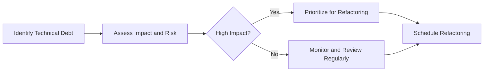
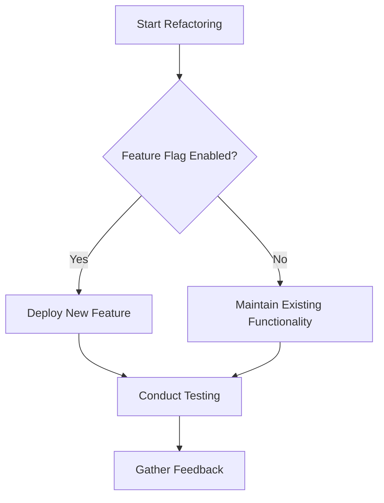

## 19.10 Handling Legacy Code and Technical Debt

As Swift developers, we often encounter legacy codebases that have accumulated technical debt over time. This section explores strategies for managing and refactoring legacy code, ensuring that we can modernize our applications while maintaining their functionality. We'll delve into incremental refactoring, improvement strategies, and maintaining functionality during the modernization process.

### Understanding Legacy Code and Technical Debt

**Legacy Code** refers to an existing codebase that may be outdated or difficult to maintain. It often lacks proper documentation and may not adhere to modern coding standards. **Technical Debt** is the implied cost of additional rework caused by choosing an easy solution now instead of using a better approach that would take longer. Both concepts are intertwined, as legacy code often accumulates technical debt over time.

#### Key Characteristics of Legacy Code

- **Lack of Documentation**: Legacy code often lacks comprehensive documentation, making it difficult to understand the original developer's intent.
- **Outdated Practices**: It may use outdated programming practices and libraries that are no longer supported.
- **Complex Dependencies**: Legacy codebases often have complex interdependencies that make changes risky and time-consuming.
- **Poor Test Coverage**: Many legacy systems lack sufficient test coverage, increasing the risk of introducing bugs during modifications.

#### The Impact of Technical Debt

Technical debt can lead to several issues, including:

- **Increased Maintenance Costs**: As technical debt accumulates, the cost of maintaining the codebase increases.
- **Reduced Agility**: High levels of technical debt can slow down development processes, making it difficult to introduce new features.
- **Higher Risk of Bugs**: Code with technical debt is more prone to bugs and errors, affecting the overall quality of the application.

### Strategies for Managing Legacy Code and Technical Debt

Managing legacy code and technical debt requires a strategic approach. Here are some effective strategies to consider:

#### 1. Incremental Refactoring

Incremental refactoring involves making small, manageable changes to the codebase over time. This approach reduces the risk of introducing new bugs and allows for gradual improvement.

- **Identify Problem Areas**: Start by identifying the most problematic areas of the codebase. Focus on sections that are frequently modified or have high bug rates.
- **Refactor in Small Steps**: Break down the refactoring process into small, manageable tasks. This allows for easier testing and validation of changes.
- **Use Automated Tests**: Implement automated tests to ensure that refactoring does not introduce new bugs. Tests provide a safety net for verifying the correctness of the code.

##### Code Example: Refactoring a Legacy Function

```swift
// Legacy function with poor readability and maintainability
func calculateTotalPrice(items: [(price: Double, quantity: Int)]) -> Double {
    var total = 0.0
    for item in items {
        total += item.price * Double(item.quantity)
    }
    return total
}

// Refactored function with improved readability
func calculateTotalPrice(for items: [Item]) -> Double {
    return items.reduce(0) { $0 + $1.totalPrice }
}

struct Item {
    let price: Double
    let quantity: Int
    
    var totalPrice: Double {
        return price * Double(quantity)
    }
}
```

In this example, we refactor a legacy function by introducing a new `Item` struct, improving readability and maintainability.

#### 2. Prioritizing Technical Debt

Not all technical debt needs to be addressed immediately. Prioritize technical debt based on its impact on the project.

- **Assess Impact and Risk**: Evaluate the impact of technical debt on the project. Focus on areas that pose the highest risk or have the greatest impact on development.
- **Schedule Regular Reviews**: Conduct regular reviews of the codebase to identify new areas of technical debt. This proactive approach helps prevent debt from accumulating.
- **Balance New Features and Debt Reduction**: Balance the development of new features with efforts to reduce technical debt. Allocate time for both activities in the development schedule.

##### Visualizing Technical Debt Prioritization



This flowchart illustrates the process of prioritizing technical debt based on impact and risk assessment.

#### 3. Code Modernization

Modernizing legacy code involves updating it to use current technologies and practices. This can improve performance, security, and maintainability.

- **Adopt Modern Language Features**: Utilize modern Swift features, such as optionals, generics, and protocol-oriented programming, to enhance code quality.
- **Replace Deprecated Libraries**: Update or replace deprecated libraries and frameworks with supported alternatives.
- **Improve Code Structure**: Use design patterns and architectural principles to improve the overall structure and organization of the code.

##### Code Example: Modernizing a Legacy API Call

```swift
// Legacy API call using URLSession
func fetchData(from url: URL, completion: @escaping (Data?, Error?) -> Void) {
    let task = URLSession.shared.dataTask(with: url) { data, response, error in
        completion(data, error)
    }
    task.resume()
}

// Modernized API call using async/await
func fetchData(from url: URL) async throws -> Data {
    let (data, _) = try await URLSession.shared.data(from: url)
    return data
}
```

In this example, we modernize a legacy API call by using Swift's async/await feature, improving readability and error handling.

#### 4. Maintaining Functionality During Refactoring

Maintaining functionality during refactoring is crucial to ensure that the application continues to operate as expected.

- **Use Feature Flags**: Implement feature flags to enable or disable new features during the refactoring process. This allows for controlled rollouts and testing.
- **Conduct Regression Testing**: Perform thorough regression testing to verify that existing functionality remains intact after changes.
- **Involve Stakeholders**: Engage stakeholders in the refactoring process to gather feedback and ensure alignment with business goals.

##### Visualizing Feature Flag Implementation



This flowchart illustrates the use of feature flags to manage functionality during refactoring.

### Swift-Specific Considerations

Swift offers unique features that can aid in managing legacy code and technical debt. Here are some Swift-specific considerations:

#### 1. Protocol-Oriented Programming

Swift's protocol-oriented programming paradigm allows for flexible and reusable code. Use protocols to define clear interfaces and separate concerns.

#### 2. Value Types and Immutability

Leverage Swift's value types and immutability to reduce side effects and improve code reliability. Use structs instead of classes when appropriate.

#### 3. Error Handling with Result Types

Swift's `Result` type provides a robust way to handle errors. Use `Result` to encapsulate success and failure cases, improving error handling in legacy code.

### Tools and Resources

Several tools and resources can assist in managing legacy code and technical debt:

- **SwiftLint**: A tool to enforce Swift style and conventions, helping to maintain code consistency.
- **Xcode Instruments**: Use Xcode Instruments to profile and analyze performance, identifying bottlenecks in legacy code.
- **Refactoring Books and Guides**: Reference books like "Refactoring: Improving the Design of Existing Code" by Martin Fowler for best practices.

### Knowledge Check

Let's reinforce our understanding with some questions:

- What are the key characteristics of legacy code?
- How can incremental refactoring help manage technical debt?
- Why is it important to prioritize technical debt based on impact and risk?
- How does protocol-oriented programming aid in managing legacy code in Swift?

### Embrace the Journey

Handling legacy code and technical debt is an ongoing journey. By adopting the strategies outlined in this section, we can effectively manage and modernize our Swift codebases. Remember, this is just the beginning. As we progress, we'll continue to refine our skills and build more robust and maintainable applications. Keep experimenting, stay curious, and enjoy the journey!

## Quiz Time!



### What is a common characteristic of legacy code?

- [x] Lack of documentation
- [ ] High test coverage
- [ ] Modern coding practices
- [ ] Simple dependencies

> **Explanation:** Legacy code often lacks comprehensive documentation, making it difficult to understand and maintain.

### Which strategy involves making small, manageable changes to the codebase over time?

- [x] Incremental refactoring
- [ ] Code modernization
- [ ] Feature flagging
- [ ] Technical debt prioritization

> **Explanation:** Incremental refactoring involves making small, manageable changes to improve the codebase gradually.

### What should be used to ensure that refactoring does not introduce new bugs?

- [x] Automated tests
- [ ] Manual reviews
- [ ] Code comments
- [ ] Feature flags

> **Explanation:** Automated tests provide a safety net for verifying the correctness of the code during refactoring.

### What is the purpose of feature flags during refactoring?

- [x] To enable or disable new features
- [ ] To increase code complexity
- [ ] To remove deprecated libraries
- [ ] To prioritize technical debt

> **Explanation:** Feature flags allow for controlled rollouts and testing of new features during refactoring.

### Which Swift feature allows for flexible and reusable code?

- [x] Protocol-oriented programming
- [ ] Deprecated libraries
- [ ] Complex dependencies
- [ ] Poor test coverage

> **Explanation:** Protocol-oriented programming in Swift allows for flexible and reusable code through clear interfaces and separation of concerns.

### What is a benefit of using Swift's value types and immutability?

- [x] Reduced side effects
- [ ] Increased technical debt
- [ ] More complex dependencies
- [ ] Higher maintenance costs

> **Explanation:** Using value types and immutability reduces side effects and improves code reliability.

### Which tool can be used to enforce Swift style and conventions?

- [x] SwiftLint
- [ ] Xcode Instruments
- [ ] Refactoring books
- [ ] Manual reviews

> **Explanation:** SwiftLint is a tool used to enforce Swift style and conventions, maintaining code consistency.

### What is the role of Xcode Instruments in managing legacy code?

- [x] Profiling and analyzing performance
- [ ] Enforcing coding standards
- [ ] Replacing deprecated libraries
- [ ] Conducting manual reviews

> **Explanation:** Xcode Instruments is used to profile and analyze performance, identifying bottlenecks in legacy code.

### True or False: All technical debt should be addressed immediately.

- [x] False
- [ ] True

> **Explanation:** Not all technical debt needs immediate attention. It should be prioritized based on impact and risk.

### True or False: Legacy code often uses modern coding practices.

- [x] False
- [ ] True

> **Explanation:** Legacy code often uses outdated coding practices and may not adhere to modern standards.


