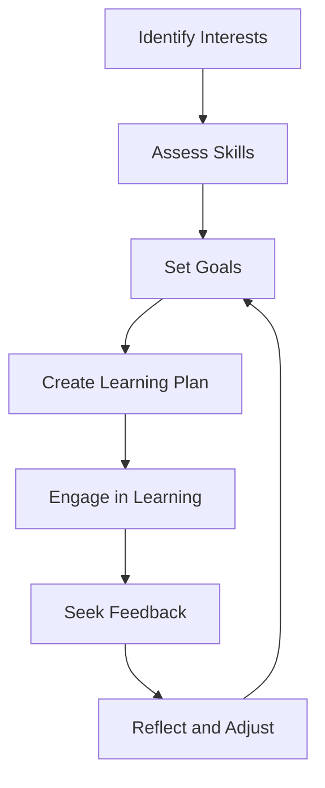

## 19.12 Continuous Learning and Skill Development

In the rapidly evolving world of technology, continuous learning and skill development are not just beneficial—they are essential. As developers, we must embrace lifelong learning to keep up with the latest advancements, tools, and methodologies. This is particularly true in the realm of Swift development, where design patterns play a crucial role in building robust and scalable applications.

### The Importance of Ongoing Education in Technology

Continuous learning in technology ensures that we remain relevant and competitive in our field. The tech industry is characterized by its fast-paced nature, with new languages, frameworks, and tools emerging regularly. Here's why ongoing education is vital:

1. **Staying Updated**: Technology evolves rapidly, and staying informed about the latest trends and updates in Swift and design patterns helps us maintain our competitive edge.
2. **Enhancing Problem-Solving Skills**: Continuous learning broadens our understanding and equips us with diverse problem-solving techniques.
3. **Career Advancement**: Acquiring new skills and certifications can lead to better job opportunities and career growth.
4. **Innovation and Creativity**: Learning new concepts can inspire innovative solutions and creative approaches to development challenges.
5. **Adaptability**: Being open to learning makes us adaptable to changes, whether it's a new project requirement or a shift in industry standards.

### Resources for Learning Swift and Software Development

To facilitate continuous learning, we must leverage a variety of resources. Here are some of the most effective avenues for expanding our knowledge in Swift and software development:

#### Online Courses and Tutorials

Platforms like [Udemy](https://www.udemy.com/), [Coursera](https://www.coursera.org/), and [edX](https://www.edx.org/) offer comprehensive courses on Swift programming and design patterns. These courses are often designed by industry experts and provide both foundational knowledge and advanced techniques.

#### Books and eBooks

Books remain a valuable resource for in-depth learning. Some recommended titles include:

- "Swift Programming: The Big Nerd Ranch Guide" by Matthew Mathias and John Gallagher
- "Design Patterns: Elements of Reusable Object-Oriented Software" by Erich Gamma et al.
- "Protocol-Oriented Programming in Swift" by Jon Hoffman

#### Documentation and Official Guides

Apple's [Swift Documentation](https://developer.apple.com/documentation/swift) is an authoritative resource for understanding Swift's features and capabilities. Regularly reviewing official documentation helps us stay aligned with the language's evolution.

#### Online Communities and Forums

Engaging with online communities such as [Stack Overflow](https://stackoverflow.com/), [Reddit's Swift Community](https://www.reddit.com/r/swift/), and [Swift.org Forums](https://forums.swift.org/) can provide support, insights, and networking opportunities. These platforms allow us to ask questions, share knowledge, and learn from others' experiences.

#### Conferences and Meetups

Attending conferences like [WWDC](https://developer.apple.com/wwdc/) and participating in local meetups can expose us to the latest industry trends and connect us with fellow developers. These events often feature workshops, talks, and networking sessions.

#### Podcasts and Webinars

Listening to podcasts such as [Swift by Sundell](https://www.swiftbysundell.com/podcast/) or attending webinars can be a convenient way to learn while commuting or during downtime.

### Setting Personal Goals for Professional Growth

To make the most of continuous learning, it's essential to set clear, achievable goals. Here are steps to guide you in setting personal goals for professional growth:

1. **Identify Your Interests**: Determine which areas of Swift development or design patterns you are passionate about or wish to explore further.
2. **Assess Your Current Skills**: Evaluate your current skill set to identify gaps and areas for improvement.
3. **Set Specific, Measurable Goals**: Define clear objectives, such as mastering a particular design pattern or contributing to an open-source Swift project.
4. **Create a Learning Plan**: Develop a structured plan that outlines the resources, time commitment, and milestones needed to achieve your goals.
5. **Seek Feedback and Mentorship**: Engage with mentors or peers who can provide guidance and constructive feedback on your progress.
6. **Reflect and Adjust**: Regularly assess your progress and be open to adjusting your goals as needed.

### Code Examples and Exercises

To reinforce learning, let's explore some practical code examples and exercises. We'll focus on implementing a simple design pattern in Swift.

#### Singleton Design Pattern Example

The Singleton pattern ensures a class has only one instance and provides a global point of access to it.

```swift
// Singleton class in Swift
class Singleton {
    static let shared = Singleton() // Single instance
    
    private init() {
        // Private initialization to ensure just one instance is created.
    }
    
    func doSomething() {
        print("Singleton instance is doing something!")
    }
}

// Usage
let singletonInstance = Singleton.shared
singletonInstance.doSomething()
```

**Try It Yourself**: Modify the `doSomething` method to perform a different action, such as logging a message with a timestamp.

### Visualizing the Learning Process

To better understand the journey of continuous learning, let's visualize the process using a flowchart.



**Caption**: This flowchart illustrates the cyclical nature of continuous learning, emphasizing the importance of reflection and adjustment.

### Knowledge Check

To ensure comprehension, consider the following questions:

- What are the benefits of continuous learning in technology?
- List three resources for learning Swift and software development.
- How can setting personal goals enhance professional growth?
- Describe the purpose of the Singleton design pattern.
- What steps are involved in creating a learning plan?

### Embrace the Journey

Remember, continuous learning is a journey, not a destination. As we progress, we'll build more complex and innovative applications. Keep experimenting, stay curious, and enjoy the process of discovery and growth.

### Summary of Key Takeaways

- Continuous learning is essential for staying relevant in the tech industry.
- Utilize diverse resources, including online courses, books, and communities, to expand your knowledge.
- Set specific, measurable goals to guide your professional growth.
- Engage in practical exercises to reinforce learning and apply new skills.

## Quiz Time!



### What is the primary benefit of continuous learning in technology?

- [x] Staying updated with the latest trends
- [ ] Reducing workload
- [ ] Avoiding team collaboration
- [ ] Limiting career opportunities

> **Explanation:** Continuous learning helps professionals stay informed about the latest advancements and trends in their field.

### Which resource is NOT typically used for learning Swift?

- [ ] Online courses
- [x] Cooking blogs
- [ ] Books
- [ ] Documentation

> **Explanation:** Cooking blogs are unrelated to learning Swift or software development.

### What is the first step in setting personal goals for professional growth?

- [x] Identify your interests
- [ ] Seek feedback
- [ ] Create a learning plan
- [ ] Assess your skills

> **Explanation:** Identifying interests helps focus on areas of passion and potential growth.

### How does the Singleton pattern benefit a Swift application?

- [x] Ensures a class has only one instance
- [ ] Allows multiple instances of a class
- [ ] Enhances data security
- [ ] Simplifies error handling

> **Explanation:** The Singleton pattern restricts a class to a single instance, providing a global access point.

### Which of the following is a key component of a learning plan?

- [x] Time commitment
- [ ] Ignoring feedback
- [ ] Avoiding challenges
- [ ] Limiting resources

> **Explanation:** A learning plan should include a clear time commitment to achieve set goals.

### What is an advantage of engaging with online communities?

- [x] Networking opportunities
- [ ] Reducing skill sets
- [ ] Limiting knowledge sharing
- [ ] Avoiding new technologies

> **Explanation:** Online communities provide networking opportunities and a platform for knowledge exchange.

### How can feedback from mentors aid in skill development?

- [x] Provides constructive criticism
- [ ] Discourages learning
- [ ] Limits growth
- [ ] Reduces motivation

> **Explanation:** Feedback from mentors offers valuable insights and constructive criticism to aid skill development.

### What role do conferences play in continuous learning?

- [x] Exposure to industry trends
- [ ] Limiting career options
- [ ] Reducing networking opportunities
- [ ] Avoiding new ideas

> **Explanation:** Conferences expose attendees to the latest industry trends and facilitate networking.

### Which of the following is a recommended book for learning Swift?

- [x] "Swift Programming: The Big Nerd Ranch Guide"
- [ ] "Cooking for Beginners"
- [ ] "The Art of War"
- [ ] "Gardening 101"

> **Explanation:** "Swift Programming: The Big Nerd Ranch Guide" is a recommended resource for learning Swift.

### Continuous learning is best described as:

- [x] A journey, not a destination
- [ ] A one-time event
- [ ] A static process
- [ ] A closed-ended task

> **Explanation:** Continuous learning is an ongoing journey, emphasizing growth and adaptation.



Remember, continuous learning is a lifelong journey that enriches both personal and professional development. Keep exploring, stay inquisitive, and embrace the ever-evolving world of technology!
