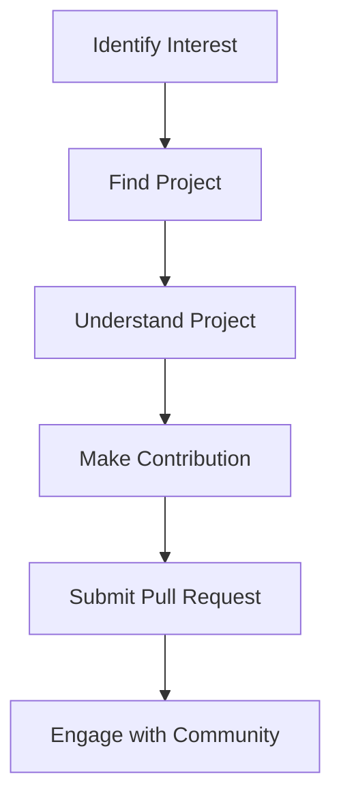

## 19.14 Embracing Open Source Contribution

In the world of software development, open-source contribution is not just a trend; it is a vital part of the ecosystem that drives innovation and collaboration. For Swift developers, engaging with open-source projects offers numerous benefits, from enhancing personal skills to building a professional portfolio. In this section, we will explore the advantages of contributing to open-source projects, provide guidance on how to get involved with Swift and its ecosystem, and discuss how these contributions can help you build a strong portfolio and engage with the community.

### The Benefits of Contributing to Open Source

Open-source contribution is a mutually beneficial endeavor. As a contributor, you gain as much from the experience as you give. Here are some of the key benefits:

#### 1. Skill Enhancement

Contributing to open-source projects allows you to work on real-world problems, which can significantly enhance your technical skills. You get to:

- **Learn from Others**: By examining the code written by experienced developers, you gain insights into different coding styles and best practices.
- **Improve Problem-Solving Skills**: Open-source projects often involve complex problems that require innovative solutions, challenging you to think critically.
- **Expand Your Knowledge**: Working on diverse projects exposes you to new technologies, tools, and frameworks.

#### 2. Networking and Community Engagement

Open source is a community-driven effort. By contributing, you:

- **Build Connections**: Engage with a global community of developers, which can lead to professional opportunities and collaborations.
- **Gain Recognition**: Establish yourself as a knowledgeable contributor in the community, which can enhance your professional reputation.

#### 3. Portfolio Development

Your contributions to open-source projects serve as a testament to your skills and dedication. They:

- **Demonstrate Your Abilities**: A well-documented contribution history showcases your coding skills and problem-solving abilities to potential employers.
- **Highlight Your Commitment**: Consistent contributions indicate your passion for development and continuous learning.

#### 4. Personal Fulfillment

There is a unique satisfaction in knowing that your work is helping others. Open-source contribution:

- **Fosters a Sense of Accomplishment**: Seeing your code being used by others is immensely rewarding.
- **Encourages Continuous Learning**: The dynamic nature of open-source projects keeps you engaged and motivated to learn.

### How to Contribute to Swift and Its Ecosystem

Contributing to the Swift ecosystem involves more than just writing code. Here’s a step-by-step guide to getting involved:

#### Step 1: Identify Your Interests

Before you start contributing, it’s important to identify areas that interest you. Swift offers a wide range of projects, from libraries and frameworks to tools and applications. Consider:

- **Swift Language Development**: Contribute to the evolution of Swift itself by participating in discussions and submitting proposals.
- **Frameworks and Libraries**: Engage with popular Swift projects like Alamofire, Vapor, or SwiftUI.
- **Documentation and Tutorials**: Help improve the documentation or create tutorials for beginners.

#### Step 2: Find a Project

Once you know your area of interest, find a project that aligns with it. Use platforms like [GitHub](https://github.com/) and [GitLab](https://gitlab.com/) to explore projects. Look for:

- **Active Projects**: Choose projects with active maintainers and contributors to ensure your contributions are reviewed and merged.
- **Beginner-Friendly Tags**: Many projects label issues as “good first issue” or “beginner-friendly” to help newcomers get started.

#### Step 3: Understand the Project

Before contributing, take the time to understand the project:

- **Read the Documentation**: Familiarize yourself with the project’s goals, structure, and contribution guidelines.
- **Explore the Codebase**: Review the code to understand its architecture and coding standards.
- **Follow the Community**: Join mailing lists, forums, or chat groups to stay updated and engage with other contributors.

#### Step 4: Make Your First Contribution

Start small to build confidence and understanding:

- **Fix Bugs**: Begin with fixing minor bugs or improving documentation.
- **Enhance Features**: Once comfortable, work on adding new features or optimizing existing ones.
- **Submit Pull Requests**: Follow the project’s guidelines to submit your changes for review.

#### Step 5: Engage with the Community

Active engagement with the community is crucial:

- **Participate in Discussions**: Contribute to discussions on issues, pull requests, and forums.
- **Seek Feedback**: Be open to feedback and use it to improve your contributions.
- **Mentor Others**: As you gain experience, help newcomers by answering questions and reviewing their contributions.

### Building a Portfolio and Engaging with the Community

Your open-source contributions can be a powerful addition to your professional portfolio. Here’s how to leverage them effectively:

#### Showcase Your Contributions

- **Create a GitHub Profile**: Maintain an updated GitHub profile that highlights your contributions and projects.
- **Document Your Work**: Write blog posts or create a personal website to document your contributions and the impact they’ve had.

#### Engage with the Swift Community

- **Attend Conferences and Meetups**: Participate in Swift-related events to network with other developers and learn about the latest trends.
- **Join Online Communities**: Engage with online forums like [Swift Forums](https://forums.swift.org/) and [Stack Overflow](https://stackoverflow.com/) to share knowledge and seek advice.

#### Continuous Learning and Improvement

- **Stay Updated**: Follow Swift’s evolution and new releases to keep your skills current.
- **Contribute Regularly**: Make regular contributions to open-source projects to maintain your engagement and skill level.

### Code Example: Contributing to an Open-Source Swift Project

Let's walk through a simple example of contributing to an open-source Swift project. We'll assume you're interested in contributing to a Swift library that provides utility functions for string manipulation.

#### Step 1: Fork and Clone the Repository

First, fork the repository on GitHub and clone it to your local machine:

```bash
# Clone the repository
git clone https://github.com/your-username/string-utils.git
cd string-utils
```

#### Step 2: Set Up the Development Environment

Ensure you have the necessary tools installed, such as Xcode and Swift. Then, open the project in Xcode:

```bash
# Open the project in Xcode
xed .
```

#### Step 3: Explore the Codebase

Familiarize yourself with the codebase. Look for areas where you can contribute, such as fixing a bug or adding a new feature.

#### Step 4: Make Changes

Suppose you want to add a function to reverse a string. Add the following code to the appropriate file:

```swift
// Add a function to reverse a string
extension String {
    func reversedString() -> String {
        return String(self.reversed())
    }
}
```

#### Step 5: Test Your Changes

Write unit tests to ensure your changes work as expected:

```swift
import XCTest

class StringUtilsTests: XCTestCase {
    func testReversedString() {
        let original = "Swift"
        let expected = "tfiwS"
        XCTAssertEqual(original.reversedString(), expected)
    }
}
```

#### Step 6: Commit and Push Your Changes

Commit your changes and push them to your forked repository:

```bash
# Commit and push changes
git add .
git commit -m "Add reversedString function"
git push origin main
```

#### Step 7: Submit a Pull Request

Go to the original repository and submit a pull request with a clear description of your changes.

### Visualizing the Contribution Process

Below is a flowchart that visualizes the process of contributing to an open-source project:



This flowchart illustrates the typical steps involved in making an open-source contribution, from identifying your interests to engaging with the community after submitting a pull request.

### References and Links

- [Swift.org](https://swift.org/) - Official Swift website for language resources and community links.
- [GitHub Open Source Guide](https://opensource.guide/) - A comprehensive guide to open-source contribution.
- [Swift Forums](https://forums.swift.org/) - Engage with the Swift community and participate in discussions.

### Knowledge Check

To reinforce your understanding of open-source contribution, consider the following questions:

- What are the benefits of contributing to open-source projects?
- How can you find a suitable open-source project to contribute to?
- What steps should you take before making your first contribution?
- How can you leverage your open-source contributions to build a professional portfolio?
- Why is community engagement important in open-source contribution?

### Embrace the Journey

Remember, contributing to open source is a journey that offers continuous learning and growth. As you engage with the community, you'll build valuable skills, make meaningful connections, and contribute to the advancement of technology. Stay curious, keep experimenting, and enjoy the rewarding experience of open-source contribution!

## Quiz Time!



### What is one of the primary benefits of contributing to open-source projects?

- [x] Enhancing technical skills
- [ ] Earning immediate financial rewards
- [ ] Avoiding teamwork
- [ ] Limiting exposure to new technologies

> **Explanation:** Contributing to open-source projects enhances technical skills by exposing you to real-world problems and diverse coding practices.

### How can you find a suitable open-source project to contribute to?

- [x] Use platforms like GitHub and GitLab
- [ ] Search for projects only on social media
- [ ] Wait for project invitations
- [ ] Only contribute to projects you created

> **Explanation:** Platforms like GitHub and GitLab host numerous open-source projects, making them ideal for finding projects that match your interests.

### What is a good first step before making a contribution?

- [x] Understanding the project’s goals and structure
- [ ] Immediately submitting code changes
- [ ] Ignoring the project's documentation
- [ ] Deleting existing code

> **Explanation:** Understanding the project’s goals and structure is crucial to ensure your contributions align with the project's objectives.

### Why is community engagement important in open-source contribution?

- [x] It helps build connections and gain recognition
- [ ] It is not important at all
- [ ] It limits learning opportunities
- [ ] It discourages collaboration

> **Explanation:** Community engagement helps build connections, gain recognition, and fosters collaboration, enhancing the open-source experience.

### How can you showcase your open-source contributions?

- [x] Maintain an updated GitHub profile
- [ ] Keep contributions private
- [ ] Avoid documenting your work
- [ ] Only share contributions verbally

> **Explanation:** An updated GitHub profile highlights your contributions and demonstrates your skills to potential employers.

### What is the role of documentation in open-source projects?

- [x] It helps contributors understand the project
- [ ] It is unnecessary and can be ignored
- [ ] It should be minimal and vague
- [ ] It is only for the project owner

> **Explanation:** Documentation is essential for helping contributors understand the project’s goals, structure, and contribution guidelines.

### What should you do after submitting a pull request?

- [x] Engage with the community for feedback
- [ ] Immediately start a new project
- [ ] Ignore any feedback received
- [ ] Delete your forked repository

> **Explanation:** Engaging with the community for feedback after submitting a pull request helps improve your contributions and fosters collaboration.

### How can you continuously improve your skills through open-source contribution?

- [x] Stay updated with Swift’s evolution
- [ ] Only work on the same type of projects
- [ ] Avoid learning new technologies
- [ ] Limit contributions to once a year

> **Explanation:** Staying updated with Swift’s evolution and contributing regularly helps continuously improve your skills.

### What is a key aspect of building a professional portfolio through open-source contribution?

- [x] Documenting your work and contributions
- [ ] Keeping all work undocumented
- [ ] Only focusing on private projects
- [ ] Avoiding any form of documentation

> **Explanation:** Documenting your work and contributions is key to building a professional portfolio that showcases your skills and achievements.

### True or False: Open-source contribution is only beneficial for beginners.

- [ ] True
- [x] False

> **Explanation:** Open-source contribution is beneficial for developers at all levels, providing opportunities for skill enhancement, networking, and professional growth.


