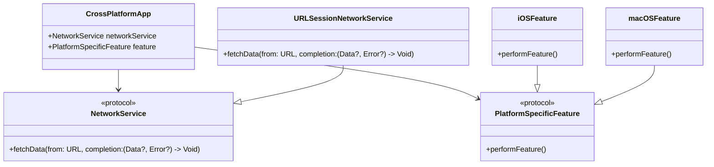

## 19.15 Cross-Platform Development Considerations

In the realm of software development, creating applications that seamlessly run across multiple platforms is a challenging yet rewarding endeavor. With Swift, developers can target Apple's ecosystem, including iOS, macOS, watchOS, and tvOS, using a single codebase. This section delves into the intricacies of cross-platform development, highlighting key considerations, best practices, and Swift-specific features that facilitate this process.

### Understanding Platform-Specific APIs and Limitations

To effectively develop cross-platform applications, it's crucial to understand the unique APIs and limitations of each platform. While Swift provides a unified language, the underlying frameworks and capabilities differ across iOS, macOS, watchOS, and tvOS.

#### iOS

iOS is primarily designed for touch-based interactions and mobile devices. It features APIs like UIKit for user interfaces, Core Motion for sensor data, and HealthKit for health-related information. iOS applications often focus on performance and battery efficiency due to the mobile nature of the devices.

#### macOS

macOS applications leverage the AppKit framework for building desktop interfaces. Unlike iOS, macOS supports windowed applications, multiple displays, and a more extensive file system. Developers must consider different input methods, such as mouse and keyboard, and the potential for more complex user interactions.

#### watchOS

watchOS is tailored for wearable devices, emphasizing quick interactions and glanceable information. The WatchKit framework is used to create apps that are lightweight and optimized for limited screen real estate and battery life.

#### tvOS

tvOS targets the Apple TV platform, focusing on media consumption. It uses the TVUIKit framework, which is designed for large screens and remote-based navigation. Developers should consider the unique user experience of a living room setting, where users interact with the app from a distance.

### Utilizing Conditional Compilation and Modular Design

Swift's conditional compilation and modular design capabilities are essential for cross-platform development. These features allow developers to write code that adapts to different platforms without duplicating efforts.

#### Conditional Compilation

Conditional compilation enables developers to include or exclude code based on the target platform. Swift uses compiler directives like `#if`, `#else`, and `#endif` to achieve this. Here's an example:

```swift
#if os(iOS)
import UIKit
typealias View = UIView
#elseif os(macOS)
import AppKit
typealias View = NSView
#elseif os(watchOS)
import WatchKit
typealias View = WKInterfaceObject
#elseif os(tvOS)
import UIKit
typealias View = UIView
#endif

class CrossPlatformView: View {
    // Platform-specific code here
}
```

In this example, we define a `View` type alias that corresponds to the appropriate view class for each platform. This allows us to write platform-specific code while maintaining a single codebase.

#### Modular Design

Modular design involves breaking down an application into smaller, reusable components. This approach enhances code maintainability and reusability across platforms. By encapsulating platform-specific logic within modules, developers can easily swap out or extend functionality for different platforms.

Consider a module for handling network requests:

```swift
protocol NetworkService {
    func fetchData(from url: URL, completion: @escaping (Data?, Error?) -> Void)
}

class URLSessionNetworkService: NetworkService {
    func fetchData(from url: URL, completion: @escaping (Data?, Error?) -> Void) {
        let task = URLSession.shared.dataTask(with: url) { data, response, error in
            completion(data, error)
        }
        task.resume()
    }
}
```

This `NetworkService` protocol defines a common interface for network operations. The `URLSessionNetworkService` class implements this protocol using `URLSession`, which is available across all Apple platforms.

### Swift's Unique Features for Cross-Platform Development

Swift offers several unique features that facilitate cross-platform development. These include protocol-oriented programming, extensions, and generics.

#### Protocol-Oriented Programming

Swift's emphasis on protocol-oriented programming (POP) allows developers to define flexible and reusable components. By using protocols, developers can create platform-agnostic interfaces that can be implemented differently on each platform.

```swift
protocol PlatformSpecificFeature {
    func performFeature()
}

#if os(iOS)
class iOSFeature: PlatformSpecificFeature {
    func performFeature() {
        print("Performing iOS-specific feature")
    }
}
#elseif os(macOS)
class macOSFeature: PlatformSpecificFeature {
    func performFeature() {
        print("Performing macOS-specific feature")
    }
}
#endif
```

In this example, the `PlatformSpecificFeature` protocol defines a common interface, while `iOSFeature` and `macOSFeature` provide platform-specific implementations.

#### Extensions

Extensions in Swift allow developers to add functionality to existing types without subclassing. This is particularly useful for cross-platform development, as it enables the addition of platform-specific behavior to shared types.

```swift
extension View {
    func commonSetup() {
        // Common setup code for all platforms
    }
}

#if os(iOS)
extension UIView {
    func iOSSetup() {
        // iOS-specific setup code
    }
}
#endif
```

Here, we extend the `View` type to include a `commonSetup` method, which is available across all platforms. Additionally, we add an `iOSSetup` method specifically for iOS.

#### Generics

Generics enable developers to write flexible and reusable code by abstracting over types. This is particularly beneficial for cross-platform development, where the same logic can be applied to different data types or platform-specific classes.

```swift
func performOperation<T>(on value: T) {
    print("Performing operation on \\(value)")
}

performOperation(on: "String")
performOperation(on: 42)
```

In this example, the `performOperation` function can operate on any type, making it versatile and reusable across different platforms.

### Visualizing Cross-Platform Architecture

To better understand the architecture of a cross-platform Swift application, let's visualize the interaction between different components using a class diagram.



This diagram illustrates a cross-platform application's architecture, highlighting the use of protocols and modular components to achieve platform-specific functionality.

### Try It Yourself

To solidify your understanding of cross-platform development in Swift, try modifying the code examples provided. Experiment with adding new platform-specific features or extending existing ones. Consider implementing additional protocols or using generics to create more flexible components.

### References and Further Reading

- [Apple Developer Documentation](https://developer.apple.com/documentation/)
- [Swift.org](https://swift.org/)
- [Hacking with Swift: Protocol-Oriented Programming](https://www.hackingwithswift.com/articles/74/protocol-oriented-programming-in-swift)
- [Ray Wenderlich: Modular Architecture in Swift](https://www.raywenderlich.com/)

### Knowledge Check

- What are the key differences between iOS and macOS APIs?
- How does conditional compilation aid in cross-platform development?
- Explain how protocol-oriented programming enhances code reusability.
- Describe the role of extensions in adding platform-specific functionality.
- How do generics contribute to flexible and reusable code?

### Embrace the Journey

Remember, cross-platform development is a journey that requires continuous learning and adaptation. As you progress, you'll gain a deeper understanding of each platform's nuances and how to leverage Swift's powerful features to create robust applications. Keep experimenting, stay curious, and enjoy the journey!

## Quiz Time!



### Which Swift feature allows for adding functionality to existing types without subclassing?

- [x] Extensions
- [ ] Protocols
- [ ] Generics
- [ ] Conditional Compilation

> **Explanation:** Extensions allow developers to add new functionality to existing types without modifying their original implementation.

### What is the primary framework used for building iOS user interfaces?

- [x] UIKit
- [ ] AppKit
- [ ] WatchKit
- [ ] TVUIKit

> **Explanation:** UIKit is the primary framework used for building user interfaces in iOS applications.

### How does conditional compilation benefit cross-platform development?

- [x] It allows for including or excluding code based on the target platform.
- [ ] It automatically optimizes code for all platforms.
- [ ] It provides a unified API for all platforms.
- [ ] It compiles code faster.

> **Explanation:** Conditional compilation enables developers to write code that adapts to different platforms by including or excluding specific sections based on compiler directives.

### What is the purpose of the `NetworkService` protocol in the provided example?

- [x] To define a common interface for network operations.
- [ ] To implement platform-specific network logic.
- [ ] To handle UI updates.
- [ ] To manage data storage.

> **Explanation:** The `NetworkService` protocol defines a common interface for network operations, allowing for platform-specific implementations.

### Which platform is the WatchKit framework associated with?

- [ ] iOS
- [ ] macOS
- [x] watchOS
- [ ] tvOS

> **Explanation:** The WatchKit framework is associated with watchOS, used for developing applications for Apple Watch.

### What does the `performOperation` function demonstrate?

- [x] The use of generics to operate on any type.
- [ ] The use of protocols for defining interfaces.
- [ ] The use of extensions for adding functionality.
- [ ] The use of conditional compilation for platform-specific code.

> **Explanation:** The `performOperation` function demonstrates the use of generics, allowing it to operate on any type.

### Which framework is designed for large screens and remote-based navigation?

- [ ] UIKit
- [ ] AppKit
- [ ] WatchKit
- [x] TVUIKit

> **Explanation:** TVUIKit is designed for large screens and remote-based navigation, used in tvOS applications.

### What is a key consideration when developing for watchOS?

- [x] Optimizing for limited screen real estate and battery life.
- [ ] Supporting multiple displays.
- [ ] Handling complex file systems.
- [ ] Enabling remote-based navigation.

> **Explanation:** watchOS applications should be optimized for limited screen real estate and battery life due to the wearable nature of the devices.

### How can modular design benefit cross-platform development?

- [x] By enhancing code maintainability and reusability.
- [ ] By automatically adapting code to different platforms.
- [ ] By reducing the need for conditional compilation.
- [ ] By providing a unified API for all platforms.

> **Explanation:** Modular design involves breaking down an application into smaller, reusable components, enhancing code maintainability and reusability across platforms.

### True or False: Generics in Swift allow for writing code that is specific to one data type.

- [ ] True
- [x] False

> **Explanation:** Generics in Swift allow for writing flexible and reusable code that can work with any data type, not just a specific one.






