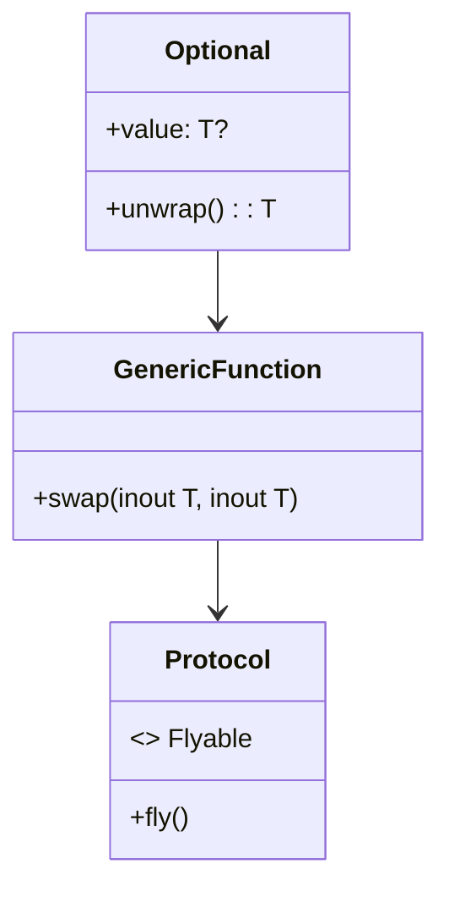

## 19.3 Leveraging Swift Language Features

Swift, Apple's modern programming language, is designed to be safe, fast, and expressive. It offers a plethora of features that, when leveraged correctly, can significantly enhance the robustness and efficiency of your code. In this section, we will explore how to utilize Swift's unique language features such as optionals, generics, protocols, and value types to write idiomatic and maintainable code.

### Embracing Optionals

Optionals are one of Swift's hallmark features, providing a safe way to handle the absence of a value. They are a powerful tool for preventing runtime crashes and ensuring safer code execution.

#### Understanding Optionals

An optional in Swift is a type that can hold either a value or `nil`. This is particularly useful when a value might be absent, such as when parsing JSON data or working with user input.

```swift
var optionalString: String? = "Hello, Swift!"
optionalString = nil // Now it holds no value
```

#### Safe Unwrapping Techniques

To access the value inside an optional, you must unwrap it. Swift provides several ways to do this safely:

- **Optional Binding**: Use `if let` or `guard let` to safely unwrap an optional.

```swift
if let unwrappedString = optionalString {
    print("The string is: \\(unwrappedString)")
} else {
    print("The optional was nil.")
}
```

- **Nil Coalescing Operator**: Provide a default value if the optional is `nil`.

```swift
let greeting = optionalString ?? "Default Greeting"
```

- **Optional Chaining**: Safely access properties, methods, and subscripts on optional that might currently be `nil`.

```swift
let length = optionalString?.count
```

#### Try It Yourself

Experiment with optionals by creating a function that takes an optional parameter and returns a string message based on whether the parameter is `nil` or not.

### Harnessing Generics

Generics allow you to write flexible and reusable functions and types that can work with any data type. They are a cornerstone of Swift's type safety and expressiveness.

#### Why Use Generics?

Generics enable you to write code that is both abstract and type-safe. This means you can create functions and types that work with any data type without sacrificing performance or safety.

```swift
func swapTwoValues<T>(_ a: inout T, _ b: inout T) {
    let temporaryA = a
    a = b
    b = temporaryA
}

var firstInt = 1
var secondInt = 2
swapTwoValues(&firstInt, &secondInt)
```

#### Generic Types and Protocols

You can also create generic types and protocols to build more flexible and reusable components.

```swift
struct Stack<Element> {
    var items: [Element] = []
    mutating func push(_ item: Element) {
        items.append(item)
    }
    mutating func pop() -> Element {
        return items.removeLast()
    }
}
```

#### Try It Yourself

Create a generic function that takes two parameters of any type and returns a tuple containing both parameters.

### Protocols and Protocol-Oriented Programming

Swift's protocols define a blueprint of methods, properties, and other requirements for tasks or functionalities. Protocol-oriented programming (POP) is a paradigm that emphasizes the use of protocols to achieve polymorphism and code reuse.

#### Defining and Using Protocols

Protocols can be used to define interfaces that types must conform to. This allows for a flexible and decoupled codebase.

```swift
protocol Flyable {
    func fly()
}

class Bird: Flyable {
    func fly() {
        print("Bird is flying")
    }
}
```

#### Protocol Extensions

Swift allows you to extend protocols to provide default implementations of methods, making it easier to adopt protocols.

```swift
extension Flyable {
    func fly() {
        print("Flying in the sky!")
    }
}
```

#### Protocol Composition

Combine multiple protocols into a single requirement using protocol composition.

```swift
protocol Swimmable {
    func swim()
}

typealias Amphibious = Flyable & Swimmable
```

#### Try It Yourself

Define a protocol for a `Vehicle` with properties and methods, and then create a class that conforms to this protocol.

### Leveraging Value Types

Swift encourages the use of value types (structs and enums) over reference types (classes) for many use cases. Value types provide safety and predictability, especially in a concurrent environment.

#### Structs vs. Classes

- **Structs** are value types, meaning they are copied when assigned to a new variable or passed to a function.
- **Classes** are reference types, meaning they are shared among multiple references.

```swift
struct Point {
    var x: Double
    var y: Double
}

var pointA = Point(x: 0, y: 0)
var pointB = pointA
pointB.x = 10
print(pointA.x) // Outputs: 0
```

#### Use Cases for Value Types

Value types are ideal for representing simple data structures that do not require inheritance or shared state.

#### Try It Yourself

Create a struct to represent a `Rectangle` with width and height properties. Add a method to calculate the area of the rectangle.

### Keeping Code Idiomatic to Swift

Writing idiomatic Swift code means embracing the language's features and conventions. This includes using Swift's powerful type system, embracing immutability, and following naming conventions.

#### Embrace Immutability

Swift encourages the use of constants (`let`) over variables (`var`) to ensure data is not accidentally modified.

```swift
let constantValue = 10
// constantValue = 20 // This will cause an error
```

#### Follow Swift Naming Conventions

Swift has specific naming conventions that make code more readable and consistent. Use camelCase for variable and function names, and capitalize the first letter of type names.

```swift
let myVariable = 42
struct MyStruct {}
```

#### Use Swift's Standard Library

Swift's standard library is rich with features that can simplify your code. Use built-in functions like `map`, `filter`, and `reduce` to work with collections.

```swift
let numbers = [1, 2, 3, 4, 5]
let squaredNumbers = numbers.map { $0 * $0 }
```

### Visualizing Swift's Language Features

To better understand how these features interact, let's visualize a simple Swift program that uses optionals, generics, and protocols.



This diagram illustrates how optionals, generics, and protocols can be interconnected in a Swift program.

### Knowledge Check

Before we move on, let's reinforce our understanding with a few questions:

- What is the primary advantage of using optionals in Swift?
- How do generics improve code reusability?
- Why are protocols important in Swift programming?

### Summary

By leveraging Swift's language features, you can write code that is not only safe and efficient but also expressive and easy to maintain. Embrace optionals to handle the absence of values safely, use generics to write flexible and reusable code, adopt protocols for polymorphism and code reuse, and choose value types for predictable behavior in concurrent environments. Keep your code idiomatic to Swift by following conventions and using the standard library effectively.

Remember, mastering these features is a journey. Keep experimenting, stay curious, and enjoy the process of becoming a more proficient Swift developer.

## Quiz Time!



### What is the primary advantage of using optionals in Swift?

- [x] They provide a safe way to handle the absence of a value.
- [ ] They increase the performance of the code.
- [ ] They allow for dynamic typing.
- [ ] They simplify memory management.

> **Explanation:** Optionals provide a safe way to handle the absence of a value, preventing runtime crashes.

### How do generics improve code reusability?

- [x] By allowing functions and types to work with any data type.
- [ ] By making code execution faster.
- [ ] By simplifying syntax.
- [ ] By enforcing strict typing.

> **Explanation:** Generics allow you to write flexible and reusable functions and types that can work with any data type.

### Why are protocols important in Swift programming?

- [x] They define a blueprint of methods and properties for tasks or functionalities.
- [ ] They increase execution speed.
- [ ] They simplify syntax.
- [ ] They are used only for error handling.

> **Explanation:** Protocols define a blueprint of methods, properties, and other requirements for tasks or functionalities.

### What is the difference between structs and classes in Swift?

- [x] Structs are value types, while classes are reference types.
- [ ] Structs are reference types, while classes are value types.
- [ ] Structs and classes are both reference types.
- [ ] Structs and classes are both value types.

> **Explanation:** Structs are value types, meaning they are copied when assigned or passed around, while classes are reference types.

### When should you prefer using value types over reference types?

- [x] When you want predictable behavior in concurrent environments.
- [ ] When you need inheritance.
- [ ] When you want to share state between objects.
- [ ] When you need dynamic typing.

> **Explanation:** Value types provide safety and predictability, especially in a concurrent environment.

### What is the purpose of the nil coalescing operator?

- [x] To provide a default value if the optional is nil.
- [ ] To unwrap an optional forcefully.
- [ ] To check if an optional is nil.
- [ ] To convert an optional to a string.

> **Explanation:** The nil coalescing operator provides a default value if the optional is nil.

### How can you combine multiple protocols into a single requirement?

- [x] Using protocol composition.
- [ ] Using inheritance.
- [ ] Using a switch statement.
- [ ] Using a tuple.

> **Explanation:** Protocol composition allows you to combine multiple protocols into a single requirement.

### What is the advantage of using protocol extensions?

- [x] They provide default implementations for protocol methods.
- [ ] They increase code execution speed.
- [ ] They simplify syntax.
- [ ] They enforce strict typing.

> **Explanation:** Protocol extensions allow you to provide default implementations of methods, making it easier to adopt protocols.

### What is the benefit of using Swift's standard library functions like map, filter, and reduce?

- [x] They simplify working with collections.
- [ ] They increase execution speed.
- [ ] They enforce strict typing.
- [ ] They allow for dynamic typing.

> **Explanation:** Swift's standard library functions like map, filter, and reduce simplify working with collections.

### True or False: Swift encourages the use of constants over variables to ensure data is not accidentally modified.

- [x] True
- [ ] False

> **Explanation:** Swift encourages the use of constants (`let`) over variables (`var`) to ensure data is not accidentally modified.




