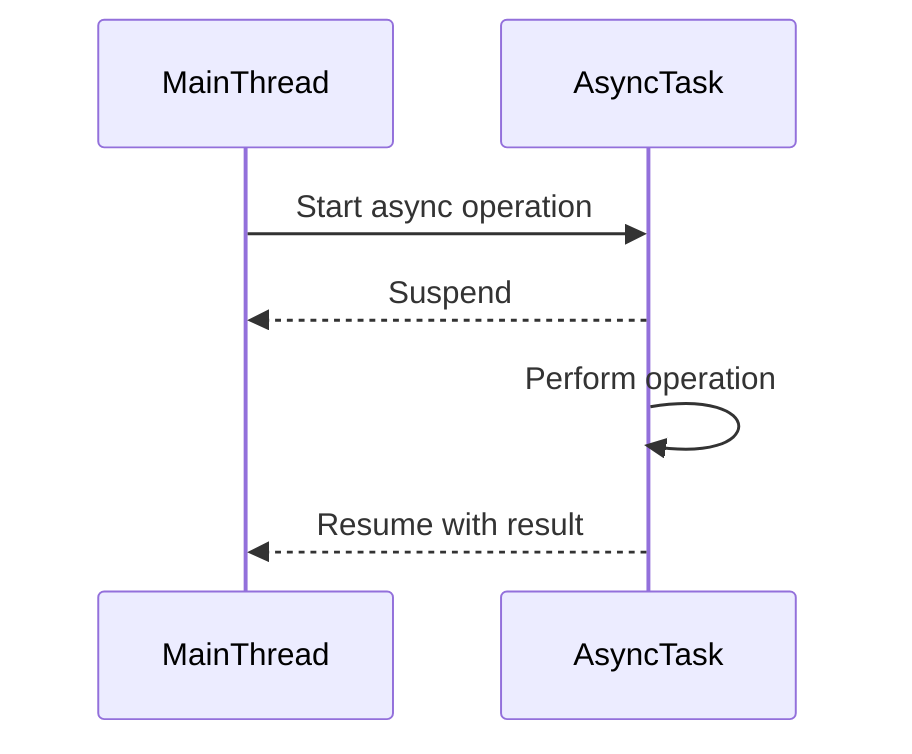

## 19.4 Asynchronous Programming Best Practices

Asynchronous programming is a cornerstone of modern software development, enabling applications to perform tasks concurrently, thus improving responsiveness and efficiency. In Swift, asynchronous programming has been significantly enhanced with the introduction of Swift Concurrency, which includes the `async/await` syntax. This section delves into best practices for handling asynchronous tasks in Swift, ensuring your code is robust, efficient, and maintainable.

### Understanding Asynchronous Programming

Before diving into best practices, let's briefly revisit what asynchronous programming entails. Unlike synchronous programming, where tasks are executed sequentially, asynchronous programming allows tasks to run concurrently, enabling the application to remain responsive. This is particularly useful in scenarios like network requests, file I/O operations, or any task that might take an unpredictable amount of time to complete.

### Using Swift Concurrency (async/await) Effectively

The introduction of `async/await` in Swift has simplified writing asynchronous code, making it more readable and easier to maintain. Here are some best practices for using `async/await` effectively:

#### 1. **Adopt `async/await` for Readability and Maintainability**

The `async/await` syntax provides a clear and concise way to write asynchronous code. It allows you to write asynchronous code that looks similar to synchronous code, making it easier to understand and maintain.

```swift
// Example of using async/await for a network request
func fetchUserData() async throws -> User {
    let url = URL(string: "https://api.example.com/user")!
    let (data, _) = try await URLSession.shared.data(from: url)
    let user = try JSONDecoder().decode(User.self, from: data)
    return user
}
```

In this example, the `fetchUserData` function performs a network request asynchronously, but the code structure remains straightforward and easy to follow.

#### 2. **Leverage Structured Concurrency**

Structured concurrency in Swift ensures that asynchronous tasks are managed in a hierarchy, making it easier to reason about their lifecycle and dependencies. Use `Task` and `TaskGroup` to manage concurrent tasks effectively.

```swift
// Example of using TaskGroup for concurrent tasks
func fetchAllUserData() async throws -> [User] {
    var users: [User] = []
    try await withThrowingTaskGroup(of: User.self) { group in
        for userId in 1...10 {
            group.addTask {
                return try await fetchUserData(for: userId)
            }
        }
        for try await user in group {
            users.append(user)
        }
    }
    return users
}
```

In this example, `withThrowingTaskGroup` is used to fetch user data concurrently for multiple users, ensuring that all tasks are completed before proceeding.

#### 3. **Handle Errors Gracefully**

Error handling is crucial in asynchronous programming. Use `try`, `catch`, and `throws` to manage errors effectively, ensuring your application can handle failures gracefully.

```swift
// Example of error handling in async/await
do {
    let user = try await fetchUserData()
    print("User data: \\(user)")
} catch {
    print("Failed to fetch user data: \\(error)")
}
```

By catching errors, you can provide meaningful feedback to the user or attempt recovery operations.

#### 4. **Avoid Blocking the Main Thread**

The main thread is responsible for updating the UI and handling user interactions. Avoid blocking it with long-running tasks. Use `async` functions to perform such tasks in the background.

```swift
// Example of updating UI after an async operation
func updateUserInterface() async {
    do {
        let user = try await fetchUserData()
        DispatchQueue.main.async {
            self.updateUI(with: user)
        }
    } catch {
        print("Error updating UI: \\(error)")
    }
}
```

In this example, the UI update is dispatched back to the main thread after fetching user data asynchronously.

### Avoiding Common Pitfalls in Concurrent Programming

While asynchronous programming offers many benefits, it also introduces potential pitfalls. Here are some common issues and how to avoid them:

#### 1. **Race Conditions**

Race conditions occur when multiple tasks access shared resources concurrently, leading to unpredictable outcomes. Use synchronization mechanisms like `actors` to prevent race conditions.

```swift
// Example of using an actor to prevent race conditions
actor UserManager {
    private var users: [User] = []

    func addUser(_ user: User) {
        users.append(user)
    }

    func getUsers() -> [User] {
        return users
    }
}
```

In this example, the `UserManager` actor ensures that access to the `users` array is serialized, preventing race conditions.

#### 2. **Deadlocks**

Deadlocks occur when two or more tasks wait indefinitely for each other to release resources. Avoid nested locks and ensure that tasks acquire locks in a consistent order.

#### 3. **Memory Leaks**

Memory leaks can occur when asynchronous tasks retain strong references to objects, preventing them from being deallocated. Use weak references where appropriate to avoid memory leaks.

```swift
// Example of avoiding memory leaks with weak references
class DataFetcher {
    weak var delegate: DataFetcherDelegate?

    func fetchData() async {
        let data = await performAsyncFetch()
        delegate?.didFetchData(data)
    }
}
```

Here, the `delegate` is a weak reference, preventing a strong reference cycle and potential memory leak.

### Visualizing Asynchronous Programming in Swift

To better understand how asynchronous programming works in Swift, let's visualize the flow of `async/await` using a sequence diagram.



This diagram illustrates how the main thread initiates an asynchronous task, which then performs its operation independently. Once the task is complete, it resumes the main thread with the result.

### Best Practices Summary

- **Use `async/await`** for cleaner, more maintainable code.
- **Leverage structured concurrency** to manage task hierarchies.
- **Handle errors gracefully** using Swift's error handling mechanisms.
- **Avoid blocking the main thread** to keep the UI responsive.
- **Prevent race conditions** using actors or other synchronization mechanisms.
- **Avoid deadlocks** by careful lock management.
- **Use weak references** to prevent memory leaks.

### Try It Yourself

Experiment with the code examples provided. Try modifying the `fetchUserData` function to simulate a network error and handle it gracefully. Explore using `TaskGroup` to perform additional concurrent operations, such as fetching posts or comments for each user.

### References and Further Reading

- [Swift.org - Concurrency](https://swift.org/documentation/concurrency/)
- [Apple Developer Documentation - Swift Concurrency](https://developer.apple.com/documentation/swift/swift_concurrency)
- [Ray Wenderlich - Swift Concurrency Tutorial](https://www.raywenderlich.com/26223393-swift-concurrency-tutorial-getting-started)

### Embrace the Journey

Asynchronous programming in Swift is a powerful tool that can significantly enhance your application's performance and responsiveness. Remember, this is just the beginning. As you progress, you'll build more complex and interactive applications. Keep experimenting, stay curious, and enjoy the journey!

## Quiz Time!



### What is the primary benefit of using async/await in Swift?

- [x] Improved readability and maintainability of asynchronous code
- [ ] Faster execution of tasks
- [ ] Reduced memory usage
- [ ] Increased security

> **Explanation:** The primary benefit of using async/await is that it improves the readability and maintainability of asynchronous code by making it look similar to synchronous code.

### What is structured concurrency in Swift?

- [x] A way to manage asynchronous tasks in a hierarchy
- [ ] A method for optimizing synchronous code
- [ ] A design pattern for UI development
- [ ] A technique for reducing memory usage

> **Explanation:** Structured concurrency in Swift is a way to manage asynchronous tasks in a hierarchy, making it easier to reason about their lifecycle and dependencies.

### How can you prevent race conditions in Swift?

- [x] Use actors to serialize access to shared resources
- [ ] Use more threads to increase performance
- [ ] Avoid using async/await
- [ ] Increase the priority of tasks

> **Explanation:** Using actors in Swift helps serialize access to shared resources, preventing race conditions.

### What should you avoid to prevent deadlocks?

- [x] Nested locks and inconsistent lock acquisition order
- [ ] Using async/await
- [ ] Handling errors
- [ ] Using actors

> **Explanation:** To prevent deadlocks, avoid nested locks and ensure that tasks acquire locks in a consistent order.

### How can you avoid memory leaks in asynchronous tasks?

- [x] Use weak references where appropriate
- [ ] Use strong references for all objects
- [ ] Avoid using async/await
- [ ] Increase memory allocation

> **Explanation:** Using weak references where appropriate helps prevent memory leaks by avoiding strong reference cycles.

### What is the role of the main thread in an iOS application?

- [x] Updating the UI and handling user interactions
- [ ] Performing all background tasks
- [ ] Managing network requests
- [ ] Handling memory management

> **Explanation:** The main thread is responsible for updating the UI and handling user interactions in an iOS application.

### What is the purpose of the `try` keyword in Swift's async/await?

- [x] To handle errors in asynchronous code
- [ ] To improve performance
- [ ] To reduce memory usage
- [ ] To increase security

> **Explanation:** The `try` keyword is used to handle errors in asynchronous code, allowing you to catch and manage exceptions.

### Why is it important to dispatch UI updates to the main thread?

- [x] To ensure the UI remains responsive and updates correctly
- [ ] To increase performance
- [ ] To reduce memory usage
- [ ] To handle errors

> **Explanation:** Dispatching UI updates to the main thread ensures that the UI remains responsive and updates correctly, as the main thread is responsible for handling user interactions.

### What is the benefit of using `TaskGroup` in Swift?

- [x] To perform concurrent tasks and manage their completion
- [ ] To reduce memory usage
- [ ] To handle errors
- [ ] To improve UI performance

> **Explanation:** `TaskGroup` in Swift allows you to perform concurrent tasks and manage their completion, making it easier to handle multiple asynchronous operations.

### True or False: Using async/await can help prevent race conditions.

- [ ] True
- [x] False

> **Explanation:** Using async/await alone does not prevent race conditions. You need to use synchronization mechanisms like actors to prevent race conditions.




