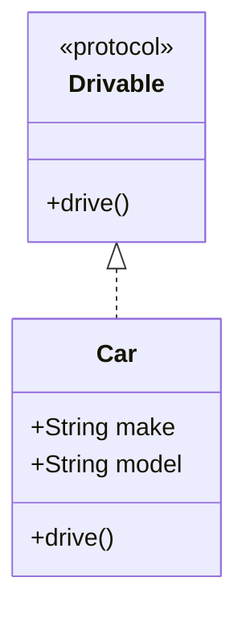

## 19.5 Swift Coding Standards and Naming Conventions

In the world of software development, coding standards and naming conventions are crucial for creating maintainable, readable, and scalable codebases. Swift, being a modern and expressive programming language, offers developers a unique set of features that can be leveraged to write clean and efficient code. In this section, we will explore the best practices for Swift coding standards and naming conventions, providing you with the tools to enhance code consistency and collaboration within your development teams.

### Introduction to Swift Coding Standards

Swift coding standards are a set of guidelines that aim to improve the quality of code by ensuring consistency and readability. These standards are not just about following rules; they are about writing code that is easy to understand and maintain by others, including your future self. By adhering to these standards, you can reduce the likelihood of introducing bugs, facilitate easier code reviews, and improve collaboration among team members.

### Importance of Naming Conventions

Naming conventions are a subset of coding standards that focus specifically on how you name your variables, functions, classes, and other entities in your code. Proper naming conventions help in:

- **Improving Code Readability**: Well-named variables and functions make the code self-documenting, reducing the need for excessive comments.
- **Facilitating Code Maintenance**: Consistent naming makes it easier to understand and modify code, especially in large projects.
- **Enhancing Collaboration**: When a team follows the same naming conventions, it becomes easier for members to work on different parts of the codebase without confusion.

### General Swift Coding Standards

Let's delve into some general Swift coding standards that every Swift developer should follow:

#### 1. Use of Indentation and Spacing

Proper indentation and spacing are essential for making code readable. Swift follows a four-space indentation rule, which helps in distinguishing code blocks and maintaining a clean structure.

```swift
func calculateSum(of numbers: [Int]) -> Int {
    var sum = 0
    for number in numbers {
        sum += number
    }
    return sum
}
```

- **Indentation**: Use four spaces per indentation level. Avoid using tabs.
- **Spacing**: Use spaces around operators and after commas to improve readability.

#### 2. Line Length

Keep lines of code to a reasonable length, ideally not exceeding 80 to 100 characters. This helps in maintaining readability across different devices and screen sizes.

#### 3. Code Comments

Use comments judiciously to explain the why behind complex logic, rather than the what. Swift supports both single-line (`//`) and multi-line (`/* ... */`) comments.

```swift
// Calculate the sum of an array of integers
func calculateSum(of numbers: [Int]) -> Int {
    // Initialize sum to zero
    var sum = 0
    for number in numbers {
        sum += number
    }
    return sum
}
```

#### 4. Use of Constants and Variables

Prefer using `let` for constants and `var` for variables. This ensures immutability where possible, leading to safer and more predictable code.

```swift
let maximumLoginAttempts = 3
var currentLoginAttempt = 0
```

### Swift Naming Conventions

Naming conventions in Swift are inspired by the language's expressive nature and aim to make the code self-explanatory. Here are some key naming conventions to follow:

#### 1. Variable and Constant Naming

- **Camel Case**: Use camel case for variable and constant names, starting with a lowercase letter.
- **Descriptive Names**: Choose names that clearly describe the purpose of the variable or constant.

```swift
let userName = "JohnDoe"
var numberOfItems = 5
```

#### 2. Function and Method Naming

- **Verb-First Naming**: Function and method names should start with a verb to indicate action.
- **Camel Case**: Use camel case, starting with a lowercase letter.

```swift
func fetchUserData() -> UserData {
    // Function implementation
}
```

#### 3. Class and Struct Naming

- **Pascal Case**: Use Pascal case for class and struct names, starting with an uppercase letter.
- **Nouns**: Names should be nouns that describe the entity.

```swift
class UserProfile {
    // Class implementation
}

struct Point {
    var x: Double
    var y: Double
}
```

#### 4. Enum Naming

- **Singular Naming**: Use singular nouns for enum names.
- **Pascal Case**: Use Pascal case for enum names and their cases.

```swift
enum Direction {
    case north
    case south
    case east
    case west
}
```

#### 5. Protocol Naming

- **Descriptive Names**: Protocol names should describe the capability or role.
- **Pascal Case**: Use Pascal case, and consider using "able", "ible", or "ing" suffixes.

```swift
protocol Drivable {
    func drive()
}
```

### Advanced Swift Naming Conventions

#### 1. Generic Type Parameters

Use single uppercase letters, such as `T`, `U`, or `V`, for generic type parameters. If more descriptive names are needed, use Pascal case.

```swift
func swap<T>(_ a: inout T, _ b: inout T) {
    let temporaryA = a
    a = b
    b = temporaryA
}
```

#### 2. Closure Naming

When passing closures as parameters, use descriptive names that indicate the closure's purpose.

```swift
func performOperation(on numbers: [Int], using operation: (Int, Int) -> Int) -> Int {
    var result = numbers[0]
    for number in numbers.dropFirst() {
        result = operation(result, number)
    }
    return result
}
```

#### 3. Type Aliases

Use type aliases to create more readable code, especially when dealing with complex types.

```swift
typealias JSONDictionary = [String: Any]
```

### Code Example: Applying Naming Conventions

Let's combine these conventions in a practical example:

```swift
// Define a protocol for a drivable vehicle
protocol Drivable {
    func drive()
}

// Define a struct for a car that conforms to the Drivable protocol
struct Car: Drivable {
    let make: String
    let model: String
    
    func drive() {
        print("Driving a \\(make) \\(model)")
    }
}

// Define a function to demonstrate the use of the Car struct
func demonstrateDriving() {
    let car = Car(make: "Tesla", model: "Model S")
    car.drive()
}

// Execute the demonstration function
demonstrateDriving()
```

### Visualizing Swift Naming Conventions

To better understand the relationships and naming conventions within Swift code, let's visualize a class diagram using Mermaid.js:



**Description**: This diagram illustrates the `Drivable` protocol and the `Car` struct that conforms to it, demonstrating naming conventions for protocols and structs.

### Try It Yourself

To solidify your understanding of Swift coding standards and naming conventions, try modifying the code examples above:

- **Change Variable Names**: Rename variables and functions to see how it affects readability.
- **Add More Functions**: Add more functions to the `Car` struct, following the naming conventions.
- **Create Additional Structs**: Create additional structs or classes that conform to the `Drivable` protocol.

### References and Further Reading

- [Swift.org - API Design Guidelines](https://swift.org/documentation/api-design-guidelines/)
- [Apple Developer Documentation - Swift](https://developer.apple.com/documentation/swift)
- [Ray Wenderlich - Swift Style Guide](https://www.raywenderlich.com/)

### Knowledge Check

To ensure you've grasped the concepts covered in this section, let's take a moment to reflect on what we've learned. Remember, mastering Swift coding standards and naming conventions is an ongoing journey, and practice makes perfect.

## Quiz Time!



### What is the recommended indentation style in Swift?

- [x] Four spaces per indentation level
- [ ] Two spaces per indentation level
- [ ] Tabs
- [ ] No indentation

> **Explanation:** Swift coding standards recommend using four spaces per indentation level for better readability and consistency.

### Which naming convention should be used for Swift class names?

- [x] Pascal Case
- [ ] camelCase
- [ ] snake_case
- [ ] kebab-case

> **Explanation:** Swift class names should use Pascal Case, starting with an uppercase letter, to differentiate them from variables and functions.

### What is the purpose of using `let` in Swift?

- [x] To declare constants
- [ ] To declare variables
- [ ] To create functions
- [ ] To define classes

> **Explanation:** `let` is used in Swift to declare constants, ensuring that the value cannot be changed after it's set.

### What suffixes are commonly used in Swift protocol names?

- [x] "able", "ible", or "ing"
- [ ] "ed", "tion", or "ment"
- [ ] "er", "or", or "ist"
- [ ] "ness", "ity", or "ship"

> **Explanation:** Swift protocol names often use suffixes like "able", "ible", or "ing" to indicate capability or role.

### Which of the following is a correct variable name in Swift?

- [x] userName
- [ ] UserName
- [ ] user_name
- [ ] username

> **Explanation:** Swift variable names should use camelCase, starting with a lowercase letter, making `userName` the correct choice.

### What is the recommended line length for Swift code?

- [x] 80 to 100 characters
- [ ] 60 to 80 characters
- [ ] 100 to 120 characters
- [ ] No limit

> **Explanation:** Keeping line length between 80 to 100 characters is recommended for better readability across different devices.

### Which of the following is a correct enum case naming in Swift?

- [x] case north
- [ ] case North
- [ ] case NORTH
- [ ] case northDirection

> **Explanation:** Enum cases in Swift should use camelCase, starting with a lowercase letter, making `case north` the correct choice.

### How should generic type parameters be named in Swift?

- [x] Single uppercase letters, such as T, U, or V
- [ ] Descriptive lowercase names
- [ ] Pascal Case names
- [ ] camelCase names

> **Explanation:** Generic type parameters in Swift should be named using single uppercase letters for brevity and clarity.

### True or False: Swift supports both single-line and multi-line comments.

- [x] True
- [ ] False

> **Explanation:** Swift supports both single-line (`//`) and multi-line (`/* ... */`) comments for code documentation.

### What is the main advantage of using descriptive names in Swift?

- [x] Improves code readability and self-documentation
- [ ] Reduces code execution time
- [ ] Increases code complexity
- [ ] Decreases file size

> **Explanation:** Using descriptive names improves code readability and makes the code self-documenting, reducing the need for excessive comments.



Remember, this is just the beginning. As you progress, you'll build more complex and interactive Swift applications. Keep experimenting, stay curious, and enjoy the journey!


