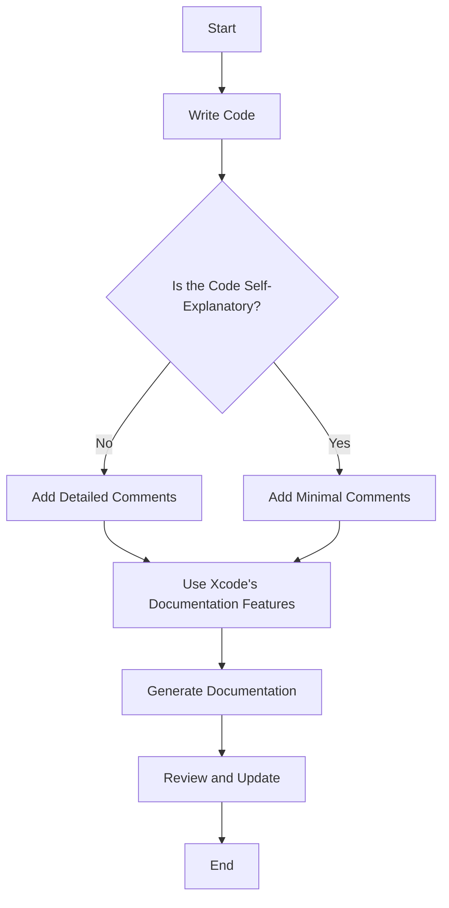

## 19.6 Documentation and Commenting

In the world of software development, documentation and commenting are essential practices that ensure code is understandable, maintainable, and accessible to other developers. This section will delve into the art of documenting Swift code effectively, utilizing tools like Markdown and Xcode's documentation features, and finding the right balance between code comments and self-explanatory code.

### The Importance of Documentation and Commenting

Documentation serves as a bridge between the code and its users, whether they are developers, testers, or end-users. It provides context, explains complex logic, and serves as a reference for future development. Commenting, on the other hand, is the practice of adding explanatory notes within the code itself. Together, they enhance code readability and facilitate collaboration among team members.

#### Key Benefits of Documentation and Commenting

- **Improved Readability:** Clear documentation and comments make it easier for others (and your future self) to understand the code.
- **Easier Maintenance:** Well-documented code is easier to debug, extend, and maintain.
- **Knowledge Transfer:** Documentation helps new team members get up to speed quickly.
- **Reduced Risk of Errors:** Clear explanations reduce the likelihood of misinterpretation and errors.

### Utilizing Markdown for Documentation

Markdown is a lightweight markup language with plain-text formatting syntax. It is widely used for writing documentation due to its simplicity and readability. In Swift development, Markdown can be used to create README files, API documentation, and more.

#### Basic Markdown Syntax

Markdown is intuitive and easy to learn. Here are some basic elements:

- **Headings:** Use `#` for headings. More `#` symbols indicate smaller headings.
  ```markdown
  # Heading 1
  ## Heading 2
  ### Heading 3
  ```

- **Lists:** Use `-` or `*` for unordered lists, and numbers for ordered lists.
  ```markdown
  - Item 1
  - Item 2
    - Subitem 2.1
  ```

- **Links:** Create links using `[text](URL)`.
  ```markdown
  [Swift Documentation](https://swift.org/documentation/)
  ```

- **Code Blocks:** Use backticks for inline code and triple backticks for code blocks.
  ```markdown
  `let example = "Swift"`
  
  ```swift
  let example = "Swift"
  ```
  ```

#### Creating Effective Documentation with Markdown

To create effective documentation, follow these guidelines:

- **Be Concise:** Keep descriptions short and to the point.
- **Use Examples:** Include code snippets to illustrate concepts.
- **Organize Content:** Use headings and lists to structure information logically.
- **Update Regularly:** Ensure documentation is kept up-to-date with code changes.

### Leveraging Xcode's Documentation Features

Xcode, Apple's integrated development environment (IDE) for Swift, offers robust documentation features that streamline the process of documenting code.

#### Xcode's Quick Help

Xcode's Quick Help feature provides instant access to documentation for Swift symbols. To use Quick Help effectively:

- **Add Documentation Comments:** Use triple slashes (`///`) to add documentation comments above functions, classes, and other declarations.
  ```swift
  /// Calculates the factorial of a number.
  ///
  /// - Parameter number: The number to calculate the factorial for.
  /// - Returns: The factorial of the given number.
  func factorial(of number: Int) -> Int {
      return (1...number).reduce(1, *)
  }
  ```

- **Use Markup:** Enhance comments with Markdown-like syntax for better readability.
- **Access Quick Help:** Hover over a symbol and press `Option` to view its documentation.

#### Generating Documentation with Xcode

Xcode can generate documentation from your code comments. This feature is particularly useful for creating API documentation.

- **Enable Documentation Generation:** In Xcode, navigate to Product > Build Documentation to generate documentation from your comments.
- **Review Generated Documentation:** Ensure that the generated documentation is clear and accurate.

### Balancing Code Comments with Self-Explanatory Code

While comments are valuable, it's important to strike a balance between commenting and writing self-explanatory code. Over-commenting can clutter the code, while under-commenting can leave readers confused.

#### Writing Self-Explanatory Code

- **Use Descriptive Names:** Choose meaningful names for variables, functions, and classes.
  ```swift
  let maxLoginAttempts = 3
  ```

- **Follow Swift Naming Conventions:** Adhere to Swift's naming conventions for consistency.
- **Refactor Complex Logic:** Break down complex logic into smaller, well-named functions.

#### When to Comment

- **Explain Why, Not What:** Focus on explaining the reasoning behind a piece of code rather than what it does.
- **Clarify Complex Logic:** Add comments to clarify complex algorithms or non-intuitive code.
- **Document Assumptions and Limitations:** Note any assumptions or limitations that are not immediately obvious.

### Code Example: Documenting a Swift Class

Let's explore a practical example of documenting a Swift class using the techniques discussed.

```swift
import Foundation

/// Represents a bank account with basic operations.
///
/// The `BankAccount` class provides methods to deposit and withdraw funds,
/// as well as to check the current balance.
class BankAccount {
    /// The current balance of the account.
    private(set) var balance: Double
    
    /// Creates a new bank account with an initial balance.
    ///
    /// - Parameter initialBalance: The initial balance of the account.
    init(initialBalance: Double) {
        self.balance = initialBalance
    }
    
    /// Deposits a specified amount into the account.
    ///
    /// - Parameter amount: The amount to deposit.
    func deposit(amount: Double) {
        balance += amount
    }
    
    /// Withdraws a specified amount from the account.
    ///
    /// - Parameter amount: The amount to withdraw.
    /// - Throws: An error if the withdrawal amount exceeds the current balance.
    func withdraw(amount: Double) throws {
        guard amount <= balance else {
            throw BankAccountError.insufficientFunds
        }
        balance -= amount
    }
}

/// Errors that can occur during bank account operations.
enum BankAccountError: Error {
    case insufficientFunds
}
```

### Try It Yourself

To deepen your understanding, try modifying the `BankAccount` class:

- **Add a method to transfer funds between two accounts.**
- **Document the new method using the techniques discussed.**

### Visualizing Documentation Workflow

To better understand the documentation workflow, let's visualize the process using a flowchart.



**Description:** This flowchart illustrates the process of writing code, assessing its clarity, adding comments, using Xcode's documentation features, generating documentation, and reviewing it.

### References and Links

- [Swift Documentation](https://swift.org/documentation/)
- [Markdown Guide](https://www.markdownguide.org/)
- [Xcode Documentation](https://developer.apple.com/documentation/xcode)

### Knowledge Check

- **What are the key benefits of documentation and commenting?**
- **How can Markdown be used in Swift development?**
- **What is the purpose of Xcode's Quick Help feature?**
- **When should you add comments to your code?**

### Embrace the Journey

Remember, mastering documentation and commenting is an ongoing journey. As you continue to develop your skills, you'll find that clear, well-documented code not only benefits others but also enhances your own understanding and efficiency. Keep experimenting, stay curious, and enjoy the process of creating maintainable and accessible Swift code!

## Quiz Time!



### What is the primary purpose of documentation in software development?

- [x] To provide context and explain complex logic
- [ ] To replace the need for comments
- [ ] To make code run faster
- [ ] To reduce the size of the codebase

> **Explanation:** Documentation provides context and explains complex logic, making code more understandable and maintainable.

### Which markup language is commonly used for writing documentation in Swift development?

- [ ] HTML
- [x] Markdown
- [ ] XML
- [ ] LaTeX

> **Explanation:** Markdown is a lightweight markup language commonly used for writing documentation due to its simplicity and readability.

### What is the function of Xcode's Quick Help feature?

- [ ] To compile code faster
- [x] To provide instant access to documentation for Swift symbols
- [ ] To debug code
- [ ] To optimize performance

> **Explanation:** Xcode's Quick Help feature provides instant access to documentation for Swift symbols, enhancing code readability.

### When should you add comments to your code?

- [x] To explain complex algorithms
- [ ] To restate what the code does
- [ ] To make code longer
- [ ] To replace variable names

> **Explanation:** Comments should be added to explain complex algorithms and clarify non-intuitive code.

### What is a benefit of using descriptive names in code?

- [x] Improves code readability
- [ ] Makes code run faster
- [ ] Reduces the need for documentation
- [ ] Increases code size

> **Explanation:** Descriptive names improve code readability by making the code self-explanatory.

### What is the recommended practice for documenting assumptions in code?

- [x] Add comments to note assumptions
- [ ] Ignore assumptions
- [ ] Use cryptic variable names
- [ ] Write assumptions in a separate document

> **Explanation:** Documenting assumptions in comments helps clarify the code's intent and any limitations.

### How can you enhance comments in Xcode?

- [x] Use Markdown-like syntax
- [ ] Use HTML tags
- [ ] Use XML annotations
- [ ] Use LaTeX equations

> **Explanation:** Using Markdown-like syntax in Xcode comments enhances readability and structure.

### What is the purpose of generating documentation in Xcode?

- [x] To create API documentation from code comments
- [ ] To compile code faster
- [ ] To reduce code size
- [ ] To debug code

> **Explanation:** Generating documentation in Xcode creates API documentation from code comments, providing a reference for developers.

### What is the key consideration when balancing comments and self-explanatory code?

- [x] Explain why, not what
- [ ] Add comments everywhere
- [ ] Avoid comments entirely
- [ ] Use comments to restate code

> **Explanation:** Focus on explaining the reasoning behind the code (why), not what the code does, to maintain clarity.

### True or False: Over-commenting can clutter the code.

- [x] True
- [ ] False

> **Explanation:** Over-commenting can clutter the code, making it harder to read and maintain.


