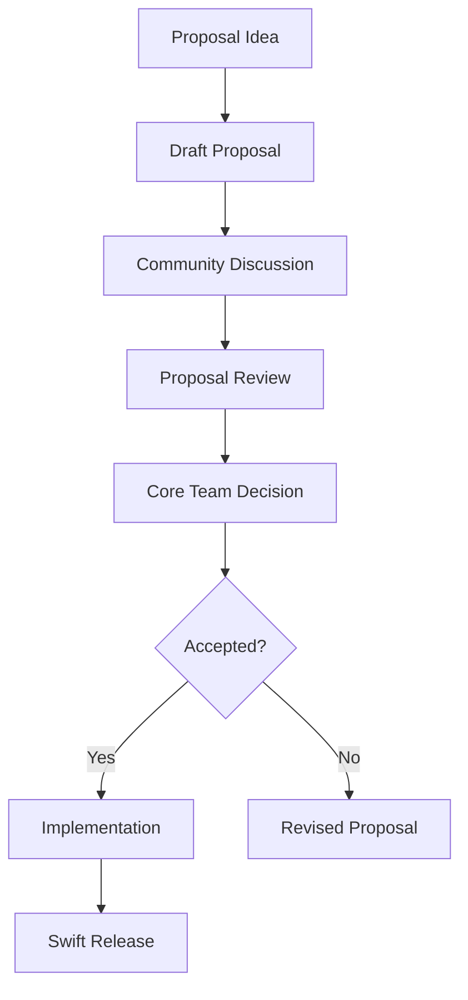

## 19.7 Staying Updated with Swift Evolution

In the ever-evolving landscape of software development, staying updated with the latest advancements is crucial for maintaining robust and efficient codebases. Swift, Apple's powerful and intuitive programming language, is no exception. The Swift Evolution process is a community-driven initiative that continuously enhances the language, introducing new features and improvements. In this section, we will explore how to stay updated with Swift Evolution, understand new proposals, and adapt your codebase to leverage these advancements effectively.

### Understanding Swift Evolution

Swift Evolution is a collaborative process where the Swift community proposes, discusses, and implements changes to the Swift language. This process ensures that Swift remains modern, efficient, and aligned with the needs of developers. Here's how you can engage with Swift Evolution:

1. **Follow the Swift Evolution Repository**: The [Swift Evolution GitHub repository](https://github.com/apple/swift-evolution) is the central hub for all proposals and discussions. By following this repository, you can stay informed about ongoing proposals and participate in discussions.

2. **Join the Swift Forums**: The [Swift Forums](https://forums.swift.org/) provide a platform for developers to discuss proposals, share feedback, and collaborate on Swift's future. Engaging in these forums allows you to contribute your insights and stay updated with community-driven changes.

3. **Read the Swift Evolution Proposals**: Each proposal is documented in detail, outlining the motivation, design, and impact of the proposed change. By reading these proposals, you can gain a deep understanding of the changes and their implications for your codebase.

4. **Subscribe to Swift Evolution Announcements**: Stay informed about the latest changes and decisions by subscribing to Swift Evolution announcements. This will ensure that you receive timely updates on accepted proposals and upcoming changes.

### Exploring New Proposals and Features

Swift Evolution proposals introduce a wide range of features and improvements, from language syntax enhancements to new standard library additions. Let's explore some key areas where new proposals can impact your Swift development:

#### Language Syntax Enhancements

Swift Evolution often introduces syntax enhancements that simplify code and improve readability. For example, the introduction of [Result Builders](https://github.com/apple/swift-evolution/blob/main/proposals/0289-result-builders.md) allows for more expressive and concise code, particularly in DSLs (Domain-Specific Languages) like SwiftUI.

```swift
@resultBuilder
struct ArrayBuilder {
    static func buildBlock(_ components: Int...) -> [Int] {
        return components
    }
}

let numbers: [Int] = ArrayBuilder.build {
    1
    2
    3
    4
}

print(numbers) // Output: [1, 2, 3, 4]
```

In this example, the `ArrayBuilder` result builder simplifies the construction of an array, making the code more expressive and easier to read.

#### Standard Library Additions

New proposals often introduce additions to the Swift Standard Library, providing developers with powerful tools for common tasks. For instance, the introduction of [Async/Await](https://github.com/apple/swift-evolution/blob/main/proposals/0296-async-await.md) revolutionized asynchronous programming in Swift, making it more intuitive and manageable.

```swift
func fetchData() async throws -> Data {
    let url = URL(string: "https://api.example.com/data")!
    let (data, _) = try await URLSession.shared.data(from: url)
    return data
}

Task {
    do {
        let data = try await fetchData()
        print("Data received: \\(data)")
    } catch {
        print("Error fetching data: \\(error)")
    }
}
```

This example demonstrates how `async` and `await` streamline asynchronous code, improving readability and error handling.

#### Performance Improvements

Swift Evolution proposals also focus on performance improvements, optimizing the language for better efficiency. For example, the introduction of [Opaque Result Types](https://github.com/apple/swift-evolution/blob/main/proposals/0244-opaque-result-types.md) allows functions to return types without exposing their concrete implementation, improving abstraction and performance.

```swift
protocol Shape {
    func area() -> Double
}

struct Circle: Shape {
    var radius: Double
    func area() -> Double {
        return .pi * radius * radius
    }
}

struct Square: Shape {
    var side: Double
    func area() -> Double {
        return side * side
    }
}

func makeShape() -> some Shape {
    return Circle(radius: 5)
}

let shape = makeShape()
print("Area: \\(shape.area())") // Output: Area: 78.53981633974483
```

In this example, the `makeShape` function returns an opaque result type, allowing for flexibility in implementation while maintaining performance.

### Adapting Codebases to Leverage Improvements

Adapting your codebase to leverage new Swift features can enhance performance, readability, and maintainability. Here are some strategies to effectively integrate Swift Evolution changes into your projects:

1. **Conduct a Code Audit**: Regularly review your codebase to identify areas where new Swift features can be applied. Look for opportunities to replace outdated patterns with modern, efficient constructs.

2. **Refactor Incrementally**: Introduce new features incrementally to minimize disruption. Focus on one section of the codebase at a time, ensuring that changes are thoroughly tested and integrated smoothly.

3. **Leverage Automated Tools**: Utilize automated tools and linters to identify and apply Swift Evolution changes. Tools like SwiftLint can help enforce coding standards and highlight areas for improvement.

4. **Stay Informed and Educated**: Continuously educate yourself and your team about new Swift features and best practices. Attend conferences, workshops, and online courses to stay updated with the latest advancements.

### Visualizing Swift Evolution

To better understand the Swift Evolution process and its impact on your development workflow, let's visualize the journey of a Swift Evolution proposal from inception to implementation.



**Figure 1**: This flowchart illustrates the typical journey of a Swift Evolution proposal, from the initial idea to its implementation in a Swift release.

### Engaging with the Swift Community

Staying updated with Swift Evolution is not just about following proposals; it's also about engaging with the vibrant Swift community. Here are some ways to actively participate:

- **Contribute to Discussions**: Share your insights and feedback on proposals in the Swift Forums. Engaging in discussions helps shape the future of Swift and ensures that your voice is heard.

- **Attend Swift Events**: Participate in Swift conferences, meetups, and workshops to connect with fellow developers and learn about the latest trends and innovations.

- **Contribute to Open Source**: Contribute to Swift-related open-source projects to gain hands-on experience with new features and collaborate with other developers.

### Knowledge Check

Before we wrap up, let's reinforce your understanding of staying updated with Swift Evolution:

- **What is the Swift Evolution process, and how can you participate?**
- **How can new Swift proposals impact your codebase?**
- **What strategies can you use to adapt your codebase to leverage new Swift features?**

### Embrace the Journey

Remember, staying updated with Swift Evolution is an ongoing journey. As you continue to learn and adapt, you'll build more efficient, scalable, and modern applications. Keep experimenting, stay curious, and enjoy the process of mastering Swift development.

## Quiz Time!



### What is the primary purpose of the Swift Evolution process?

- [x] To propose, discuss, and implement changes to the Swift language.
- [ ] To provide a platform for developers to share their Swift projects.
- [ ] To manage Swift's version control system.
- [ ] To create Swift tutorials for beginners.

> **Explanation:** The Swift Evolution process is a community-driven initiative to propose, discuss, and implement changes to the Swift language.

### How can you stay informed about ongoing Swift Evolution proposals?

- [x] Follow the Swift Evolution GitHub repository.
- [x] Join the Swift Forums.
- [ ] Subscribe to Swift's official YouTube channel.
- [ ] Read Swift-related blog posts.

> **Explanation:** Following the Swift Evolution GitHub repository and joining the Swift Forums are effective ways to stay informed about ongoing proposals.

### What is a key benefit of using result builders in Swift?

- [x] They allow for more expressive and concise code.
- [ ] They improve the performance of Swift applications.
- [ ] They enable asynchronous programming.
- [ ] They enhance error handling in Swift.

> **Explanation:** Result builders allow for more expressive and concise code, particularly in DSLs like SwiftUI.

### Which Swift feature revolutionized asynchronous programming?

- [x] Async/Await
- [ ] Result Builders
- [ ] Opaque Result Types
- [ ] Protocol Extensions

> **Explanation:** Async/Await revolutionized asynchronous programming in Swift, making it more intuitive and manageable.

### What is the role of opaque result types in Swift?

- [x] To allow functions to return types without exposing their concrete implementation.
- [ ] To enable asynchronous programming.
- [ ] To simplify error handling.
- [ ] To improve code readability.

> **Explanation:** Opaque result types allow functions to return types without exposing their concrete implementation, improving abstraction and performance.

### How can you adapt your codebase to leverage new Swift features?

- [x] Conduct a code audit.
- [x] Refactor incrementally.
- [ ] Ignore outdated patterns.
- [ ] Avoid using automated tools.

> **Explanation:** Conducting a code audit and refactoring incrementally are effective strategies for adapting your codebase to leverage new Swift features.

### What is a benefit of engaging with the Swift community?

- [x] Shaping the future of Swift.
- [x] Connecting with fellow developers.
- [ ] Avoiding code reviews.
- [ ] Reducing development costs.

> **Explanation:** Engaging with the Swift community helps shape the future of Swift and allows you to connect with fellow developers.

### What does the Swift Evolution flowchart illustrate?

- [x] The journey of a Swift Evolution proposal from inception to implementation.
- [ ] The process of writing Swift code.
- [ ] The lifecycle of a Swift application.
- [ ] The steps to deploy a Swift project.

> **Explanation:** The Swift Evolution flowchart illustrates the journey of a proposal from inception to implementation.

### What is a key takeaway from staying updated with Swift Evolution?

- [x] Building more efficient, scalable, and modern applications.
- [ ] Avoiding the use of new Swift features.
- [ ] Focusing solely on legacy code.
- [ ] Ignoring community feedback.

> **Explanation:** Staying updated with Swift Evolution helps you build more efficient, scalable, and modern applications.

### True or False: Engaging with Swift Evolution is a one-time task.

- [ ] True
- [x] False

> **Explanation:** Engaging with Swift Evolution is an ongoing journey that requires continuous learning and adaptation.




