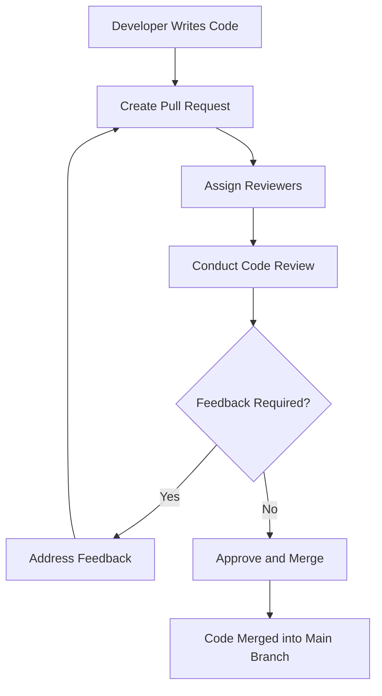

## 19.8 Code Reviews and Collaborative Development

In the realm of software development, especially within the Swift ecosystem, code reviews and collaborative development are pivotal practices that ensure the production of high-quality, maintainable, and scalable code. This section delves into the intricacies of implementing effective code review processes, fostering team collaboration and knowledge sharing, and utilizing tools that facilitate these practices.

### Understanding Code Reviews

Code reviews are a systematic examination of software source code by one or more individuals other than the author. The primary objectives of code reviews are to identify bugs, improve code quality, enhance readability, and ensure adherence to coding standards.

#### Benefits of Code Reviews

1. **Improved Code Quality**: Code reviews help catch errors and bugs that might have been overlooked by the original developer.
2. **Knowledge Sharing**: They provide an opportunity for team members to learn from each other, fostering a culture of continuous learning.
3. **Consistency**: Reviews ensure that the codebase remains consistent with the team's coding standards and best practices.
4. **Reduced Technical Debt**: By addressing issues early, code reviews help prevent the accumulation of technical debt.

### Implementing Effective Code Review Processes

To maximize the benefits of code reviews, it is essential to implement them effectively. Here are some strategies:

#### Define Clear Guidelines

Establish clear guidelines for what should be covered during a code review. This includes coding standards, architectural guidelines, and specific areas of focus such as performance and security.

#### Use Checklists

Checklists can help reviewers focus on key areas and ensure consistency across reviews. A typical checklist might include items such as:

- Are variable names meaningful and consistent?
- Is the code free of unnecessary complexity?
- Are error handling and edge cases adequately addressed?

#### Set a Reasonable Scope

Avoid overwhelming reviewers by setting a reasonable scope for each review. A good rule of thumb is to limit reviews to 200-400 lines of code.

#### Encourage Constructive Feedback

Feedback should be constructive and aimed at improving the code, not criticizing the developer. Encourage reviewers to ask questions and provide suggestions rather than directives.

#### Foster a Culture of Respect

Create an environment where developers feel comfortable both giving and receiving feedback. This involves respecting each other's opinions and being open to different perspectives.

### Encouraging Team Collaboration and Knowledge Sharing

Collaboration and knowledge sharing are essential components of a successful development team. Here are some ways to foster these practices:

#### Regular Team Meetings

Hold regular team meetings to discuss ongoing projects, share insights, and address any challenges. These meetings can also be used to review code collectively and discuss best practices.

#### Pair Programming

Pair programming involves two developers working together on the same code. This practice not only improves code quality but also facilitates knowledge sharing and collaboration.

#### Documentation

Encourage developers to document their code and processes. Well-documented code is easier to understand and maintain, and it serves as a valuable resource for new team members.

#### Mentorship Programs

Establish mentorship programs where experienced developers guide and support less experienced team members. This helps in skill development and fosters a sense of community within the team.

### Tools to Facilitate Code Reviews and Version Control

Several tools can facilitate code reviews and version control, making the process more efficient and effective.

#### Version Control Systems

Version control systems like Git are essential for collaborative development. They allow multiple developers to work on the same codebase simultaneously and track changes over time.

- **GitHub**: A popular platform that provides tools for code review, issue tracking, and project management.
- **GitLab**: Offers similar features to GitHub, with additional support for continuous integration and deployment.
- **Bitbucket**: Integrates with Jira for project management and provides robust code review tools.

#### Code Review Tools

- **Crucible**: A collaborative code review tool that integrates with other Atlassian products like Jira and Bitbucket.
- **Review Board**: An open-source tool that supports multiple version control systems and provides a web-based interface for code reviews.
- **Phabricator**: A suite of tools for code review, project management, and more, developed by Facebook.

#### Continuous Integration and Continuous Deployment (CI/CD)

CI/CD tools automate the process of integrating code changes and deploying them to production. They help ensure that code is tested and reviewed before being deployed.

- **Jenkins**: An open-source automation server that supports building, deploying, and automating any project.
- **CircleCI**: A CI/CD tool that integrates with GitHub and Bitbucket, providing automated testing and deployment.
- **Travis CI**: A CI service used to build and test software projects hosted on GitHub.

### Code Review Workflow

A well-defined workflow is crucial for effective code reviews. Here's a typical workflow:

1. **Create a Pull Request**: The developer creates a pull request (PR) for the code they want to merge into the main branch.
2. **Assign Reviewers**: The PR is assigned to one or more reviewers who will examine the code.
3. **Conduct the Review**: Reviewers examine the code, provide feedback, and request changes if necessary.
4. **Address Feedback**: The developer addresses the feedback and updates the PR.
5. **Approve and Merge**: Once the reviewers are satisfied, they approve the PR, and it is merged into the main branch.

### Code Review Best Practices

To ensure that code reviews are effective, consider the following best practices:

- **Review Early and Often**: Conduct reviews as soon as possible after code is written to catch issues early.
- **Keep Reviews Small**: Focus on small, manageable chunks of code to avoid overwhelming reviewers.
- **Automate Where Possible**: Use tools to automate repetitive tasks, such as checking for coding standards violations.
- **Encourage Open Communication**: Foster an environment where team members feel comfortable discussing code and providing feedback.

### Try It Yourself

To get hands-on experience with code reviews, try the following exercise:

1. Set up a Git repository and create a simple Swift project.
2. Write a small feature or fix a bug and commit your changes.
3. Create a pull request and invite a colleague to review your code.
4. Use a code review tool like GitHub or GitLab to conduct the review.
5. Address the feedback, make the necessary changes, and merge the pull request.

### Visualizing Code Review Workflow

To better understand the code review process, let's visualize it using a flowchart:

### Knowledge Check

Before moving on, let's reinforce what we've learned with a few questions:

- What are the primary objectives of code reviews?
- How can checklists improve the code review process?
- Why is it important to foster a culture of respect during code reviews?
- What are some tools that facilitate code reviews and version control?
- How does pair programming contribute to collaborative development?

### Conclusion

Code reviews and collaborative development are essential practices for producing high-quality software. By implementing effective code review processes, encouraging team collaboration, and utilizing the right tools, you can enhance your development workflow and ensure the success of your projects. Remember, this is just the beginning. As you continue to explore and refine these practices, you'll build more efficient and effective development teams. Keep experimenting, stay curious, and enjoy the journey!

## Quiz Time!



### What is the primary objective of code reviews?

- [x] To improve code quality and catch errors
- [ ] To increase the number of lines of code
- [ ] To reduce the number of developers needed
- [ ] To make the code more complex

> **Explanation:** The primary objective of code reviews is to improve code quality and catch errors that might have been overlooked by the original developer.

### Which tool is commonly used for version control in collaborative development?

- [x] Git
- [ ] Microsoft Word
- [ ] PowerPoint
- [ ] Excel

> **Explanation:** Git is a widely used version control system that allows multiple developers to work on the same codebase simultaneously and track changes over time.

### What is a benefit of pair programming?

- [x] It facilitates knowledge sharing
- [ ] It doubles the time needed to write code
- [ ] It reduces code quality
- [ ] It eliminates the need for code reviews

> **Explanation:** Pair programming facilitates knowledge sharing by allowing two developers to work together on the same code, improving code quality and collaboration.

### What is a key component of effective code reviews?

- [x] Providing constructive feedback
- [ ] Criticizing the developer
- [ ] Ignoring coding standards
- [ ] Focusing on the number of lines changed

> **Explanation:** Providing constructive feedback is a key component of effective code reviews, as it helps improve the code and fosters a positive team environment.

### What should be included in a code review checklist?

- [x] Meaningful variable names
- [ ] The number of lines of code
- [ ] The developer's personal preferences
- [ ] The color of the code editor

> **Explanation:** A code review checklist should include items like meaningful variable names to ensure code readability and maintainability.

### Which platform provides tools for code review, issue tracking, and project management?

- [x] GitHub
- [ ] Microsoft Word
- [ ] PowerPoint
- [ ] Excel

> **Explanation:** GitHub is a popular platform that provides tools for code review, issue tracking, and project management, making it a valuable resource for collaborative development.

### What is a typical scope for a code review?

- [x] 200-400 lines of code
- [ ] 1000-2000 lines of code
- [ ] 10,000 lines of code
- [ ] The entire codebase

> **Explanation:** A typical scope for a code review is 200-400 lines of code to avoid overwhelming reviewers and ensure a thorough examination.

### How can automation benefit the code review process?

- [x] By automating repetitive tasks
- [ ] By replacing human reviewers
- [ ] By increasing the number of bugs
- [ ] By making the code more complex

> **Explanation:** Automation can benefit the code review process by automating repetitive tasks, such as checking for coding standards violations, allowing reviewers to focus on more critical aspects of the code.

### What is the role of continuous integration in code reviews?

- [x] To automate testing and deployment
- [ ] To replace human reviewers
- [ ] To increase the number of bugs
- [ ] To make the code more complex

> **Explanation:** Continuous integration automates testing and deployment, ensuring that code is tested and reviewed before being deployed, which enhances the code review process.

### True or False: Code reviews should be conducted as soon as possible after code is written.

- [x] True
- [ ] False

> **Explanation:** Code reviews should be conducted as soon as possible after code is written to catch issues early and prevent them from becoming more significant problems.


