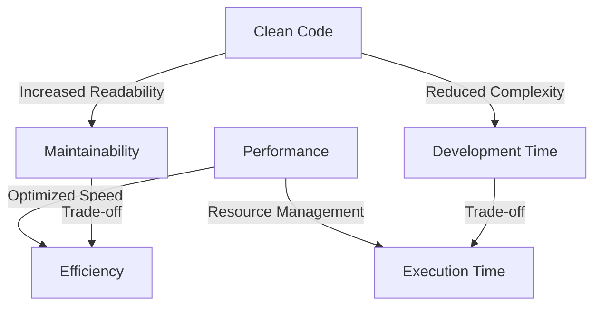

## 19.9 Balancing Performance with Clean Code

In the realm of software development, particularly in Swift, achieving a balance between performance and clean code is crucial. As developers, we often face the challenge of writing code that is both efficient and maintainable. This section delves into strategies for balancing these two critical aspects, providing insights and practical examples to guide you in developing robust Swift applications.

### Understanding the Trade-offs

Before we dive into specific strategies, it's essential to understand the inherent trade-offs between performance and clean code. Clean code is characterized by readability, simplicity, and maintainability, while performance focuses on optimizing speed and resource usage. Striking a balance between these can be challenging, as optimizing for one often impacts the other.

#### Key Considerations

- **Readability vs. Complexity**: Clean code is easy to read and understand, but performance optimizations can introduce complexity.
- **Maintainability vs. Efficiency**: Maintainable code is easy to modify and extend, while efficient code may require intricate optimizations that are harder to maintain.
- **Development Time vs. Execution Time**: Clean code can reduce development time by making it easier to debug and extend, whereas performance optimizations can reduce execution time but increase development complexity.

### Prioritizing Optimization

Knowing when to prioritize optimization is crucial. Premature optimization can lead to over-complicated code with marginal performance gains. Follow these guidelines to determine when optimization is necessary:

1. **Identify Bottlenecks**: Use profiling tools to identify actual performance bottlenecks in your application. Focus on optimizing these areas rather than guessing where improvements are needed.

2. **Set Performance Goals**: Define clear performance goals based on user requirements and application context. This will help you determine the level of optimization needed.

3. **Evaluate Impact**: Consider the impact of optimization on code readability and maintainability. Aim for optimizations that provide significant performance improvements with minimal complexity.

### Code Examples

Let's look at some code examples to illustrate the balance between performance and clean code in Swift.

#### Example 1: Loop Optimization

Consider a scenario where you need to process a large array of data. A common optimization technique is to use Swift's `map`, `filter`, and `reduce` functions, which are both performant and expressive.

```swift
// Original code: Using a for loop
var result = [Int]()
for number in numbers {
    if number % 2 == 0 {
        result.append(number * 2)
    }
}

// Optimized code: Using map and filter
let result = numbers.filter { $0 % 2 == 0 }.map { $0 * 2 }
```

In this example, using `filter` and `map` not only improves performance by leveraging Swift's functional programming capabilities but also enhances code readability.

#### Example 2: Lazy Loading

Lazy loading is a technique that delays the initialization of an object until it is needed, improving performance by reducing unnecessary computations.

```swift
// Original code: Eager initialization
class DataManager {
    let data = loadData()

    func loadData() -> [String] {
        // Simulate data loading
        return ["Data1", "Data2", "Data3"]
    }
}

// Optimized code: Lazy initialization
class DataManager {
    lazy var data: [String] = {
        return loadData()
    }()

    func loadData() -> [String] {
        // Simulate data loading
        return ["Data1", "Data2", "Data3"]
    }
}
```

By using the `lazy` keyword, the `data` property is only initialized when accessed, saving resources if it's never needed.

### Avoiding Over-Complication

While optimization is important, it's crucial to avoid over-complicating code for marginal gains. Here are some strategies to maintain clean code:

1. **Refactor Regularly**: Regular refactoring helps keep code clean and maintainable. It allows you to introduce optimizations without sacrificing readability.

2. **Use Design Patterns**: Design patterns provide proven solutions to common problems, helping you write clean and efficient code. For example, using the Singleton pattern can help manage shared resources efficiently.

3. **Leverage Swift Features**: Swift offers features like optionals, type inference, and protocol-oriented programming that can help you write clean and performant code.

### Visualizing the Balance

To better understand the balance between performance and clean code, let's visualize the trade-offs using a simple diagram.



This diagram illustrates how clean code and performance optimizations intersect and the trade-offs involved in balancing them.

### Best Practices

To achieve a balance between performance and clean code, consider the following best practices:

- **Profile First**: Use profiling tools to identify performance bottlenecks before optimizing.
- **Measure Impact**: Quantify the impact of optimizations on both performance and code quality.
- **Document Changes**: Clearly document any optimizations to help future developers understand the code.
- **Test Thoroughly**: Ensure that optimizations do not introduce bugs or regressions by writing comprehensive tests.

### Swift Unique Features

Swift offers unique features that can help balance performance and clean code:

- **Value Types**: Use structs and enums for value types to improve performance and maintainability.
- **Protocol Extensions**: Leverage protocol extensions to add functionality without cluttering your codebase.
- **Generics**: Use generics to write reusable and type-safe code, reducing redundancy and enhancing performance.

### Differences and Similarities

It's important to recognize the differences and similarities between clean code and performance optimizations:

- **Similarities**: Both aim to improve the quality of the software, albeit in different ways.
- **Differences**: Clean code focuses on readability and maintainability, while performance optimizations focus on execution speed and resource management.

### Try It Yourself

To practice balancing performance and clean code, try modifying the provided code examples. Experiment with different optimizations and observe their impact on code readability and performance.

### Knowledge Check

- **What are the key trade-offs between clean code and performance?**
- **How can lazy loading improve performance?**
- **Why is it important to profile before optimizing?**

### Embrace the Journey

Remember, achieving a balance between performance and clean code is a continuous journey. As you progress, you'll develop a deeper understanding of when and how to optimize your code. Keep experimenting, stay curious, and enjoy the journey!

## Quiz Time!



### What is a primary benefit of clean code?

- [x] Improved readability and maintainability
- [ ] Faster execution speed
- [ ] Reduced memory usage
- [ ] Increased complexity

> **Explanation:** Clean code is primarily focused on improving readability and maintainability, making it easier to understand and modify.

### When should you prioritize optimization?

- [x] After identifying performance bottlenecks
- [ ] At the beginning of development
- [ ] After code refactoring
- [ ] When the code is difficult to read

> **Explanation:** Optimization should be prioritized after identifying performance bottlenecks to ensure that efforts are focused on areas that will have the most impact.

### What is a potential downside of premature optimization?

- [x] Increased code complexity
- [ ] Improved readability
- [ ] Faster development time
- [ ] Reduced execution time

> **Explanation:** Premature optimization can lead to increased code complexity without significant performance gains.

### How does lazy loading improve performance?

- [x] By delaying initialization until needed
- [ ] By increasing memory usage
- [ ] By reducing code readability
- [ ] By executing code faster

> **Explanation:** Lazy loading improves performance by delaying the initialization of an object until it is actually needed, saving resources if it is never used.

### Which Swift feature helps in writing clean and performant code?

- [x] Protocol extensions
- [ ] Forced unwrapping
- [ ] Global variables
- [ ] Nested loops

> **Explanation:** Protocol extensions in Swift help add functionality without cluttering the codebase, contributing to both clean and performant code.

### What should you do before optimizing your code?

- [x] Profile the application
- [ ] Refactor the code
- [ ] Write documentation
- [ ] Increase code comments

> **Explanation:** Profiling the application helps identify the actual performance bottlenecks, ensuring that optimization efforts are focused and effective.

### What is the focus of performance optimization?

- [x] Execution speed and resource management
- [ ] Code readability
- [ ] Development time
- [ ] Code maintainability

> **Explanation:** Performance optimization focuses on improving execution speed and managing resources efficiently.

### What is a trade-off of focusing too much on performance?

- [x] Reduced code readability
- [ ] Increased development time
- [ ] Improved maintainability
- [ ] Simplified code structure

> **Explanation:** Focusing too much on performance can lead to reduced code readability and increased complexity.

### How can you maintain clean code while optimizing for performance?

- [x] Refactor regularly and use design patterns
- [ ] Avoid using Swift features
- [ ] Ignore code readability
- [ ] Focus solely on execution speed

> **Explanation:** Regular refactoring and using design patterns can help maintain clean code while optimizing for performance.

### True or False: Clean code and performance optimization are mutually exclusive.

- [ ] True
- [x] False

> **Explanation:** Clean code and performance optimization are not mutually exclusive; they can be balanced to achieve both maintainability and efficiency.


