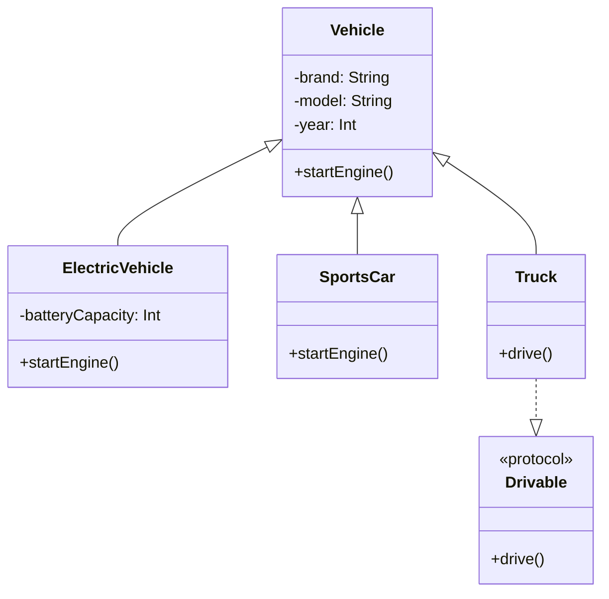

## 2.1 Object-Oriented Programming (OOP) Fundamentals in Swift

Object-Oriented Programming (OOP) is a programming paradigm that uses "objects" to design applications and computer programs. OOP in Swift is a powerful tool for organizing code in a way that is both intuitive and efficient. In this section, we will delve into the core concepts of OOP in Swift, including classes and objects, inheritance, encapsulation, and polymorphism. These concepts form the foundation of many design patterns and are essential for robust Swift development.

### Classes and Objects

In Swift, classes are one of the primary building blocks for object-oriented programming. A class defines a blueprint for objects, encapsulating data and behavior. Let's explore how to create and use classes in Swift.

#### Creating a Class

To define a class in Swift, use the `class` keyword followed by the class name and a pair of curly braces `{}`. Inside the braces, you can define properties and methods.

```swift
class Vehicle {
    var brand: String
    var model: String
    var year: Int

    init(brand: String, model: String, year: Int) {
        self.brand = brand
        self.model = model
        self.year = year
    }

    func startEngine() {
        print("Engine started for \\(brand) \\(model).")
    }
}
```

In this example, the `Vehicle` class has three properties: `brand`, `model`, and `year`. It also includes an initializer `init` to set these properties and a method `startEngine` to perform an action.

#### Creating an Object

An object is an instance of a class. You can create an object by calling the class's initializer.

```swift
let myCar = Vehicle(brand: "Toyota", model: "Corolla", year: 2020)
myCar.startEngine() // Output: Engine started for Toyota Corolla.
```

Here, `myCar` is an instance of the `Vehicle` class. We initialize it with specific values for the brand, model, and year.

### Inheritance

Inheritance allows a class to inherit properties and methods from another class. This promotes code reuse and establishes a hierarchical relationship between classes.

#### Defining a Subclass

To create a subclass, use the colon `:` followed by the superclass name.

```swift
class ElectricVehicle: Vehicle {
    var batteryCapacity: Int

    init(brand: String, model: String, year: Int, batteryCapacity: Int) {
        self.batteryCapacity = batteryCapacity
        super.init(brand: brand, model: model, year: year)
    }

    override func startEngine() {
        print("Electric engine started for \\(brand) \\(model).")
    }
}
```

In this example, `ElectricVehicle` is a subclass of `Vehicle`. It inherits all properties and methods from `Vehicle` and adds a new property `batteryCapacity`. The `startEngine` method is overridden to provide specific behavior for electric vehicles.

#### Using Subclass Instances

```swift
let myElectricCar = ElectricVehicle(brand: "Tesla", model: "Model S", year: 2021, batteryCapacity: 100)
myElectricCar.startEngine() // Output: Electric engine started for Tesla Model S.
```

The `myElectricCar` object is an instance of `ElectricVehicle`. It has access to properties and methods from both `ElectricVehicle` and `Vehicle`.

### Encapsulation

Encapsulation is the practice of restricting access to certain components of an object and only exposing what is necessary. Swift provides several access control levels to achieve encapsulation.

#### Access Control

Swift's access control model includes five levels: `open`, `public`, `internal`, `fileprivate`, and `private`.

- **Open/Public**: Accessible from any source file in the defining module or any module that imports the defining module.
- **Internal**: Accessible from any source file in the defining module (default access level).
- **Fileprivate**: Accessible from within the same source file.
- **Private**: Accessible only within the enclosing declaration.

```swift
class BankAccount {
    private var balance: Double = 0.0

    func deposit(amount: Double) {
        balance += amount
    }

    func withdraw(amount: Double) -> Bool {
        if amount <= balance {
            balance -= amount
            return true
        } else {
            return false
        }
    }

    func getBalance() -> Double {
        return balance
    }
}
```

In this example, the `balance` property is private, meaning it cannot be accessed directly from outside the `BankAccount` class. Instead, methods like `deposit`, `withdraw`, and `getBalance` are provided to interact with the balance safely.

### Polymorphism

Polymorphism allows objects to be treated as instances of their parent class. It enables a single interface to represent different underlying forms (data types).

#### Method Overriding

Method overriding is a form of polymorphism where a subclass provides a specific implementation of a method that is already defined in its superclass.

```swift
class SportsCar: Vehicle {
    override func startEngine() {
        print("Sports engine roars to life for \\(brand) \\(model).")
    }
}

let mySportsCar: Vehicle = SportsCar(brand: "Ferrari", model: "488", year: 2020)
mySportsCar.startEngine() // Output: Sports engine roars to life for Ferrari 488.
```

In this example, `mySportsCar` is declared as a `Vehicle` but is instantiated as a `SportsCar`. The overridden `startEngine` method in `SportsCar` is called, demonstrating polymorphism.

#### Protocols and Polymorphism

Protocols in Swift define a blueprint of methods, properties, and other requirements that suit a particular task or piece of functionality. Protocols can be adopted by classes, structs, and enums.

```swift
protocol Drivable {
    func drive()
}

class Truck: Vehicle, Drivable {
    func drive() {
        print("Driving a truck.")
    }
}

let myTruck: Drivable = Truck(brand: "Ford", model: "F-150", year: 2021)
myTruck.drive() // Output: Driving a truck.
```

In this example, `Truck` adopts the `Drivable` protocol, implementing the `drive` method. The `myTruck` object is treated as a `Drivable`, showcasing polymorphism through protocols.

### Visualizing OOP Concepts in Swift

To better understand the relationships and interactions between classes, subclasses, and protocols, let's visualize these concepts using a class diagram.



This diagram illustrates the inheritance hierarchy, with `Vehicle` as the superclass and `ElectricVehicle`, `SportsCar`, and `Truck` as subclasses. The `Drivable` protocol is adopted by `Truck`, demonstrating polymorphism through protocol conformance.

### Try It Yourself

To deepen your understanding of OOP in Swift, try modifying the code examples:

- Add a new subclass `Convertible` with a method `openRoof()`.
- Implement a protocol `Raceable` with a method `race()`, and have `SportsCar` conform to it.
- Experiment with access control by changing the visibility of properties and methods in the `Vehicle` class.

### References and Links

- [Swift Documentation on Classes and Structures](https://developer.apple.com/documentation/swift/classes_and_structures)
- [Swift Language Guide: Inheritance](https://developer.apple.com/documentation/swift/inheritance)
- [Swift Language Guide: Access Control](https://developer.apple.com/documentation/swift/access_control)

### Knowledge Check

Before moving on, let's reinforce what we've learned:

- What is the purpose of a class in Swift?
- How does inheritance promote code reuse?
- Why is encapsulation important in OOP?
- How does polymorphism enhance flexibility in code?

### Embrace the Journey

Remember, mastering OOP in Swift is a journey. As you continue to explore and apply these concepts, you'll find new ways to structure your code, making it more efficient and maintainable. Keep experimenting, stay curious, and enjoy the journey!

## Quiz Time!



### What is the primary purpose of a class in Swift?

- [x] To define a blueprint for creating objects
- [ ] To perform mathematical calculations
- [ ] To manage memory allocation
- [ ] To handle network requests

> **Explanation:** A class in Swift serves as a blueprint for creating objects, encapsulating data and behavior.

### How does inheritance promote code reuse in Swift?

- [x] By allowing a class to inherit properties and methods from another class
- [ ] By enabling multiple classes to share the same memory space
- [ ] By allowing functions to be reused across different modules
- [ ] By providing a way to execute code in parallel

> **Explanation:** Inheritance allows a class to inherit properties and methods from another class, promoting code reuse and reducing redundancy.

### What is encapsulation in the context of OOP?

- [x] The practice of restricting access to certain components of an object
- [ ] The process of converting an object into a string
- [ ] The ability to execute multiple tasks simultaneously
- [ ] The technique of compressing data for storage

> **Explanation:** Encapsulation involves restricting access to certain components of an object, exposing only what is necessary.

### Which access control level allows a property to be accessed only within the same source file?

- [ ] open
- [ ] public
- [ ] internal
- [x] fileprivate

> **Explanation:** The `fileprivate` access level restricts access to within the same source file.

### How does polymorphism enhance flexibility in code?

- [x] By allowing objects to be treated as instances of their parent class
- [ ] By enabling functions to execute faster
- [ ] By reducing the size of the compiled code
- [ ] By simplifying the syntax of the language

> **Explanation:** Polymorphism allows objects to be treated as instances of their parent class, enabling a single interface to represent different underlying forms.

### What is method overriding?

- [x] Providing a specific implementation of a method in a subclass
- [ ] Declaring a method with the same name in multiple classes
- [ ] Executing a method multiple times in a loop
- [ ] Creating a method without any parameters

> **Explanation:** Method overriding involves providing a specific implementation of a method in a subclass, which replaces the superclass's version.

### What is the role of protocols in Swift?

- [x] To define a blueprint of methods and properties for conforming types
- [ ] To manage memory allocation for objects
- [ ] To handle network requests and responses
- [ ] To perform mathematical calculations

> **Explanation:** Protocols define a blueprint of methods and properties that conforming types must implement, promoting code consistency and flexibility.

### Which keyword is used to create a subclass in Swift?

- [x] :
- [ ] extends
- [ ] inherits
- [ ] subclass

> **Explanation:** The colon `:` is used to create a subclass in Swift, indicating inheritance from a superclass.

### What is the benefit of using access control in Swift?

- [x] To protect data and ensure encapsulation
- [ ] To increase the speed of code execution
- [ ] To simplify the syntax of the language
- [ ] To reduce the size of the compiled code

> **Explanation:** Access control protects data by restricting access to certain components of an object, ensuring encapsulation.

### True or False: In Swift, a class can conform to multiple protocols.

- [x] True
- [ ] False

> **Explanation:** In Swift, a class can conform to multiple protocols, allowing it to implement multiple sets of methods and properties.






