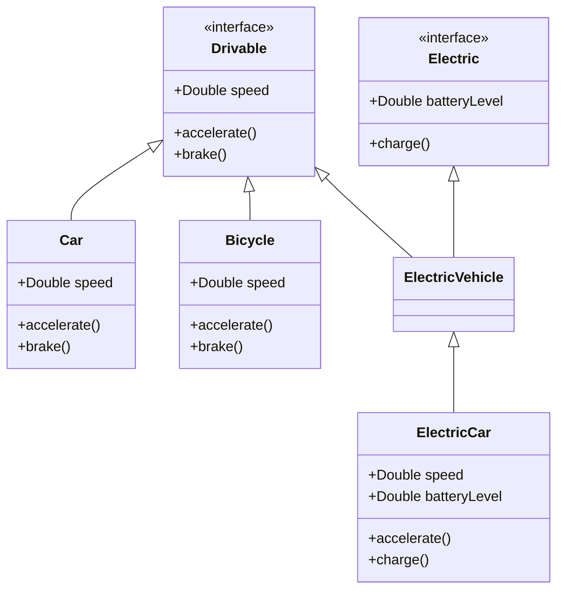

## 2.2 Protocol-Oriented Programming (POP)

Swift, Apple's powerful programming language, embraces a unique paradigm known as Protocol-Oriented Programming (POP). This approach is a cornerstone of Swift's design philosophy, offering developers a robust framework for building scalable, flexible, and reusable code. In this section, we delve into the core concepts of POP, explore its advantages, and provide practical examples to illustrate its application in real-world scenarios.

### Introduction to Protocol-Oriented Programming

Protocol-Oriented Programming is a paradigm that emphasizes the use of protocols over traditional class inheritance. In Swift, protocols define a blueprint of methods, properties, and other requirements that suit a particular task or piece of functionality. By leveraging protocols, Swift enables developers to design systems that are modular, testable, and easy to extend.

#### Why Protocol-Oriented Programming?

The shift towards POP in Swift addresses several limitations associated with classical object-oriented programming (OOP). While OOP relies heavily on inheritance, which can lead to rigid and tightly coupled code, POP promotes flexibility through composition. Protocols allow developers to define clear interfaces and separate concerns, making it easier to manage and evolve codebases.

### Protocols as Interfaces

At the heart of POP are protocols, which act as interfaces defining the blueprint for methods and properties. Protocols specify what a conforming type must implement, without dictating how these requirements should be fulfilled. This abstraction allows for a clean separation of concerns and promotes code reuse.

#### Defining a Protocol

Let's start by defining a simple protocol in Swift:

```swift
protocol Drivable {
    var speed: Double { get set }
    func accelerate()
    func brake()
}
```

In this example, the `Drivable` protocol defines two methods, `accelerate` and `brake`, and a property `speed`. Any type that conforms to this protocol must implement these requirements.

#### Implementing Protocols

To conform to a protocol, a type must provide implementations for all of the protocol's requirements:

```swift
class Car: Drivable {
    var speed: Double = 0.0

    func accelerate() {
        speed += 10.0
        print("Accelerating to \\(speed) km/h")
    }

    func brake() {
        speed -= 10.0
        print("Slowing down to \\(speed) km/h")
    }
}
```

Here, the `Car` class conforms to the `Drivable` protocol by implementing the required methods and property.

### Protocol Extensions

One of the most powerful features of Swift's POP is protocol extensions. They allow developers to provide default implementations for protocol methods, enabling code reuse and reducing boilerplate.

#### Providing Default Implementations

Let's extend the `Drivable` protocol to provide a default implementation for the `brake` method:

```swift
extension Drivable {
    func brake() {
        speed -= 5.0
        print("Default braking to \\(speed) km/h")
    }
}
```

With this extension, any type conforming to `Drivable` that does not provide its own `brake` implementation will use the default one. This feature is particularly useful for adding common functionality to multiple types without duplicating code.

#### Overriding Default Implementations

Types can still provide their own implementations if needed:

```swift
class Bicycle: Drivable {
    var speed: Double = 0.0

    func accelerate() {
        speed += 3.0
        print("Pedaling to \\(speed) km/h")
    }

    // Custom brake implementation
    func brake() {
        speed -= 2.0
        print("Bicycle slowing down to \\(speed) km/h")
    }
}
```

In this case, the `Bicycle` class provides a custom `brake` method, overriding the default implementation.

### Protocol Inheritance and Composition

Swift's protocols can inherit from other protocols, allowing developers to build complex behaviors by composing multiple protocols.

#### Protocol Inheritance

Consider the following example:

```swift
protocol Electric {
    var batteryLevel: Double { get set }
    func charge()
}

protocol ElectricVehicle: Drivable, Electric {}
```

Here, `ElectricVehicle` inherits from both `Drivable` and `Electric`, combining their requirements into a single protocol. Types conforming to `ElectricVehicle` must implement all the requirements of both protocols.

#### Composing Protocols

Protocol composition enables the creation of flexible and reusable components. Let's see how it works in practice:

```swift
class ElectricCar: ElectricVehicle {
    var speed: Double = 0.0
    var batteryLevel: Double = 100.0

    func accelerate() {
        speed += 20.0
        batteryLevel -= 5.0
        print("Electric car accelerating to \\(speed) km/h with battery at \\(batteryLevel)%")
    }

    func charge() {
        batteryLevel = 100.0
        print("Charging battery to \\(batteryLevel)%")
    }
}
```

The `ElectricCar` class conforms to `ElectricVehicle`, inheriting the requirements of both `Drivable` and `Electric`. This composition allows for the creation of rich, modular types without the pitfalls of deep inheritance hierarchies.

### Visualizing Protocol-Oriented Programming

To better understand how POP works, let's visualize the relationship between protocols and conforming types using a class diagram:



This diagram illustrates how protocols serve as blueprints for conforming types, promoting a clean and organized architecture.

### Key Benefits of Protocol-Oriented Programming

1. **Flexibility**: Protocols decouple the interface from implementation, allowing for flexible and interchangeable components.
2. **Reusability**: Protocol extensions enable the reuse of common functionality across multiple types.
3. **Modularity**: Protocol composition encourages the design of modular and maintainable systems.
4. **Testability**: Protocols facilitate mocking and dependency injection, making code easier to test.

### Swift's Unique Approach to POP

Swift's emphasis on POP distinguishes it from other languages, providing developers with powerful tools to build robust applications. Here are some unique aspects of Swift's approach:

- **Value Types and Protocols**: Swift encourages the use of value types (structs and enums) with protocols, promoting immutability and safety.
- **Protocol Extensions**: Unlike many other languages, Swift allows extensions to add functionality to protocols, not just concrete types.
- **Protocol Witness Tables**: Swift uses protocol witness tables to achieve dynamic dispatch, offering performance benefits over traditional OOP.

### Try It Yourself

Let's experiment with POP by extending our example. Try adding a new protocol for `SelfDriving` vehicles and implement it in the `ElectricCar` class. Here's a starting point:

```swift
protocol SelfDriving {
    func engageAutopilot()
}

extension SelfDriving {
    func engageAutopilot() {
        print("Engaging autopilot mode")
    }
}

class SelfDrivingCar: ElectricCar, SelfDriving {
    // Inherits all functionality and can override if needed
}
```

Experiment by modifying the `engageAutopilot` method or adding new features to the `SelfDrivingCar` class. This exercise will help reinforce your understanding of POP.

### References and Further Reading

- [Swift.org - Protocol-Oriented Programming](https://swift.org)
- [Apple's Swift Documentation](https://developer.apple.com/documentation/swift)

### Knowledge Check

Before we conclude, let's reinforce your understanding with some key takeaways:

- Protocols define interfaces, promoting loose coupling and flexibility.
- Protocol extensions provide default implementations, reducing boilerplate.
- Protocol inheritance and composition enable the creation of complex behaviors.
- Swift's unique approach to POP enhances code safety and performance.

Remember, mastering POP is a journey. As you continue exploring Swift, you'll discover even more ways to leverage protocols for building efficient and scalable applications. Keep experimenting, stay curious, and enjoy the journey!

## Quiz Time!



### What is the primary benefit of using protocols in Swift?

- [x] They decouple the interface from implementation.
- [ ] They enforce strict inheritance hierarchies.
- [ ] They are only used for network communication.
- [ ] They replace all classes in Swift.

> **Explanation:** Protocols decouple the interface from implementation, allowing for flexible and interchangeable components.

### How do protocol extensions benefit Swift developers?

- [x] They provide default implementations for protocol methods.
- [ ] They restrict the use of protocols to classes only.
- [ ] They eliminate the need for any concrete implementations.
- [ ] They are used exclusively for error handling.

> **Explanation:** Protocol extensions provide default implementations, reducing boilerplate and enabling code reuse across multiple types.

### What distinguishes Swift's protocol-oriented programming from traditional OOP?

- [x] Emphasis on protocols and composition over inheritance.
- [ ] Mandatory use of classes for all types.
- [ ] Lack of support for value types.
- [ ] Protocols are used only for UI components.

> **Explanation:** Swift's POP emphasizes protocols and composition, promoting flexibility and modularity over rigid inheritance hierarchies.

### What is a protocol witness table in Swift?

- [x] A mechanism for achieving dynamic dispatch with protocols.
- [ ] A table used for storing protocol definitions.
- [ ] A method for converting protocols to classes.
- [ ] A tool for debugging protocol implementations.

> **Explanation:** Protocol witness tables in Swift are used for dynamic dispatch, offering performance benefits in protocol-oriented programming.

### Which of the following is a key feature of protocol-oriented programming?

- [x] Protocol inheritance and composition.
- [ ] Strict enforcement of single inheritance.
- [ ] Exclusive use of reference types.
- [ ] Mandatory use of global variables.

> **Explanation:** Protocol inheritance and composition allow for the creation of complex behaviors, a key feature of protocol-oriented programming.

### How can protocol-oriented programming improve testability?

- [x] By facilitating mocking and dependency injection.
- [ ] By enforcing the use of global state.
- [ ] By requiring all tests to be written in Objective-C.
- [ ] By eliminating the need for unit tests.

> **Explanation:** Protocols facilitate mocking and dependency injection, making code easier to test and improving testability.

### What is the role of protocol extensions in Swift?

- [x] To provide default implementations for protocol methods.
- [ ] To restrict protocol usage to enums only.
- [ ] To enforce strict type constraints.
- [ ] To replace all existing classes with protocols.

> **Explanation:** Protocol extensions provide default implementations, enhancing code reuse and reducing boilerplate.

### What is a common use case for protocol composition in Swift?

- [x] Building complex behaviors by combining multiple protocols.
- [ ] Defining global variables across multiple files.
- [ ] Creating singletons for app-wide use.
- [ ] Restricting the use of structs in an application.

> **Explanation:** Protocol composition allows for building complex behaviors by combining multiple protocols, enhancing modularity and flexibility.

### How does Swift's emphasis on value types relate to POP?

- [x] It promotes immutability and safety.
- [ ] It restricts the use of protocols to classes only.
- [ ] It eliminates the need for protocol extensions.
- [ ] It requires all protocols to be implemented as enums.

> **Explanation:** Swift's emphasis on value types promotes immutability and safety, aligning with the principles of protocol-oriented programming.

### True or False: Protocol-oriented programming in Swift eliminates the need for classes entirely.

- [ ] True
- [x] False

> **Explanation:** While POP emphasizes protocols and value types, classes are still used in Swift for scenarios where reference semantics are needed.



By embracing Protocol-Oriented Programming, you are well on your way to mastering Swift's powerful capabilities for building robust and scalable applications. Keep exploring, experimenting, and applying these concepts to your projects. Happy coding!


