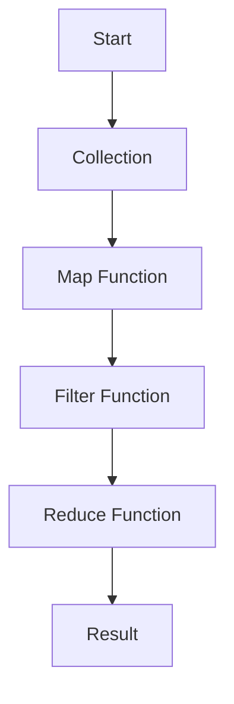

## 2.3 Functional Programming Elements in Swift

Functional programming (FP) is a paradigm that treats computation as the evaluation of mathematical functions and avoids changing state and mutable data. Swift, while primarily an object-oriented language, offers robust support for functional programming elements. By incorporating these elements into your Swift code, you can write more concise, predictable, and testable applications. In this section, we will delve into the core functional programming elements in Swift: first-class functions, immutability, higher-order functions, and closures.

### First-Class Functions

In Swift, functions are first-class citizens, meaning they can be assigned to variables, passed as arguments, and returned from other functions. This capability allows for a high degree of flexibility in how functions are used and composed.

#### Treating Functions as Variables

Functions in Swift can be stored in variables and constants, allowing them to be manipulated like any other data type.

```swift
// Define a simple function
func greet(name: String) -> String {
    return "Hello, \\(name)!"
}

// Assign the function to a variable
let greeter: (String) -> String = greet

// Use the function through the variable
print(greeter("Alice")) // Output: Hello, Alice!
```

#### Passing Functions as Parameters

Functions can be passed as parameters to other functions, enabling higher-order functions and functional composition.

```swift
// A function that takes another function as a parameter
func performOperation(_ operation: (Int, Int) -> Int, on a: Int, and b: Int) -> Int {
    return operation(a, b)
}

// Define addition and multiplication functions
func add(_ a: Int, _ b: Int) -> Int { return a + b }
func multiply(_ a: Int, _ b: Int) -> Int { return a * b }

// Use the performOperation function
let sum = performOperation(add, on: 3, and: 5) // Output: 8
let product = performOperation(multiply, on: 3, and: 5) // Output: 15
```

#### Returning Functions from Functions

Swift allows functions to return other functions, which is a powerful feature for creating highly modular and reusable code.

```swift
// A function that returns another function
func makeIncrementer(by increment: Int) -> (Int) -> Int {
    return { number in
        return number + increment
    }
}

// Create an incrementer function
let incrementByTwo = makeIncrementer(by: 2)

// Use the incrementer function
print(incrementByTwo(5)) // Output: 7
```

### Immutability

Immutability is a core principle of functional programming, emphasizing the use of constants (`let`) over variables (`var`). This practice leads to safer and more predictable code by reducing side effects.

#### Favoring Constants Over Variables

Swift encourages the use of constants wherever possible. By declaring values as constants, you ensure they cannot be changed after initialization, which aids in maintaining state consistency.

```swift
// Use 'let' for constants
let pi = 3.14159

// Attempting to modify a constant will result in a compile-time error
// pi = 3.14 // Error: Cannot assign to value: 'pi' is a 'let' constant
```

#### Benefits of Immutability

1. **Thread Safety**: Immutable data structures are inherently thread-safe, as they cannot be modified concurrently.
2. **Predictability**: Reduces the complexity of reasoning about code, as data does not change unexpectedly.
3. **Ease of Testing**: Functions that rely on immutable data are easier to test, as they produce consistent outputs for given inputs.

### Higher-Order Functions

Higher-order functions are functions that take other functions as parameters or return them as results. Swift's standard library includes several higher-order functions that operate on collections, such as `map`, `filter`, and `reduce`.

#### Map

The `map` function applies a given transformation to each element of a collection, returning a new collection of the transformed elements.

```swift
let numbers = [1, 2, 3, 4, 5]

// Use 'map' to square each number
let squaredNumbers = numbers.map { $0 * $0 }
print(squaredNumbers) // Output: [1, 4, 9, 16, 25]
```

#### Filter

The `filter` function returns a new collection containing only the elements that satisfy a given predicate.

```swift
let numbers = [1, 2, 3, 4, 5]

// Use 'filter' to get even numbers
let evenNumbers = numbers.filter { $0 % 2 == 0 }
print(evenNumbers) // Output: [2, 4]
```

#### Reduce

The `reduce` function combines all elements of a collection into a single value using a specified closure.

```swift
let numbers = [1, 2, 3, 4, 5]

// Use 'reduce' to sum all numbers
let sum = numbers.reduce(0, +)
print(sum) // Output: 15
```

### Closures

Closures are self-contained blocks of functionality that can be passed around and used in your code. They are similar to functions but can capture and store references to variables and constants from their surrounding context.

#### Syntax and Usage

Closures in Swift have a clean, concise syntax that allows for elegant and expressive code.

```swift
// Basic closure syntax
let greet = { (name: String) -> String in
    return "Hello, \\(name)!"
}

// Use the closure
print(greet("Bob")) // Output: Hello, Bob!
```

#### Capturing Values

Closures can capture and store references to variables and constants from the context in which they are defined.

```swift
func makeMultiplier(multiplier: Int) -> (Int) -> Int {
    return { number in
        return number * multiplier
    }
}

let triple = makeMultiplier(multiplier: 3)
print(triple(4)) // Output: 12
```

#### Trailing Closure Syntax

Swift provides a trailing closure syntax, which is especially useful when the closure is the last argument of a function.

```swift
// Using trailing closure syntax with 'map'
let numbers = [1, 2, 3, 4, 5]
let doubledNumbers = numbers.map { $0 * 2 }
print(doubledNumbers) // Output: [2, 4, 6, 8, 10]
```

### Visualizing Functional Programming in Swift

To better understand how these elements interact, let's visualize the flow of data through higher-order functions using a Mermaid.js flowchart.



This flowchart illustrates how a collection of data can be transformed and reduced using a series of higher-order functions, resulting in a final computed value.

### Try It Yourself

To solidify your understanding, try modifying the code examples above. For instance, create a new higher-order function that combines `map` and `filter` to transform and filter a collection in a single operation. Experiment with closures by capturing different external variables and observing the effects.

### References and Links

- [Swift Language Guide: Functions](https://docs.swift.org/swift-book/LanguageGuide/Functions.html)
- [Swift Language Guide: Closures](https://docs.swift.org/swift-book/LanguageGuide/Closures.html)
- [Functional Programming in Swift](https://www.raywenderlich.com/books/functional-programming-in-swift)

### Knowledge Check

1. **What are first-class functions, and how do they benefit Swift programming?**
2. **Explain the concept of immutability and its advantages.**
3. **How do higher-order functions enhance code modularity and reusability?**
4. **Describe the syntax and use cases for closures in Swift.**
5. **What are the benefits of using trailing closure syntax?**

### Embrace the Journey

Remember, mastering functional programming in Swift is a journey. As you practice and experiment with these concepts, you'll discover new ways to write cleaner, more efficient code. Keep exploring, stay curious, and enjoy the process!

## Quiz Time!



### What are first-class functions in Swift?

- [x] Functions that can be treated as variables
- [ ] Functions that cannot be passed as arguments
- [ ] Functions that must return a value
- [ ] Functions that are only used in closures

> **Explanation:** First-class functions can be treated as variables, passed as arguments, and returned from other functions, providing flexibility in programming.

### What is a key benefit of immutability in Swift?

- [x] Thread safety
- [ ] Increased memory usage
- [ ] Slower performance
- [ ] More complex code

> **Explanation:** Immutability ensures that data cannot be changed, leading to thread safety and reducing unexpected side effects.

### Which higher-order function applies a transformation to each element of a collection?

- [x] map
- [ ] filter
- [ ] reduce
- [ ] sort

> **Explanation:** The `map` function applies a given transformation to each element of a collection, returning a new collection of the transformed elements.

### What is the purpose of closures in Swift?

- [x] To create self-contained blocks of functionality
- [ ] To define global variables
- [ ] To enforce immutability
- [ ] To replace classes

> **Explanation:** Closures are self-contained blocks of functionality that can capture and store references to variables and constants from their surrounding context.

### How does the trailing closure syntax benefit Swift code?

- [x] It makes code more readable and concise
- [ ] It requires more lines of code
- [ ] It limits the use of closures
- [ ] It enforces strict typing

> **Explanation:** Trailing closure syntax allows for more readable and concise code, especially when the closure is the last argument of a function.

### What does the `filter` function do in Swift?

- [x] Returns a new collection with elements that satisfy a predicate
- [ ] Combines elements into a single value
- [ ] Sorts elements in ascending order
- [ ] Maps elements to a new form

> **Explanation:** The `filter` function returns a new collection containing only the elements that satisfy a given predicate.

### Can functions in Swift return other functions?

- [x] Yes
- [ ] No

> **Explanation:** Functions in Swift can return other functions, allowing for modular and reusable code.

### What is a closure in Swift?

- [x] An anonymous function that can capture values from its context
- [ ] A named function that cannot capture values
- [ ] A global constant
- [ ] A type of class

> **Explanation:** A closure is an anonymous function that can capture and store references to variables and constants from its surrounding context.

### What is the result of using the `reduce` function?

- [x] A single value obtained by combining all elements of a collection
- [ ] A new collection with transformed elements
- [ ] A filtered collection
- [ ] A sorted collection

> **Explanation:** The `reduce` function combines all elements of a collection into a single value using a specified closure.

### True or False: Immutability in Swift leads to unpredictable code behavior.

- [ ] True
- [x] False

> **Explanation:** Immutability leads to predictable code behavior by ensuring that data does not change unexpectedly.




