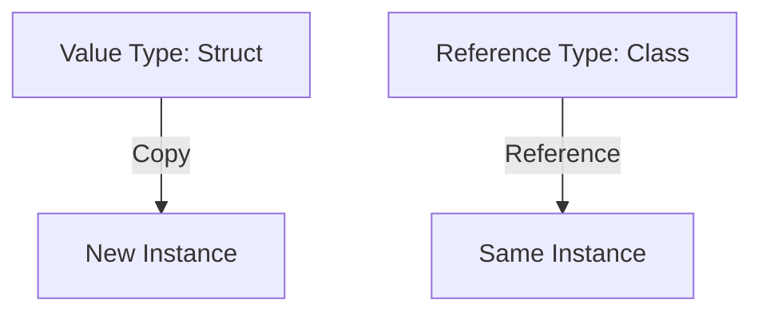

## 2.4 Value Types vs. Reference Types

In Swift, understanding the distinction between value types and reference types is fundamental to mastering the language and its design patterns. This section will explore the nuances of value types, such as structs, and reference types, like classes, and how they impact memory management and application design.

### Understanding Structs (Value Types)

Value types in Swift are types where each instance keeps a unique copy of its data. When you assign or pass a value type, a copy of the data is created. This behavior is intrinsic to Swift's structs, enums, and tuples.

#### Key Characteristics of Value Types

- **Copy on Assignment**: When you assign a value type to a variable or pass it to a function, a copy of the data is made.
- **Immutability**: Value types can be easily made immutable by declaring them as constants using `let`.
- **Thread Safety**: Since value types are copied, they are inherently thread-safe as each thread operates on its own copy.

#### Code Example: Structs in Swift

```swift
struct Point {
    var x: Int
    var y: Int
}

var point1 = Point(x: 10, y: 20)
var point2 = point1 // A copy of point1 is created

point2.x = 30

print("Point1: \\(point1.x), \\(point1.y)") // Output: Point1: 10, 20
print("Point2: \\(point2.x), \\(point2.y)") // Output: Point2: 30, 20
```

In this example, `point2` is a copy of `point1`. Modifying `point2` does not affect `point1`, demonstrating the copy-on-assignment behavior of value types.

### Understanding Classes (Reference Types)

Classes in Swift are reference types, meaning that when you assign or pass a class instance, you are dealing with a reference to the same instance, not a copy.

#### Key Characteristics of Reference Types

- **Shared Instance**: Multiple variables can refer to the same instance.
- **Mutability**: Changes made through one reference are visible to all references.
- **Automatic Reference Counting (ARC)**: Swift uses ARC to manage memory for class instances, tracking and managing the lifecycle of objects.

#### Code Example: Classes in Swift

```swift
class Rectangle {
    var width: Int
    var height: Int

    init(width: Int, height: Int) {
        self.width = width
        self.height = height
    }
}

let rectangle1 = Rectangle(width: 10, height: 20)
let rectangle2 = rectangle1 // rectangle2 refers to the same instance as rectangle1

rectangle2.width = 30

print("Rectangle1: \\(rectangle1.width), \\(rectangle1.height)") // Output: Rectangle1: 30, 20
print("Rectangle2: \\(rectangle2.width), \\(rectangle2.height)") // Output: Rectangle2: 30, 20
```

Here, `rectangle2` is a reference to the same instance as `rectangle1`. Modifying `rectangle2` affects `rectangle1`, illustrating the shared instance nature of reference types.

### Memory Management Implications

Understanding how Swift handles memory for value and reference types is crucial for efficient app development.

#### Automatic Reference Counting (ARC)

Swift uses ARC to manage memory for class instances. ARC automatically keeps track of the number of references to each class instance and deallocates memory when there are no more references.

- **Strong References**: By default, references are strong, meaning they increase the reference count.
- **Weak and Unowned References**: To prevent retain cycles, use `weak` or `unowned` references where appropriate.

#### Copying Behavior

- **Value Types**: Copied on assignment, ensuring that each instance has its own data.
- **Reference Types**: Shared across references, requiring careful management to prevent unintended side effects.

### Choosing Between Structs and Classes

Selecting between structs and classes depends on the specific requirements of your application. Here are some guidelines:

#### When to Use Structs

- **Immutability**: When you want to ensure data is not modified after creation.
- **Simplicity**: For simple data structures that do not require inheritance.
- **Performance**: When you want to avoid the overhead of reference counting.

#### When to Use Classes

- **Shared State**: When you need to share data across different parts of your app.
- **Inheritance**: When you need to leverage class inheritance.
- **ARC Management**: When you need fine-grained control over memory management.

### Best Practices

- **Immutable Value Types**: Use `let` to declare constants and ensure immutability.
- **Avoiding Retain Cycles**: Use `weak` and `unowned` references to manage memory effectively.
- **Performance Considerations**: Profile and test to ensure that your choice of value or reference types meets performance requirements.

### Visualizing Value and Reference Types

To better understand the differences between value and reference types, let's visualize how they are stored and accessed in memory.



This diagram illustrates how value types create a new instance upon assignment, while reference types share the same instance.

### Try It Yourself

Experiment with the following code to deepen your understanding:

1. Modify the `Point` struct to include a method that changes its properties.
2. Create a new class that inherits from `Rectangle` and add a method that modifies its properties.
3. Test the behavior of these methods when called on different instances or references.

### Further Reading

- [Swift Documentation on Structures and Classes](https://developer.apple.com/documentation/swift/choosing_between_structures_and_classes)
- [Automatic Reference Counting in Swift](https://developer.apple.com/documentation/swift/automatic_reference_counting)

### Knowledge Check

- Explain the difference between value types and reference types in Swift.
- Provide an example where using a struct is more beneficial than a class.
- Discuss how ARC manages memory for class instances.

### Embrace the Journey

Remember, mastering value and reference types is just the beginning. As you continue to explore Swift, you'll build more robust and efficient applications. Keep experimenting, stay curious, and enjoy the journey!

## Quiz Time!



### What is a key characteristic of value types in Swift?

- [x] They are copied on assignment.
- [ ] They are shared across references.
- [ ] They require ARC for memory management.
- [ ] They can inherit from other types.

> **Explanation:** Value types are copied on assignment, meaning each instance has its own copy of the data.

### Which of the following is a reference type in Swift?

- [ ] Struct
- [ ] Enum
- [x] Class
- [ ] Tuple

> **Explanation:** Classes are reference types in Swift, while structs, enums, and tuples are value types.

### How does ARC manage memory for class instances?

- [x] By tracking the number of references to each instance.
- [ ] By copying instances on assignment.
- [ ] By using manual memory management.
- [ ] By automatically making all instances immutable.

> **Explanation:** ARC automatically tracks the number of references to each class instance and deallocates memory when there are no more references.

### When should you use a struct over a class?

- [x] When you want to ensure immutability.
- [ ] When you need to share data across your app.
- [ ] When you require inheritance.
- [ ] When you need fine-grained control over memory management.

> **Explanation:** Structs are ideal for ensuring immutability and are simpler for data structures that do not require inheritance.

### What is the default reference type in Swift?

- [x] Strong
- [ ] Weak
- [ ] Unowned
- [ ] Mutable

> **Explanation:** By default, references in Swift are strong, meaning they increase the reference count.

### Which keyword is used to prevent retain cycles in Swift?

- [ ] let
- [ ] var
- [x] weak
- [ ] static

> **Explanation:** The `weak` keyword is used to create weak references, which do not increase the reference count and help prevent retain cycles.

### What happens when you assign a value type to a new variable?

- [x] A copy of the data is made.
- [ ] The original data is modified.
- [ ] The reference count is increased.
- [ ] The data becomes immutable.

> **Explanation:** Assigning a value type to a new variable creates a copy of the data.

### Which of the following is NOT a characteristic of reference types?

- [ ] Shared instance
- [ ] Mutability
- [x] Copy on assignment
- [ ] ARC management

> **Explanation:** Reference types are shared across references and managed by ARC, but they are not copied on assignment.

### True or False: Value types are always immutable in Swift.

- [ ] True
- [x] False

> **Explanation:** Value types can be mutable if declared with `var`, but they can also be made immutable using `let`.

### Which of the following is a benefit of using value types?

- [x] Thread safety
- [ ] Shared state
- [ ] Inheritance
- [ ] ARC management

> **Explanation:** Value types are inherently thread-safe because each thread operates on its own copy of the data.




