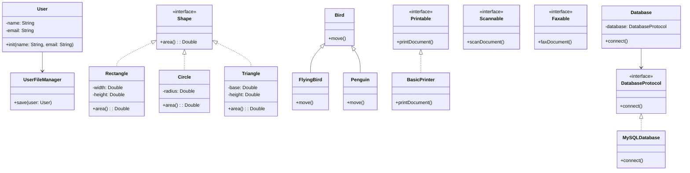

## 2.5 The SOLID Principles Applied in Swift

The SOLID principles are a set of five design principles intended to make software designs more understandable, flexible, and maintainable. These principles are especially relevant in Swift, where they help developers build robust iOS and macOS applications. Let's delve into each principle and see how they can be applied in Swift to improve your codebase.

### Single Responsibility Principle (SRP)

The **Single Responsibility Principle** states that a class should have one, and only one, reason to change. This principle encourages developers to design classes that are focused on a single task or responsibility.

#### Example in Swift

Let's consider a simple example of a `User` class that handles both user data and file management:

```swift
class User {
    var name: String
    var email: String

    init(name: String, email: String) {
        self.name = name
        self.email = email
    }

    func saveToFile() {
        // Code to save user data to a file
    }
}
```

Here, the `User` class has two responsibilities: managing user data and handling file operations. To adhere to the SRP, we can refactor the code by separating these responsibilities:

```swift
class User {
    var name: String
    var email: String

    init(name: String, email: String) {
        self.name = name
        self.email = email
    }
}

class UserFileManager {
    func save(user: User) {
        // Code to save user data to a file
    }
}
```

In this refactored version, the `User` class is only responsible for storing user data, while the `UserFileManager` class handles file operations.

#### Benefits of SRP

- **Improved Readability**: Classes are easier to understand when they have a single responsibility.
- **Enhanced Maintainability**: Changes in one responsibility do not affect others.
- **Better Reusability**: Classes can be reused in different contexts without modification.

### Open/Closed Principle (OCP)

The **Open/Closed Principle** states that software entities should be open for extension but closed for modification. This means you should be able to add new functionality to a class without altering its existing code.

#### Example in Swift

Consider a `Shape` class hierarchy where we need to calculate the area of different shapes:

```swift
class Rectangle {
    var width: Double
    var height: Double

    init(width: Double, height: Double) {
        self.width = width
        self.height = height
    }

    func area() -> Double {
        return width * height
    }
}

class Circle {
    var radius: Double

    init(radius: Double) {
        self.radius = radius
    }

    func area() -> Double {
        return .pi * radius * radius
    }
}
```

If we want to add a new shape, such as a `Triangle`, we would need to modify existing code. Instead, we can use protocols to adhere to OCP:

```swift
protocol Shape {
    func area() -> Double
}

class Rectangle: Shape {
    var width: Double
    var height: Double

    init(width: Double, height: Double) {
        self.width = width
        self.height = height
    }

    func area() -> Double {
        return width * height
    }
}

class Circle: Shape {
    var radius: Double

    init(radius: Double) {
        self.radius = radius
    }

    func area() -> Double {
        return .pi * radius * radius
    }
}

class Triangle: Shape {
    var base: Double
    var height: Double

    init(base: Double, height: Double) {
        self.base = base
        self.height = height
    }

    func area() -> Double {
        return 0.5 * base * height
    }
}
```

By using a protocol, we can add new shapes without modifying existing code.

#### Benefits of OCP

- **Scalability**: New features can be added with minimal impact on existing code.
- **Flexibility**: Code can be extended without altering its core functionality.
- **Reduced Risk**: Less chance of introducing bugs when extending functionality.

### Liskov Substitution Principle (LSP)

The **Liskov Substitution Principle** states that objects of a superclass should be replaceable with objects of a subclass without affecting the correctness of the program. This principle ensures that a subclass can stand in for its superclass.

#### Example in Swift

Consider a base class `Bird` and a subclass `Penguin`:

```swift
class Bird {
    func fly() {
        print("Flying")
    }
}

class Penguin: Bird {
    override func fly() {
        // Penguins can't fly
        fatalError("Penguins can't fly")
    }
}
```

Here, substituting a `Penguin` for a `Bird` violates LSP because `Penguin` cannot fly. To adhere to LSP, we can redesign the class hierarchy:

```swift
class Bird {
    func move() {
        print("Moving")
    }
}

class FlyingBird: Bird {
    override func move() {
        print("Flying")
    }
}

class Penguin: Bird {
    override func move() {
        print("Swimming")
    }
}
```

Now, `Penguin` can be substituted for `Bird` without breaking the program's logic.

#### Benefits of LSP

- **Robustness**: Ensures that subclasses maintain the behavior expected by the base class.
- **Consistency**: Subclasses can be used interchangeably with their base class.
- **Reliability**: Reduces unexpected behavior in the program.

### Interface Segregation Principle (ISP)

The **Interface Segregation Principle** states that clients should not be forced to depend on interfaces they do not use. This principle encourages the creation of smaller, client-specific interfaces.

#### Example in Swift

Consider a `Printer` protocol with multiple methods:

```swift
protocol Printer {
    func printDocument()
    func scanDocument()
    func faxDocument()
}

class BasicPrinter: Printer {
    func printDocument() {
        print("Printing document")
    }

    func scanDocument() {
        // Not supported
    }

    func faxDocument() {
        // Not supported
    }
}
```

The `BasicPrinter` class is forced to implement methods it does not use. To adhere to ISP, we can split the `Printer` protocol into smaller interfaces:

```swift
protocol Printable {
    func printDocument()
}

protocol Scannable {
    func scanDocument()
}

protocol Faxable {
    func faxDocument()
}

class BasicPrinter: Printable {
    func printDocument() {
        print("Printing document")
    }
}
```

Now, `BasicPrinter` only implements the `Printable` protocol, adhering to ISP.

#### Benefits of ISP

- **Simplicity**: Interfaces are easier to understand and implement.
- **Flexibility**: Clients depend only on the methods they need.
- **Modularity**: Promotes the creation of modular and decoupled code.

### Dependency Inversion Principle (DIP)

The **Dependency Inversion Principle** states that high-level modules should not depend on low-level modules. Both should depend on abstractions. This principle encourages dependency on interfaces or abstract classes rather than concrete implementations.

#### Example in Swift

Consider a `Database` class that directly depends on a `MySQLDatabase` class:

```swift
class MySQLDatabase {
    func connect() {
        print("Connecting to MySQL database")
    }
}

class Database {
    private let database: MySQLDatabase

    init(database: MySQLDatabase) {
        self.database = database
    }

    func connect() {
        database.connect()
    }
}
```

Here, `Database` depends directly on `MySQLDatabase`, violating DIP. To adhere to DIP, we can introduce a protocol:

```swift
protocol DatabaseProtocol {
    func connect()
}

class MySQLDatabase: DatabaseProtocol {
    func connect() {
        print("Connecting to MySQL database")
    }
}

class Database {
    private let database: DatabaseProtocol

    init(database: DatabaseProtocol) {
        self.database = database
    }

    func connect() {
        database.connect()
    }
}
```

Now, `Database` depends on an abstraction (`DatabaseProtocol`) rather than a concrete class.

#### Benefits of DIP

- **Flexibility**: Easily swap out implementations without changing high-level code.
- **Testability**: Facilitates testing by allowing the use of mock objects.
- **Decoupling**: Reduces dependencies between high-level and low-level modules.

### Visualizing SOLID Principles in Swift

To better understand how these principles interact, let's visualize them using a class diagram:



### Try It Yourself

To deepen your understanding of the SOLID principles, try the following:

- **Modify the `User` and `UserFileManager` classes** to add functionality for deleting a user. Ensure that the SRP is maintained.
- **Extend the `Shape` protocol** to include a method for calculating the perimeter. Add this functionality to existing and new shapes.
- **Create a new subclass of `Bird`**, such as `Sparrow`, and ensure it adheres to the LSP.
- **Split the `Printer` protocol further** to include additional functionalities like `DuplexPrintable`. Implement a class that uses this new protocol.
- **Introduce a new database class** that conforms to `DatabaseProtocol`, such as `PostgreSQLDatabase`, and swap it with `MySQLDatabase` in the `Database` class.

### Key Takeaways

- The SOLID principles help create software that is easier to understand, extend, and maintain.
- Applying these principles in Swift can lead to more robust and flexible applications.
- Each principle addresses a specific aspect of software design, from class responsibilities to dependency management.
- Regularly revisiting and refactoring code to align with SOLID principles can significantly improve code quality.

Remember, mastering these principles is a journey. As you continue to apply them in your Swift projects, you'll develop a deeper understanding and appreciation for clean and maintainable code.

## Quiz Time!



### Which SOLID principle states that a class should have only one reason to change?

- [x] Single Responsibility Principle
- [ ] Open/Closed Principle
- [ ] Liskov Substitution Principle
- [ ] Interface Segregation Principle

> **Explanation:** The Single Responsibility Principle focuses on ensuring that a class has only one reason to change, promoting focused and cohesive design.


### What does the Open/Closed Principle advocate for?

- [ ] Classes should be open for modification but closed for extension.
- [x] Classes should be open for extension but closed for modification.
- [ ] Classes should be neither open for extension nor modification.
- [ ] Classes should be open for both extension and modification.

> **Explanation:** The Open/Closed Principle suggests that classes should allow for new functionality to be added without altering existing code.


### How does the Liskov Substitution Principle impact subclassing?

- [x] Subtypes must be substitutable for their base types.
- [ ] Subtypes must not be substitutable for their base types.
- [ ] Subtypes must only extend base types without substitution.
- [ ] Subtypes should not override base type methods.

> **Explanation:** The Liskov Substitution Principle ensures that subclasses can replace their base classes without affecting the program's correctness.


### Which principle emphasizes creating smaller, client-specific interfaces?

- [ ] Single Responsibility Principle
- [ ] Open/Closed Principle
- [ ] Liskov Substitution Principle
- [x] Interface Segregation Principle

> **Explanation:** The Interface Segregation Principle encourages the use of specific interfaces to avoid forcing clients to implement unused methods.


### What is the main focus of the Dependency Inversion Principle?

- [x] Depend upon abstractions, not concretions.
- [ ] Depend upon concretions, not abstractions.
- [ ] Depend upon both abstractions and concretions.
- [ ] Depend upon neither abstractions nor concretions.

> **Explanation:** The Dependency Inversion Principle promotes relying on abstract interfaces rather than concrete implementations to enhance flexibility.


### What is a key benefit of adhering to the Single Responsibility Principle?

- [x] Improved readability and maintainability
- [ ] Increased complexity
- [ ] Reduced code reusability
- [ ] Decreased flexibility

> **Explanation:** By focusing on a single responsibility, classes become easier to read and maintain, enhancing overall code quality.


### How can the Open/Closed Principle be implemented in Swift?

- [x] Using protocols and extensions
- [ ] Using only classes
- [ ] Using global variables
- [ ] Using only structs

> **Explanation:** Protocols and extensions in Swift allow for extending functionality without modifying existing code, aligning with the Open/Closed Principle.


### What is a common violation of the Liskov Substitution Principle?

- [x] A subclass that cannot be substituted for its base class
- [ ] A subclass that extends its base class
- [ ] A subclass that overrides a method
- [ ] A subclass that implements a protocol

> **Explanation:** When a subclass cannot replace its base class without affecting program behavior, it violates the Liskov Substitution Principle.


### Why is the Interface Segregation Principle important?

- [x] It reduces client dependencies on unused methods.
- [ ] It increases the number of methods in an interface.
- [ ] It forces clients to implement all methods.
- [ ] It simplifies interface design by merging functionalities.

> **Explanation:** The Interface Segregation Principle reduces unnecessary dependencies by advocating for smaller, more focused interfaces.


### True or False: The Dependency Inversion Principle encourages high-level modules to depend on low-level modules.

- [ ] True
- [x] False

> **Explanation:** The Dependency Inversion Principle suggests that both high-level and low-level modules should depend on abstractions, not on each other.


