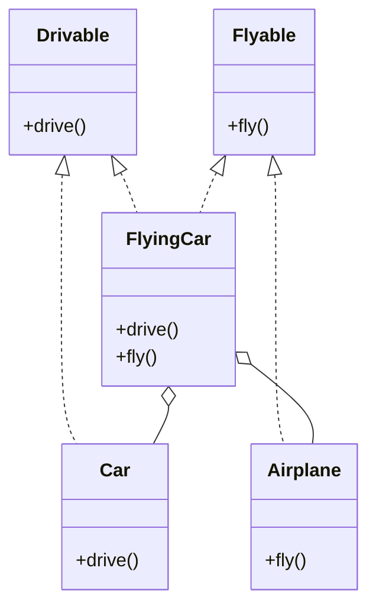

## 2.6 Composition Over Inheritance

In the realm of software development, the principle of "Composition Over Inheritance" is a guiding light for creating flexible and reusable code. In Swift, this principle is particularly powerful due to the language's support for protocols, structs, and value semantics. In this section, we will delve into the advantages of composition, demonstrate how to implement it in Swift, and provide examples of building complex functionality by combining simple components.

### Understanding Composition and Inheritance

Before we dive into the details, let's clarify what we mean by composition and inheritance:

- **Inheritance** is a mechanism where a new class is derived from an existing class, inheriting its properties and behaviors. It allows for code reuse but can lead to rigid and tightly coupled systems.
  
- **Composition** involves building complex objects by combining simpler, reusable components. It promotes flexibility and decoupling, as components can be easily swapped or extended.

### Advantages of Composition Over Inheritance

1. **Flexibility**: Composition allows you to change the behavior of a class at runtime by composing it with different objects. This is not possible with inheritance, where behavior is fixed at compile time.

2. **Reusability**: By composing objects, you can reuse components across different parts of your application without duplicating code.

3. **Decoupling**: Composition leads to systems where components are less dependent on each other, making the codebase easier to maintain and extend.

4. **Avoiding the Fragile Base Class Problem**: Inheritance can lead to the fragile base class problem, where changes in a base class can inadvertently affect derived classes. Composition mitigates this risk by keeping components separate.

### Implementing Composition in Swift

Swift provides several features that make implementing composition straightforward and effective:

#### Using Protocols

Protocols in Swift define a blueprint of methods, properties, and other requirements that suit a particular task or piece of functionality. By using protocols, you can define interfaces for components that can be composed together.

```swift
protocol Drivable {
    func drive()
}

protocol Flyable {
    func fly()
}

struct Car: Drivable {
    func drive() {
        print("Driving a car")
    }
}

struct Airplane: Flyable {
    func fly() {
        print("Flying an airplane")
    }
}

struct FlyingCar: Drivable, Flyable {
    let car: Car
    let airplane: Airplane
    
    func drive() {
        car.drive()
    }
    
    func fly() {
        airplane.fly()
    }
}
```

In this example, the `FlyingCar` struct composes a `Car` and an `Airplane`, thereby gaining both driving and flying capabilities without inheriting from either.

#### Using Structs

Structs in Swift are value types and are ideal for composition. They can hold instances of other structs or classes, allowing you to build complex types from simpler ones.

```swift
struct Engine {
    let horsepower: Int
}

struct Wheels {
    let count: Int
}

struct Vehicle {
    let engine: Engine
    let wheels: Wheels
    
    func describe() {
        print("This vehicle has an engine with \\(engine.horsepower) horsepower and \\(wheels.count) wheels.")
    }
}

let engine = Engine(horsepower: 150)
let wheels = Wheels(count: 4)
let car = Vehicle(engine: engine, wheels: wheels)
car.describe()
```

Here, a `Vehicle` is composed of an `Engine` and `Wheels`, demonstrating how structs can be used to build complex objects.

### Examples of Building Complex Functionality

Let's explore how to build more complex functionality by combining simple components using composition.

#### Example 1: A Modular Audio System

Consider an audio system where you want to mix and match different components like amplifiers, speakers, and audio sources.

```swift
protocol Amplifier {
    func amplify()
}

protocol Speaker {
    func outputSound()
}

protocol AudioSource {
    func play()
}

struct BasicAmplifier: Amplifier {
    func amplify() {
        print("Amplifying sound")
    }
}

struct StereoSpeaker: Speaker {
    func outputSound() {
        print("Outputting stereo sound")
    }
}

struct CDPlayer: AudioSource {
    func play() {
        print("Playing CD")
    }
}

struct AudioSystem {
    let amplifier: Amplifier
    let speaker: Speaker
    let audioSource: AudioSource
    
    func playMusic() {
        audioSource.play()
        amplifier.amplify()
        speaker.outputSound()
    }
}

let amplifier = BasicAmplifier()
let speaker = StereoSpeaker()
let audioSource = CDPlayer()

let audioSystem = AudioSystem(amplifier: amplifier, speaker: speaker, audioSource: audioSource)
audioSystem.playMusic()
```

In this example, the `AudioSystem` is composed of an `Amplifier`, a `Speaker`, and an `AudioSource`, allowing you to easily swap out components to change the system's behavior.

#### Example 2: A Flexible Notification System

Imagine a notification system where you can send notifications via different channels like email, SMS, or push notifications.

```swift
protocol NotificationChannel {
    func send(message: String)
}

struct EmailChannel: NotificationChannel {
    func send(message: String) {
        print("Sending email: \\(message)")
    }
}

struct SMSChannel: NotificationChannel {
    func send(message: String) {
        print("Sending SMS: \\(message)")
    }
}

struct PushNotificationChannel: NotificationChannel {
    func send(message: String) {
        print("Sending push notification: \\(message)")
    }
}

struct NotificationSystem {
    let channels: [NotificationChannel]
    
    func sendNotification(message: String) {
        channels.forEach { $0.send(message: message) }
    }
}

let emailChannel = EmailChannel()
let smsChannel = SMSChannel()
let pushChannel = PushNotificationChannel()

let notificationSystem = NotificationSystem(channels: [emailChannel, smsChannel, pushChannel])
notificationSystem.sendNotification(message: "Hello, World!")
```

Here, the `NotificationSystem` uses composition to support multiple notification channels, demonstrating the flexibility of this approach.

### Visualizing Composition Over Inheritance

To better understand the concept of composition over inheritance, let's visualize it using a class diagram.



In this diagram, `FlyingCar` is composed of `Car` and `Airplane`, illustrating how composition allows for combining behaviors without the need for inheritance.

### Swift's Unique Features for Composition

Swift's language features make it particularly well-suited for composition:

- **Protocols with Default Implementations**: Swift allows protocols to have default method implementations, enabling you to provide shared functionality across multiple conforming types.

- **Protocol Extensions**: These allow you to extend a protocol to provide additional functionality, further enhancing the power of composition.

- **Value Types and Immutability**: Swift's emphasis on value types and immutability aligns well with composition, as it encourages building systems from small, immutable components.

### Differences and Similarities with Inheritance

While both composition and inheritance aim to promote code reuse, they differ in approach:

- **Inheritance** is hierarchical and often leads to tightly coupled systems. It is suitable for situations where there is a clear "is-a" relationship.

- **Composition** is more flexible and promotes decoupling. It is ideal for "has-a" relationships and when you need to swap or extend behavior dynamically.

### Design Considerations

When deciding between composition and inheritance, consider the following:

- Use **composition** when you need flexibility, decoupling, and the ability to change behavior at runtime.
- Use **inheritance** when there is a clear hierarchy and shared behavior that does not change.

### Try It Yourself

Experiment with the examples provided by modifying components or adding new ones. For instance, try adding a new `NotificationChannel` to the `NotificationSystem` or a new `AudioSource` to the `AudioSystem`. Observe how easily you can extend functionality without altering existing code.

### Knowledge Check

Let's review some key points:

- **Composition** promotes flexibility and reusability by combining simple components.
- **Inheritance** can lead to tightly coupled systems and is less flexible.
- Swift's **protocols** and **structs** are powerful tools for implementing composition.

### Embrace the Journey

Remember, mastering composition over inheritance is a journey. As you continue to build and refine your Swift applications, you'll discover the power and elegance of this approach. Keep experimenting, stay curious, and enjoy the process of creating robust, flexible software.

## Quiz Time!



### What is the main advantage of using composition over inheritance?

- [x] Flexibility and reusability
- [ ] Simplified code hierarchy
- [ ] Easier debugging
- [ ] Faster execution

> **Explanation:** Composition allows for more flexible and reusable code by combining simple components.

### In Swift, which feature is primarily used to implement composition?

- [x] Protocols
- [ ] Classes
- [ ] Enums
- [ ] Closures

> **Explanation:** Protocols in Swift define interfaces that can be composed together to implement composition.

### Which of the following is a disadvantage of inheritance?

- [x] Tightly coupled systems
- [ ] Increased flexibility
- [ ] Better code reuse
- [ ] Simplified code structure

> **Explanation:** Inheritance can lead to tightly coupled systems, making it harder to change or extend behavior.

### What is the "fragile base class problem"?

- [x] Changes in a base class affecting derived classes
- [ ] Difficulty in understanding base class code
- [ ] Too many base classes in a hierarchy
- [ ] Lack of documentation for base classes

> **Explanation:** The fragile base class problem occurs when changes in a base class inadvertently affect derived classes.

### Which Swift feature allows protocols to have shared functionality?

- [x] Protocol extensions
- [ ] Structs
- [ ] Classes
- [ ] Enums

> **Explanation:** Protocol extensions in Swift allow you to provide shared functionality across conforming types.

### What is a key benefit of using structs for composition in Swift?

- [x] Value semantics and immutability
- [ ] Simplified syntax
- [ ] Faster execution
- [ ] Easier debugging

> **Explanation:** Structs in Swift are value types, promoting immutability and value semantics, which align well with composition.

### Which of the following best describes a "has-a" relationship?

- [x] Composition
- [ ] Inheritance
- [ ] Abstraction
- [ ] Encapsulation

> **Explanation:** A "has-a" relationship is best represented by composition, where an object is composed of other objects.

### In the provided example, what does the `FlyingCar` struct demonstrate?

- [x] Combining behaviors from multiple components
- [ ] Inheriting from multiple base classes
- [ ] Using enums for type safety
- [ ] Implementing a singleton pattern

> **Explanation:** The `FlyingCar` struct demonstrates combining behaviors from `Car` and `Airplane` using composition.

### True or False: Inheritance is always the best choice for code reuse.

- [ ] True
- [x] False

> **Explanation:** False. While inheritance can promote code reuse, it is not always the best choice due to potential tight coupling and lack of flexibility.

### What should you consider when choosing between composition and inheritance?

- [x] Flexibility and decoupling needs
- [ ] Code execution speed
- [ ] Number of developers on the team
- [ ] The size of the codebase

> **Explanation:** When choosing between composition and inheritance, consider the need for flexibility and decoupling in your system.




