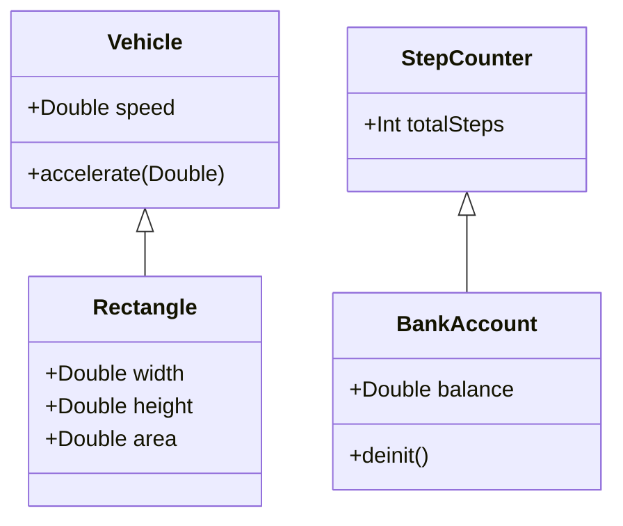

## 2.7 Swift's Unique Approach to OOP Concepts

Swift, Apple's powerful and intuitive programming language, takes a unique approach to Object-Oriented Programming (OOP) that distinguishes it from other languages. While Swift embraces traditional OOP principles, it enhances them with modern features that promote flexibility, safety, and performance. In this section, we will delve into Swift's distinctive OOP concepts, such as extensions, computed properties, property observers, and deinitializers, providing a comprehensive understanding of how these features contribute to robust Swift development.

### Extensions: Adding Functionality Without Subclassing

Extensions in Swift allow developers to add new functionality to existing classes, structures, enumerations, and protocols. This capability is particularly powerful as it enables the enhancement of types without the need for subclassing, promoting a more modular and flexible codebase.

#### Understanding Extensions

Extensions can add computed properties, methods, initializers, subscripts, and nested types to existing types. They can also make an existing type conform to a protocol. This feature is invaluable for adhering to the Single Responsibility Principle and enhancing code reuse.

#### Code Example: Using Extensions

```swift
// Original class
class Vehicle {
    var speed: Double = 0.0
}

// Extension to add new functionality
extension Vehicle {
    func accelerate(by increment: Double) {
        speed += increment
    }
}

// Usage
let car = Vehicle()
car.accelerate(by: 10.0)
print(car.speed) // Output: 10.0
```

In this example, we extend the `Vehicle` class to include an `accelerate` method, demonstrating how extensions can enhance existing classes without altering their source code.

#### Try It Yourself

Experiment with extensions by adding a decelerate method to the `Vehicle` class. Consider how you might use extensions to add similar functionality to other types in your projects.

### Computed Properties: Encapsulating Logic Within Properties

Computed properties in Swift allow for the encapsulation of logic within properties, providing a way to calculate a value rather than storing it. This feature enhances encapsulation and reduces redundancy in your code.

#### Understanding Computed Properties

A computed property does not store a value directly. Instead, it provides a getter and an optional setter to retrieve and set other properties and values indirectly.

#### Code Example: Computed Properties

```swift
struct Rectangle {
    var width: Double
    var height: Double
    
    // Computed property
    var area: Double {
        return width * height
    }
}

// Usage
let rect = Rectangle(width: 5.0, height: 10.0)
print(rect.area) // Output: 50.0
```

Here, the `area` property is computed based on the `width` and `height` properties, demonstrating how computed properties can simplify calculations and maintain data integrity.

#### Try It Yourself

Create a computed property for the perimeter of the `Rectangle` struct. Consider how computed properties can be used to derive other properties in your applications.

### Property Observers: Responding to Changes in Property Values

Property observers in Swift allow you to monitor and respond to changes in a property's value. This feature is essential for implementing reactive programming patterns and maintaining data consistency.

#### Understanding Property Observers

Swift provides two types of property observers: `willSet` and `didSet`. The `willSet` observer is called just before the value is stored, and `didSet` is called immediately after the new value is stored.

#### Code Example: Property Observers

```swift
class StepCounter {
    var totalSteps: Int = 0 {
        willSet(newTotalSteps) {
            print("About to set totalSteps to \\(newTotalSteps)")
        }
        didSet {
            if totalSteps > oldValue {
                print("Added \\(totalSteps - oldValue) steps")
            }
        }
    }
}

// Usage
let stepCounter = StepCounter()
stepCounter.totalSteps = 200
// Output:
// About to set totalSteps to 200
// Added 200 steps
```

In this example, property observers are used to track changes to the `totalSteps` property, providing feedback on the number of steps added.

#### Try It Yourself

Add a `didSet` observer to a property in one of your classes or structs. Experiment with using `willSet` to validate new values before they are set.

### Deinitializers: Custom Cleanup Before Instance Deallocation

Deinitializers in Swift provide a way to perform custom cleanup just before an instance is deallocated. This feature is crucial for managing resources and ensuring that instances are properly cleaned up.

#### Understanding Deinitializers

A deinitializer is called automatically just before an instance is deallocated. It is defined using the `deinit` keyword and is available only for class types.

#### Code Example: Deinitializers

```swift
class BankAccount {
    var balance: Double
    
    init(balance: Double) {
        self.balance = balance
    }
    
    deinit {
        print("BankAccount with balance \\(balance) is being deallocated")
    }
}

// Usage
var account: BankAccount? = BankAccount(balance: 1000.0)
account = nil
// Output: BankAccount with balance 1000.0 is being deallocated
```

In this example, the `BankAccount` class includes a deinitializer that prints a message when an instance is deallocated, illustrating how deinitializers can be used for cleanup tasks.

#### Try It Yourself

Implement a deinitializer in one of your classes to release resources or perform other cleanup tasks. Consider how deinitializers can help manage memory and resources in your applications.

### Visualizing Swift's OOP Concepts

To better understand how these concepts work together, let's visualize the relationships and interactions between extensions, computed properties, property observers, and deinitializers.



This diagram illustrates how extensions can add methods to classes like `Vehicle`, computed properties can be used in structs like `Rectangle`, property observers can monitor changes in classes like `StepCounter`, and deinitializers can perform cleanup in classes like `BankAccount`.

### References and Further Reading

- [Swift Language Guide: Extensions](https://docs.swift.org/swift-book/LanguageGuide/Extensions.html)
- [Swift Language Guide: Properties](https://docs.swift.org/swift-book/LanguageGuide/Properties.html)
- [Swift Language Guide: Initialization](https://docs.swift.org/swift-book/LanguageGuide/Initialization.html)

### Knowledge Check

- What are the benefits of using extensions in Swift?
- How do computed properties differ from stored properties?
- What are the two types of property observers in Swift?
- When is a deinitializer called in Swift?

### Embrace the Journey

Remember, mastering Swift's unique approach to OOP concepts is a journey. As you continue to explore and experiment with these features, you'll discover new ways to enhance your applications and improve your coding skills. Keep experimenting, stay curious, and enjoy the journey!

## Quiz Time!



### What is a primary benefit of using extensions in Swift?

- [x] Adding functionality to existing types without subclassing
- [ ] Improving compile-time performance
- [ ] Enabling multiple inheritance
- [ ] Simplifying memory management

> **Explanation:** Extensions allow you to add functionality to existing types without the need for subclassing, promoting code reuse and modularity.

### How do computed properties differ from stored properties?

- [x] Computed properties calculate values on the fly
- [ ] Computed properties store values directly
- [ ] Computed properties are only available in classes
- [ ] Computed properties are immutable

> **Explanation:** Computed properties calculate their values dynamically rather than storing them directly, allowing for encapsulation of logic within the property.

### Which property observer is called just before a property's value is set?

- [x] willSet
- [ ] didSet
- [ ] beforeSet
- [ ] preSet

> **Explanation:** The `willSet` observer is called just before the new value is set, allowing you to perform actions or validations before the change.

### What keyword is used to define a deinitializer in Swift?

- [x] deinit
- [ ] finalize
- [ ] destructor
- [ ] cleanup

> **Explanation:** The `deinit` keyword is used to define a deinitializer, which is called just before an instance is deallocated.

### Can extensions in Swift add stored properties to a type?

- [ ] Yes
- [x] No

> **Explanation:** Extensions cannot add stored properties to a type; they can only add computed properties, methods, initializers, and other functionalities.

### What is the purpose of a deinitializer in Swift?

- [x] To perform cleanup before an instance is deallocated
- [ ] To initialize stored properties
- [ ] To override superclass methods
- [ ] To manage memory allocation

> **Explanation:** Deinitializers are used to perform cleanup tasks, such as releasing resources, just before an instance is deallocated.

### Which of the following can be added to a type using an extension?

- [x] Methods
- [x] Computed properties
- [ ] Stored properties
- [x] Protocol conformance

> **Explanation:** Extensions can add methods, computed properties, and make a type conform to a protocol, but they cannot add stored properties.

### What is a common use case for property observers?

- [x] Monitoring changes to a property's value
- [ ] Storing large amounts of data
- [ ] Improving runtime performance
- [ ] Enforcing access control

> **Explanation:** Property observers are commonly used to monitor changes to a property's value and respond accordingly, such as updating the UI or triggering other actions.

### Can a computed property have a setter?

- [x] Yes
- [ ] No

> **Explanation:** Computed properties can have a setter, allowing you to define custom logic for setting the property's value.

### True or False: Deinitializers are available for both classes and structs in Swift.

- [ ] True
- [x] False

> **Explanation:** Deinitializers are only available for class types in Swift, as they are used to perform cleanup before an instance is deallocated.




