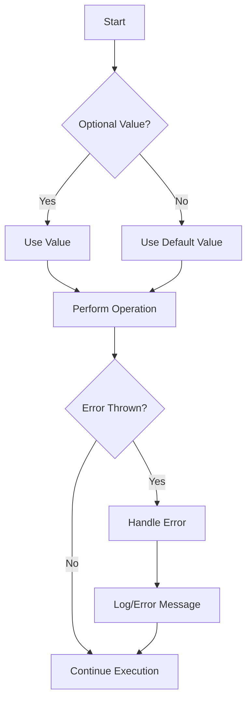

## 2.8 Best Practices in Swift Design

In Swift development, adhering to best practices is crucial for creating maintainable, efficient, and scalable applications. This section delves into essential practices that every Swift developer should incorporate into their workflow. We'll explore writing clean code, using optionals effectively, robust error handling, and adopting Swift conventions.

### Writing Clean Code: Readability and Simplicity

Writing clean code is fundamental to software development. It enhances readability, simplifies maintenance, and reduces the likelihood of errors. In Swift, this involves several key practices:

#### **1. Consistent Naming Conventions**

Adopt clear and consistent naming conventions for variables, functions, and types. Swift encourages descriptive names that convey the purpose of the code element. For instance, use camelCase for variables and functions, and PascalCase for types and protocols.

```swift
// Good naming conventions
let userName: String
func calculateTotalPrice() -> Double

// Poor naming conventions
let usrNm: String
func calcTP() -> Double
```

#### **2. Code Organization and Structure**

Organize code logically into classes, structs, and extensions. Group related functionality together and separate concerns using protocols and extensions to enhance modularity and readability.

```swift
// Organizing code with extensions
struct User {
    var name: String
    var age: Int
}

extension User {
    func isAdult() -> Bool {
        return age >= 18
    }
}
```

#### **3. Avoiding Code Duplication**

Strive to eliminate code duplication by identifying common patterns and abstracting them into reusable functions or types. This reduces maintenance overhead and potential errors.

```swift
// Abstracting common functionality
func printUserDetails(_ user: User) {
    print("Name: \\(user.name), Age: \\(user.age)")
}
```

#### **4. Commenting and Documentation**

While code should be self-explanatory, comments and documentation are essential for explaining complex logic or decisions. Use comments to clarify non-obvious parts of the code and provide documentation for public APIs.

```swift
/// Calculates the total price including tax.
/// - Parameter price: The original price.
/// - Returns: The total price with tax.
func calculateTotalPrice(price: Double) -> Double {
    let taxRate = 0.08
    return price * (1 + taxRate)
}
```

### Using Optionals Effectively: Handling Nil Values Safely

Swift's optionals provide a powerful mechanism for handling the absence of a value. To use optionals effectively, follow these practices:

#### **1. Avoiding Force Unwrapping**

Force unwrapping (`!`) should be avoided as it can lead to runtime crashes if the optional is nil. Instead, use optional binding (`if let` or `guard let`) to safely unwrap optionals.

```swift
// Safe unwrapping with optional binding
if let userName = optionalUserName {
    print("User name is \\(userName)")
} else {
    print("User name is not available")
}
```

#### **2. Using Nil-Coalescing Operator**

The nil-coalescing operator (`??`) provides a default value if the optional is nil, simplifying code and improving readability.

```swift
let defaultName = "Guest"
let userName = optionalUserName ?? defaultName
```

#### **3. Leveraging Optional Chaining**

Optional chaining allows you to safely call properties, methods, and subscripts on optionals, returning nil if the optional is nil.

```swift
// Using optional chaining
let userAge = optionalUser?.profile?.age
```

#### **4. Understanding Implicitly Unwrapped Optionals**

Use implicitly unwrapped optionals (`!`) only when you are certain that an optional will always have a value after being initially set. They are useful for properties that cannot be initialized at declaration.

```swift
class ViewController: UIViewController {
    var label: UILabel!

    override func viewDidLoad() {
        super.viewDidLoad()
        label = UILabel()
    }
}
```

### Error Handling: Robust and User-Friendly Error Management

Swift provides powerful error handling mechanisms that help you write robust code. Here are some best practices for managing errors:

#### **1. Using `do-catch` for Error Handling**

The `do-catch` block is the primary way to handle errors in Swift. It allows you to catch and handle errors gracefully, providing feedback to users or logging errors for debugging.

```swift
do {
    try performRiskyOperation()
} catch {
    print("An error occurred: \\(error)")
}
```

#### **2. Defining Custom Error Types**

Define custom error types to provide more context about errors. Use enums conforming to the `Error` protocol to categorize errors.

```swift
enum FileError: Error {
    case fileNotFound
    case unreadable
    case unknown
}

func readFile(at path: String) throws {
    // Throw custom error
    throw FileError.fileNotFound
}
```

#### **3. Propagating Errors with `throws`**

Use the `throws` keyword to propagate errors up the call stack, allowing higher-level functions to handle them appropriately.

```swift
func performRiskyOperation() throws {
    try readFile(at: "path/to/file")
}
```

#### **4. Using `try?` and `try!`**

Use `try?` to convert errors into optional values, and `try!` when you are certain that an operation will not fail. Use `try!` sparingly, as it can lead to crashes if an error is thrown.

```swift
// Using try?
let result = try? performRiskyOperation()

// Using try!
let result = try! performRiskyOperation()
```

### Adopting Swift Conventions: Naming Conventions and Code Organization

Adopting Swift conventions ensures consistency and improves code readability. Here are some key conventions to follow:

#### **1. Swift API Design Guidelines**

Follow Swift's API Design Guidelines, which emphasize clarity and expressiveness. Use descriptive method and parameter names, and prefer function names that read like natural language.

```swift
// Following Swift API Design Guidelines
func addUser(name: String, age: Int) {
    // Implementation
}
```

#### **2. Organizing Code with Extensions**

Use extensions to organize code by functionality. This helps in managing large classes and structs by logically grouping related methods and properties.

```swift
// Organizing code with extensions
extension User {
    func displayName() -> String {
        return "\\(name), \\(age) years old"
    }
}
```

#### **3. Using Protocols for Abstraction**

Protocols provide a powerful way to define interfaces and enable polymorphism. Use protocols to define shared behavior and decouple implementation details.

```swift
protocol Displayable {
    func displayName() -> String
}

struct User: Displayable {
    var name: String
    var age: Int

    func displayName() -> String {
        return "\\(name), \\(age) years old"
    }
}
```

#### **4. Emphasizing Immutability**

Favor immutability by using `let` instead of `var` whenever possible. This reduces side effects and makes code easier to reason about.

```swift
// Favoring immutability
let constantValue = 42
```

### Visualizing Swift Design Best Practices

To better understand how these best practices fit together, let's visualize the flow of handling optionals and errors in Swift. The diagram below illustrates the process:



**Diagram Description:** This flowchart demonstrates the process of handling optionals and errors in Swift. It starts by checking if an optional has a value, then proceeds to perform an operation. If an error is thrown, it is handled and logged, before continuing execution.

### Try It Yourself

To reinforce these concepts, try modifying the code examples provided:

1. **Experiment with Optionals:** Create a function that accepts an optional parameter and uses optional chaining and the nil-coalescing operator to handle it.

2. **Implement Error Handling:** Define a custom error type and write a function that throws this error. Use `do-catch` to handle the error and print a user-friendly message.

3. **Organize Code with Extensions:** Take a class or struct and refactor it using extensions to separate different functionalities.

### Knowledge Check

As you progress through mastering Swift design best practices, regularly test your understanding by posing questions or small challenges to yourself. Consider exercises or practice problems to reinforce learning and summarize key takeaways.

### Embrace the Journey

Remember, mastering Swift design best practices is a journey. As you progress, you'll build more complex and interactive applications. Keep experimenting, stay curious, and enjoy the journey!

## Quiz Time!



### What is a key benefit of writing clean code in Swift?

- [x] Enhances readability and maintainability
- [ ] Increases code execution speed
- [ ] Reduces the need for comments
- [ ] Eliminates all runtime errors

> **Explanation:** Writing clean code enhances readability and maintainability, making it easier for developers to understand and modify the code.

### Which Swift feature allows you to safely call properties on an optional?

- [x] Optional Chaining
- [ ] Force Unwrapping
- [ ] Nil-Coalescing Operator
- [ ] Implicitly Unwrapped Optionals

> **Explanation:** Optional chaining allows you to safely call properties, methods, and subscripts on an optional, returning nil if the optional is nil.

### What is the primary way to handle errors in Swift?

- [x] `do-catch` block
- [ ] `try!` statement
- [ ] `guard` statement
- [ ] `if` statement

> **Explanation:** The `do-catch` block is the primary way to handle errors in Swift, allowing you to catch and manage errors gracefully.

### What should you use to provide a default value for an optional?

- [x] Nil-Coalescing Operator
- [ ] Force Unwrapping
- [ ] Optional Chaining
- [ ] Implicitly Unwrapped Optionals

> **Explanation:** The nil-coalescing operator (`??`) provides a default value if the optional is nil.

### How can you define custom error types in Swift?

- [x] Using enums conforming to the `Error` protocol
- [ ] Using classes conforming to the `Error` protocol
- [ ] Using structs conforming to the `Error` protocol
- [ ] Using tuples conforming to the `Error` protocol

> **Explanation:** Custom error types are typically defined using enums conforming to the `Error` protocol to categorize errors.

### What is a best practice for naming variables and functions in Swift?

- [x] Use camelCase for variables and functions
- [ ] Use PascalCase for variables and functions
- [ ] Use snake_case for variables and functions
- [ ] Use all uppercase for variables and functions

> **Explanation:** In Swift, camelCase is used for naming variables and functions, while PascalCase is used for types and protocols.

### When should you use implicitly unwrapped optionals?

- [x] When you are certain the optional will always have a value after initialization
- [ ] When you want to avoid using optionals altogether
- [ ] When you need to handle nil values frequently
- [ ] When you want to simplify error handling

> **Explanation:** Implicitly unwrapped optionals are used when you are certain that an optional will always have a value after being initially set.

### What is the purpose of using extensions in Swift?

- [x] To organize code by functionality
- [ ] To increase code execution speed
- [ ] To eliminate the need for protocols
- [ ] To simplify error handling

> **Explanation:** Extensions are used to organize code by functionality, helping manage large classes and structs by logically grouping related methods and properties.

### Which Swift convention emphasizes clarity and expressiveness?

- [x] Swift API Design Guidelines
- [ ] Swift Naming Conventions
- [ ] Swift Code Organization
- [ ] Swift Error Handling

> **Explanation:** Swift API Design Guidelines emphasize clarity and expressiveness, encouraging descriptive method and parameter names.

### True or False: Using `try!` is recommended when you are unsure if an operation will fail.

- [ ] True
- [x] False

> **Explanation:** Using `try!` is not recommended when you are unsure if an operation will fail, as it can lead to crashes if an error is thrown.



By following these best practices, you'll be well-equipped to write clean, efficient, and maintainable Swift code. Keep exploring and applying these principles to become a proficient Swift developer!


