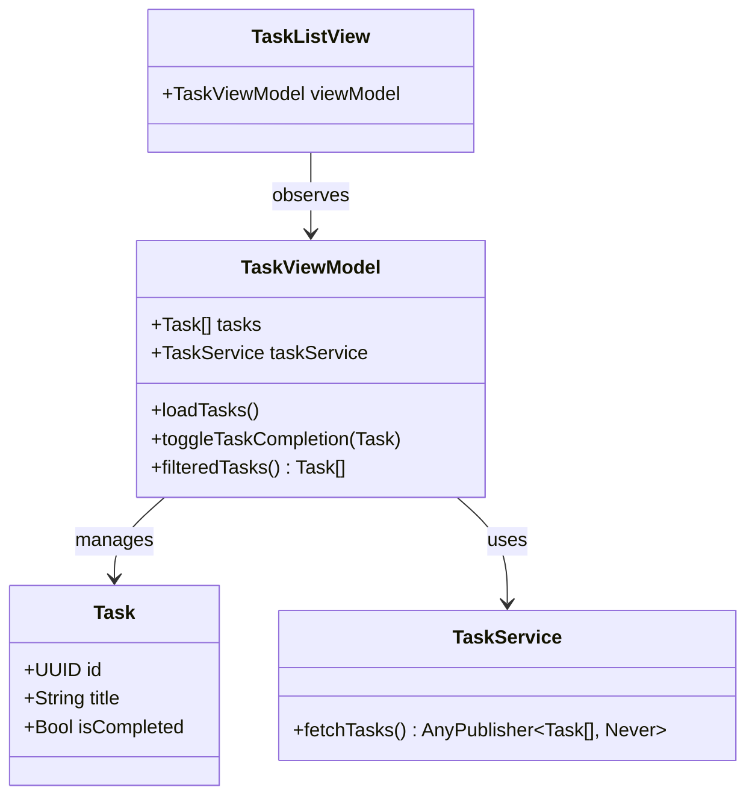

## 20.1 Building a Complex iOS App with MVVM and Combine

In this section, we will embark on a journey to build a complex iOS application using the Model-View-ViewModel (MVVM) architecture pattern alongside the Combine framework for reactive programming. By the end of this guide, you will have a solid understanding of how to implement MVVM in Swift, leverage Combine for data binding and asynchronous data handling, and manage app state and dependencies in a scalable manner.

### Introduction to MVVM and Combine

Before diving into the implementation, let's briefly explore the core concepts of MVVM and Combine, which are pivotal in building modern iOS applications.

#### What is MVVM?

**Model-View-ViewModel (MVVM)** is a software architectural pattern that facilitates the separation of the user interface (UI) from the business logic. It enhances the maintainability and testability of code by organizing it into three main components:

- **Model**: Represents the data and business logic of the application.
- **View**: Displays the UI and receives user interactions.
- **ViewModel**: Acts as an intermediary between the View and the Model, handling the presentation logic and data binding.

#### What is Combine?

**Combine** is a framework introduced by Apple that provides a declarative Swift API for processing values over time. It enables developers to handle asynchronous events by combining data streams and reacting to data changes in a functional reactive programming style.

### Setting Up the Project

Let's start by setting up a new Swift project in Xcode. Follow these steps:

1. **Open Xcode** and create a new project.
2. Choose **App** under iOS and click **Next**.
3. Enter a product name, select Swift as the language, and ensure the **Use SwiftUI** option is unchecked for now.
4. Set up your project directory and click **Create**.

Once your project is set up, let's integrate Combine and start building our MVVM architecture.

### Implementing MVVM Architecture

#### Designing the Model

The Model in MVVM represents the data structure and business logic. Let's create a simple data model for a hypothetical "Task Management" app.

```swift
import Foundation

struct Task: Identifiable {
    let id: UUID
    var title: String
    var isCompleted: Bool
}
```

This `Task` struct will serve as our data model, representing individual tasks with a unique identifier, title, and completion status.

#### Creating the ViewModel

The ViewModel is responsible for preparing data for the View and handling user interactions. It uses Combine to bind data to the UI reactively.

```swift
import Foundation
import Combine

class TaskViewModel: ObservableObject {
    @Published var tasks: [Task] = []
    private var cancellables = Set<AnyCancellable>()
    
    init() {
        loadTasks()
    }
    
    func loadTasks() {
        // Simulate loading tasks from a data source
        tasks = [
            Task(id: UUID(), title: "Buy groceries", isCompleted: false),
            Task(id: UUID(), title: "Walk the dog", isCompleted: true),
            Task(id: UUID(), title: "Read a book", isCompleted: false)
        ]
    }
    
    func toggleTaskCompletion(_ task: Task) {
        if let index = tasks.firstIndex(where: { $0.id == task.id }) {
            tasks[index].isCompleted.toggle()
        }
    }
}
```

In this `TaskViewModel`, we use the `@Published` property wrapper to automatically notify the View of changes to the `tasks` array. The `loadTasks()` method simulates fetching data, while `toggleTaskCompletion(_:)` updates the task's completion status.

#### Building the View

The View in MVVM displays data and interacts with the user. It observes the ViewModel for changes and updates the UI accordingly.

```swift
import SwiftUI

struct TaskListView: View {
    @ObservedObject var viewModel = TaskViewModel()
    
    var body: some View {
        NavigationView {
            List(viewModel.tasks) { task in
                TaskRow(task: task, toggleCompletion: {
                    viewModel.toggleTaskCompletion(task)
                })
            }
            .navigationTitle("Tasks")
        }
    }
}

struct TaskRow: View {
    let task: Task
    let toggleCompletion: () -> Void
    
    var body: some View {
        HStack {
            Text(task.title)
            Spacer()
            Button(action: toggleCompletion) {
                Image(systemName: task.isCompleted ? "checkmark.circle.fill" : "circle")
                    .foregroundColor(task.isCompleted ? .green : .red)
            }
        }
    }
}
```

In `TaskListView`, we use `@ObservedObject` to keep track of the `TaskViewModel`. The `TaskRow` view displays individual tasks and provides a button to toggle their completion status.

### Utilizing Combine for Reactive Programming

Combine allows us to handle asynchronous data streams and updates efficiently. Let's explore how we can leverage Combine to enhance our MVVM implementation.

#### Data Binding with Combine

The `@Published` property wrapper in the ViewModel automatically creates a `Publisher` that emits changes. The View subscribes to these changes and updates the UI accordingly.

```swift
@Published var tasks: [Task] = []
```

Whenever the `tasks` array is modified, the View is notified, and the UI is re-rendered.

#### Handling Asynchronous Data Streams

Combine provides operators to handle asynchronous data streams. Let's simulate fetching tasks from a network service using Combine.

```swift
import Foundation
import Combine

class TaskService {
    func fetchTasks() -> AnyPublisher<[Task], Never> {
        let tasks = [
            Task(id: UUID(), title: "Buy groceries", isCompleted: false),
            Task(id: UUID(), title: "Walk the dog", isCompleted: true),
            Task(id: UUID(), title: "Read a book", isCompleted: false)
        ]
        return Just(tasks)
            .delay(for: .seconds(2), scheduler: RunLoop.main)
            .eraseToAnyPublisher()
    }
}
```

In this `TaskService`, we use the `Just` publisher to emit a static array of tasks. The `delay` operator simulates a network delay, and `eraseToAnyPublisher` hides the specific type of the publisher.

#### Integrating Combine in the ViewModel

Let's update the `TaskViewModel` to use `TaskService` for fetching tasks asynchronously.

```swift
class TaskViewModel: ObservableObject {
    @Published var tasks: [Task] = []
    private var cancellables = Set<AnyCancellable>()
    private let taskService = TaskService()
    
    init() {
        loadTasks()
    }
    
    func loadTasks() {
        taskService.fetchTasks()
            .receive(on: DispatchQueue.main)
            .sink(receiveCompletion: { _ in }, receiveValue: { [weak self] tasks in
                self?.tasks = tasks
            })
            .store(in: &cancellables)
    }
    
    func toggleTaskCompletion(_ task: Task) {
        if let index = tasks.firstIndex(where: { $0.id == task.id }) {
            tasks[index].isCompleted.toggle()
        }
    }
}
```

We use the `sink` operator to subscribe to the task publisher and update the `tasks` array upon receiving new data. The `store(in:)` method manages the lifecycle of the subscription.

### Managing App State and Dependencies

Managing app state and dependencies is crucial in a complex iOS application. Let's explore how to handle these aspects effectively.

#### State Management

In our app, the `TaskViewModel` manages the state of tasks. We can extend this to handle more complex scenarios, such as filtering tasks or handling user authentication.

```swift
enum TaskFilter {
    case all, completed, pending
}

class TaskViewModel: ObservableObject {
    @Published var tasks: [Task] = []
    @Published var filter: TaskFilter = .all
    private var cancellables = Set<AnyCancellable>()
    private let taskService = TaskService()
    
    init() {
        loadTasks()
    }
    
    func loadTasks() {
        taskService.fetchTasks()
            .receive(on: DispatchQueue.main)
            .sink(receiveCompletion: { _ in }, receiveValue: { [weak self] tasks in
                self?.tasks = tasks
            })
            .store(in: &cancellables)
    }
    
    func toggleTaskCompletion(_ task: Task) {
        if let index = tasks.firstIndex(where: { $0.id == task.id }) {
            tasks[index].isCompleted.toggle()
        }
    }
    
    func filteredTasks() -> [Task] {
        switch filter {
        case .all:
            return tasks
        case .completed:
            return tasks.filter { $0.isCompleted }
        case .pending:
            return tasks.filter { !$0.isCompleted }
        }
    }
}
```

The `filteredTasks()` method returns tasks based on the selected filter. This approach allows us to manage app state more effectively.

#### Dependency Injection

Dependency injection is a design pattern that facilitates the decoupling of components by injecting dependencies at runtime. Let's apply dependency injection to our `TaskViewModel`.

```swift
class TaskViewModel: ObservableObject {
    @Published var tasks: [Task] = []
    private var cancellables = Set<AnyCancellable>()
    private let taskService: TaskService
    
    init(taskService: TaskService = TaskService()) {
        self.taskService = taskService
        loadTasks()
    }
    
    func loadTasks() {
        taskService.fetchTasks()
            .receive(on: DispatchQueue.main)
            .sink(receiveCompletion: { _ in }, receiveValue: { [weak self] tasks in
                self?.tasks = tasks
            })
            .store(in: &cancellables)
    }
    
    func toggleTaskCompletion(_ task: Task) {
        if let index = tasks.firstIndex(where: { $0.id == task.id }) {
            tasks[index].isCompleted.toggle()
        }
    }
}
```

By injecting `TaskService` through the initializer, we can easily replace it with a mock service for testing purposes.

### Visualizing the MVVM Architecture

To better understand the flow of data and interactions in our MVVM architecture, let's visualize the components and their relationships.



In this diagram, we see how the `TaskViewModel` manages `Task` data and interacts with `TaskService` to fetch tasks. The `TaskListView` observes the `TaskViewModel` for changes.

### Try It Yourself

Now that we've built a basic MVVM app with Combine, try experimenting with the code:

- **Add New Features**: Implement a feature to add new tasks or delete existing ones.
- **Enhance UI**: Customize the UI with SwiftUI views and animations.
- **Integrate Networking**: Replace the simulated task fetching with real network requests.
- **Test Your App**: Write unit tests for the ViewModel and TaskService.

### Conclusion

Building a complex iOS app with MVVM and Combine allows you to create scalable, maintainable, and reactive applications. By separating concerns and leveraging Combine for data binding and asynchronous operations, you can enhance the user experience and simplify code management.

Remember, this is just the beginning. As you progress, you'll build more complex and interactive applications. Keep experimenting, stay curious, and enjoy the journey!

## Quiz Time!



### What is the primary role of the ViewModel in the MVVM architecture?

- [x] To handle presentation logic and data binding between the Model and the View.
- [ ] To directly manipulate the UI elements.
- [ ] To store the application's persistent data.
- [ ] To manage network requests.

> **Explanation:** The ViewModel acts as an intermediary between the Model and the View, handling presentation logic and data binding.

### Which Swift framework is used for reactive programming in this guide?

- [ ] SwiftUI
- [ ] Foundation
- [x] Combine
- [ ] UIKit

> **Explanation:** Combine is the framework used for reactive programming in Swift, enabling data binding and handling of asynchronous events.

### How does the `@Published` property wrapper in Combine work?

- [x] It creates a Publisher that emits changes to the property, allowing the View to react to updates.
- [ ] It automatically saves the property to persistent storage.
- [ ] It ensures the property is thread-safe.
- [ ] It prevents the property from being modified.

> **Explanation:** The `@Published` property wrapper creates a Publisher that emits changes, allowing the View to react to updates.

### What is the purpose of the `sink` operator in Combine?

- [ ] To transform data streams.
- [x] To subscribe to a Publisher and handle emitted values.
- [ ] To filter data streams based on a condition.
- [ ] To combine multiple Publishers into one.

> **Explanation:** The `sink` operator is used to subscribe to a Publisher and handle emitted values and completion events.

### What is the benefit of using dependency injection in the ViewModel?

- [x] It allows for easier testing and decoupling of components.
- [ ] It increases the performance of the application.
- [ ] It simplifies the UI code.
- [ ] It automatically manages memory usage.

> **Explanation:** Dependency injection allows for easier testing and decoupling of components by injecting dependencies at runtime.

### In the MVVM pattern, which component is responsible for displaying data and interacting with the user?

- [ ] Model
- [ ] ViewModel
- [x] View
- [ ] Controller

> **Explanation:** The View is responsible for displaying data and interacting with the user in the MVVM pattern.

### How can you simulate a network delay in Combine?

- [ ] By using the `map` operator.
- [ ] By using the `filter` operator.
- [x] By using the `delay` operator.
- [ ] By using the `merge` operator.

> **Explanation:** The `delay` operator is used to simulate a network delay in Combine by delaying the emission of values.

### What does the `eraseToAnyPublisher` method do in Combine?

- [ ] It cancels all subscriptions to a Publisher.
- [x] It hides the specific type of a Publisher, returning a type-erased Publisher.
- [ ] It combines multiple Publishers into one.
- [ ] It filters out unwanted values from a Publisher.

> **Explanation:** The `eraseToAnyPublisher` method hides the specific type of a Publisher, returning a type-erased Publisher.

### Which of the following is NOT a component of the MVVM architecture?

- [ ] Model
- [ ] View
- [ ] ViewModel
- [x] Controller

> **Explanation:** The Controller is not a component of the MVVM architecture; it is part of the MVC pattern.

### True or False: The Combine framework can only be used with SwiftUI.

- [ ] True
- [x] False

> **Explanation:** False. The Combine framework can be used with both SwiftUI and UIKit, as it is a general-purpose reactive programming framework.


