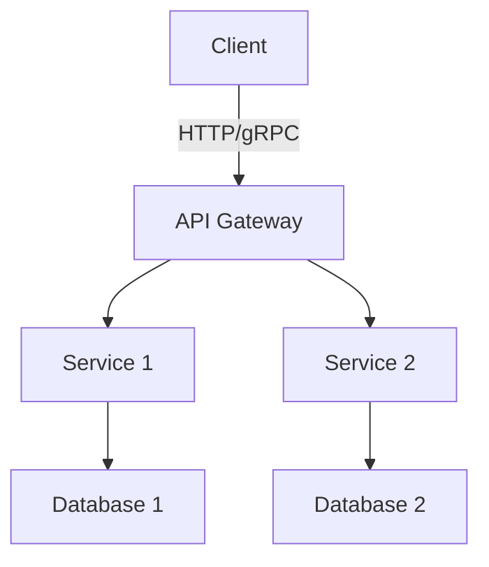

## 20.10 Implementing Microservices with SwiftNIO

In this section, we will delve into the world of microservices architecture using SwiftNIO. We'll explore how to design and implement non-blocking, event-driven servers, enabling you to build scalable, efficient, and high-performance applications. By the end of this guide, you will have a comprehensive understanding of how to leverage SwiftNIO for microservices, handle concurrency, and deploy your services for high availability.

### Understanding SwiftNIO

SwiftNIO is a powerful framework for building event-driven network applications in Swift. It provides the essential tools for creating non-blocking, asynchronous servers and clients. SwiftNIO is inspired by Netty, a popular Java networking library, and brings similar capabilities to the Swift ecosystem.

#### Key Features of SwiftNIO

- **Event-Driven Architecture**: SwiftNIO uses an event-driven model, where events trigger actions, allowing for efficient handling of I/O operations.
- **Non-Blocking I/O**: It supports non-blocking I/O, which means threads are not blocked waiting for I/O operations to complete, improving scalability.
- **Concurrency**: SwiftNIO efficiently manages concurrency, allowing multiple tasks to run simultaneously without interfering with each other.

### Designing Microservices Architecture with Swift

Microservices architecture involves breaking down an application into small, independent services that communicate with each other. Each service is responsible for a specific business capability and can be developed, deployed, and scaled independently.

#### Benefits of Microservices

- **Scalability**: Services can be scaled independently based on demand.
- **Flexibility**: Different services can be written in different languages and technologies.
- **Resilience**: Failure in one service does not affect the entire system.

#### Key Components of Microservices

1. **Service Discovery**: Mechanism for services to find each other.
2. **API Gateway**: Acts as a single entry point for all client requests.
3. **Inter-Service Communication**: Protocols like HTTP, gRPC, or message brokers for communication.
4. **Data Management**: Each service manages its own database.

### Building a Microservice with SwiftNIO

Let's walk through the process of building a simple microservice using SwiftNIO. We'll create a basic HTTP server to demonstrate the core concepts.

#### Setting Up Your Project

First, create a new Swift package:

```bash
swift package init --type executable
```

Add SwiftNIO as a dependency in your `Package.swift` file:

```swift
// swift-tools-version:5.5
import PackageDescription

let package = Package(
    name: "Microservice",
    dependencies: [
        .package(url: "https://github.com/apple/swift-nio.git", from: "2.32.0"),
    ],
    targets: [
        .target(
            name: "Microservice",
            dependencies: ["NIO", "NIOHTTP1"]),
    ]
)
```

#### Implementing the HTTP Server

Here's a simple implementation of an HTTP server using SwiftNIO:

```swift
import NIO
import NIOHTTP1

final class HTTPHandler: ChannelInboundHandler {
    typealias InboundIn = HTTPServerRequestPart
    typealias OutboundOut = HTTPServerResponsePart

    func channelRead(context: ChannelHandlerContext, data: NIOAny) {
        let reqPart = self.unwrapInboundIn(data)
        switch reqPart {
        case .head(let request):
            print("Received request: \\(request.uri)")
        case .body:
            break
        case .end:
            let responseHead = HTTPResponseHead(version: request.version, status: .ok)
            context.write(self.wrapOutboundOut(.head(responseHead)), promise: nil)

            var buffer = context.channel.allocator.buffer(capacity: 0)
            buffer.writeString("Hello, World!")
            context.write(self.wrapOutboundOut(.body(.byteBuffer(buffer))), promise: nil)

            context.writeAndFlush(self.wrapOutboundOut(.end(nil)), promise: nil)
        }
    }
}

let group = MultiThreadedEventLoopGroup(numberOfThreads: System.coreCount)
let bootstrap = ServerBootstrap(group: group)
    .serverChannelOption(ChannelOptions.backlog, value: 256)
    .childChannelInitializer { channel in
        channel.pipeline.configureHTTPServerPipeline().flatMap {
            channel.pipeline.addHandler(HTTPHandler())
        }
    }
    .bind(host: "localhost", port: 8080)

defer {
    try! group.syncShutdownGracefully()
}

try! bootstrap.wait()
```

### Communication Between Services Using Protocols Like gRPC

In a microservices architecture, services need to communicate efficiently. While HTTP/REST is common, gRPC offers advantages like efficient binary serialization and built-in support for bi-directional streaming.

#### Setting Up gRPC with SwiftNIO

To use gRPC, add the `swift-grpc` package to your project:

```swift
.package(url: "https://github.com/grpc/grpc-swift.git", from: "1.0.0"),
```

Define your service in a `.proto` file:

```proto
syntax = "proto3";

service Greeter {
  rpc SayHello (HelloRequest) returns (HelloReply) {}
}

message HelloRequest {
  string name = 1;
}

message HelloReply {
  string message = 1;
}
```

Generate Swift code using the `protoc` compiler and implement the service:

```swift
import GRPC
import NIO

class GreeterProvider: GreeterProvider {
    func sayHello(request: HelloRequest, context: StatusOnlyCallContext) -> EventLoopFuture<HelloReply> {
        let response = HelloReply.with {
            $0.message = "Hello \\(request.name)"
        }
        return context.eventLoop.makeSucceededFuture(response)
    }
}
```

### Handling Concurrency and Scalability

Concurrency is crucial for building scalable microservices. SwiftNIO's event-driven model allows you to handle multiple connections efficiently.

#### Event Loops and Channels

- **Event Loops**: Manage the lifecycle of events. Each thread in SwiftNIO has its own event loop.
- **Channels**: Represent a connection, such as a TCP connection.

#### Scaling Your Services

- **Horizontal Scaling**: Run multiple instances of your service.
- **Load Balancing**: Distribute requests across instances to prevent overload.

### Deployment Strategies for High Availability

Deploying microservices requires careful planning to ensure high availability and resilience.

#### Containerization with Docker

Docker allows you to package your service and its dependencies into a container, making it easy to deploy and scale.

```dockerfile
FROM swift:5.5
WORKDIR /app
COPY . .
RUN swift build -c release
CMD ["./.build/release/Microservice"]
```

#### Orchestration with Kubernetes

Kubernetes automates deployment, scaling, and management of containerized applications. Define your service in a `Deployment` file:

```yaml
apiVersion: apps/v1
kind: Deployment
metadata:
  name: microservice
spec:
  replicas: 3
  selector:
    matchLabels:
      app: microservice
  template:
    metadata:
      labels:
        app: microservice
    spec:
      containers:
      - name: microservice
        image: microservice:latest
        ports:
        - containerPort: 8080
```

### Try It Yourself

Experiment with the code examples provided. Try modifying the HTTP server to add additional routes or implement a new gRPC service. Explore deploying your microservice using Docker and Kubernetes to understand the deployment process better.

### Visualizing Microservices Architecture

Let's visualize the architecture of a microservices system using SwiftNIO and gRPC:



This diagram illustrates how a client interacts with an API Gateway, which routes requests to different services. Each service manages its own database, ensuring data isolation and independence.

### Knowledge Check

- Explain the benefits of using SwiftNIO for building microservices.
- Describe how gRPC can improve inter-service communication.
- Discuss the importance of concurrency in microservices architecture.
- What are the advantages of containerization and orchestration in deploying microservices?

### Summary

In this section, we've explored how to implement microservices using SwiftNIO. We've covered the fundamentals of designing microservices architecture, implementing a basic HTTP server, and using gRPC for inter-service communication. We've also discussed handling concurrency and deploying services for high availability. Remember, building microservices is an iterative process. Keep experimenting, stay curious, and enjoy the journey of mastering SwiftNIO and microservices architecture!

## Quiz Time!



### What is SwiftNIO primarily used for?

- [x] Building non-blocking, event-driven network applications
- [ ] Creating graphical user interfaces
- [ ] Managing databases
- [ ] Developing machine learning models

> **Explanation:** SwiftNIO is designed for building non-blocking, event-driven network applications, providing efficient handling of I/O operations.

### Which protocol is commonly used for inter-service communication in microservices architecture?

- [ ] FTP
- [ ] SMTP
- [x] gRPC
- [ ] POP3

> **Explanation:** gRPC is commonly used for inter-service communication due to its efficient binary serialization and support for bi-directional streaming.

### What is a key benefit of microservices architecture?

- [x] Scalability
- [ ] Increased complexity
- [ ] Monolithic design
- [ ] Reduced flexibility

> **Explanation:** Microservices architecture allows for scalability, as services can be independently scaled based on demand.

### What does Docker provide for microservices deployment?

- [ ] Database management
- [ ] User authentication
- [x] Containerization
- [ ] Network security

> **Explanation:** Docker provides containerization, allowing services and their dependencies to be packaged into containers for easy deployment and scaling.

### How does SwiftNIO handle concurrency?

- [ ] By blocking threads
- [x] Through event-driven architecture
- [ ] By using global variables
- [ ] Through synchronous operations

> **Explanation:** SwiftNIO handles concurrency through an event-driven architecture, allowing multiple tasks to run simultaneously without blocking threads.

### What is the purpose of an API Gateway in microservices?

- [x] To act as a single entry point for client requests
- [ ] To manage databases
- [ ] To provide user interfaces
- [ ] To handle file storage

> **Explanation:** An API Gateway acts as a single entry point for client requests, routing them to the appropriate services.

### What is a benefit of using gRPC over HTTP/REST?

- [ ] Simplicity
- [x] Efficient binary serialization
- [ ] Text-based communication
- [ ] Limited scalability

> **Explanation:** gRPC offers efficient binary serialization, which can improve performance over text-based HTTP/REST communication.

### What is a common method for scaling microservices?

- [ ] Vertical scaling
- [x] Horizontal scaling
- [ ] Reducing service instances
- [ ] Increasing database size

> **Explanation:** Horizontal scaling involves running multiple instances of a service to handle increased load, a common method for scaling microservices.

### What does Kubernetes automate in microservices deployment?

- [ ] User authentication
- [ ] Data encryption
- [x] Deployment, scaling, and management
- [ ] Code compilation

> **Explanation:** Kubernetes automates the deployment, scaling, and management of containerized applications, making it ideal for microservices deployment.

### True or False: Each microservice should manage its own database.

- [x] True
- [ ] False

> **Explanation:** In microservices architecture, each service should manage its own database to ensure data isolation and independence.




