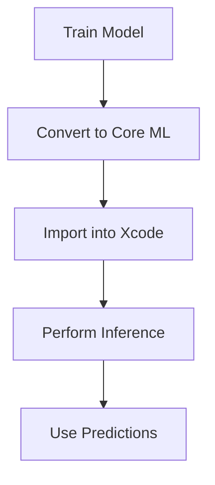

## 20.11 Integrating Machine Learning with Core ML

Integrating machine learning into iOS applications has become increasingly accessible with Apple's Core ML framework. Core ML allows developers to incorporate pre-trained machine learning models into their apps, enabling functionalities like image recognition, natural language processing, and more, all while maintaining user privacy by performing inference directly on the device. In this guide, we will explore the process of integrating machine learning models with Core ML, covering model preparation, on-device inference, and practical use cases. 

### Introduction to Core ML

Core ML is Apple's machine learning framework designed to integrate machine learning models into iOS, macOS, watchOS, and tvOS applications. It supports a variety of model types, including neural networks, tree ensembles, and support vector machines, among others. Core ML models are optimized for on-device performance, ensuring that machine learning tasks are executed efficiently and securely without the need for a network connection.

#### Key Features of Core ML

- **On-device Inference:** Core ML performs inference directly on the device, enhancing performance and ensuring user data privacy.
- **Model Optimization:** Models are optimized for Apple's hardware, leveraging the CPU, GPU, and Neural Engine for efficient execution.
- **Broad Model Support:** Core ML supports a wide range of model formats, including those from TensorFlow, PyTorch, and scikit-learn.
- **Ease of Integration:** Core ML models can be easily integrated into Swift applications using the Core ML framework.

### Preparing and Importing Models into Core ML

Before integrating a machine learning model into your application, you need to prepare it for use with Core ML. This involves training a model using a machine learning framework, converting it to the Core ML format, and importing it into your Xcode project.

#### Training and Exporting Models

1. **Train Your Model:** Use a machine learning framework such as TensorFlow, PyTorch, or scikit-learn to train your model on the desired dataset. Ensure that the model is trained to a satisfactory level of accuracy and performance.

2. **Convert to Core ML Format:** Once the model is trained, convert it to the Core ML format (`.mlmodel`). Apple provides tools such as `coremltools` for converting models from popular frameworks into the Core ML format.

   ```python
   # Example: Converting a TensorFlow model to Core ML
   import coremltools as ct
   import tensorflow as tf

   # Load the TensorFlow model
   model = tf.keras.models.load_model('my_model.h5')

   # Convert to Core ML
   coreml_model = ct.convert(model)
   coreml_model.save('MyModel.mlmodel')
   ```

3. **Import into Xcode:** Add the `.mlmodel` file to your Xcode project. Xcode will automatically generate a Swift class for the model, which you can use to perform inference.

#### Performing Inference on-device

Once the model is imported into your project, you can use it to perform inference. This involves passing input data to the model and retrieving the output predictions.

```swift
import CoreML

// Load the model
guard let model = try? MyModel(configuration: MLModelConfiguration()) else {
    fatalError("Failed to load model")
}

// Prepare input data
let input = MyModelInput(data: /* Your input data */)

// Perform inference
guard let output = try? model.prediction(input: input) else {
    fatalError("Failed to perform inference")
}

// Use the output
print("Prediction: \\(output.classLabel)")
```

### Use Cases for Core ML

Core ML can be used in a variety of applications, from image recognition to natural language processing. Here are some common use cases:

#### Image Recognition

Image recognition is one of the most popular applications of machine learning. With Core ML, you can build apps that recognize objects, scenes, or even faces in images.

```swift
import CoreML
import Vision

// Load the Core ML model
guard let model = try? VNCoreMLModel(for: MyImageRecognitionModel().model) else {
    fatalError("Failed to load model")
}

// Create a request
let request = VNCoreMLRequest(model: model) { request, error in
    guard let results = request.results as? [VNClassificationObservation] else {
        fatalError("Unexpected result type")
    }
    if let firstResult = results.first {
        print("Detected: \\(firstResult.identifier) with confidence \\(firstResult.confidence)")
    }
}

// Perform the request
let handler = VNImageRequestHandler(ciImage: ciImage, options: [:])
try? handler.perform([request])
```

#### Natural Language Processing (NLP)

Core ML can also be used for NLP tasks such as sentiment analysis, language translation, or text classification.

```swift
import CoreML

// Load the NLP model
guard let model = try? MyNLPModel(configuration: MLModelConfiguration()) else {
    fatalError("Failed to load model")
}

// Prepare the input text
let inputText = "This is a sample text for sentiment analysis."

// Perform inference
guard let output = try? model.prediction(text: inputText) else {
    fatalError("Failed to perform inference")
}

print("Sentiment: \\(output.sentimentLabel)")
```

### Updating Models and Handling Versioning

As your application evolves, you may need to update your machine learning models to improve accuracy or adapt to new data. Core ML makes it easy to manage model updates and handle versioning.

1. **Versioning Models:** Keep track of model versions by using descriptive filenames or incorporating version numbers in the model metadata. This will help you manage updates and ensure compatibility with your application.

2. **Updating Models:** To update a model, simply replace the existing `.mlmodel` file in your Xcode project with the new version. Ensure that the new model is compatible with the existing input and output interfaces.

3. **Testing Updated Models:** Before deploying an updated model, thoroughly test it to ensure that it performs as expected and does not introduce regressions.

### Design Considerations

When integrating machine learning models with Core ML, consider the following:

- **Model Size:** Larger models may consume more memory and processing power. Optimize your models to balance performance and accuracy.
- **Privacy:** Core ML performs inference on-device, enhancing privacy by keeping user data local. Ensure that your models adhere to privacy guidelines.
- **Performance:** Test your models on target devices to ensure they perform efficiently. Consider using the GPU or Neural Engine for complex models.

### Swift Unique Features

Swift's type safety, optionals, and error handling make it a robust language for integrating machine learning models. Utilize Swift's features to handle model inputs and outputs safely and efficiently.

### Differences and Similarities with Other Patterns

While Core ML is specific to machine learning, it shares similarities with other design patterns in its emphasis on modularity and encapsulation. Like the Factory Method pattern, Core ML abstracts the complexity of model inference, allowing developers to focus on application logic.

### Try It Yourself

Experiment with the provided code examples by modifying the input data or trying different models. Explore Apple's [Core ML documentation](https://developer.apple.com/documentation/coreml) for more information on supported model types and conversion tools.

### Visualizing Core ML Integration



**Figure 1:** Visualizing the process of integrating machine learning models with Core ML.

## Quiz Time!



### What is the primary advantage of using Core ML for machine learning on iOS devices?

- [x] On-device inference for enhanced performance and privacy
- [ ] Cloud-based processing for scalability
- [ ] Simplified model training
- [ ] Automatic model updates

> **Explanation:** Core ML performs inference directly on the device, which enhances performance and maintains user privacy by keeping data local.

### Which tool can be used to convert a TensorFlow model to Core ML format?

- [x] coremltools
- [ ] TensorFlow Lite
- [ ] PyTorch
- [ ] Keras

> **Explanation:** `coremltools` is a tool provided by Apple to convert models from various frameworks, including TensorFlow, into the Core ML format.

### What is a common use case for Core ML in iOS applications?

- [x] Image recognition
- [ ] Database management
- [ ] File compression
- [ ] Network routing

> **Explanation:** Image recognition is a common use case for Core ML, allowing apps to identify objects or scenes in images.

### How can you update a Core ML model in your Xcode project?

- [x] Replace the existing `.mlmodel` file with the new version
- [ ] Modify the model's source code directly in Xcode
- [ ] Use a script to patch the model
- [ ] Update the model via the App Store

> **Explanation:** To update a Core ML model, you replace the existing `.mlmodel` file in your Xcode project with the new version, ensuring compatibility with the app.

### What should you consider when handling model versioning in Core ML?

- [x] Use descriptive filenames or metadata for version tracking
- [ ] Store models in a database
- [ ] Encrypt all model files
- [ ] Use a version control system

> **Explanation:** Using descriptive filenames or metadata helps manage model versions and ensures compatibility with the application.

### Which Swift feature is particularly useful for handling Core ML model inputs and outputs?

- [x] Optionals
- [ ] Extensions
- [ ] Protocols
- [ ] Tuples

> **Explanation:** Swift's optionals are useful for safely handling model inputs and outputs, ensuring that the code can gracefully handle missing or unexpected data.

### What is the role of the Neural Engine in Core ML?

- [x] Enhancing model inference performance
- [ ] Training models on-device
- [ ] Managing model updates
- [ ] Providing cloud-based storage

> **Explanation:** The Neural Engine is used to enhance the performance of model inference by accelerating computations on supported devices.

### What is a potential drawback of using large models with Core ML?

- [x] Increased memory and processing power consumption
- [ ] Reduced model accuracy
- [ ] Slower conversion to Core ML format
- [ ] Inability to perform on-device inference

> **Explanation:** Larger models may consume more memory and processing power, which can affect the performance of the application.

### Which of the following is NOT a supported model format for Core ML?

- [ ] Neural networks
- [ ] Tree ensembles
- [ ] Support vector machines
- [x] Blockchain models

> **Explanation:** Core ML supports neural networks, tree ensembles, and support vector machines, but not blockchain models.

### True or False: Core ML requires an internet connection to perform inference.

- [ ] True
- [x] False

> **Explanation:** Core ML performs inference on-device, so it does not require an internet connection.



Remember, this is just the beginning of your journey with Core ML. As you continue to explore, you'll discover more advanced techniques and use cases for integrating machine learning into your iOS applications. Keep experimenting, stay curious, and enjoy the journey!


