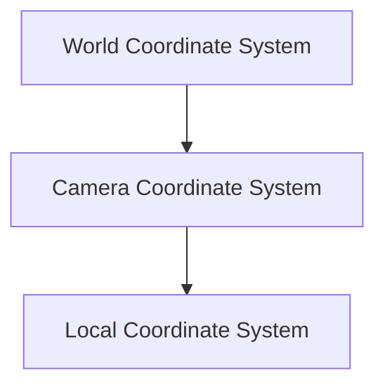

## 20.12 Creating an Augmented Reality Experience with ARKit

Augmented Reality (AR) has revolutionized the way we interact with digital content, blending virtual elements with the real world. Apple's ARKit is a powerful framework that allows developers to create immersive AR experiences on iOS devices. In this guide, we will explore the essential components of building AR applications using ARKit, including scene management, coordinate systems, 3D model integration, animations, user interactions, and best practices for crafting engaging AR experiences.

### Understanding Scene Management and Coordinate Systems

#### SceneKit and ARKit Integration

ARKit leverages SceneKit, a high-level 3D graphics framework, to render and manage 3D content. Understanding how these frameworks interact is crucial for effective scene management.

- **SceneKit Basics**: SceneKit provides a scene graph architecture, where scenes consist of nodes arranged in a hierarchy. Each node can have geometry, lights, cameras, and other attributes.
- **ARSCNView**: ARKit uses ARSCNView, a subclass of SceneKit's SCNView, to display AR content. It combines SceneKit's rendering capabilities with ARKit's tracking and camera functionalities.

```swift
import ARKit
import SceneKit

class ARViewController: UIViewController, ARSCNViewDelegate {
    var sceneView: ARSCNView!

    override func viewDidLoad() {
        super.viewDidLoad()

        // Initialize ARSCNView
        sceneView = ARSCNView(frame: self.view.frame)
        self.view.addSubview(sceneView)

        // Set the scene to the view
        sceneView.scene = SCNScene()

        // Set the delegate
        sceneView.delegate = self
    }
}
```

**Explanation**: Here, we initialize an `ARSCNView`, set up a basic scene, and assign a delegate to handle AR session events.

#### Coordinate Systems

Understanding ARKit's coordinate systems is vital for positioning objects accurately in the real world.

- **World Coordinate System**: Origin is at the device's initial position when the AR session starts. It uses meters as units.
- **Camera Coordinate System**: Origin is at the camera's position, with axes aligned to the device.
- **Local Coordinate System**: Each node has its own local coordinate system relative to its parent.

**Visualizing Coordinate Systems**:



**Caption**: The hierarchy of coordinate systems in ARKit, showing how local systems relate to the world and camera systems.

### Incorporating 3D Models and Animations

#### Importing 3D Models

ARKit supports various 3D model formats, including `.dae` (Collada), `.scn` (SceneKit), and `.usdz` (Universal Scene Description).

- **Using `.scn` Files**: SceneKit's native format, `.scn`, is efficient for AR applications.
- **Loading Models**: Use `SCNScene` to load models and add them to the scene graph.

```swift
func loadModel() {
    guard let modelScene = SCNScene(named: "art.scnassets/model.scn") else { return }
    let modelNode = modelScene.rootNode.childNode(withName: "model", recursively: true)
    sceneView.scene.rootNode.addChildNode(modelNode!)
}
```

**Explanation**: This code snippet demonstrates loading a 3D model from the app's assets and adding it to the scene.

#### Animating 3D Models

Animations enhance the interactivity of AR experiences. SceneKit supports keyframe and skeletal animations.

- **Keyframe Animations**: Use `CAKeyframeAnimation` for simple transformations.
- **Skeletal Animations**: Use `SCNAnimation` for complex character animations.

```swift
func animateModel(node: SCNNode) {
    let rotation = CABasicAnimation(keyPath: "rotation")
    rotation.fromValue = SCNVector4(0, 1, 0, 0)
    rotation.toValue = SCNVector4(0, 1, 0, Float.pi * 2)
    rotation.duration = 5
    rotation.repeatCount = .infinity
    node.addAnimation(rotation, forKey: "spin")
}
```

**Explanation**: This example rotates a model continuously, creating a spinning effect.

### Handling User Interactions in an AR Environment

#### Gesture Recognizers

User interactions in AR are primarily handled through gestures. ARKit supports various gesture recognizers, including tap, pan, and pinch.

- **Tap Gesture**: Detect taps to select or interact with virtual objects.
- **Pinch Gesture**: Use pinch gestures to scale objects.

```swift
let tapGesture = UITapGestureRecognizer(target: self, action: #selector(handleTap(_:)))
sceneView.addGestureRecognizer(tapGesture)

@objc func handleTap(_ gestureRecognize: UIGestureRecognizer) {
    let location = gestureRecognize.location(in: sceneView)
    let hitResults = sceneView.hitTest(location, options: nil)
    if let result = hitResults.first {
        let node = result.node
        // Perform actions on the node
    }
}
```

**Explanation**: This code sets up a tap gesture recognizer to detect taps on virtual objects and perform actions on them.

#### Physics and Collision Detection

Incorporating physics into AR experiences can make interactions more realistic. SceneKit provides a physics engine for handling collisions and dynamics.

- **Physics Bodies**: Assign physics bodies to nodes to enable collision detection.
- **Collision Detection**: Use physics contacts to respond to collisions.

```swift
func setupPhysics(node: SCNNode) {
    node.physicsBody = SCNPhysicsBody(type: .dynamic, shape: nil)
    node.physicsBody?.categoryBitMask = 1
    node.physicsBody?.contactTestBitMask = 1
    node.physicsBody?.collisionBitMask = 1
}
```

**Explanation**: This example assigns a dynamic physics body to a node, enabling it to participate in collisions.

### Best Practices for Creating Immersive AR Experiences

#### Performance Optimization

- **Efficient Rendering**: Minimize the number of nodes and draw calls to maintain performance.
- **Resource Management**: Load resources asynchronously and release them when no longer needed.

#### User Experience Design

- **Natural Interactions**: Design interactions that mimic real-world behaviors.
- **Clear Feedback**: Provide visual or haptic feedback for user actions.

#### Testing and Iteration

- **Test in Real Environments**: Test AR applications in various lighting conditions and environments.
- **Iterate Based on Feedback**: Use user feedback to refine and improve the AR experience.

### Try It Yourself

Experiment with the code examples provided by:

- Modifying the 3D model's position and scale.
- Adding new animations to enhance interactivity.
- Implementing additional gesture recognizers for complex interactions.

### Knowledge Check

- Explain the role of `ARSCNView` in ARKit applications.
- Describe how coordinate systems are used in ARKit.
- Demonstrate how to import and animate a 3D model.
- Discuss the importance of user interactions in AR experiences.
- List best practices for optimizing AR performance.

### Embrace the Journey

Creating AR experiences with ARKit is an exciting journey that blends creativity with technical skills. Remember, this is just the beginning. As you progress, you'll build more complex and interactive AR applications. Keep experimenting, stay curious, and enjoy the journey!

## Quiz Time!



### What is the primary role of ARSCNView in ARKit?

- [x] To render and display AR content using SceneKit.
- [ ] To manage user input and gestures.
- [ ] To handle network communications.
- [ ] To manage device sensors.

> **Explanation:** ARSCNView is responsible for rendering and displaying AR content by integrating SceneKit's rendering capabilities with ARKit's tracking and camera functionalities.

### Which file format is native to SceneKit for 3D models?

- [x] .scn
- [ ] .dae
- [ ] .usdz
- [ ] .obj

> **Explanation:** The .scn file format is native to SceneKit, providing an efficient way to store and render 3D models in AR applications.

### How are coordinate systems structured in ARKit?

- [x] World, Camera, and Local coordinate systems.
- [ ] Global, Local, and Screen coordinate systems.
- [ ] Device, User, and Object coordinate systems.
- [ ] Absolute, Relative, and Mixed coordinate systems.

> **Explanation:** ARKit uses World, Camera, and Local coordinate systems to position objects accurately in the real world.

### What gesture recognizer is typically used to detect taps on virtual objects?

- [x] UITapGestureRecognizer
- [ ] UIPinchGestureRecognizer
- [ ] UISwipeGestureRecognizer
- [ ] UIRotationGestureRecognizer

> **Explanation:** UITapGestureRecognizer is used to detect taps on virtual objects, allowing for interaction with AR content.

### What is a key consideration for optimizing AR performance?

- [x] Minimizing the number of nodes and draw calls.
- [ ] Increasing the number of animations.
- [ ] Using high-resolution textures.
- [ ] Adding more complex physics simulations.

> **Explanation:** Minimizing the number of nodes and draw calls helps maintain performance by reducing the computational load on the device.

### How can user experience be enhanced in AR applications?

- [x] By providing clear feedback for user actions.
- [ ] By using complex animations.
- [ ] By adding more 3D models.
- [ ] By increasing the app's complexity.

> **Explanation:** Providing clear feedback, such as visual or haptic responses, enhances user experience by making interactions more intuitive and satisfying.

### Which of the following is a best practice for resource management in AR applications?

- [x] Loading resources asynchronously and releasing them when no longer needed.
- [ ] Loading all resources at the start of the application.
- [ ] Keeping all resources in memory for quick access.
- [ ] Using synchronous loading for faster performance.

> **Explanation:** Loading resources asynchronously and releasing them when no longer needed helps manage memory efficiently and improves app performance.

### What is the purpose of assigning physics bodies to nodes in SceneKit?

- [x] To enable collision detection and dynamics.
- [ ] To improve rendering performance.
- [ ] To enhance visual effects.
- [ ] To simplify user interactions.

> **Explanation:** Assigning physics bodies to nodes enables collision detection and dynamics, allowing for realistic interactions in AR environments.

### Why is it important to test AR applications in real environments?

- [x] To ensure functionality under various lighting conditions and environments.
- [ ] To save time during development.
- [ ] To reduce the need for user feedback.
- [ ] To simplify the testing process.

> **Explanation:** Testing in real environments ensures that AR applications function correctly under different lighting conditions and environments, providing a better user experience.

### True or False: ARKit can only be used for gaming applications.

- [ ] True
- [x] False

> **Explanation:** False. ARKit can be used for a wide range of applications beyond gaming, including education, retail, healthcare, and more.


