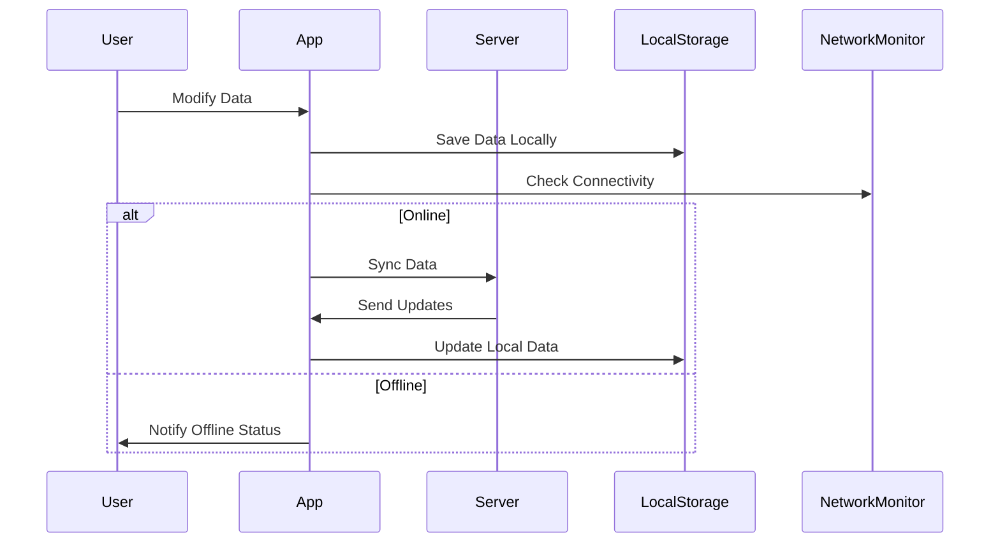

## 20.13 Handling Offline Capabilities and Data Synchronization

In today's world, users expect apps to function seamlessly, even without constant internet connectivity. Implementing offline capabilities and data synchronization in your Swift apps is crucial for providing a robust user experience. In this section, we'll explore various techniques and design patterns to achieve this, including local data storage, data synchronization with servers, conflict resolution, and user experience considerations.

### Understanding Offline Capabilities

Offline capabilities refer to an application's ability to function without an active internet connection. This involves storing data locally on the device and synchronizing it with a remote server once connectivity is restored. Implementing offline capabilities can significantly enhance user experience by ensuring that users can continue to use the app without interruption.

### Local Data Storage

To implement offline capabilities, the first step is to store data locally. Two popular choices for local data storage in Swift are Core Data and Realm. Let's explore how to use each of these frameworks.

#### Core Data

Core Data is Apple's object graph and persistence framework. It's a powerful tool for managing the model layer of your application. Here's how you can set up Core Data for offline storage:

```swift
import CoreData

// Define your data model
@objc(User)
public class User: NSManagedObject {
    @NSManaged public var id: UUID
    @NSManaged public var name: String
    @NSManaged public var email: String
}

// Set up Core Data stack
class CoreDataStack {
    static let shared = CoreDataStack()
    private init() {}

    lazy var persistentContainer: NSPersistentContainer = {
        let container = NSPersistentContainer(name: "Model")
        container.loadPersistentStores { _, error in
            if let error = error {
                fatalError("Unresolved error \\(error)")
            }
        }
        return container
    }()

    var context: NSManagedObjectContext {
        return persistentContainer.viewContext
    }
}

// Save data
func saveUser(id: UUID, name: String, email: String) {
    let user = User(context: CoreDataStack.shared.context)
    user.id = id
    user.name = name
    user.email = email

    do {
        try CoreDataStack.shared.context.save()
    } catch {
        print("Failed to save user: \\(error)")
    }
}
```

Core Data is ideal for complex data models and relationships. However, it can be overkill for simple data storage needs.

#### Realm

Realm is another popular choice for local data storage. It's known for its simplicity and speed. Here's how you can use Realm to store data offline:

```swift
import RealmSwift

// Define your data model
class User: Object {
    @Persisted(primaryKey: true) var id: UUID
    @Persisted var name: String
    @Persisted var email: String
}

// Save data
func saveUser(id: UUID, name: String, email: String) {
    let user = User()
    user.id = id
    user.name = name
    user.email = email

    let realm = try! Realm()
    try! realm.write {
        realm.add(user)
    }
}
```

Realm is particularly useful for apps that require high performance and simplicity. It allows for easy migrations and is well-suited for mobile applications.

### Synchronizing Data with Servers

Once you have local data storage in place, the next step is to synchronize data with a remote server. This involves sending local changes to the server and updating local data with changes from the server.

#### Network Reachability

Before attempting to sync data, it's important to check network reachability. You can use Apple's Network framework or third-party libraries like ReachabilitySwift to monitor network status.

```swift
import Network

let monitor = NWPathMonitor()
monitor.pathUpdateHandler = { path in
    if path.status == .satisfied {
        print("We're connected!")
        // Trigger data synchronization
    } else {
        print("No connection.")
    }
}
let queue = DispatchQueue(label: "NetworkMonitor")
monitor.start(queue: queue)
```

#### Data Synchronization

Data synchronization involves sending local changes to the server and receiving updates from the server. This can be done using URLSession for network requests.

```swift
func syncData() {
    // Prepare data to be sent to the server
    let users = fetchLocalUsers()
    let jsonData = try? JSONEncoder().encode(users)

    // Create a URL request
    var request = URLRequest(url: URL(string: "https://api.example.com/sync")!)
    request.httpMethod = "POST"
    request.httpBody = jsonData
    request.setValue("application/json", forHTTPHeaderField: "Content-Type")

    // Send the request
    let task = URLSession.shared.dataTask(with: request) { data, response, error in
        if let error = error {
            print("Failed to sync data: \\(error)")
            return
        }

        // Handle server response
        if let data = data {
            let serverUsers = try? JSONDecoder().decode([User].self, from: data)
            updateLocalData(with: serverUsers)
        }
    }
    task.resume()
}
```

### Conflict Resolution Strategies

When synchronizing data, conflicts may arise if the same data is modified both locally and on the server. It's important to implement conflict resolution strategies to handle these situations.

#### Last Write Wins

In the Last Write Wins strategy, the most recent change is considered the correct one. This is a simple approach but may lead to data loss if not handled carefully.

```swift
func resolveConflict(localUser: User, serverUser: User) -> User {
    return localUser.lastModified > serverUser.lastModified ? localUser : serverUser
}
```

#### Merge Changes

A more sophisticated approach is to merge changes from both the local and server versions. This requires a deeper understanding of the data and how it should be combined.

```swift
func mergeUsers(localUser: User, serverUser: User) -> User {
    let mergedUser = User()
    mergedUser.id = localUser.id
    mergedUser.name = serverUser.name.isEmpty ? localUser.name : serverUser.name
    mergedUser.email = serverUser.email.isEmpty ? localUser.email : serverUser.email
    return mergedUser
}
```

### User Experience Considerations

Providing a seamless user experience is crucial when implementing offline capabilities. Here are some considerations to keep in mind:

#### Informing the User

Inform users when the app is offline and when data synchronization is occurring. This can be done through visual indicators or notifications.

```swift
func showOfflineAlert() {
    let alert = UIAlertController(title: "Offline Mode", message: "You are currently offline. Some features may not be available.", preferredStyle: .alert)
    alert.addAction(UIAlertAction(title: "OK", style: .default))
    present(alert, animated: true)
}
```

#### Offline Mode Features

Ensure that essential features are available offline. This may involve caching data or allowing users to queue actions that will be performed once connectivity is restored.

### Visualizing Data Synchronization Flow

To better understand the flow of data synchronization, let's visualize it using a sequence diagram.



This diagram illustrates the process of modifying data, saving it locally, checking network connectivity, and synchronizing with the server when online.

### Try It Yourself

To experiment with offline capabilities and data synchronization, try modifying the code examples provided. Here are some suggestions:

- Implement a new data model and test synchronization with a mock server.
- Add conflict resolution logic to handle complex data structures.
- Enhance the user interface to provide better feedback during offline mode.

### References and Further Reading

- [Apple's Core Data Documentation](https://developer.apple.com/documentation/coredata)
- [Realm Swift Documentation](https://realm.io/docs/swift/latest/)
- [Network Framework Documentation](https://developer.apple.com/documentation/network)

### Knowledge Check

To reinforce your understanding, consider the following questions:

- What are the key differences between Core Data and Realm?
- How can you handle conflicts during data synchronization?
- What strategies can you use to inform users about offline status?

### Embrace the Journey

Remember, implementing offline capabilities and data synchronization is just the beginning. As you continue to develop your skills, you'll create more resilient and user-friendly applications. Keep experimenting, stay curious, and enjoy the journey!

## Quiz Time!



### What is the primary purpose of implementing offline capabilities in a Swift app?

- [x] To allow the app to function without an internet connection
- [ ] To increase the app's download size
- [ ] To improve the app's appearance
- [ ] To reduce the app's battery consumption

> **Explanation:** Offline capabilities ensure that the app can function without an active internet connection, enhancing user experience.

### Which of the following is a popular choice for local data storage in Swift?

- [x] Core Data
- [x] Realm
- [ ] SQLite
- [ ] Firebase

> **Explanation:** Core Data and Realm are popular frameworks for local data storage in Swift applications.

### What is the 'Last Write Wins' strategy?

- [x] A conflict resolution strategy where the most recent change is considered correct
- [ ] A method to optimize app performance
- [ ] A technique to reduce app size
- [ ] A way to improve user interface design

> **Explanation:** 'Last Write Wins' is a simple conflict resolution strategy that prioritizes the most recent change.

### How can you inform users about the app's offline status?

- [x] Through visual indicators or notifications
- [ ] By reducing app performance
- [ ] By disabling the app
- [ ] By increasing app size

> **Explanation:** Informing users through visual indicators or notifications helps them understand the app's current status.

### Which framework can be used to monitor network reachability in Swift?

- [x] Network
- [x] ReachabilitySwift
- [ ] UIKit
- [ ] CoreGraphics

> **Explanation:** The Network framework and ReachabilitySwift can be used to monitor network status in Swift.

### What is a key benefit of using Realm for local data storage?

- [x] Simplicity and speed
- [ ] Complex data model handling
- [ ] Large data storage capacity
- [ ] Built-in user authentication

> **Explanation:** Realm is known for its simplicity and speed, making it ideal for mobile applications.

### What should you consider when designing offline mode features?

- [x] Essential features should be available offline
- [ ] The app should be completely disabled
- [ ] The app should increase in size
- [ ] The app should consume more battery

> **Explanation:** Ensuring essential features are available offline enhances user experience.

### Which of the following is a method to synchronize data with a server?

- [x] Using URLSession for network requests
- [ ] Using CoreGraphics for rendering
- [ ] Using UIKit for interface design
- [ ] Using CoreAnimation for animations

> **Explanation:** URLSession is used to handle network requests, including data synchronization.

### Why is conflict resolution important in data synchronization?

- [x] To handle situations where the same data is modified both locally and on the server
- [ ] To improve app performance
- [ ] To reduce app size
- [ ] To enhance user interface design

> **Explanation:** Conflict resolution ensures data integrity when the same data is modified in multiple locations.

### True or False: Core Data is always the best choice for local data storage in Swift apps.

- [ ] True
- [x] False

> **Explanation:** Core Data is powerful but may be overkill for simple data storage needs; Realm may be more suitable for simpler requirements.




