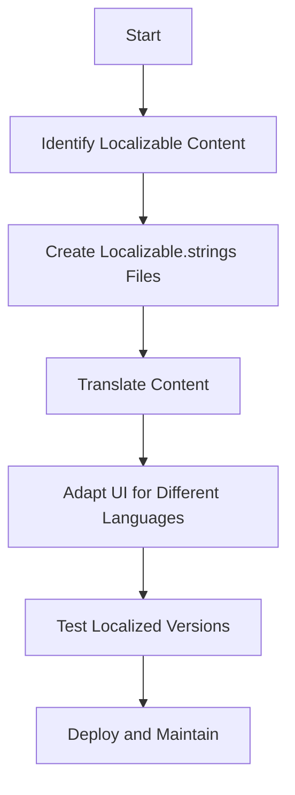

## 20.14 Scaling an App for Internationalization and Localization

In today's globalized world, reaching a broader audience often means scaling your app for internationalization (i18n) and localization (l10n). Internationalization is the process of designing your app to support multiple languages and regions, while localization involves adapting the app for specific locales. This section explores the concepts, tools, and best practices for preparing your Swift app to cater to a global audience.

### Understanding Internationalization and Localization

**Internationalization (i18n)** is the process of designing software applications so they can be adapted to various languages and regions without engineering changes. It involves:

- Designing a flexible user interface that can accommodate different text lengths and layouts.
- Abstracting all locale-specific elements, such as date, time, and currency formats.

**Localization (l10n)** is the adaptation of your app for a specific region or language by translating text and adjusting the layout. It includes:

- Translating user interface text and messages.
- Adapting graphics and colors to suit cultural preferences.
- Converting date, time, and currency formats to local standards.

### Using Localization Tools and Managing Localized Resources

Swift provides robust support for localization through Xcode and the Foundation framework. Here's how you can manage localized resources effectively:

#### Setting Up Localizable Strings

1. **Create a Localizable.strings File**: This file contains key-value pairs for each piece of text in your app. Each key is a unique identifier, and the value is the text to display.

    ```swift
    // Localizable.strings (English)
    "welcome_message" = "Welcome to our app!";
    
    // Localizable.strings (Spanish)
    "welcome_message" = "¡Bienvenido a nuestra aplicación!";
    ```

2. **Access Localized Strings in Code**: Use the `NSLocalizedString` function to fetch localized strings.

    ```swift
    let welcomeMessage = NSLocalizedString("welcome_message", comment: "Welcome message for the user")
    ```

3. **Organize Strings with Comments**: Provide context for translators by adding comments.

    ```swift
    let welcomeMessage = NSLocalizedString("welcome_message", comment: "Displayed on the home screen when the user first opens the app")
    ```

#### Managing Localized Assets

- **Localized Storyboards and XIBs**: Use Xcode to localize your storyboards and XIB files. This ensures that UI elements are appropriately translated.

- **Localized Images and Resources**: Store images and other resources in language-specific folders. Xcode automatically selects the correct resources based on the user's language settings.

#### Using Xcode's Localization Features

- **String Files**: Use Xcode's Export for Localization feature to create `.xliff` files, which can be sent to translators and then re-imported into your project.

- **Interface Builder**: Localize your interface directly in Interface Builder by selecting UI elements and providing translations for each language.

### Handling Date, Time, and Currency Formats

Handling date, time, and currency formats is crucial for creating a localized experience. Swift's Foundation framework offers powerful tools to manage these formats:

#### Date and Time Formatting

Use `DateFormatter` to format dates and times according to the user's locale.

```swift
let dateFormatter = DateFormatter()
dateFormatter.dateStyle = .long
dateFormatter.timeStyle = .short
dateFormatter.locale = Locale.current
let formattedDate = dateFormatter.string(from: Date())
```

#### Currency Formatting

Use `NumberFormatter` to format currency values.

```swift
let numberFormatter = NumberFormatter()
numberFormatter.numberStyle = .currency
numberFormatter.locale = Locale.current
let formattedCurrency = numberFormatter.string(from: 1234.56)
```

### Adapting UI Layouts for Different Languages

Adapting your UI to support different languages, especially those with right-to-left (RTL) scripts, is an essential part of localization.

#### Supporting Right-to-Left Languages

1. **Enable RTL Support**: Use `UIView`'s `semanticContentAttribute` to support RTL layouts.

    ```swift
    view.semanticContentAttribute = .forceRightToLeft
    ```

2. **Use Auto Layout**: Leverage Auto Layout to create flexible interfaces that adapt to different text lengths and orientations.

3. **Mirroring Images and Icons**: Ensure that images and icons are mirrored appropriately for RTL languages.

#### Dynamic Type and Accessibility

- **Support Dynamic Type**: Use scalable fonts to ensure text is readable in all languages.

- **Accessibility Considerations**: Ensure that your app is accessible to users with disabilities by supporting VoiceOver and other accessibility features.

### Testing and Maintaining Localized Versions

Testing is crucial to ensure that your localized app functions correctly across all languages and regions.

#### Testing Localization

1. **Simulate Different Locales**: Use Xcode's scheme editor to simulate different locales and test your app in various languages.

2. **Check for Text Overflow**: Ensure that translated text fits within the UI elements and does not cause layout issues.

3. **Test Date, Time, and Currency Formats**: Verify that these elements are displayed correctly for each locale.

#### Maintaining Localized Content

- **Regular Updates**: Keep your localized content up-to-date with the latest app features and changes.

- **Continuous Integration**: Integrate localization testing into your CI/CD pipeline to catch issues early.

### Try It Yourself

Experiment with the provided code examples by adding additional languages and testing the app's behavior. Consider modifying the `Localizable.strings` file to include more complex sentences and observe how your UI adapts.

### Visualizing Internationalization and Localization

To better understand the process of internationalization and localization, let's visualize the workflow using a Mermaid.js diagram:



This diagram illustrates the key steps involved in preparing your app for internationalization and localization, from identifying localizable content to deploying and maintaining localized versions.

### References and Links

- [Apple's Internationalization and Localization Guide](https://developer.apple.com/library/archive/documentation/MacOSX/Conceptual/BPInternational/Introduction/Introduction.html)
- [NSLocalizedString Documentation](https://developer.apple.com/documentation/foundation/nslocalizedstring)
- [DateFormatter Documentation](https://developer.apple.com/documentation/foundation/dateformatter)
- [NumberFormatter Documentation](https://developer.apple.com/documentation/foundation/numberformatter)

### Knowledge Check

- What is the difference between internationalization and localization?
- How can you manage localized strings in a Swift app?
- What are some best practices for adapting UI layouts for different languages?

### Embrace the Journey

Remember, internationalization and localization are ongoing processes. As you expand your app's reach, you'll encounter new challenges and opportunities to improve the user experience. Keep experimenting, stay curious, and embrace the journey of making your app accessible to a global audience!

## Quiz Time!



### What is the primary goal of internationalization in app development?

- [x] To design software that can be easily adapted to various languages and regions without engineering changes.
- [ ] To translate the app's content into multiple languages.
- [ ] To improve the app's performance in different regions.
- [ ] To ensure the app complies with regional legal requirements.

> **Explanation:** Internationalization focuses on designing software that can be adapted to various languages and regions without requiring engineering changes.

### Which Swift function is used to fetch localized strings?

- [x] NSLocalizedString
- [ ] LocalizedString
- [ ] StringLocalization
- [ ] FetchLocalizedString

> **Explanation:** The `NSLocalizedString` function is used to fetch localized strings in Swift.

### What is a key consideration when adapting UI layouts for right-to-left languages?

- [x] Ensuring that images and icons are mirrored appropriately.
- [ ] Using only fixed-width fonts.
- [ ] Disabling Auto Layout.
- [ ] Avoiding the use of dynamic type.

> **Explanation:** When adapting UI layouts for right-to-left languages, it's important to ensure that images and icons are mirrored appropriately.

### How can you test your app in different locales using Xcode?

- [x] Use Xcode's scheme editor to simulate different locales.
- [ ] Manually change the language settings on your device.
- [ ] Use a third-party localization testing tool.
- [ ] Change the system language in macOS settings.

> **Explanation:** Xcode's scheme editor allows you to simulate different locales for testing purposes.

### What is the purpose of the `semanticContentAttribute` property in `UIView`?

- [x] To support right-to-left layouts by specifying the semantic content direction.
- [ ] To set the text color of a view.
- [ ] To define the accessibility label of a view.
- [ ] To adjust the view's z-index.

> **Explanation:** The `semanticContentAttribute` property in `UIView` is used to support right-to-left layouts by specifying the semantic content direction.

### Which framework provides tools for handling date, time, and currency formats in Swift?

- [x] Foundation
- [ ] UIKit
- [ ] CoreData
- [ ] AVFoundation

> **Explanation:** The Foundation framework provides tools for handling date, time, and currency formats in Swift.

### What is the role of `NumberFormatter` in localization?

- [x] To format currency values according to the user's locale.
- [ ] To convert numbers to strings.
- [ ] To perform mathematical calculations.
- [ ] To handle errors in numerical operations.

> **Explanation:** `NumberFormatter` is used to format currency values according to the user's locale.

### Why is it important to provide comments in `Localizable.strings`?

- [x] To give context for translators and ensure accurate translations.
- [ ] To improve the performance of the app.
- [ ] To make the code more readable for developers.
- [ ] To comply with Apple's guidelines.

> **Explanation:** Providing comments in `Localizable.strings` gives context for translators, ensuring accurate translations.

### Which of the following is NOT a part of localization?

- [x] Improving the app's network performance.
- [ ] Translating user interface text.
- [ ] Adapting graphics to suit cultural preferences.
- [ ] Converting date, time, and currency formats.

> **Explanation:** Improving the app's network performance is not a part of localization.

### True or False: Localization is a one-time process that doesn't require maintenance.

- [ ] True
- [x] False

> **Explanation:** Localization is an ongoing process that requires regular updates and maintenance to keep up with app changes and new features.


