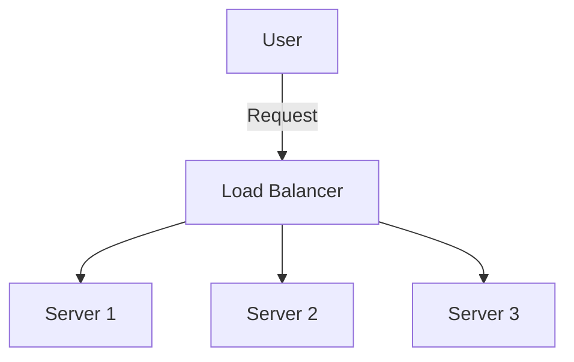

## 20.15 Performance Optimization in a High-Load App

In the world of modern software development, creating applications that can efficiently handle high loads is paramount. Whether you're developing for iOS, macOS, or server-side Swift, understanding how to optimize performance is crucial for maintaining a seamless user experience. In this section, we will explore various strategies and techniques for optimizing performance in high-load Swift applications. We will cover identifying performance bottlenecks, optimizing code and algorithms, implementing caching, managing memory efficiently, scaling backend services, and monitoring performance post-optimization.

### Identifying Performance Bottlenecks Using Profiling Tools

Before we can optimize, we must first identify where the bottlenecks are. Profiling tools are essential in this process as they help us pinpoint the areas of our application that are consuming the most resources or taking the most time to execute.

#### Using Xcode Instruments

Xcode provides a suite of tools called Instruments, which are invaluable for profiling Swift applications. Instruments can help you analyze various aspects of your app, such as CPU usage, memory allocation, and disk I/O.

- **Time Profiler**: This tool helps you understand where your app spends most of its time. It samples your app's stack traces and highlights the methods that consume the most CPU time.
- **Allocations**: Use this tool to track memory usage and identify memory leaks. It provides insights into how much memory is being used and which objects are consuming the most memory.
- **Leaks**: This tool helps detect memory leaks in your application, which can lead to increased memory usage and potential crashes.
- **Network**: Use this to monitor network requests and responses, helping you identify slow or inefficient network operations.

```swift
// Example of using Time Profiler in Instruments
func performHeavyComputation() {
    for _ in 0..<10000 {
        // Simulate heavy computation
        let _ = (0..<1000).map { $0 * $0 }.reduce(0, +)
    }
}
```

#### Analyzing Performance with Swift's Built-in Tools

Swift also provides built-in tools that can help you analyze performance. The `os_signpost` API, for example, allows you to log specific events in your code, which can then be visualized using Instruments.

```swift
import os

let log = OSLog(subsystem: "com.example.app", category: "performance")

func performTask() {
    os_signpost(.begin, log: log, name: "Task Execution")
    // Task execution code
    os_signpost(.end, log: log, name: "Task Execution")
}
```

### Optimizing Code, Algorithms, and Data Structures

Once bottlenecks are identified, the next step is to optimize your code. This involves improving algorithms, choosing efficient data structures, and writing clean, concise code.

#### Choosing the Right Algorithms

The choice of algorithm can significantly impact the performance of your application. For example, using a more efficient sorting algorithm can reduce the time complexity from O(n^2) to O(n log n).

```swift
// Example of using a more efficient sorting algorithm
let numbers = [5, 3, 9, 1, 6]
let sortedNumbers = numbers.sorted() // O(n log n) complexity
```

#### Utilizing Efficient Data Structures

Selecting the right data structure can also enhance performance. For instance, using a `Set` instead of an `Array` for membership tests can reduce time complexity from O(n) to O(1).

```swift
// Example of using a Set for efficient membership testing
let numberSet: Set = [1, 2, 3, 4, 5]
let containsNumber = numberSet.contains(3) // O(1) complexity
```

### Implementing Caching and Efficient Memory Management

Caching is a powerful technique to reduce redundant computations and improve performance. Efficient memory management ensures that your app uses resources wisely, preventing unnecessary memory consumption.

#### Implementing Caching

Caching can be implemented at various levels, including in-memory caches and persistent caches. Use caching to store frequently accessed data, reducing the need for repeated calculations or network requests.

```swift
// Example of a simple in-memory cache using NSCache
class DataCache {
    private let cache = NSCache<NSString, NSData>()
    
    func cacheData(_ data: NSData, forKey key: String) {
        cache.setObject(data, forKey: key as NSString)
    }
    
    func fetchData(forKey key: String) -> NSData? {
        return cache.object(forKey: key as NSString)
    }
}
```

#### Efficient Memory Management

Swift's Automatic Reference Counting (ARC) helps manage memory automatically, but developers must still be vigilant to avoid retain cycles and memory leaks. Use weak references where appropriate and ensure that objects are deallocated when no longer needed.

```swift
// Example of using weak references to avoid retain cycles
class Node {
    weak var parent: Node?
    var children: [Node] = []
}
```

### Scaling Backend Services to Handle Increased Load

As your application grows, it may need to handle more users and data. Scaling backend services is essential to maintain performance under increased load.

#### Horizontal and Vertical Scaling

- **Horizontal Scaling**: Involves adding more servers to distribute the load. This is often more cost-effective and provides redundancy.
- **Vertical Scaling**: Involves adding more resources (CPU, RAM) to existing servers. This can be limited by the hardware capabilities.

#### Load Balancing

Implement load balancing to distribute incoming requests across multiple servers, ensuring no single server is overwhelmed. This can be achieved using hardware or software solutions.



#### Using Cloud Services

Leverage cloud services like AWS, Google Cloud, or Azure to scale your backend services. These platforms offer auto-scaling features that automatically adjust resources based on demand.

### Monitoring Performance and User Experience Post-Optimization

After implementing optimizations, it's crucial to monitor the performance and user experience to ensure that changes have the desired effect.

#### Using Analytics and Monitoring Tools

Use tools like Firebase Analytics, New Relic, or Datadog to monitor app performance and user interactions. These tools provide insights into how users are experiencing your app and can help identify areas for further improvement.

#### Gathering User Feedback

Encourage users to provide feedback on their experience. This can help identify issues that may not be apparent through automated monitoring.

### Try It Yourself

Experiment with the code examples provided in this section. Try modifying the caching mechanism to use a different data structure, or implement a custom algorithm for a specific task. Use Xcode Instruments to profile your changes and observe the impact on performance.

### Summary

Performance optimization is a continuous process that involves identifying bottlenecks, optimizing code and algorithms, implementing caching, scaling backend services, and monitoring performance. By applying these techniques, you can ensure that your Swift applications remain responsive and efficient, even under high load.

## Quiz Time!



### Which Xcode tool helps identify methods consuming the most CPU time?

- [x] Time Profiler
- [ ] Allocations
- [ ] Leaks
- [ ] Network

> **Explanation:** Time Profiler samples the app's stack traces to highlight methods consuming the most CPU time.

### What is the time complexity of the Swift `sorted()` method?

- [ ] O(n)
- [x] O(n log n)
- [ ] O(n^2)
- [ ] O(log n)

> **Explanation:** The `sorted()` method in Swift uses an algorithm with O(n log n) complexity.

### Which data structure offers O(1) complexity for membership tests?

- [ ] Array
- [x] Set
- [ ] Dictionary
- [ ] List

> **Explanation:** A `Set` offers O(1) complexity for membership tests due to its hash-based implementation.

### What does ARC stand for in Swift?

- [ ] Automatic Resource Counting
- [x] Automatic Reference Counting
- [ ] Automated Runtime Control
- [ ] Advanced Resource Control

> **Explanation:** ARC stands for Automatic Reference Counting, which manages memory in Swift.

### Which scaling involves adding more servers to distribute load?

- [x] Horizontal Scaling
- [ ] Vertical Scaling
- [ ] Diagonal Scaling
- [ ] Parallel Scaling

> **Explanation:** Horizontal Scaling involves adding more servers to distribute the load.

### What is the purpose of load balancing?

- [x] Distribute requests across servers
- [ ] Increase server memory
- [ ] Enhance server security
- [ ] Reduce server latency

> **Explanation:** Load balancing distributes incoming requests across multiple servers to prevent overload.

### Which cloud service feature adjusts resources based on demand?

- [ ] Static Scaling
- [x] Auto-Scaling
- [ ] Manual Scaling
- [ ] Dynamic Scaling

> **Explanation:** Auto-Scaling automatically adjusts resources based on demand in cloud services.

### What tool can be used to monitor app performance and user interactions?

- [ ] Xcode
- [ ] Swift
- [x] Firebase Analytics
- [ ] GitHub

> **Explanation:** Firebase Analytics monitors app performance and user interactions.

### What is a common cause of memory leaks in Swift?

- [x] Retain Cycles
- [ ] Weak References
- [ ] Strong References
- [ ] ARC

> **Explanation:** Retain cycles occur when two objects hold strong references to each other, preventing deallocation.

### True or False: Vertical scaling adds more servers to handle increased load.

- [ ] True
- [x] False

> **Explanation:** Vertical scaling adds more resources to existing servers, not more servers.



Remember, performance optimization is an ongoing journey. Keep experimenting, stay curious, and enjoy the process of making your Swift applications more efficient and robust!
