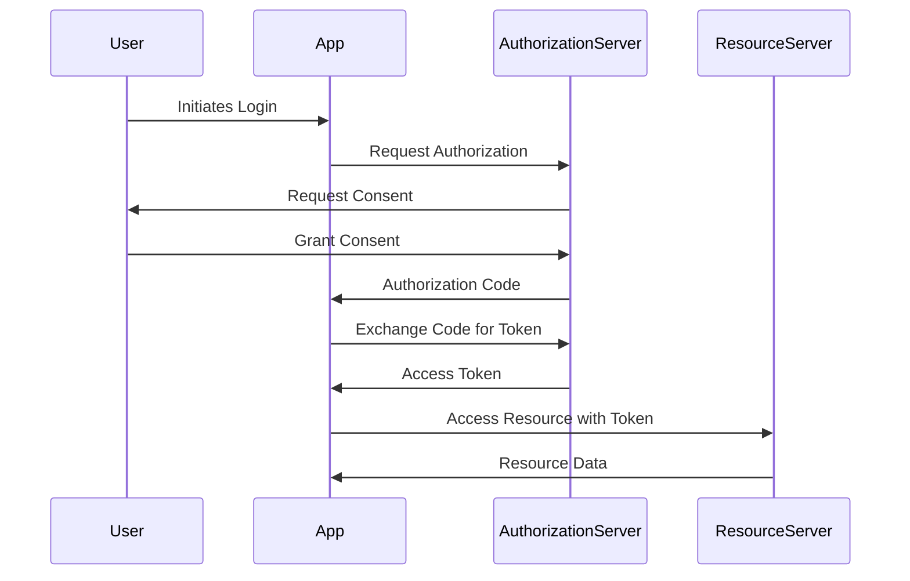
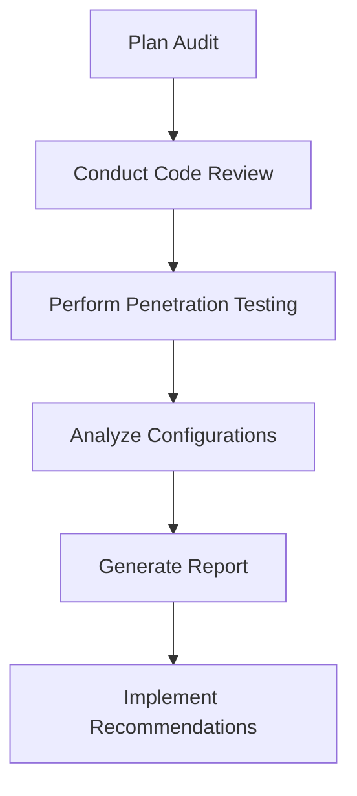

## 20.16 Security Enhancements in a Financial Application

In the realm of financial applications, security is of paramount importance. These applications handle sensitive data and financial transactions, making them prime targets for cyber threats. In this section, we will delve into the security enhancements necessary for developing robust financial applications using Swift. We will cover secure authentication mechanisms, data protection through encryption and secure storage, compliance with regulations such as GDPR and PCI DSS, and the importance of regular security audits and vulnerability assessments.

### Understanding the Security Landscape

Before diving into specific enhancements, it's crucial to understand the security landscape for financial applications. This involves recognizing the types of threats these applications face, such as data breaches, phishing attacks, and identity theft. Financial applications must be designed with a security-first mindset, ensuring that every aspect of the application is fortified against potential threats.

### Implementing Secure Authentication Mechanisms

Authentication is the first line of defense in any application. For financial applications, implementing secure authentication mechanisms is critical to ensure that only authorized users can access sensitive information.

#### Multi-Factor Authentication (MFA)

Multi-Factor Authentication (MFA) adds an extra layer of security by requiring users to provide multiple forms of verification. This typically includes something the user knows (password), something the user has (a mobile device), and something the user is (biometric verification).

**Code Example: Implementing MFA in Swift**

```swift
import LocalAuthentication

func authenticateUser(completion: @escaping (Bool, Error?) -> Void) {
    let context = LAContext()
    var error: NSError?

    if context.canEvaluatePolicy(.deviceOwnerAuthenticationWithBiometrics, error: &error) {
        let reason = "Authenticate to access your financial data."

        context.evaluatePolicy(.deviceOwnerAuthenticationWithBiometrics, localizedReason: reason) { success, authenticationError in
            DispatchQueue.main.async {
                if success {
                    completion(true, nil)
                } else {
                    completion(false, authenticationError)
                }
            }
        }
    } else {
        completion(false, error)
    }
}
```

In the above code, we use the `LocalAuthentication` framework to implement biometric authentication, which is a common form of MFA.

#### OAuth 2.0 for Secure API Access

OAuth 2.0 is a widely used protocol for secure API access. It allows users to grant third-party applications limited access to their resources without exposing their credentials.

**Diagram: OAuth 2.0 Flow**



The diagram above illustrates the OAuth 2.0 authorization code flow, which is commonly used in financial applications for secure API access.

### Protecting Data with Encryption and Secure Storage

Data protection is vital in financial applications to prevent unauthorized access and ensure data integrity. This involves encrypting data both at rest and in transit.

#### Data Encryption at Rest

Encrypting data at rest ensures that even if data is accessed by unauthorized parties, it remains unreadable without the decryption key. Swift provides robust cryptographic libraries to implement data encryption.

**Code Example: Encrypting Data with CryptoKit**

```swift
import CryptoKit

func encryptData(data: Data, key: SymmetricKey) -> Data? {
    do {
        let sealedBox = try AES.GCM.seal(data, using: key)
        return sealedBox.combined
    } catch {
        print("Encryption failed: \\(error)")
        return nil
    }
}

let key = SymmetricKey(size: .bits256)
let sensitiveData = "Sensitive financial information".data(using: .utf8)!
if let encryptedData = encryptData(data: sensitiveData, key: key) {
    print("Encrypted data: \\(encryptedData.base64EncodedString())")
}
```

In this example, we use the `CryptoKit` framework to encrypt sensitive data using AES-GCM, a secure encryption algorithm.

#### Secure Storage with Keychain

The Keychain is a secure storage solution provided by Apple for storing sensitive data such as passwords and encryption keys.

**Code Example: Storing Data in Keychain**

```swift
import Security

func storeInKeychain(data: Data, account: String) -> Bool {
    let query: [String: Any] = [
        kSecClass as String: kSecClassGenericPassword,
        kSecAttrAccount as String: account,
        kSecValueData as String: data
    ]

    let status = SecItemAdd(query as CFDictionary, nil)
    return status == errSecSuccess
}

let account = "com.example.financialApp.userToken"
let tokenData = "UserAccessToken".data(using: .utf8)!
if storeInKeychain(data: tokenData, account: account) {
    print("Data stored successfully in Keychain.")
}
```

This code demonstrates how to store sensitive data securely in the Keychain, ensuring it is protected from unauthorized access.

### Compliance with Regulations: GDPR and PCI DSS

Compliance with regulations such as the General Data Protection Regulation (GDPR) and the Payment Card Industry Data Security Standard (PCI DSS) is crucial for financial applications. These regulations set standards for data protection and security.

#### GDPR Compliance

GDPR focuses on protecting the personal data of individuals within the European Union. Financial applications must ensure that they handle personal data in compliance with GDPR requirements.

**Key GDPR Compliance Measures:**

- Obtain explicit consent from users before collecting their data.
- Provide users with the ability to access, modify, or delete their data.
- Implement data protection measures to safeguard personal data.

#### PCI DSS Compliance

PCI DSS is a set of security standards designed to ensure that all companies that accept, process, store, or transmit credit card information maintain a secure environment.

**Key PCI DSS Compliance Measures:**

- Use strong encryption to protect cardholder data.
- Implement access control measures to restrict access to cardholder data.
- Regularly monitor and test networks to ensure security.

### Regular Security Audits and Vulnerability Assessments

Regular security audits and vulnerability assessments are essential to identify and address potential security weaknesses in financial applications. These assessments help ensure that the application remains secure against evolving threats.

#### Conducting Security Audits

Security audits involve a thorough examination of the application's security measures, including code reviews, penetration testing, and configuration analysis.

**Diagram: Security Audit Process**



The diagram outlines the typical steps involved in a security audit, from planning to implementing recommendations.

#### Vulnerability Assessments

Vulnerability assessments focus on identifying and prioritizing vulnerabilities in the application. This involves using automated tools to scan for known vulnerabilities and manual testing to uncover potential issues.

### Try It Yourself: Enhancing Security in Your Application

To reinforce your understanding, try implementing the following security enhancements in a sample Swift application:

1. **Implement Multi-Factor Authentication:** Use the `LocalAuthentication` framework to add biometric authentication to your app.
2. **Encrypt Sensitive Data:** Use `CryptoKit` to encrypt sensitive data before storing it in a database.
3. **Store Data Securely:** Use the Keychain to store sensitive information such as access tokens.
4. **Conduct a Security Audit:** Perform a basic security audit of your application, focusing on identifying and addressing potential vulnerabilities.

### Conclusion

Security is a critical aspect of financial application development. By implementing secure authentication mechanisms, protecting data with encryption and secure storage, ensuring compliance with regulations, and conducting regular security audits, you can build robust and secure financial applications. Remember, security is an ongoing process, and staying vigilant against emerging threats is essential to maintaining the integrity and trustworthiness of your application.

## Quiz Time!



### What is the primary purpose of Multi-Factor Authentication (MFA) in financial applications?

- [x] To provide an extra layer of security by requiring multiple forms of verification
- [ ] To simplify the login process for users
- [ ] To replace passwords entirely
- [ ] To allow users to bypass security questions

> **Explanation:** MFA enhances security by requiring multiple verification forms, making it harder for unauthorized users to gain access.

### Which Swift framework is commonly used for implementing biometric authentication?

- [x] LocalAuthentication
- [ ] CryptoKit
- [ ] Foundation
- [ ] Security

> **Explanation:** The `LocalAuthentication` framework is used for implementing biometric authentication such as Face ID and Touch ID.

### What is the role of OAuth 2.0 in financial applications?

- [x] To provide secure API access by allowing users to grant limited access to their resources
- [ ] To encrypt sensitive data
- [ ] To store user credentials securely
- [ ] To monitor network traffic for suspicious activity

> **Explanation:** OAuth 2.0 is a protocol for secure API access, allowing users to grant limited access to their resources without exposing credentials.

### What is the purpose of encrypting data at rest?

- [x] To ensure that data remains unreadable without the decryption key, even if accessed by unauthorized parties
- [ ] To speed up data retrieval processes
- [ ] To compress data for storage efficiency
- [ ] To allow easy sharing of data across networks

> **Explanation:** Encrypting data at rest ensures that it remains secure and unreadable without the decryption key, even if accessed by unauthorized parties.

### Which framework is used in Swift for encrypting data?

- [x] CryptoKit
- [ ] LocalAuthentication
- [ ] UIKit
- [ ] Alamofire

> **Explanation:** `CryptoKit` is a Swift framework used for encrypting data securely.

### What is the Keychain used for in iOS applications?

- [x] To securely store sensitive data such as passwords and encryption keys
- [ ] To manage network connections
- [ ] To handle user interface elements
- [ ] To perform data encryption

> **Explanation:** The Keychain is used for securely storing sensitive data such as passwords and encryption keys in iOS applications.

### What are the key compliance measures for GDPR?

- [x] Obtain explicit consent, provide data access/modification, implement data protection
- [ ] Encrypt all data, restrict network access, perform regular backups
- [ ] Use biometric authentication, enable two-factor authentication, conduct security audits
- [ ] Monitor user activity, log all transactions, enforce password policies

> **Explanation:** GDPR compliance involves obtaining explicit consent, providing data access/modification, and implementing data protection measures.

### What is the purpose of conducting regular security audits?

- [x] To identify and address potential security weaknesses in the application
- [ ] To improve application performance
- [ ] To reduce development costs
- [ ] To enhance user experience

> **Explanation:** Regular security audits help identify and address potential security weaknesses in the application.

### What is a vulnerability assessment?

- [x] A process of identifying and prioritizing vulnerabilities in the application
- [ ] A method for encrypting data
- [ ] A technique for optimizing application performance
- [ ] A strategy for improving user interface design

> **Explanation:** A vulnerability assessment is a process of identifying and prioritizing vulnerabilities in the application.

### True or False: Security is a one-time implementation process.

- [ ] True
- [x] False

> **Explanation:** Security is an ongoing process that requires continuous monitoring and updating to protect against emerging threats.




