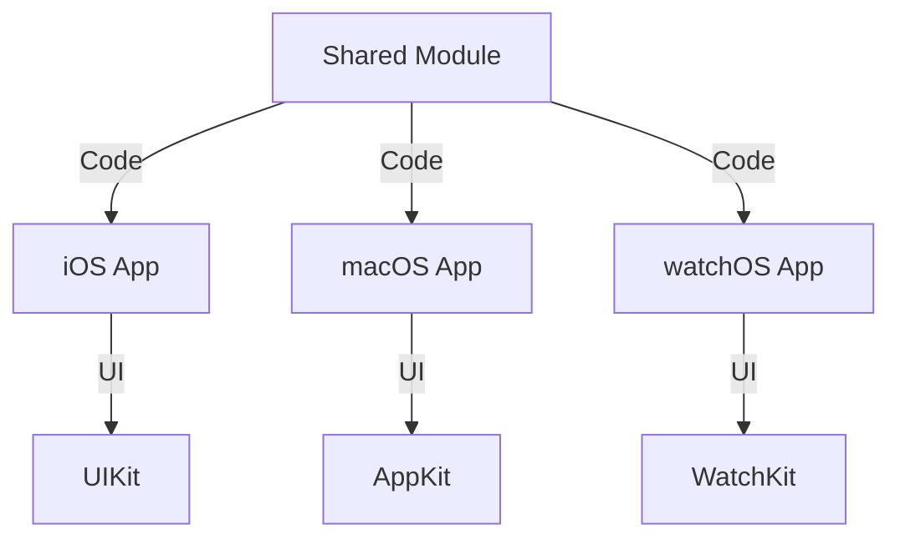

## 20.17 Cross-Platform Development with Swift for Mac, iOS, and watchOS

Cross-platform development with Swift allows developers to create applications that run on multiple Apple platforms like macOS, iOS, and watchOS. By leveraging Swift's powerful features, you can share code between these platforms, adapt user interfaces for different devices, and manage platform-specific features efficiently. This guide will explore how to achieve seamless cross-platform development using Swift, focusing on code sharing, UI adaptation, and handling platform-specific nuances.

### Sharing Code Between Apple Platforms

One of the primary goals of cross-platform development is to maximize code reuse. Swift provides several mechanisms to facilitate code sharing across macOS, iOS, and watchOS.

#### Utilizing Swift's Conditional Compilation and Modules

Swift's conditional compilation allows you to include or exclude code based on the target platform. This is achieved using the `#if`, `#else`, and `#endif` directives. Here's an example:

```swift
#if os(iOS)
import UIKit
typealias PlatformView = UIView
#elseif os(macOS)
import Cocoa
typealias PlatformView = NSView
#elseif os(watchOS)
import WatchKit
typealias PlatformView = WKInterfaceObject
#endif

class CrossPlatformView: PlatformView {
    // Shared code for all platforms
}
```

In this example, we define a `PlatformView` type alias that maps to the appropriate view class for each platform. This enables us to write platform-agnostic code that can be compiled for macOS, iOS, and watchOS.

#### Creating Shared Modules

Modules in Swift are a great way to encapsulate shared logic and data models. By creating a shared module, you can include it in different platform-specific targets. This approach not only promotes code reuse but also maintains a clean separation of concerns.

To create a shared module:

1. **Define a Swift Package**: Use Swift Package Manager (SPM) to create a package that contains shared code. This package can then be added as a dependency to your macOS, iOS, and watchOS projects.

2. **Use Frameworks**: Alternatively, you can create a framework that encapsulates shared functionality. This framework can be included in your different platform targets.

### Adapting User Interfaces for Each Device Type

While sharing code is essential, adapting the user interface (UI) to suit each platform's unique characteristics is equally important. Each Apple device has its own design guidelines and user interaction patterns.

#### Responsive Design with SwiftUI

SwiftUI is a declarative framework that makes it easier to create responsive UIs that adapt to different screen sizes and device capabilities. With SwiftUI, you can define views that automatically adjust to the platform they are running on.

```swift
import SwiftUI

struct CrossPlatformView: View {
    var body: some View {
        VStack {
            Text("Hello, World!")
                .font(.headline)
                .padding()
            #if os(iOS)
            Text("Running on iOS")
            #elseif os(macOS)
            Text("Running on macOS")
            #elseif os(watchOS)
            Text("Running on watchOS")
            #endif
        }
    }
}
```

In this example, we use SwiftUI to create a simple view that displays a platform-specific message.

#### Storyboards and XIBs for UIKit and AppKit

For developers using UIKit and AppKit, storyboards and XIBs are traditional ways to design interfaces. While these tools are platform-specific, you can still share logic by creating view controllers that manage the UI elements.

```swift
class SharedViewController: UIViewController {
    override func viewDidLoad() {
        super.viewDidLoad()
        // Shared setup code
    }
}
```

By subclassing `SharedViewController` in both iOS and macOS applications, you can maintain shared logic while allowing platform-specific customization.

### Managing Platform-Specific Features and Limitations

Each Apple platform has its unique features and limitations. Understanding these differences is crucial for developing cross-platform applications.

#### Handling Platform-Specific APIs

Some APIs are only available on specific platforms. Use conditional compilation to handle these cases gracefully.

```swift
#if os(iOS)
func useiOSFeature() {
    // iOS-specific code
}
#endif

#if os(macOS)
func useMacOSFeature() {
    // macOS-specific code
}
#endif
```

By wrapping platform-specific code in conditional compilation blocks, you ensure that your application remains portable across different platforms.

#### Leveraging Platform Capabilities

Each platform offers unique capabilities that can enhance your application. For example, macOS provides more extensive window management options, while watchOS focuses on quick interactions.

- **macOS**: Utilize menu bars, multiple windows, and advanced file management.
- **iOS**: Leverage touch gestures, camera access, and location services.
- **watchOS**: Implement complications, notifications, and health-related features.

### Testing and Deploying Across Multiple Platforms

Ensuring that your application works seamlessly across all target platforms requires thorough testing and a well-planned deployment strategy.

#### Cross-Platform Testing

1. **Unit Tests**: Write unit tests for your shared code to ensure its correctness across all platforms.
2. **UI Tests**: Use platform-specific testing tools like XCTest for iOS and macOS to verify UI behavior.
3. **Simulator Testing**: Test your application on different simulators to mimic various device configurations.

#### Deployment Strategies

1. **Continuous Integration (CI)**: Implement CI pipelines to automate testing and deployment across multiple platforms.
2. **App Store Distribution**: Prepare separate builds for the App Store, ensuring compliance with each platform's guidelines.
3. **Beta Testing**: Use TestFlight or other beta testing services to gather feedback from users on different devices.

### Visualizing Cross-Platform Architecture

To better understand the architecture of a cross-platform Swift application, let's visualize how shared components and platform-specific components interact.



**Diagram Description:** This diagram illustrates how a shared module interacts with platform-specific applications. The shared module provides common code, while each app uses its respective UI framework (UIKit for iOS, AppKit for macOS, and WatchKit for watchOS).

### Conclusion

Cross-platform development with Swift for macOS, iOS, and watchOS is a powerful approach to building versatile applications. By sharing code, adapting user interfaces, and managing platform-specific features, you can create robust applications that provide a seamless experience across all Apple devices. Remember to test thoroughly and leverage each platform's unique capabilities to deliver the best possible user experience.

### Try It Yourself

Experiment with the provided code examples by modifying them to suit your specific needs. Try adding new features, adapting the UI further, or integrating additional platform-specific APIs. This hands-on approach will deepen your understanding of cross-platform development with Swift.

## Quiz Time!



### What is the primary goal of cross-platform development with Swift?

- [x] To maximize code reuse across different Apple platforms.
- [ ] To create unique code for each platform.
- [ ] To ensure apps only run on iOS devices.
- [ ] To avoid using SwiftUI.

> **Explanation:** The primary goal of cross-platform development is to maximize code reuse across different platforms like macOS, iOS, and watchOS.

### Which Swift feature allows you to include or exclude code based on the target platform?

- [x] Conditional compilation
- [ ] Protocols
- [ ] Extensions
- [ ] Generics

> **Explanation:** Conditional compilation in Swift uses directives like `#if`, `#else`, and `#endif` to include or exclude code based on the target platform.

### What is a common tool for creating shared modules in Swift?

- [x] Swift Package Manager (SPM)
- [ ] Xcode Storyboards
- [ ] Core Data
- [ ] Interface Builder

> **Explanation:** Swift Package Manager (SPM) is commonly used to create shared modules that can be included in different platform-specific targets.

### Which framework is recommended for creating responsive UIs that adapt to different Apple platforms?

- [x] SwiftUI
- [ ] UIKit
- [ ] AppKit
- [ ] WatchKit

> **Explanation:** SwiftUI is a declarative framework that makes it easier to create responsive UIs that adapt to different screen sizes and device capabilities.

### How can you handle platform-specific APIs in Swift?

- [x] Use conditional compilation blocks
- [ ] Create separate projects for each platform
- [ ] Avoid using platform-specific APIs
- [ ] Use only UIKit

> **Explanation:** Platform-specific APIs can be handled using conditional compilation blocks to ensure portability across platforms.

### What is a key benefit of using SwiftUI for cross-platform development?

- [x] It allows for declarative UI design.
- [ ] It is only available for iOS.
- [ ] It requires separate code for each platform.
- [ ] It is not compatible with macOS.

> **Explanation:** SwiftUI allows for declarative UI design, making it easier to create interfaces that adapt to different platforms.

### Which testing tool is platform-specific for iOS and macOS?

- [x] XCTest
- [ ] JUnit
- [ ] Selenium
- [ ] Mocha

> **Explanation:** XCTest is a testing tool specific to iOS and macOS for verifying UI behavior and running unit tests.

### What is a recommended strategy for deploying cross-platform applications?

- [x] Implementing Continuous Integration (CI) pipelines
- [ ] Manually testing each platform
- [ ] Skipping beta testing
- [ ] Using a single build for all platforms

> **Explanation:** Implementing Continuous Integration (CI) pipelines helps automate testing and deployment across multiple platforms.

### Which UI framework is used for watchOS applications?

- [x] WatchKit
- [ ] UIKit
- [ ] AppKit
- [ ] SwiftUI

> **Explanation:** WatchKit is the UI framework used for developing watchOS applications.

### True or False: SwiftUI can only be used for iOS development.

- [ ] True
- [x] False

> **Explanation:** False. SwiftUI can be used for developing applications across multiple Apple platforms, including macOS, iOS, and watchOS.


