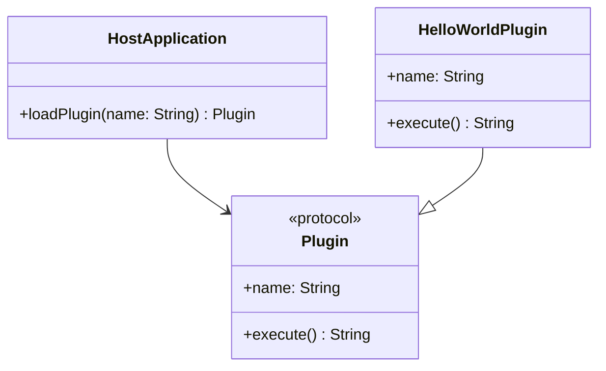

## 20.18 Developing a Plugin System with Swift Package Manager

In this section, we will delve into the process of developing a plugin system using the Swift Package Manager (SPM). We'll cover the key concepts, design considerations, and implementation details that you need to know to create a flexible and secure plugin architecture for your Swift applications.

### Introduction

A plugin system allows applications to be extended with new features without altering the core codebase. This modular approach not only enhances flexibility and scalability but also supports a vibrant ecosystem of third-party developers contributing to your application.

### Key Concepts

Before we dive into the details, let's outline the core concepts involved in developing a plugin system:

- **Modular Development**: Breaking down applications into smaller, interchangeable components.
- **Plugin APIs and Protocols**: Defining interfaces that plugins must adhere to.
- **Security and Sandboxing**: Ensuring that plugins operate safely and do not compromise application integrity.
- **Distribution and Updates**: Managing how plugins are shared and maintained over time.

### Using Swift Package Manager for Modular Development

The Swift Package Manager is a tool for managing the distribution of Swift code. It’s integrated into the Swift build system, making it a natural choice for creating modular applications.

#### Setting Up a Swift Package

To create a new Swift package, use the following command in your terminal:

```bash
swift package init --type library
```

This command initializes a new package with a library target. The directory structure will look like this:

```
MyPlugin/
├── Package.swift
├── Sources/
│   └── MyPlugin/
│       └── MyPlugin.swift
└── Tests/
    └── MyPluginTests/
        └── MyPluginTests.swift
```

The `Package.swift` file is the manifest file where you define your package's dependencies and targets.

#### Defining Plugin APIs and Protocols

A plugin system requires a well-defined API that plugins must implement. This is typically done using Swift protocols.

```swift
public protocol Plugin {
    var name: String { get }
    func execute() -> String
}
```

This protocol defines a simple interface with a `name` property and an `execute` method. Plugins conforming to this protocol can be loaded and executed by the host application.

#### Implementing a Plugin

Here’s a simple example of a plugin that conforms to the `Plugin` protocol:

```swift
public struct HelloWorldPlugin: Plugin {
    public var name: String {
        return "HelloWorld"
    }

    public init() {}

    public func execute() -> String {
        return "Hello, World!"
    }
}
```

#### Loading Plugins Dynamically

To load plugins dynamically, you can use Swift's reflection capabilities. Here’s a basic example of how you might load a plugin:

```swift
import Foundation

func loadPlugin(named name: String) -> Plugin? {
    guard let pluginClass = NSClassFromString(name) as? Plugin.Type else {
        return nil
    }
    return pluginClass.init()
}

// Usage
if let plugin = loadPlugin(named: "HelloWorldPlugin") {
    print(plugin.execute())
}
```

### Ensuring Security and Sandboxing of Plugins

Security is a critical aspect of plugin systems. Plugins can potentially execute arbitrary code, so it’s essential to implement measures that prevent malicious activities.

#### Sandboxing

Sandboxing restricts the resources that a plugin can access. Swift does not provide built-in sandboxing, but you can use macOS's App Sandbox feature to limit what plugins can do.

#### Code Signing

Ensure that all plugins are code-signed. This verifies the identity of the plugin author and ensures that the plugin has not been tampered with.

#### Permissions

Define a clear set of permissions that plugins must request to access sensitive resources. Consider using a permission model similar to iOS, where users must grant explicit permission for each resource.

### Distributing and Updating Plugins

Effective distribution and updating mechanisms are crucial for a successful plugin system.

#### Distributing Plugins

You can distribute plugins as Swift packages. This allows developers to easily integrate them into their projects using the Swift Package Manager.

#### Updating Plugins

To update plugins, you can leverage versioning in Swift Package Manager. Define version constraints in your `Package.swift` file to ensure compatibility:

```swift
dependencies: [
    .package(url: "https://github.com/username/MyPlugin.git", from: "1.0.0")
]
```

### Try It Yourself

To experiment with plugin development, try creating your own plugin that implements the `Plugin` protocol. Modify the `execute` method to perform a different task, such as fetching data from a network or performing a calculation. Observe how the plugin interacts with the host application and consider how you might enhance security and distribution.

### Visualizing Plugin Architecture

To better understand the plugin architecture, let's visualize the interaction between the host application and plugins using a class diagram.



**Diagram Description**: This class diagram illustrates the relationship between the `HostApplication`, `Plugin` protocol, and `HelloWorldPlugin`. The `HostApplication` loads plugins that conform to the `Plugin` protocol, and `HelloWorldPlugin` is an implementation of this protocol.

### Design Considerations

- **Modularity**: Ensure that plugins are independent and do not rely on each other.
- **Compatibility**: Maintain backward compatibility when updating plugin APIs.
- **Performance**: Consider the performance impact of loading and executing plugins.

### Swift Unique Features

Swift's strong type system and protocol-oriented programming make it an excellent choice for developing plugin systems. Protocols provide a flexible way to define plugin interfaces, and Swift's safety features help prevent common programming errors.

### Differences and Similarities

Plugin systems are often compared to other modular architectures like microservices. While both aim to decouple components, plugins are typically more lightweight and focused on extending application functionality.

### Knowledge Check

- **What is the main purpose of a plugin system?**
- **How does Swift Package Manager assist in modular development?**
- **What are some security measures you can implement for plugins?**

### Embrace the Journey

Remember, developing a plugin system is a journey that involves careful planning and consideration of various factors such as security, distribution, and compatibility. As you progress, you'll gain insights into creating robust and flexible architectures that can adapt to changing requirements. Keep experimenting, stay curious, and enjoy the journey!

## Quiz Time!



### What is the main purpose of a plugin system?

- [x] To extend application functionality without altering the core codebase
- [ ] To reduce application size
- [ ] To improve application speed
- [ ] To simplify application design

> **Explanation:** A plugin system allows applications to be extended with new features without altering the core codebase, enhancing flexibility and scalability.

### Which tool is used for managing the distribution of Swift code?

- [x] Swift Package Manager
- [ ] CocoaPods
- [ ] Carthage
- [ ] Xcode

> **Explanation:** The Swift Package Manager is the tool integrated into the Swift build system for managing the distribution of Swift code.

### What is a key component of a plugin API?

- [x] Protocols
- [ ] Classes
- [ ] Enums
- [ ] Structs

> **Explanation:** Protocols define the interfaces that plugins must adhere to, making them a key component of a plugin API.

### How can plugins be loaded dynamically in Swift?

- [x] Using Swift's reflection capabilities
- [ ] Using static imports
- [ ] Through manual code inclusion
- [ ] By recompiling the application

> **Explanation:** Swift's reflection capabilities allow for dynamic loading of plugins by identifying and instantiating classes at runtime.

### What is a security measure for plugins?

- [x] Sandboxing
- [ ] Increasing memory allocation
- [ ] Reducing code size
- [ ] Using global variables

> **Explanation:** Sandboxing restricts the resources that a plugin can access, ensuring that plugins operate safely and do not compromise application integrity.

### How can plugins be distributed in Swift?

- [x] As Swift packages
- [ ] As executable binaries
- [ ] As zip files
- [ ] As text files

> **Explanation:** Plugins can be distributed as Swift packages, allowing developers to easily integrate them into their projects using the Swift Package Manager.

### What is the role of code signing in plugin security?

- [x] Verifies the identity of the plugin author
- [ ] Increases the plugin's execution speed
- [ ] Reduces the plugin's memory usage
- [ ] Simplifies the plugin's code

> **Explanation:** Code signing verifies the identity of the plugin author and ensures that the plugin has not been tampered with.

### What is a benefit of using Swift protocols in plugin systems?

- [x] They provide a flexible way to define plugin interfaces
- [ ] They increase the application's compile time
- [ ] They reduce the application's code readability
- [ ] They limit the number of plugins

> **Explanation:** Swift protocols provide a flexible way to define plugin interfaces, allowing for easy extension and integration of plugins.

### Which of the following is a design consideration for plugin systems?

- [x] Modularity
- [ ] Increasing application size
- [ ] Reducing code complexity
- [ ] Using global variables

> **Explanation:** Modularity ensures that plugins are independent and do not rely on each other, which is a key design consideration for plugin systems.

### True or False: Plugins should be dependent on each other.

- [ ] True
- [x] False

> **Explanation:** Plugins should be independent and not rely on each other to maintain modularity and flexibility in the application architecture.


