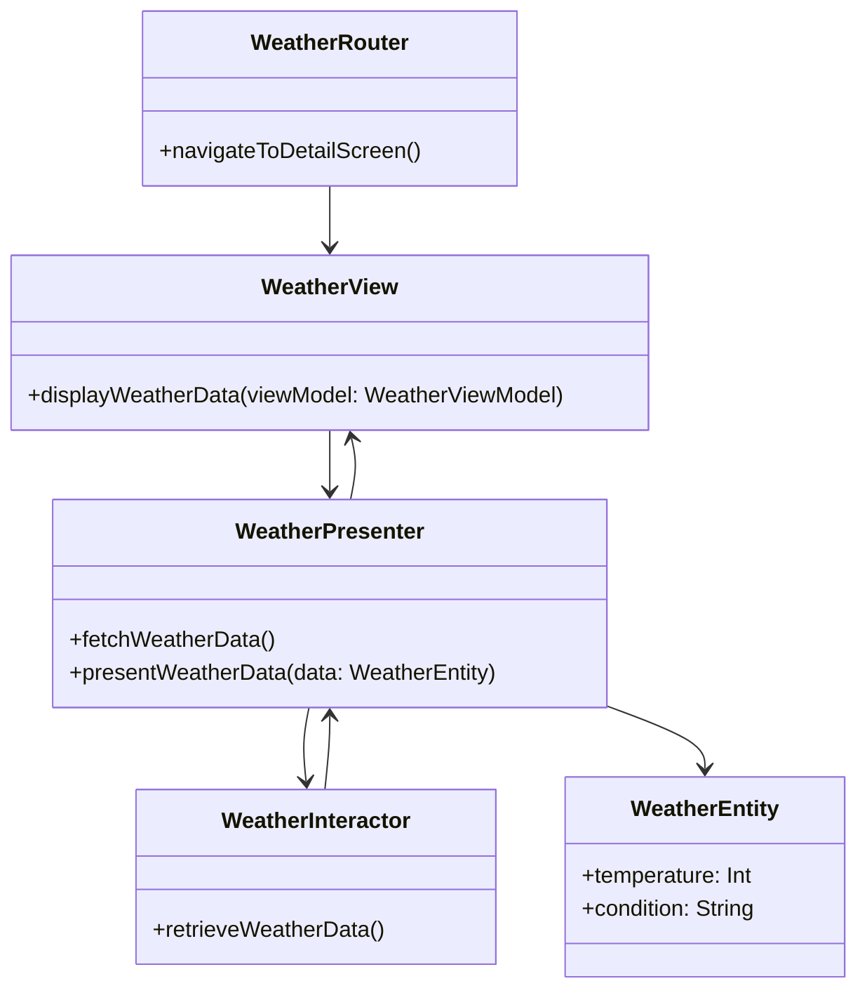

## 20.2 Refactoring an App from MVC to VIPER

In the realm of iOS development, the Model-View-Controller (MVC) pattern has been a staple for organizing code. However, as applications grow in complexity, the limitations of MVC become apparent. Enter VIPER: a design pattern that promises to separate concerns more effectively, enhancing testability and maintainability. In this guide, we'll explore the process of refactoring an existing app from MVC to VIPER, discuss the benefits and challenges, and provide practical examples to illustrate the transition.

### Identifying Limitations of MVC in Large Projects

Before diving into VIPER, it's crucial to understand why MVC might not be the best fit for large-scale applications. In MVC, the view controllers often become massive, taking on responsibilities beyond their intended scope. This can lead to:

- **Poor Testability**: With so much logic embedded in view controllers, unit testing becomes challenging.
- **Difficult Maintenance**: As the codebase grows, making changes without introducing bugs becomes harder.
- **Tight Coupling**: Components often become tightly coupled, making reuse difficult.

### Introducing VIPER: A Solution for Scalable Architecture

VIPER stands for View, Interactor, Presenter, Entity, and Router. It breaks down the responsibilities of an application into distinct modules, each with a specific role:

- **View**: Handles the display of information to the user.
- **Interactor**: Contains the business logic and data manipulation.
- **Presenter**: Acts as a mediator between the View and Interactor.
- **Entity**: Represents the data model.
- **Router**: Manages navigation and routing.

By adopting VIPER, we can achieve a more modular architecture, where each component is responsible for a single aspect of the application's behavior.

### The Process of Refactoring to VIPER

Refactoring an existing app from MVC to VIPER involves several steps. Let's walk through the process using a hypothetical example: a simple weather app.

#### Step 1: Analyze the Existing MVC Structure

Begin by examining the current MVC structure. Identify the components and their responsibilities. For instance, in our weather app, the view controller might be responsible for fetching weather data, updating the UI, and handling user interactions.

#### Step 2: Define VIPER Components

Next, map out the VIPER components for the app. Here's how we might break down the weather app:

- **View**: Responsible for displaying weather data.
- **Interactor**: Fetches weather data from an API and processes it.
- **Presenter**: Converts data from the Interactor into a format suitable for the View.
- **Entity**: Represents weather data.
- **Router**: Handles navigation to different screens, such as a detailed weather view.

#### Step 3: Implement the VIPER Modules

Let's implement the VIPER modules for our weather app. We'll start with the Presenter, which acts as the central hub.

```swift
// Presenter.swift
protocol WeatherPresenterProtocol {
    func fetchWeatherData()
    func presentWeatherData(_ data: WeatherEntity)
}

class WeatherPresenter: WeatherPresenterProtocol {
    var view: WeatherViewProtocol?
    var interactor: WeatherInteractorProtocol?
    var router: WeatherRouterProtocol?

    func fetchWeatherData() {
        interactor?.retrieveWeatherData()
    }

    func presentWeatherData(_ data: WeatherEntity) {
        let viewModel = WeatherViewModel(data: data)
        view?.displayWeatherData(viewModel)
    }
}
```

Here, the `WeatherPresenter` fetches data from the Interactor and prepares it for the View.

#### Step 4: Implement the Interactor

The Interactor handles the business logic and data fetching.

```swift
// Interactor.swift
protocol WeatherInteractorProtocol {
    func retrieveWeatherData()
}

class WeatherInteractor: WeatherInteractorProtocol {
    var presenter: WeatherPresenterProtocol?

    func retrieveWeatherData() {
        // Simulate network call
        let weatherData = WeatherEntity(temperature: 72, condition: "Sunny")
        presenter?.presentWeatherData(weatherData)
    }
}
```

The `WeatherInteractor` retrieves data and passes it to the Presenter.

#### Step 5: Implement the View

The View is responsible for displaying data to the user.

```swift
// View.swift
protocol WeatherViewProtocol {
    func displayWeatherData(_ viewModel: WeatherViewModel)
}

class WeatherViewController: UIViewController, WeatherViewProtocol {
    var presenter: WeatherPresenterProtocol?

    func displayWeatherData(_ viewModel: WeatherViewModel) {
        // Update UI with weather data
        temperatureLabel.text = "\\(viewModel.temperature)°"
        conditionLabel.text = viewModel.condition
    }
}
```

The `WeatherViewController` updates the UI based on the data it receives from the Presenter.

#### Step 6: Implement the Router

The Router handles navigation within the app.

```swift
// Router.swift
protocol WeatherRouterProtocol {
    func navigateToDetailScreen()
}

class WeatherRouter: WeatherRouterProtocol {
    weak var viewController: UIViewController?

    func navigateToDetailScreen() {
        let detailVC = WeatherDetailViewController()
        viewController?.navigationController?.pushViewController(detailVC, animated: true)
    }
}
```

The `WeatherRouter` manages the navigation flow, ensuring a clean separation of concerns.

### Managing Increased Complexity and Boilerplate

One of the criticisms of VIPER is the perceived increase in complexity and boilerplate code. While it's true that VIPER introduces more files and protocols, this is a trade-off for improved separation of concerns and testability. Here are some strategies to manage this complexity:

- **Use Templates**: Create templates for VIPER modules to streamline the creation of new components.
- **Leverage Code Generation Tools**: Tools like Sourcery can automate the generation of boilerplate code.
- **Adopt Consistent Naming Conventions**: Consistent naming helps in organizing and navigating the codebase.

### Tools and Best Practices for a Smooth Transition

To ensure a smooth transition from MVC to VIPER, consider the following best practices:

- **Incremental Refactoring**: Refactor one module at a time to avoid overwhelming changes.
- **Comprehensive Testing**: Write unit tests for each VIPER component to ensure functionality remains intact.
- **Code Reviews**: Conduct regular code reviews to maintain code quality and consistency.
- **Documentation**: Document the architecture and flow of data between components to aid future developers.

### Visualizing the Transition from MVC to VIPER

To better understand the transition from MVC to VIPER, let's visualize the architecture using a class diagram.



This diagram illustrates the relationships between the VIPER components, highlighting the flow of data and responsibilities.

### Try It Yourself

To deepen your understanding, try refactoring a small MVC project to VIPER. Start with a simple app, such as a to-do list, and gradually apply the VIPER principles. Experiment with different ways to organize the components and observe how the architecture improves testability and maintainability.

### Knowledge Check

To reinforce the concepts covered in this guide, consider the following questions:

- What are the key components of the VIPER architecture?
- How does VIPER improve testability compared to MVC?
- What strategies can help manage the complexity of VIPER?
- Why is it beneficial to separate concerns in an app's architecture?

### Conclusion

Refactoring an app from MVC to VIPER can be a daunting task, but the benefits in terms of maintainability, testability, and scalability are significant. By following the steps outlined in this guide, you can transition your app to a more robust architecture, setting the stage for future growth and success. Remember, this is just the beginning. As you gain experience with VIPER, you'll discover new ways to optimize and enhance your applications. Keep experimenting, stay curious, and enjoy the journey!

## Quiz Time!



### What is one of the main limitations of the MVC pattern in large projects?

- [x] Massive view controllers
- [ ] Lack of data models
- [ ] Insufficient user interface components
- [ ] Excessive use of protocols

> **Explanation:** In MVC, view controllers often become massive, taking on too many responsibilities, which makes them difficult to test and maintain.

### What does the 'P' in VIPER stand for?

- [ ] Protocol
- [ ] Pattern
- [x] Presenter
- [ ] Processor

> **Explanation:** In VIPER, the 'P' stands for Presenter, which acts as a mediator between the View and Interactor.

### Which component in VIPER is responsible for business logic?

- [ ] View
- [x] Interactor
- [ ] Presenter
- [ ] Router

> **Explanation:** The Interactor in VIPER is responsible for the business logic and data manipulation.

### How does VIPER improve testability compared to MVC?

- [x] By separating concerns into distinct modules
- [ ] By reducing the number of files
- [ ] By integrating directly with testing frameworks
- [ ] By using fewer protocols

> **Explanation:** VIPER improves testability by separating concerns into distinct modules, making it easier to write unit tests for each component.

### What is a strategy to manage the complexity of VIPER?

- [x] Use templates for VIPER modules
- [ ] Reduce the number of components
- [ ] Avoid using protocols
- [ ] Merge components to simplify architecture

> **Explanation:** Using templates for VIPER modules can help manage complexity by streamlining the creation of new components.

### Which VIPER component is responsible for navigation?

- [ ] View
- [ ] Interactor
- [ ] Presenter
- [x] Router

> **Explanation:** The Router in VIPER is responsible for managing navigation and routing within the app.

### What tool can be used to automate the generation of boilerplate code in VIPER?

- [ ] Xcode
- [ ] SwiftLint
- [x] Sourcery
- [ ] CocoaPods

> **Explanation:** Sourcery is a tool that can automate the generation of boilerplate code, which is useful in managing VIPER's complexity.

### What is the primary role of the Presenter in VIPER?

- [x] To act as a mediator between the View and Interactor
- [ ] To handle navigation
- [ ] To manage data storage
- [ ] To perform network requests

> **Explanation:** The Presenter in VIPER acts as a mediator between the View and Interactor, preparing data for display.

### True or False: VIPER architecture leads to tightly coupled components.

- [ ] True
- [x] False

> **Explanation:** VIPER architecture is designed to create loosely coupled components, improving modularity and testability.

### What is a benefit of refactoring an app to VIPER?

- [x] Improved maintainability
- [ ] Reduced file count
- [ ] Simplified architecture
- [ ] Elimination of protocols

> **Explanation:** Refactoring an app to VIPER improves maintainability by clearly separating concerns and responsibilities.




