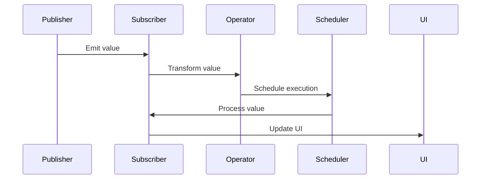

## 20.3 Implementing Real-Time Features with Combine

In today's fast-paced digital world, real-time features such as live updates and notifications are critical for creating engaging user experiences. Swift's Combine framework offers a powerful set of tools to implement these capabilities efficiently. In this section, we will delve into how to use Combine's publishers and subscribers for streaming data, integrate with WebSockets and real-time APIs, ensure thread safety and performance, and effectively test real-time features.

### Introduction to Combine for Real-Time Features

Combine is a framework introduced by Apple to handle asynchronous events by providing a declarative Swift API for processing values over time. It allows developers to work with asynchronous data streams, making it ideal for implementing real-time features. Let's explore the key concepts of Combine that are essential for building real-time applications.

#### Publishers and Subscribers

In Combine, a **Publisher** emits a sequence of values over time, while a **Subscriber** receives those values. Publishers can represent various data sources, such as network requests, user inputs, or timers. Subscribers process the emitted values, allowing you to update your UI or perform other actions.

#### Key Concepts

- **Operators**: Transform, filter, and combine data streams.
- **Subjects**: Act as both publishers and subscribers, enabling the broadcast of values to multiple subscribers.
- **Schedulers**: Control the execution context of your Combine pipelines.

### Streaming Data with Combine

To implement real-time features, we need to stream data efficiently. Combine's publishers and subscribers provide a robust mechanism for handling streaming data. Let's explore how to set up a basic data stream using Combine.

#### Creating a Publisher

To create a publisher, you can use Combine's built-in publishers or create a custom one. Here's an example using a `Timer` publisher to emit values at regular intervals:

```swift
import Combine

let timerPublisher = Timer.publish(every: 1.0, on: .main, in: .common).autoconnect()
```

This code creates a timer that emits a value every second on the main thread.

#### Subscribing to a Publisher

To receive and process the emitted values, we need a subscriber. Combine provides several built-in subscribers, such as `sink` and `assign`. Here's how to use `sink` to print the emitted values:

```swift
let cancellable = timerPublisher.sink { time in
    print("Current time: \\(time)")
}
```

The `sink` subscriber receives each value emitted by the publisher and executes the provided closure.

#### Using Operators

Combine's operators allow you to transform and filter data streams. For example, you can use the `map` operator to transform the emitted values:

```swift
let formattedTimePublisher = timerPublisher.map { time in
    return DateFormatter.localizedString(from: time, dateStyle: .none, timeStyle: .medium)
}

let formattedCancellable = formattedTimePublisher.sink { formattedTime in
    print("Formatted time: \\(formattedTime)")
}
```

### Integrating with WebSockets and Real-Time APIs

Real-time applications often rely on WebSockets or other real-time APIs to receive updates. Combine can be seamlessly integrated with these technologies to handle real-time data.

#### Setting Up a WebSocket Connection

To integrate WebSockets, you can use URLSession's WebSocketTask. Here's how to set up a WebSocket connection and use Combine to process incoming messages:

```swift
import Foundation
import Combine

class WebSocketManager {
    private var webSocketTask: URLSessionWebSocketTask?
    private var cancellables = Set<AnyCancellable>()

    func connect() {
        let url = URL(string: "wss://example.com/socket")!
        webSocketTask = URLSession.shared.webSocketTask(with: url)
        webSocketTask?.resume()
        
        receiveMessages()
    }

    private func receiveMessages() {
        webSocketTask?.receive { [weak self] result in
            switch result {
            case .success(let message):
                self?.handleMessage(message)
                self?.receiveMessages()
            case .failure(let error):
                print("Error receiving message: \\(error)")
            }
        }
    }

    private func handleMessage(_ message: URLSessionWebSocketTask.Message) {
        if case .string(let text) = message {
            print("Received message: \\(text)")
        }
    }
}
```

#### Processing WebSocket Messages with Combine

To process WebSocket messages using Combine, you can create a publisher that emits messages received from the WebSocket:

```swift
class WebSocketManager {
    private var webSocketTask: URLSessionWebSocketTask?
    private var messageSubject = PassthroughSubject<String, Never>()
    private var cancellables = Set<AnyCancellable>()

    var messagePublisher: AnyPublisher<String, Never> {
        return messageSubject.eraseToAnyPublisher()
    }

    func connect() {
        // ... (same as before)
        receiveMessages()
    }

    private func receiveMessages() {
        webSocketTask?.receive { [weak self] result in
            switch result {
            case .success(let message):
                self?.handleMessage(message)
                self?.receiveMessages()
            case .failure(let error):
                print("Error receiving message: \\(error)")
            }
        }
    }

    private func handleMessage(_ message: URLSessionWebSocketTask.Message) {
        if case .string(let text) = message {
            messageSubject.send(text)
        }
    }
}
```

Now, you can subscribe to the `messagePublisher` to process incoming messages:

```swift
let webSocketManager = WebSocketManager()
webSocketManager.messagePublisher
    .sink { message in
        print("Received message: \\(message)")
    }
    .store(in: &webSocketManager.cancellables)

webSocketManager.connect()
```

### Ensuring Thread Safety and Performance

Real-time applications must handle data efficiently and ensure thread safety. Combine provides tools to manage execution contexts and optimize performance.

#### Using Schedulers

Schedulers control the execution context of Combine pipelines. You can specify which thread to use for processing data, ensuring that UI updates occur on the main thread:

```swift
let cancellable = timerPublisher
    .receive(on: DispatchQueue.main)
    .sink { time in
        print("Current time: \\(time)")
    }
```

#### Handling Backpressure

Combine automatically manages backpressure, ensuring that subscribers are not overwhelmed by data. However, you can use operators like `buffer` to control the flow of data:

```swift
let cancellable = timerPublisher
    .buffer(size: 10, prefetch: .keepFull, whenFull: .dropOldest)
    .sink { time in
        print("Buffered time: \\(time)")
    }
```

### Testing Real-Time Features

Testing real-time features can be challenging due to their asynchronous nature. Combine provides tools to effectively test these features.

#### Using Combine's Test Scheduler

Combine's Test Scheduler allows you to simulate time and test asynchronous code deterministically. Here's an example of testing a timer publisher:

```swift
import XCTest
import Combine

class TimerTests: XCTestCase {
    var cancellables = Set<AnyCancellable>()

    func testTimerPublisher() {
        let expectation = XCTestExpectation(description: "Timer emits values")
        let testScheduler = DispatchQueue.test

        let timerPublisher = Timer.publish(every: 1.0, on: testScheduler, in: .common).autoconnect()

        timerPublisher
            .sink { time in
                print("Test time: \\(time)")
                expectation.fulfill()
            }
            .store(in: &cancellables)

        testScheduler.advance(by: .seconds(1))

        wait(for: [expectation], timeout: 1.0)
    }
}
```

### Visualizing Combine's Data Flow

To better understand how data flows through Combine's pipelines, let's visualize the process using a Mermaid.js sequence diagram:



This diagram illustrates the flow of data from a publisher to a subscriber, with an operator transforming the data and a scheduler controlling the execution context.

### Try It Yourself

Now that we've covered the basics, let's encourage you to experiment with Combine. Try modifying the WebSocket example to handle binary messages or integrate error handling using Combine's `catch` operator. Experiment with different operators to transform and filter data streams. The possibilities are endless!

### Key Takeaways

- Combine provides a powerful framework for handling real-time data streams in Swift.
- Publishers and subscribers are the core components of Combine, enabling efficient data processing.
- Integrating with WebSockets and real-time APIs is seamless with Combine.
- Thread safety and performance can be managed using schedulers and operators.
- Effective testing of real-time features is possible with Combine's Test Scheduler.

### References and Further Reading

- [Apple's Combine Documentation](https://developer.apple.com/documentation/combine)
- [WebSockets in Swift](https://developer.apple.com/documentation/foundation/urlsessionwebsockettask)
- [Testing Combine Pipelines](https://developer.apple.com/documentation/combine/testing_combine_pipelines)

## Quiz Time!



### What is the primary role of a Publisher in Combine?

- [x] To emit a sequence of values over time
- [ ] To receive and process values
- [ ] To control execution context
- [ ] To transform data streams

> **Explanation:** A Publisher in Combine is responsible for emitting a sequence of values over time.

### Which Combine component acts as both a publisher and a subscriber?

- [ ] Operator
- [x] Subject
- [ ] Scheduler
- [ ] Timer

> **Explanation:** A Subject in Combine can act as both a publisher and a subscriber.

### What is the purpose of a Scheduler in Combine?

- [ ] To emit values
- [ ] To receive values
- [x] To control the execution context
- [ ] To handle errors

> **Explanation:** A Scheduler in Combine is used to control the execution context of a pipeline.

### How can you ensure that UI updates occur on the main thread in Combine?

- [ ] Use a Subject
- [x] Use the `receive(on:)` operator with `DispatchQueue.main`
- [ ] Use a Timer
- [ ] Use a Test Scheduler

> **Explanation:** The `receive(on:)` operator with `DispatchQueue.main` ensures that UI updates occur on the main thread.

### What is the role of the `sink` subscriber in Combine?

- [x] To receive and process emitted values
- [ ] To transform data streams
- [ ] To control execution context
- [ ] To handle backpressure

> **Explanation:** The `sink` subscriber in Combine is used to receive and process values emitted by a publisher.

### Which operator can be used to transform data streams in Combine?

- [x] `map`
- [ ] `sink`
- [ ] `buffer`
- [ ] `receive(on:)`

> **Explanation:** The `map` operator is used to transform data streams in Combine.

### What is the purpose of the `buffer` operator in Combine?

- [ ] To transform data streams
- [x] To control the flow of data and handle backpressure
- [ ] To emit values
- [ ] To receive values

> **Explanation:** The `buffer` operator is used to control the flow of data and handle backpressure in Combine.

### How can you integrate WebSockets with Combine?

- [ ] Use a Timer
- [ ] Use a Subject
- [x] Use URLSession's WebSocketTask and a custom publisher
- [ ] Use a Test Scheduler

> **Explanation:** URLSession's WebSocketTask can be used with a custom publisher to integrate WebSockets with Combine.

### What does Combine's Test Scheduler allow you to do?

- [ ] Emit values
- [ ] Receive values
- [x] Simulate time and test asynchronous code deterministically
- [ ] Transform data streams

> **Explanation:** Combine's Test Scheduler allows you to simulate time and test asynchronous code deterministically.

### True or False: Combine automatically manages backpressure to prevent subscriber overload.

- [x] True
- [ ] False

> **Explanation:** Combine automatically manages backpressure to ensure that subscribers are not overwhelmed by data.




