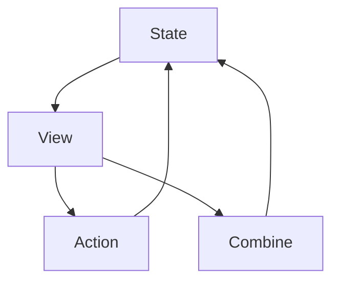

## 20.4 Developing a SwiftUI Application

SwiftUI is Apple's modern framework for building user interfaces across all Apple platforms. By adopting a declarative syntax, SwiftUI allows developers to create complex UIs with less code and more clarity. In this section, we will delve into the process of developing a SwiftUI application, focusing on key concepts such as state management, view composition, integration with Combine, and navigation handling.

### Understanding SwiftUI's State Management

State management is a cornerstone of any SwiftUI application. SwiftUI provides several property wrappers to manage state effectively: `@State`, `@Binding`, `@ObservedObject`, and `@EnvironmentObject`. Each of these serves a specific purpose and is used in different contexts.

#### `@State`

`@State` is used to declare a source of truth for a value within a single view. It is a lightweight way to manage state that is local to a view.

```swift
import SwiftUI

struct CounterView: View {
    @State private var count = 0

    var body: some View {
        VStack {
            Text("Count: \\(count)")
            Button("Increment") {
                count += 1
            }
        }
    }
}
```

In this example, `count` is a state variable that is local to `CounterView`. Whenever `count` changes, the view automatically updates to reflect the new state.

#### `@Binding`

`@Binding` is used to create a two-way connection between a parent view and a child view. It allows a child view to read and write a value owned by a parent view.

```swift
struct ContentView: View {
    @State private var isOn = false

    var body: some View {
        ToggleView(isOn: $isOn)
    }
}

struct ToggleView: View {
    @Binding var isOn: Bool

    var body: some View {
        Toggle("Toggle", isOn: $isOn)
    }
}
```

Here, `ToggleView` receives a binding to `isOn`, allowing it to update the state in `ContentView`.

#### `@ObservedObject`

`@ObservedObject` is used when you want to observe an external object that conforms to the `ObservableObject` protocol. This is typically used for more complex data models.

```swift
class UserSettings: ObservableObject {
    @Published var username: String = "Guest"
}

struct SettingsView: View {
    @ObservedObject var settings = UserSettings()

    var body: some View {
        TextField("Username", text: $settings.username)
    }
}
```

In this example, `SettingsView` observes changes to `UserSettings`, and updates the UI when `username` changes.

#### `@EnvironmentObject`

`@EnvironmentObject` is used to inject shared data into the view hierarchy. This is useful for passing data through many layers of views without explicitly passing it down the view hierarchy.

```swift
class AppData: ObservableObject {
    @Published var score: Int = 0
}

struct GameView: View {
    @EnvironmentObject var data: AppData

    var body: some View {
        Text("Score: \\(data.score)")
    }
}
```

In this setup, `GameView` can access `AppData` from anywhere in the view hierarchy where it has been provided.

### Composing Views and Reusable Components

SwiftUI encourages the creation of small, reusable components. This modular approach not only makes code more manageable but also promotes reusability across different parts of an application.

#### Building Reusable Components

Let's create a reusable button component:

```swift
struct CustomButton: View {
    var title: String
    var action: () -> Void

    var body: some View {
        Button(action: action) {
            Text(title)
                .font(.headline)
                .padding()
                .background(Color.blue)
                .foregroundColor(.white)
                .cornerRadius(8)
        }
    }
}
```

This `CustomButton` can be used throughout the app, simplifying the process of button creation.

#### View Composition

Compose complex views by combining smaller components. For example, a profile view might consist of a photo, name, and a bio, each of which is a separate component.

```swift
struct ProfileView: View {
    var body: some View {
        VStack {
            ProfilePhoto()
            ProfileName()
            ProfileBio()
        }
    }
}
```

Each component can be developed and tested independently, improving maintainability.

### Integrating SwiftUI with Combine for Reactive Data Flow

Combine is Apple's framework for handling asynchronous events by providing a declarative Swift API for processing values over time. When integrated with SwiftUI, Combine can be used to manage data flow reactively.

#### Using Combine with SwiftUI

Consider an example where we fetch data from a network and update the UI reactively:

```swift
import Combine

class DataFetcher: ObservableObject {
    @Published var data: [String] = []
    private var cancellables = Set<AnyCancellable>()

    func fetchData() {
        URLSession.shared.dataTaskPublisher(for: URL(string: "https://api.example.com/data")!)
            .map { $0.data }
            .decode(type: [String].self, decoder: JSONDecoder())
            .replaceError(with: [])
            .receive(on: DispatchQueue.main)
            .assign(to: \.data, on: self)
            .store(in: &cancellables)
    }
}

struct DataView: View {
    @ObservedObject var fetcher = DataFetcher()

    var body: some View {
        List(fetcher.data, id: \.self) { item in
            Text(item)
        }
        .onAppear {
            fetcher.fetchData()
        }
    }
}
```

In this example, `DataFetcher` uses Combine to fetch data and update the `data` property. `DataView` observes these changes and updates the UI accordingly.

### Handling Navigation and Routing in SwiftUI

Navigation in SwiftUI is managed using `NavigationView` and `NavigationLink`. This declarative approach simplifies the process of defining navigation flows.

#### Basic Navigation

```swift
struct HomeView: View {
    var body: some View {
        NavigationView {
            VStack {
                NavigationLink(destination: DetailView()) {
                    Text("Go to Detail")
                }
            }
            .navigationTitle("Home")
        }
    }
}

struct DetailView: View {
    var body: some View {
        Text("Detail View")
    }
}
```

In this setup, `HomeView` contains a `NavigationLink` that navigates to `DetailView`.

#### Advanced Navigation

For more complex navigation scenarios, such as conditional navigation or programmatic navigation, you can use state variables to control navigation.

```swift
struct ConditionalNavigationView: View {
    @State private var navigate = false

    var body: some View {
        NavigationView {
            VStack {
                Button("Navigate") {
                    navigate = true
                }
                NavigationLink(destination: DetailView(), isActive: $navigate) {
                    EmptyView()
                }
            }
        }
    }
}
```

Here, a button sets a state variable to trigger navigation programmatically.

### Visualizing SwiftUI Architecture

To better understand how SwiftUI components interact, consider the following diagram illustrating the relationship between views, state, and data flow:



**Diagram Description:** This diagram illustrates the flow of data in a SwiftUI application. State changes trigger view updates, actions from the view update the state, and Combine can be used to manage asynchronous data flow, feeding back into the state.

### Try It Yourself

Now that we've covered the basics, try building a simple SwiftUI application yourself. Experiment with the following:

- Modify the `CounterView` to include a decrement button.
- Create a reusable component for displaying user profiles.
- Integrate a Combine publisher to fetch and display data from a different API.
- Implement a navigation flow with multiple destinations and conditional paths.

### Knowledge Check

Before moving on, let's review some key concepts:

- **State Management:** Understand the differences and use cases for `@State`, `@Binding`, `@ObservedObject`, and `@EnvironmentObject`.
- **View Composition:** Practice creating and using reusable components.
- **Combine Integration:** Explore how Combine can be used to manage data flow in SwiftUI.
- **Navigation:** Familiarize yourself with `NavigationView` and `NavigationLink`.

### Embrace the Journey

Developing with SwiftUI is a rewarding experience that encourages a clean, declarative approach to UI design. Remember, this is just the beginning. As you continue to explore SwiftUI, you'll discover more advanced techniques and patterns that will enhance your app development skills. Keep experimenting, stay curious, and enjoy the journey!

## Quiz Time!



### Which property wrapper is used for local state management in a single SwiftUI view?

- [x] @State
- [ ] @Binding
- [ ] @ObservedObject
- [ ] @EnvironmentObject

> **Explanation:** `@State` is used for local state management within a single SwiftUI view.

### What is the purpose of the `@Binding` property wrapper?

- [x] To create a two-way connection between a parent view and a child view
- [ ] To observe an external object
- [ ] To inject shared data into the view hierarchy
- [ ] To manage local state within a view

> **Explanation:** `@Binding` allows a child view to read and write a value owned by a parent view, creating a two-way connection.

### How does Combine integrate with SwiftUI?

- [x] By managing asynchronous data flow and updating the UI reactively
- [ ] By providing a declarative syntax for UI design
- [ ] By handling navigation and routing
- [ ] By composing views and reusable components

> **Explanation:** Combine manages asynchronous data flow and updates the UI reactively in SwiftUI applications.

### In SwiftUI, which component is used for navigation?

- [x] NavigationLink
- [ ] Toggle
- [ ] VStack
- [ ] Text

> **Explanation:** `NavigationLink` is used in SwiftUI to navigate between views.

### What does `@ObservedObject` do?

- [x] Observes an external object that conforms to the `ObservableObject` protocol
- [ ] Manages local state within a view
- [ ] Injects shared data into the view hierarchy
- [ ] Creates a two-way connection between views

> **Explanation:** `@ObservedObject` is used to observe an external object that conforms to the `ObservableObject` protocol.

### Which property wrapper is used to inject shared data into a SwiftUI view hierarchy?

- [x] @EnvironmentObject
- [ ] @State
- [ ] @Binding
- [ ] @ObservedObject

> **Explanation:** `@EnvironmentObject` is used to inject shared data into the view hierarchy.

### What is the main advantage of using reusable components in SwiftUI?

- [x] Improved code maintainability and reusability
- [ ] Faster application performance
- [ ] Simplified state management
- [ ] Enhanced navigation capabilities

> **Explanation:** Reusable components improve code maintainability and reusability across different parts of an application.

### Which framework is used alongside SwiftUI for reactive data flow?

- [x] Combine
- [ ] UIKit
- [ ] CoreData
- [ ] Foundation

> **Explanation:** Combine is used alongside SwiftUI for managing reactive data flow.

### What is the role of `NavigationView` in SwiftUI?

- [x] To provide a container for managing navigation between views
- [ ] To display a list of items
- [ ] To handle asynchronous data flow
- [ ] To manage local state within a view

> **Explanation:** `NavigationView` provides a container for managing navigation between views in SwiftUI.

### True or False: `@State` can be used to manage shared data across multiple views.

- [ ] True
- [x] False

> **Explanation:** `@State` is intended for local state management within a single view, not for managing shared data across multiple views.



By mastering these concepts, you will be well-equipped to build modern, robust applications using SwiftUI. Continue to explore and experiment with SwiftUI's features to enhance your development skills further.


