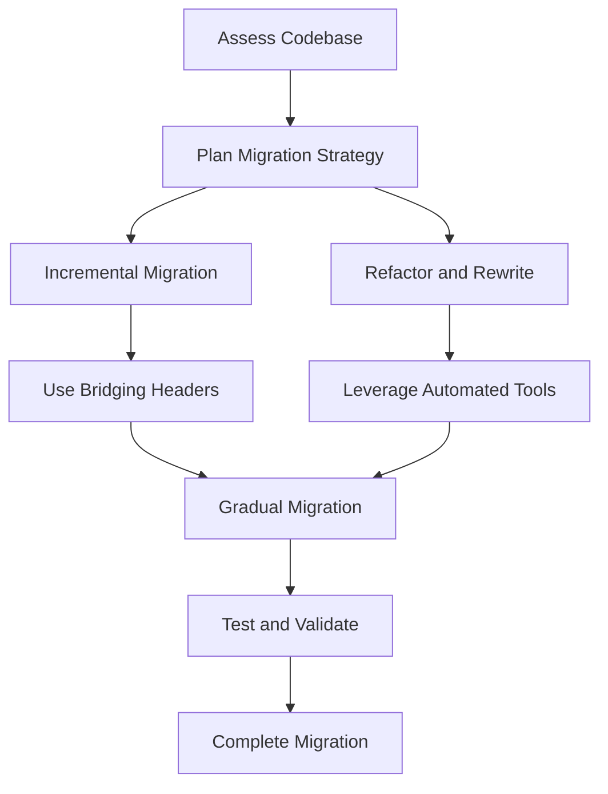

## 20.5 Migrating Legacy Objective-C Code to Swift

Migrating legacy Objective-C code to Swift is a significant undertaking that can lead to more maintainable, efficient, and modern applications. In this section, we will explore the benefits and challenges of migrating to Swift, strategies for gradual migration, interoperability features, and case studies demonstrating successful migrations.

### Assessing the Benefits and Challenges of Migrating to Swift

#### Benefits of Migrating to Swift

1. **Modern Language Features**: Swift offers advanced language features such as optionals, closures, generics, and type inference, which can lead to cleaner and more concise code.
2. **Safety and Performance**: Swift is designed with safety in mind, reducing common programming errors. It also offers performance improvements over Objective-C.
3. **Interoperability**: Swift can seamlessly interact with existing Objective-C code, allowing for a phased migration approach.
4. **Community and Support**: The Swift community is vibrant and growing, providing ample resources, libraries, and tools.
5. **Future-Proofing**: Apple is continuously advancing Swift, making it the preferred language for iOS, macOS, watchOS, and tvOS development.

#### Challenges of Migrating to Swift

1. **Learning Curve**: Developers familiar with Objective-C need time to learn Swift's syntax and paradigms.
2. **Compatibility Issues**: Some legacy Objective-C APIs may not have direct Swift equivalents, requiring careful refactoring.
3. **Resource Investment**: Migration requires time and resources, which can be significant depending on the size and complexity of the codebase.
4. **Risk of Bugs**: Introducing new code can lead to unforeseen bugs, especially if not thoroughly tested.

### Strategies for Gradual Migration While Maintaining Functionality

Migrating a large codebase all at once can be daunting and risky. A gradual migration strategy allows you to transition to Swift while maintaining the functionality of your application.

#### Strategy 1: Incremental Migration

- **Start with New Features**: Implement new features in Swift. This allows developers to become familiar with Swift while minimizing disruption to existing code.
- **Module-by-Module Approach**: Migrate individual modules or components one at a time. This can be done by identifying low-risk areas or frequently updated modules.
- **Use Bridging Headers**: Bridging headers allow Swift and Objective-C code to coexist, making it possible to call Objective-C code from Swift and vice versa.

```swift
// Example of a Bridging Header
// Objective-C Class
@interface LegacyClass : NSObject
- (void)doSomething;
@end

// Swift Usage
let legacyObject = LegacyClass()
legacyObject.doSomething()
```

#### Strategy 2: Refactor and Rewrite

- **Refactor**: Simplify and clean up Objective-C code before migrating. This can involve removing deprecated APIs and improving code structure.
- **Rewrite**: For some components, it might be more efficient to rewrite them in Swift, especially if they are small or poorly designed.

#### Strategy 3: Use Automated Tools

- **Swiftify**: Tools like Swiftify can help automate parts of the migration process by converting Objective-C code to Swift. However, manual review and testing are essential to ensure correctness.

### Using Interoperability Features Between Swift and Objective-C

Swift and Objective-C can coexist in the same project, thanks to several interoperability features.

#### Bridging Headers

Bridging headers allow Swift code to use Objective-C classes, methods, and properties. This is crucial for a step-by-step migration process.

#### Objective-C Compatibility

Swift classes can be marked with `@objc` to make them accessible from Objective-C code. This is useful when migrating Objective-C code that relies on Swift components.

```swift
// Swift Class
@objc class SwiftClass: NSObject {
    @objc func performAction() {
        print("Action performed")
    }
}

// Objective-C Usage
SwiftClass *swiftObject = [[SwiftClass alloc] init];
[swiftObject performAction];
```

#### Dynamic Dispatch

Swift can use dynamic dispatch to call Objective-C methods, ensuring compatibility with Objective-C's runtime features.

### Refactoring Code to Adopt Modern Swift Features

Refactoring is a critical step in the migration process. It involves adapting the existing code to leverage Swift's modern features.

#### Use Optionals

Swift's optionals provide a safer way to handle `nil` values compared to Objective-C's `nil` pointers. This reduces runtime crashes and improves code readability.

```swift
// Objective-C
NSString *name = nil;

// Swift
var name: String? = nil
```

#### Leverage Swift's Type System

Swift's strong type system can catch errors at compile time, reducing runtime issues. Refactor code to use Swift's type inference and generics.

```swift
// Objective-C
NSArray *array = @[@"One", @"Two"];

// Swift
let array: [String] = ["One", "Two"]
```

#### Embrace Swift's Functional Programming Features

Swift supports functional programming paradigms such as map, filter, and reduce. Refactor loops and conditional logic to use these features for cleaner code.

```swift
// Objective-C
NSMutableArray *squaredNumbers = [NSMutableArray array];
for (NSNumber *number in numbers) {
    [squaredNumbers addObject:@(number.intValue * number.intValue)];
}

// Swift
let squaredNumbers = numbers.map { $0 * $0 }
```

### Case Studies Demonstrating Successful Migrations

#### Case Study 1: E-Commerce App Migration

An e-commerce application with a large codebase was gradually migrated to Swift. The team started by implementing new features in Swift and used bridging headers to maintain compatibility. Over time, they refactored existing Objective-C modules, leveraging Swift's optionals and type system to improve code safety and readability.

#### Case Study 2: Media Streaming Service

A media streaming service faced performance issues with its Objective-C code. By migrating to Swift, the team improved performance and reduced app crashes. They used automated tools for initial conversion and manually refactored the code to adopt Swift's modern features.

#### Case Study 3: Banking Application

A banking application required enhanced security and maintainability. The team chose a module-by-module migration strategy, starting with less critical features. They used Swift's strong type system to prevent errors and adopted Swift's functional programming features to simplify complex logic.

### Visualizing the Migration Process

Below is a flowchart illustrating the migration process from Objective-C to Swift:



### Try It Yourself: Experimenting with Migration

To get hands-on experience, take a small Objective-C project and try migrating it to Swift. Start by converting a simple module or feature. Use bridging headers to maintain compatibility and refactor the code to use Swift's modern features. This exercise will help you understand the challenges and strategies involved in real-world migration scenarios.

### References and Links

- [Apple's Swift Documentation](https://developer.apple.com/documentation/swift)
- [Swiftify - Objective-C to Swift Converter](https://swiftify.com/)
- [Swift and Objective-C Interoperability](https://developer.apple.com/documentation/swift/objective-c_and_c_code_customization)

### Knowledge Check

Before moving on, consider the following questions to test your understanding:

- What are the key benefits of migrating to Swift?
- How can bridging headers facilitate a gradual migration?
- What are some challenges you might face when migrating to Swift?
- How can Swift's optionals improve code safety compared to Objective-C?
- Why is it important to refactor code when migrating to Swift?

### Embrace the Journey

Migrating from Objective-C to Swift is a journey that requires careful planning and execution. Remember, this is just the beginning. As you progress, you'll build more robust, maintainable, and efficient applications. Keep experimenting, stay curious, and enjoy the journey!

## Quiz Time!



### What is one of the primary benefits of migrating to Swift from Objective-C?

- [x] Modern language features
- [ ] Easier syntax
- [ ] Faster compilation
- [ ] Larger community

> **Explanation:** Swift offers modern language features such as optionals, closures, and generics that enhance code quality and safety.

### Which strategy involves using bridging headers to maintain compatibility during migration?

- [x] Incremental Migration
- [ ] Refactor and Rewrite
- [ ] Automated Tools
- [ ] Complete Overhaul

> **Explanation:** Bridging headers allow Swift and Objective-C code to coexist, making incremental migration feasible.

### What is a common challenge when migrating to Swift?

- [x] Compatibility issues
- [ ] Lack of documentation
- [ ] No community support
- [ ] Limited IDE support

> **Explanation:** Compatibility issues arise because some Objective-C APIs may not have direct Swift equivalents.

### How can Swift's optionals improve code safety?

- [x] By reducing runtime crashes
- [ ] By simplifying syntax
- [ ] By increasing performance
- [ ] By enhancing readability

> **Explanation:** Optionals provide a safer way to handle `nil` values, reducing the likelihood of runtime crashes.

### What is the purpose of using automated tools in migration?

- [x] To assist in converting Objective-C code to Swift
- [ ] To speed up the compilation process
- [ ] To enhance code readability
- [ ] To improve runtime performance

> **Explanation:** Automated tools like Swiftify help convert Objective-C code to Swift, easing the migration process.

### Which Swift feature can replace loops and conditional logic for cleaner code?

- [x] Functional programming features
- [ ] Dynamic dispatch
- [ ] Bridging headers
- [ ] Type inference

> **Explanation:** Swift's functional programming features like map, filter, and reduce can simplify code.

### What is a key consideration when refactoring code for migration?

- [x] Adopting modern Swift features
- [ ] Maintaining original syntax
- [ ] Reducing file size
- [ ] Enhancing UI design

> **Explanation:** Refactoring involves adapting code to leverage Swift's modern features, improving maintainability.

### Why is testing important during the migration process?

- [x] To ensure the new code functions correctly
- [ ] To reduce file size
- [ ] To enhance UI design
- [ ] To speed up compilation

> **Explanation:** Testing ensures that the migrated code functions correctly and maintains the application's integrity.

### True or False: Swift and Objective-C cannot coexist in the same project.

- [ ] True
- [x] False

> **Explanation:** Swift and Objective-C can coexist in the same project using interoperability features like bridging headers.

### What is the first step in the migration process according to the flowchart?

- [x] Assess Codebase
- [ ] Plan Migration Strategy
- [ ] Incremental Migration
- [ ] Test and Validate

> **Explanation:** Assessing the codebase is the first step to understand the scope and requirements for migration.


