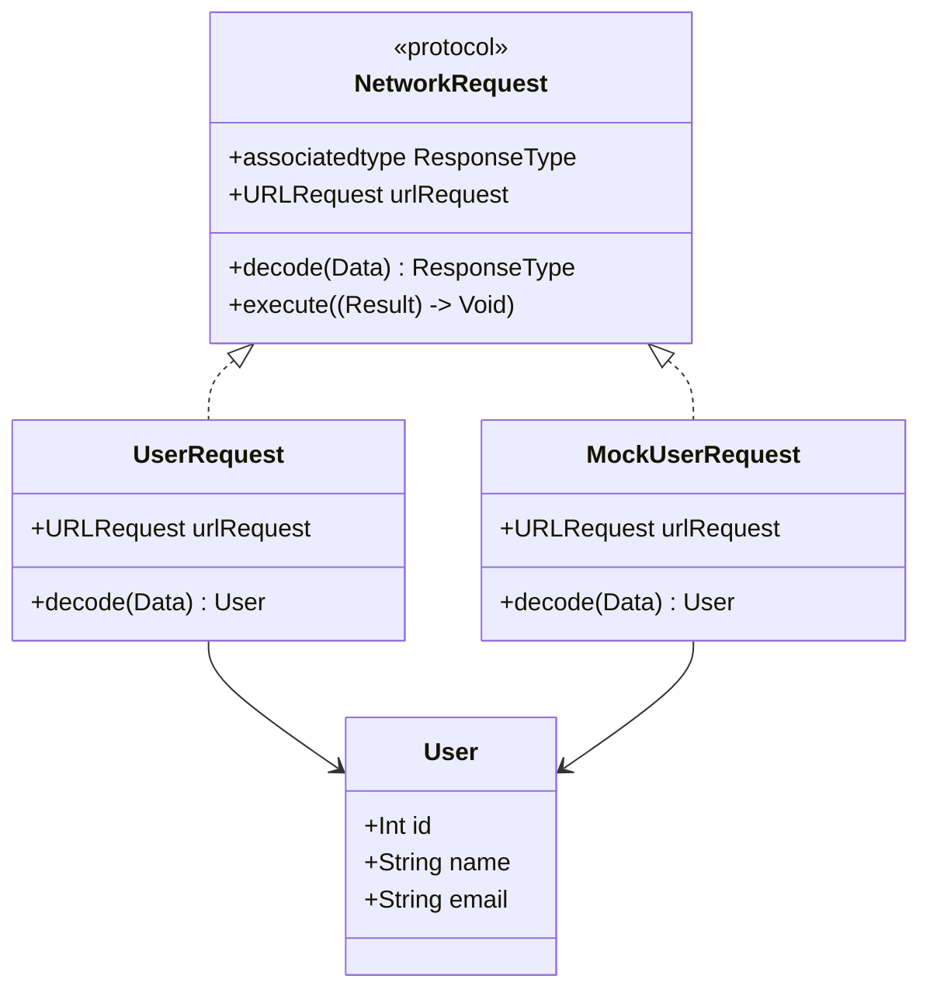

## 20.6 Using Protocol-Oriented Programming in a Networking Layer

Swift's Protocol-Oriented Programming (POP) paradigm offers a powerful approach to designing a flexible and robust networking layer. By leveraging protocols and protocol extensions, we can abstract away networking details, making our code easier to test and maintain. This section will guide you through the process of building a networking layer using POP, focusing on key concepts such as abstraction, generics, associated types, and unit testing.

### Introduction to Protocol-Oriented Programming

Protocol-Oriented Programming is a paradigm that emphasizes the use of protocols to define interfaces and behavior in Swift. Unlike traditional Object-Oriented Programming (OOP), which focuses on class hierarchies, POP encourages the use of protocols and extensions to achieve polymorphism and code reuse.

#### Key Concepts

- **Protocols**: Define a blueprint of methods, properties, and other requirements that suit a particular task or piece of functionality.
- **Protocol Extensions**: Provide default implementations for protocol methods, allowing shared behavior across conforming types.
- **Generics**: Enable writing flexible and reusable functions and types that can work with any type.
- **Associated Types**: Define a placeholder name for a type that is used as part of the protocol.

### Designing the Networking Layer

To design a networking layer using POP, we need to focus on abstraction and flexibility. Our goal is to create a system that can easily handle different API endpoints and response models while being testable and maintainable.

#### Step 1: Define Protocols for Networking

Start by defining a protocol for making network requests. This protocol will serve as the foundation for our networking layer.

```swift
protocol NetworkRequest {
    associatedtype ResponseType
    var urlRequest: URLRequest { get }
    func decode(_ data: Data) throws -> ResponseType
}
```

- **`associatedtype ResponseType`**: This allows us to define a generic response type for each network request.
- **`var urlRequest: URLRequest`**: Represents the URL request that will be sent.
- **`func decode(_ data: Data) throws -> ResponseType`**: A method to decode the response data into the desired type.

#### Step 2: Implement Protocol Extensions

Use protocol extensions to provide default implementations for common functionality. For example, we can add a method to execute the network request.

```swift
extension NetworkRequest {
    func execute(completion: @escaping (Result<ResponseType, Error>) -> Void) {
        let task = URLSession.shared.dataTask(with: urlRequest) { data, response, error in
            if let error = error {
                completion(.failure(error))
                return
            }
            
            guard let data = data else {
                completion(.failure(NetworkError.noData))
                return
            }
            
            do {
                let decodedResponse = try self.decode(data)
                completion(.success(decodedResponse))
            } catch {
                completion(.failure(error))
            }
        }
        task.resume()
    }
}

enum NetworkError: Error {
    case noData
}
```

- **`execute(completion:)`**: This method performs the network request and decodes the response using the `decode` method.
- **`NetworkError`**: An enum to handle common network errors, such as missing data.

### Handling Different API Endpoints

To handle different API endpoints, create specific types that conform to the `NetworkRequest` protocol. Each type will define its own URL request and response decoding logic.

```swift
struct UserRequest: NetworkRequest {
    typealias ResponseType = User
    
    var urlRequest: URLRequest {
        let url = URL(string: "https://api.example.com/user")!
        return URLRequest(url: url)
    }
    
    func decode(_ data: Data) throws -> User {
        let decoder = JSONDecoder()
        return try decoder.decode(User.self, from: data)
    }
}

struct User: Codable {
    let id: Int
    let name: String
    let email: String
}
```

- **`UserRequest`**: A concrete implementation of `NetworkRequest` for fetching user data.
- **`User`**: A model conforming to `Codable` to represent the user data.

### Unit Testing the Networking Layer

Testing is a crucial part of any networking layer. By using protocols, we can easily create mock services for unit testing.

#### Step 1: Create a Mock Network Request

Define a mock version of the `NetworkRequest` protocol to simulate network responses.

```swift
struct MockUserRequest: NetworkRequest {
    typealias ResponseType = User
    
    var urlRequest: URLRequest {
        return URLRequest(url: URL(string: "https://mockapi.example.com/user")!)
    }
    
    func decode(_ data: Data) throws -> User {
        return User(id: 1, name: "Mock User", email: "mock@example.com")
    }
}
```

#### Step 2: Write Unit Tests

Use XCTest to write unit tests for your networking layer.

```swift
import XCTest

class NetworkingTests: XCTestCase {
    func testUserRequest() {
        let request = MockUserRequest()
        
        request.execute { result in
            switch result {
            case .success(let user):
                XCTAssertEqual(user.name, "Mock User")
            case .failure(let error):
                XCTFail("Request failed with error: \\(error)")
            }
        }
    }
}
```

- **`testUserRequest`**: A test case to verify that the `MockUserRequest` returns the expected user data.

### Visualizing the Networking Layer

To better understand the architecture of our networking layer, let's visualize it using a class diagram.



This diagram shows the relationships between the `NetworkRequest` protocol, its conforming types (`UserRequest` and `MockUserRequest`), and the `User` model.

### Try It Yourself

Experiment with the networking layer by adding new endpoints and response models. Here are some suggestions:

- **Add a new request**: Create a new struct conforming to `NetworkRequest` for a different API endpoint.
- **Modify the decoding logic**: Change the `decode` method to handle different response formats.
- **Test error handling**: Simulate network errors and verify that your error handling logic works as expected.

### Conclusion

Using Protocol-Oriented Programming in Swift allows us to design a flexible and maintainable networking layer. By abstracting away networking details with protocols and protocol extensions, we can easily handle different API endpoints and response models. Additionally, the use of generics and associated types ensures type safety, while mock services facilitate unit testing.

Remember, this is just the beginning. As you progress, you'll build more complex networking layers and explore advanced Swift features. Keep experimenting, stay curious, and enjoy the journey!

## Quiz Time!



### What is the primary focus of Protocol-Oriented Programming in Swift?

- [x] Using protocols to define interfaces and behavior
- [ ] Emphasizing class hierarchies
- [ ] Avoiding the use of generics
- [ ] Relying solely on inheritance

> **Explanation:** Protocol-Oriented Programming emphasizes the use of protocols to define interfaces and behavior, rather than relying on class hierarchies.

### Which Swift feature allows you to define a placeholder name for a type used in a protocol?

- [ ] Generics
- [x] Associated types
- [ ] Extensions
- [ ] Enumerations

> **Explanation:** Associated types allow you to define a placeholder name for a type that is used as part of a protocol.

### What is the purpose of the `decode` method in the `NetworkRequest` protocol?

- [ ] To send the network request
- [x] To decode the response data into the desired type
- [ ] To handle network errors
- [ ] To create a URL request

> **Explanation:** The `decode` method is used to decode the response data into the desired type.

### How does Protocol-Oriented Programming enhance testability in a networking layer?

- [ ] By using inheritance
- [x] By allowing the creation of mock services
- [ ] By avoiding the use of protocols
- [ ] By using only concrete types

> **Explanation:** Protocol-Oriented Programming enhances testability by allowing the creation of mock services that conform to protocols.

### Which of the following is a benefit of using protocol extensions?

- [x] Providing default implementations for protocol methods
- [ ] Restricting code reuse
- [ ] Eliminating the need for protocols
- [ ] Increasing code complexity

> **Explanation:** Protocol extensions allow you to provide default implementations for protocol methods, enabling code reuse.

### What does the `execute` method in the `NetworkRequest` protocol extension do?

- [ ] Creates a URL request
- [x] Performs the network request and decodes the response
- [ ] Handles user authentication
- [ ] Manages database connections

> **Explanation:** The `execute` method performs the network request and decodes the response using the `decode` method.

### What is the role of the `NetworkError` enum in the networking layer?

- [ ] To define URL requests
- [x] To handle common network errors
- [ ] To manage database operations
- [ ] To create mock services

> **Explanation:** The `NetworkError` enum is used to handle common network errors, such as missing data.

### How can you test different API endpoints using the networking layer?

- [ ] By creating separate classes for each endpoint
- [x] By creating specific types conforming to the `NetworkRequest` protocol
- [ ] By using only one generic type
- [ ] By avoiding the use of protocols

> **Explanation:** You can test different API endpoints by creating specific types that conform to the `NetworkRequest` protocol, each defining its own URL request and response decoding logic.

### True or False: Protocol-Oriented Programming in Swift eliminates the need for unit testing.

- [ ] True
- [x] False

> **Explanation:** Protocol-Oriented Programming does not eliminate the need for unit testing; it enhances testability by allowing the creation of mock services.

### Which Swift feature ensures type safety in the networking layer?

- [ ] Protocol extensions
- [x] Generics and associated types
- [ ] Inheritance
- [ ] Enumerations

> **Explanation:** Generics and associated types ensure type safety in the networking layer by allowing flexible and reusable functions and types.




