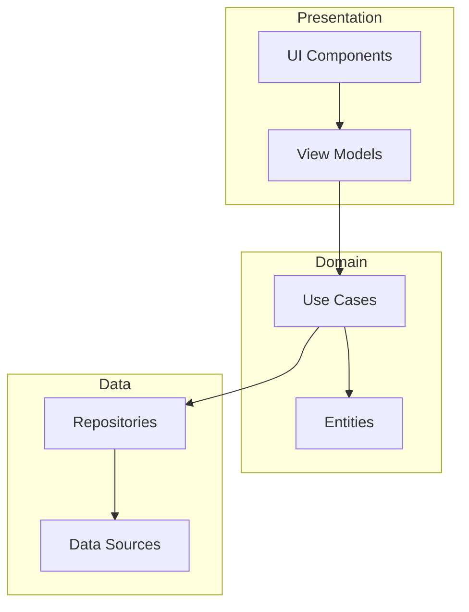

## 20.7 Applying Clean Architecture in a Large-Scale Project

Welcome to the comprehensive guide on applying Clean Architecture in Swift for large-scale projects. In this section, we will delve into the principles of Clean Architecture, its benefits, and how to effectively implement it in Swift. This will include structuring code into layers, ensuring dependency inversion, and overcoming challenges in large teams and projects. Let's embark on this journey to enhance scalability and testability in your Swift applications.

### Introduction to Clean Architecture

Clean Architecture, introduced by Robert C. Martin (Uncle Bob), is a software design philosophy that emphasizes the separation of concerns, making your codebase more maintainable and scalable. The core idea is to structure your application into distinct layers, each with specific responsibilities, and to ensure that dependencies flow inwards, towards the core business logic.

#### Key Principles of Clean Architecture

1. **Separation of Concerns**: Each layer of the architecture should have a single responsibility, making it easier to manage and test.
2. **Dependency Inversion**: High-level modules should not depend on low-level modules. Both should depend on abstractions.
3. **Independence**: The architecture should be independent of frameworks, UI, database, and any external agency, allowing for flexibility and adaptability.

### Structuring Code into Layers

In Clean Architecture, the application is typically divided into three main layers: Presentation, Domain, and Data. Each layer has its own responsibilities and interacts with the others through well-defined interfaces.

#### 1. Presentation Layer

The Presentation Layer is responsible for displaying data to the user and handling user interactions. In Swift, this could be implemented using UIKit or SwiftUI. This layer should not contain any business logic; instead, it should delegate tasks to the Domain Layer.

**Example:**

```swift
import SwiftUI

struct ContentView: View {
    @ObservedObject var viewModel: WeatherViewModel

    var body: some View {
        VStack {
            Text(viewModel.weatherDescription)
            Button(action: {
                viewModel.fetchWeather()
            }) {
                Text("Refresh")
            }
        }
    }
}
```

#### 2. Domain Layer

The Domain Layer contains the business logic of the application. It is independent of any external frameworks and should be testable in isolation. This layer defines the use cases and the entities.

**Example:**

```swift
protocol WeatherRepository {
    func fetchWeather() -> Weather
}

class FetchWeatherUseCase {
    private let repository: WeatherRepository

    init(repository: WeatherRepository) {
        self.repository = repository
    }

    func execute() -> Weather {
        return repository.fetchWeather()
    }
}
```

#### 3. Data Layer

The Data Layer is responsible for data retrieval and storage. It interacts with external data sources such as databases or web services. This layer should not contain any business logic.

**Example:**

```swift
class WeatherRepositoryImpl: WeatherRepository {
    func fetchWeather() -> Weather {
        // Fetch weather data from a web service
        return Weather(description: "Sunny")
    }
}
```

### Ensuring Dependency Inversion and Flow of Control

Dependency inversion is a fundamental principle of Clean Architecture. It ensures that high-level modules are not dependent on low-level modules, but rather on abstractions. This is achieved through the use of interfaces or protocols in Swift.

#### Implementing Dependency Inversion

To implement dependency inversion, define protocols for the dependencies and inject them into the classes that require them. This allows for greater flexibility and easier testing.

**Example:**

```swift
protocol WeatherService {
    func getWeather() -> Weather
}

class WeatherViewModel: ObservableObject {
    private let weatherService: WeatherService

    @Published var weatherDescription: String = ""

    init(weatherService: WeatherService) {
        self.weatherService = weatherService
    }

    func fetchWeather() {
        let weather = weatherService.getWeather()
        weatherDescription = weather.description
    }
}
```

### Benefits in Scalability and Testability

Clean Architecture provides numerous benefits, particularly in large-scale projects. By separating concerns and ensuring dependency inversion, it becomes easier to scale the application and write tests.

#### Scalability

With a well-defined architecture, adding new features or modifying existing ones becomes straightforward. Each layer can be developed and maintained independently, allowing teams to work in parallel without conflicts.

#### Testability

By isolating business logic in the Domain Layer and using protocols for dependencies, writing unit tests becomes simpler. You can mock dependencies and test each component in isolation.

**Example of Unit Test:**

```swift
import XCTest
@testable import YourApp

class WeatherViewModelTests: XCTestCase {
    func testWeatherDescription() {
        let mockService = MockWeatherService()
        let viewModel = WeatherViewModel(weatherService: mockService)

        viewModel.fetchWeather()

        XCTAssertEqual(viewModel.weatherDescription, "Sunny")
    }
}

class MockWeatherService: WeatherService {
    func getWeather() -> Weather {
        return Weather(description: "Sunny")
    }
}
```

### Overcoming Challenges in Large Teams and Projects

Implementing Clean Architecture in large-scale projects can present challenges, particularly in terms of coordination and consistency across teams. Here are some strategies to overcome these challenges:

#### 1. Establish Clear Guidelines

Define clear guidelines and best practices for implementing Clean Architecture. Ensure all team members are familiar with the principles and the specific implementation details for your project.

#### 2. Use Code Reviews and Pair Programming

Encourage code reviews and pair programming to ensure consistency and adherence to the architecture. This also facilitates knowledge sharing and helps identify potential issues early.

#### 3. Automate Testing and Continuous Integration

Implement automated testing and continuous integration to catch issues early and ensure that changes do not break existing functionality. This is crucial for maintaining the integrity of the architecture over time.

#### 4. Foster a Culture of Collaboration

Promote a culture of collaboration and open communication among team members. Encourage discussions and feedback on architectural decisions to ensure the best solutions are implemented.

### Try It Yourself

To solidify your understanding of Clean Architecture, try implementing a simple weather application using the principles discussed. Experiment with different designs and see how the architecture affects scalability and testability. Consider modifying the data source or presentation framework to see how easily the architecture adapts to changes.

### Visualizing Clean Architecture

Below is a diagram illustrating the flow of control and dependencies in Clean Architecture:



**Diagram Description:** This diagram shows the flow of control in Clean Architecture. The Presentation Layer interacts with the Domain Layer through View Models and Use Cases. The Domain Layer is independent and interacts with the Data Layer through Repositories.

### References and Links

- [Clean Architecture by Robert C. Martin](https://www.oreilly.com/library/view/clean-architecture/9780134494272/)
- [Swift Documentation](https://developer.apple.com/documentation/swift)
- [Dependency Inversion Principle](https://en.wikipedia.org/wiki/Dependency_inversion_principle)

### Knowledge Check

To reinforce your understanding, consider the following questions:

- How does Clean Architecture improve testability in a Swift project?
- What is the role of the Domain Layer in Clean Architecture?
- How can dependency inversion be implemented in Swift?

### Embrace the Journey

Remember, mastering Clean Architecture is a journey. As you continue to apply these principles, you'll gain deeper insights into structuring scalable and maintainable applications. Keep experimenting, stay curious, and enjoy the process of building robust Swift applications.

## Quiz Time!



### What is a key principle of Clean Architecture?

- [x] Separation of concerns
- [ ] Use of global variables
- [ ] Monolithic design
- [ ] Tight coupling

> **Explanation:** Clean Architecture emphasizes separation of concerns to make the codebase more maintainable and scalable.

### Which layer in Clean Architecture contains the business logic?

- [ ] Presentation Layer
- [x] Domain Layer
- [ ] Data Layer
- [ ] UI Layer

> **Explanation:** The Domain Layer contains the business logic and is independent of external frameworks.

### How is dependency inversion achieved in Swift?

- [x] By using protocols
- [ ] By using global variables
- [ ] By using inheritance
- [ ] By using singletons

> **Explanation:** Dependency inversion is achieved by using protocols to define dependencies, allowing for flexibility and easier testing.

### What is a benefit of Clean Architecture in large-scale projects?

- [x] Scalability
- [ ] Increased complexity
- [ ] Tight coupling
- [ ] Reduced testability

> **Explanation:** Clean Architecture improves scalability by allowing each layer to be developed and maintained independently.

### What strategy can help overcome challenges in large teams?

- [x] Establishing clear guidelines
- [ ] Avoiding code reviews
- [ ] Using global variables
- [ ] Ignoring architectural decisions

> **Explanation:** Establishing clear guidelines helps ensure consistency and adherence to the architecture across large teams.

### What is the role of the Data Layer in Clean Architecture?

- [ ] To contain business logic
- [ ] To handle user interactions
- [x] To manage data retrieval and storage
- [ ] To define use cases

> **Explanation:** The Data Layer is responsible for data retrieval and storage, interacting with external data sources.

### Which of the following is NOT a layer in Clean Architecture?

- [ ] Presentation Layer
- [ ] Domain Layer
- [ ] Data Layer
- [x] Network Layer

> **Explanation:** The Network Layer is not a distinct layer in Clean Architecture; network operations are typically part of the Data Layer.

### What does the Presentation Layer do in Clean Architecture?

- [x] Displays data to the user
- [ ] Contains business logic
- [ ] Manages data storage
- [ ] Defines use cases

> **Explanation:** The Presentation Layer is responsible for displaying data to the user and handling user interactions.

### How can testability be improved in Clean Architecture?

- [x] By isolating business logic in the Domain Layer
- [ ] By using global variables
- [ ] By tightly coupling components
- [ ] By avoiding protocols

> **Explanation:** Testability is improved by isolating business logic in the Domain Layer and using protocols for dependencies.

### True or False: Clean Architecture is dependent on specific frameworks.

- [ ] True
- [x] False

> **Explanation:** Clean Architecture is independent of specific frameworks, allowing for flexibility and adaptability.


