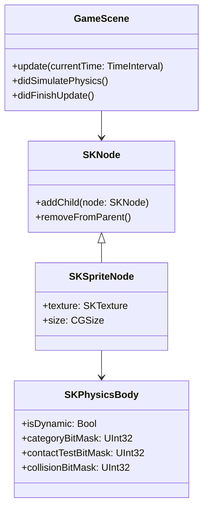

## 20.8 Designing a Game Using Swift and SpriteKit

Game development can be an exciting and rewarding endeavor, especially when using powerful tools like Swift and SpriteKit. In this section, we will explore how to design a game using these technologies, focusing on key aspects such as implementing game loops, physics, animation, managing assets, and applying design patterns specific to game development. By the end of this guide, you'll have a solid foundation for creating engaging and performant games on iOS devices.

### Introduction to Game Development with SpriteKit

SpriteKit is Apple's framework for creating 2D games. It provides a rich set of features for handling graphics, animations, physics, and user input, making it an excellent choice for both beginners and experienced developers. Swift, with its modern syntax and powerful features, complements SpriteKit perfectly, enabling developers to write clean and efficient code.

#### Key Features of SpriteKit

- **Scene Management:** Organize your game into scenes, each representing a different part of your game, such as the main menu, game levels, and game over screen.
- **Sprite Nodes:** Use nodes to represent game objects like characters, enemies, and obstacles.
- **Physics Engine:** Simulate realistic physics interactions between game objects.
- **Particle Systems:** Create stunning visual effects such as explosions, fire, and smoke.
- **Animation Support:** Animate sprites using actions and texture atlases.
- **Audio Integration:** Add sound effects and background music to enhance the gaming experience.

### Implementing Game Loops, Physics, and Animation

A core component of any game is the game loop, which continuously updates the game state and renders the graphics. In SpriteKit, this is handled automatically, but understanding how it works is crucial for implementing custom behaviors.

#### The Game Loop

The game loop in SpriteKit is managed by the `SKScene` class. It consists of three main phases:

1. **Update Phase:** Update the game state, such as moving characters or checking for collisions.
2. **Physics Simulation:** The physics engine updates the positions and velocities of physics bodies.
3. **Render Phase:** Draw the updated game state to the screen.

Here's a basic implementation of the game loop in a SpriteKit project:

```swift
import SpriteKit

class GameScene: SKScene {
    
    override func update(_ currentTime: TimeInterval) {
        // Called before each frame is rendered
        // Update game logic here
    }
    
    override func didSimulatePhysics() {
        // Called after physics simulation
        // Update positions of nodes based on physics
    }
    
    override func didFinishUpdate() {
        // Called after all updates are completed
        // Final adjustments before rendering
    }
}
```

#### Physics in SpriteKit

SpriteKit's physics engine allows you to add realistic physics behaviors to your game objects. You can define physics bodies, set properties like mass and friction, and apply forces or impulses.

**Creating a Physics Body:**

```swift
let sprite = SKSpriteNode(imageNamed: "character")
sprite.physicsBody = SKPhysicsBody(rectangleOf: sprite.size)
sprite.physicsBody?.isDynamic = true // Allows the body to be affected by physics
sprite.physicsBody?.categoryBitMask = PhysicsCategory.Player
sprite.physicsBody?.contactTestBitMask = PhysicsCategory.Enemy
sprite.physicsBody?.collisionBitMask = PhysicsCategory.Wall
```

**Handling Collisions:**

Implement the `SKPhysicsContactDelegate` to respond to collisions between physics bodies:

```swift
extension GameScene: SKPhysicsContactDelegate {
    func didBegin(_ contact: SKPhysicsContact) {
        // Handle collision
        let firstBody = contact.bodyA
        let secondBody = contact.bodyB
        
        if firstBody.categoryBitMask == PhysicsCategory.Player && secondBody.categoryBitMask == PhysicsCategory.Enemy {
            // Player collided with Enemy
        }
    }
}
```

#### Animating Sprites

SpriteKit provides several ways to animate sprites, including actions and texture atlases.

**Using Actions:**

Actions are reusable objects that describe changes to a node's properties over time. For example, you can move a sprite across the screen, rotate it, or change its transparency.

```swift
let moveAction = SKAction.move(to: CGPoint(x: 100, y: 100), duration: 1.0)
sprite.run(moveAction)
```

**Using Texture Atlases:**

Texture atlases are collections of images that can be used to create frame-by-frame animations. This is useful for animating characters or other complex objects.

```swift
let textureAtlas = SKTextureAtlas(named: "Character")
var textures: [SKTexture] = []

for i in 1...textureAtlas.textureNames.count {
    let textureName = "character_\\(i)"
    textures.append(textureAtlas.textureNamed(textureName))
}

let animation = SKAction.animate(with: textures, timePerFrame: 0.1)
sprite.run(SKAction.repeatForever(animation))
```

### Managing Assets and Resources Efficiently

Efficient management of assets and resources is crucial for performance and scalability in game development. This includes organizing your assets, optimizing their sizes, and loading them efficiently.

#### Organizing Assets

- **Use Asset Catalogs:** Store your images, sounds, and other resources in asset catalogs. This helps in managing different resolutions and device-specific assets.
- **Group Related Assets:** Organize assets into folders based on their usage, such as characters, backgrounds, and UI elements.

#### Optimizing Asset Sizes

- **Use Appropriate Formats:** Use PNG for lossless images and JPEG for photographs. Consider using compressed formats like HEIF for iOS 11 and later.
- **Optimize Image Sizes:** Ensure images are not larger than necessary, and use tools like ImageOptim to reduce file sizes without losing quality.

#### Efficient Asset Loading

- **Lazy Loading:** Load assets only when needed to reduce memory usage. For example, load level-specific assets when entering a level.
- **Preloading Assets:** Preload assets that are used frequently or need to be available immediately to avoid delays during gameplay.

### Applying Design Patterns Specific to Game Development

Design patterns can help organize your game code and make it more maintainable and scalable. Here are some patterns commonly used in game development:

#### The Singleton Pattern

The Singleton pattern ensures that a class has only one instance and provides a global point of access to it. This is useful for managing shared resources like game settings or audio managers.

```swift
class AudioManager {
    static let shared = AudioManager()
    
    private init() {}
    
    func playSound(_ sound: String) {
        // Play sound
    }
}
```

#### The Observer Pattern

The Observer pattern allows objects to be notified when a specific event occurs. This is useful for updating the UI or game state in response to changes.

```swift
protocol GameEventListener: AnyObject {
    func onScoreChanged(newScore: Int)
}

class GameEventManager {
    private var listeners = [GameEventListener]()
    
    func addListener(_ listener: GameEventListener) {
        listeners.append(listener)
    }
    
    func notifyScoreChanged(newScore: Int) {
        for listener in listeners {
            listener.onScoreChanged(newScore: newScore)
        }
    }
}
```

#### The Component Pattern

The Component pattern allows you to add behaviors to game objects dynamically. This is useful for creating flexible and reusable game entities.

```swift
protocol Component {
    func update(deltaTime: TimeInterval)
}

class MovementComponent: Component {
    func update(deltaTime: TimeInterval) {
        // Update movement
    }
}

class GameObject {
    private var components = [Component]()
    
    func addComponent(_ component: Component) {
        components.append(component)
    }
    
    func update(deltaTime: TimeInterval) {
        for component in components {
            component.update(deltaTime: deltaTime)
        }
    }
}
```

### Optimizing for Performance on Different Devices

Performance optimization is crucial for providing a smooth gaming experience across a range of devices. Here are some strategies to consider:

#### Reducing Draw Calls

Minimize the number of draw calls by combining sprites into texture atlases and using batch rendering techniques.

#### Managing Memory Usage

- **Use Texture Atlases:** Reduce memory usage by combining images into a single texture atlas.
- **Release Unused Resources:** Free up memory by releasing resources that are no longer needed.

#### Optimizing Physics Calculations

- **Simplify Physics Bodies:** Use simple shapes for physics bodies to reduce computation.
- **Adjust Physics Precision:** Lower the precision of physics calculations for less powerful devices.

#### Profiling and Testing

- **Use Instruments:** Profile your game using Xcode's Instruments to identify performance bottlenecks.
- **Test on Multiple Devices:** Ensure your game runs smoothly on a range of devices, from the latest models to older ones.

### Try It Yourself

Now that we've covered the basics, let's put it all together in a simple game project. Create a new SpriteKit project in Xcode and implement the following:

1. **Create a Game Scene:** Set up a basic scene with a background and a player character.
2. **Add Physics:** Implement basic physics interactions, such as gravity and collisions.
3. **Animate the Player:** Use a texture atlas to animate the player's movement.
4. **Implement a Game Loop:** Update the game state and handle user input.
5. **Optimize Performance:** Profile your game and make improvements based on the data.

Experiment with different assets, physics settings, and animations to see how they affect the gameplay and performance. Remember, this is just the beginning. As you progress, you'll build more complex and interactive games. Keep experimenting, stay curious, and enjoy the journey!

### Visualizing Game Architecture

To better understand the architecture of a SpriteKit game, let's visualize the relationships between the main components using a class diagram.



This diagram illustrates the hierarchy and relationships between the `GameScene`, `SKNode`, `SKSpriteNode`, and `SKPhysicsBody` classes, which are fundamental to building a SpriteKit game.

### References and Links

- [Apple Developer Documentation - SpriteKit](https://developer.apple.com/documentation/spritekit)
- [Ray Wenderlich - SpriteKit Tutorials](https://www.raywenderlich.com/paths/ios)
- [Hacking with Swift - SpriteKit](https://www.hackingwithswift.com/read/11/overview)

### Knowledge Check

- What are the main phases of the game loop in SpriteKit?
- How can you optimize asset loading in a SpriteKit game?
- Describe how the Observer pattern can be used in game development.
- What are some strategies for optimizing performance in a SpriteKit game?

## Quiz Time!



### What is the primary role of the game loop in SpriteKit?

- [x] To continuously update the game state and render graphics
- [ ] To handle user input
- [ ] To manage audio playback
- [ ] To load assets

> **Explanation:** The game loop in SpriteKit is responsible for updating the game state and rendering graphics, ensuring smooth gameplay.

### Which method is used to handle collisions in SpriteKit?

- [x] didBegin(_ contact: SKPhysicsContact)
- [ ] update(_ currentTime: TimeInterval)
- [ ] didSimulatePhysics()
- [ ] didFinishUpdate()

> **Explanation:** The `didBegin(_ contact: SKPhysicsContact)` method is part of the `SKPhysicsContactDelegate` and is used to handle collisions between physics bodies.

### What is the advantage of using texture atlases in SpriteKit?

- [x] Reduces memory usage and improves performance
- [ ] Increases the size of the game
- [ ] Makes animations slower
- [ ] Complicates asset management

> **Explanation:** Texture atlases combine multiple images into a single file, reducing memory usage and improving performance by minimizing draw calls.

### Which design pattern is useful for managing shared resources like game settings?

- [x] Singleton Pattern
- [ ] Observer Pattern
- [ ] Component Pattern
- [ ] Factory Pattern

> **Explanation:** The Singleton pattern ensures that a class has only one instance, making it ideal for managing shared resources like game settings.

### How can you optimize physics calculations in SpriteKit?

- [x] Simplify physics bodies and adjust physics precision
- [ ] Increase the number of physics bodies
- [ ] Use complex shapes for physics bodies
- [ ] Ignore physics calculations

> **Explanation:** Simplifying physics bodies and adjusting physics precision can reduce computational overhead, optimizing physics calculations.

### What is the purpose of the `SKAction` class in SpriteKit?

- [x] To describe changes to a node's properties over time
- [ ] To manage physics bodies
- [ ] To handle user input
- [ ] To load assets

> **Explanation:** The `SKAction` class is used to create animations and other changes to a node's properties over time, such as movement or rotation.

### Which of the following is a benefit of using the Component pattern in game development?

- [x] Allows dynamic addition of behaviors to game objects
- [ ] Ensures a single instance of a class
- [ ] Notifies objects of specific events
- [ ] Complicates code structure

> **Explanation:** The Component pattern allows behaviors to be added to game objects dynamically, making it flexible and reusable.

### What is a common strategy for managing memory usage in SpriteKit games?

- [x] Release unused resources
- [ ] Load all assets at startup
- [ ] Use large textures
- [ ] Increase draw calls

> **Explanation:** Releasing unused resources helps manage memory usage, ensuring that the game runs smoothly without consuming excessive memory.

### True or False: SpriteKit automatically handles the game loop, including updating the game state and rendering graphics.

- [x] True
- [ ] False

> **Explanation:** SpriteKit automatically manages the game loop, allowing developers to focus on implementing game logic and features.

### Which tool can be used to profile a SpriteKit game for performance optimization?

- [x] Xcode's Instruments
- [ ] SKTextureAtlas
- [ ] SKPhysicsBody
- [ ] SKAction

> **Explanation:** Xcode's Instruments is a powerful tool for profiling and identifying performance bottlenecks in a SpriteKit game.



Remember, game development is a journey of creativity and technical skill. Embrace the challenges, experiment with new ideas, and enjoy the process of bringing your game to life. Happy coding!


